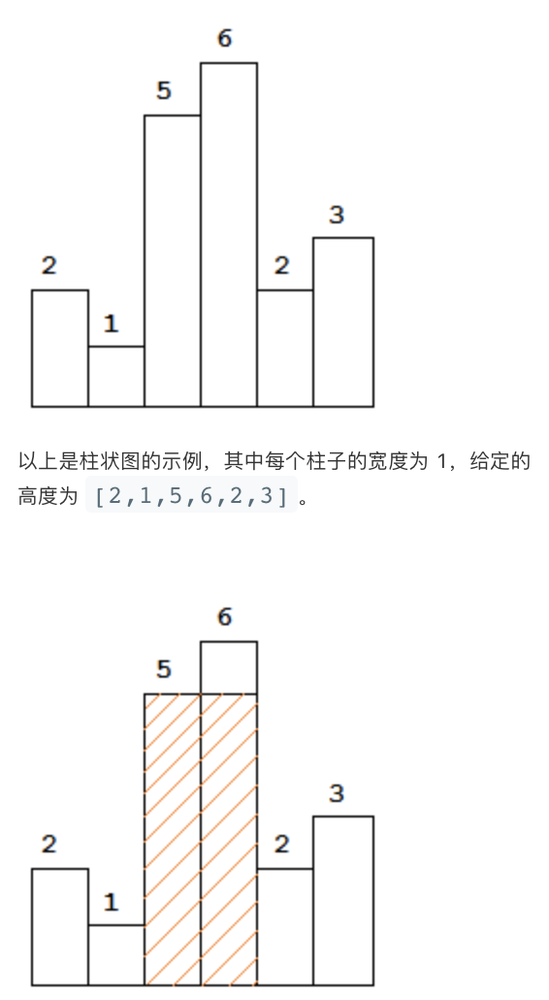
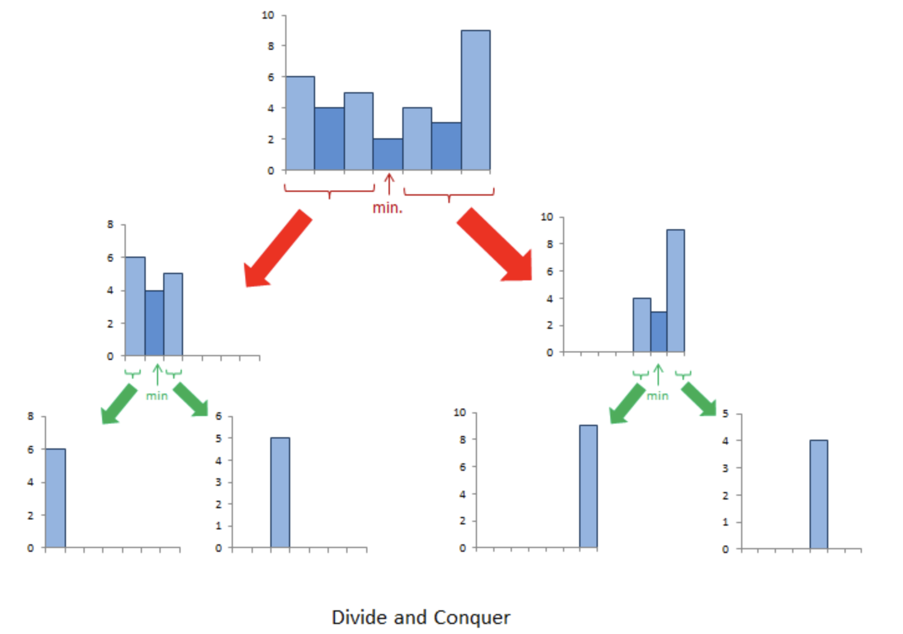
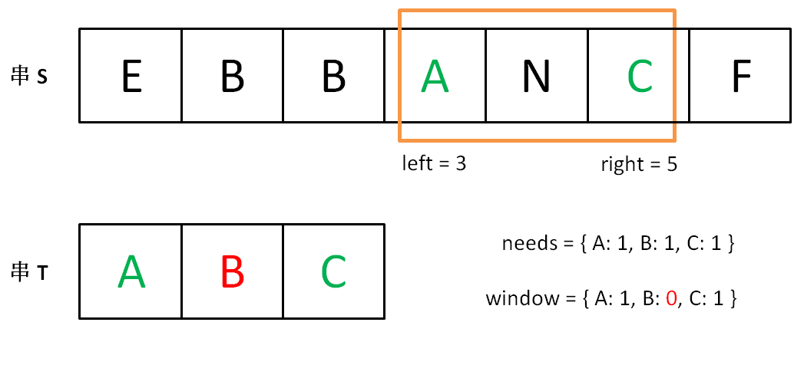
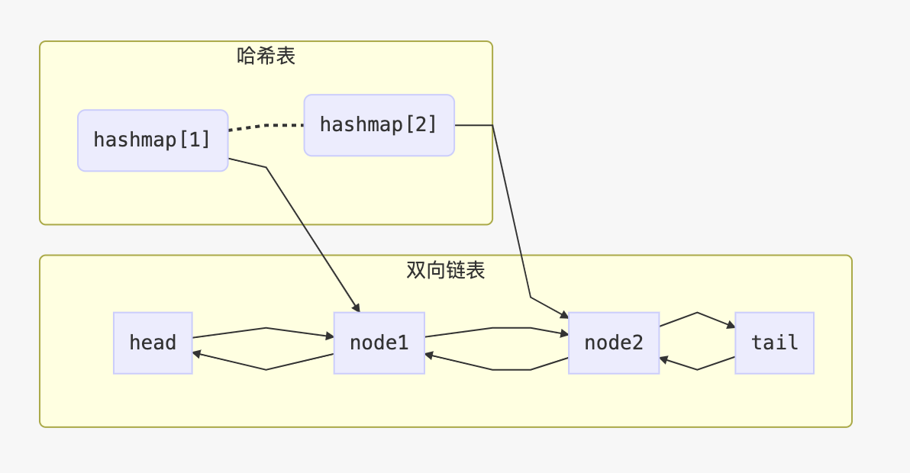
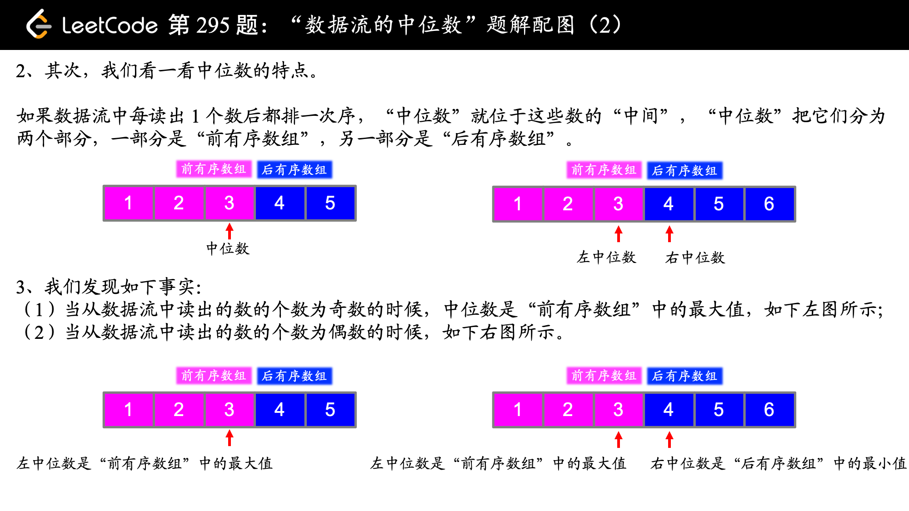
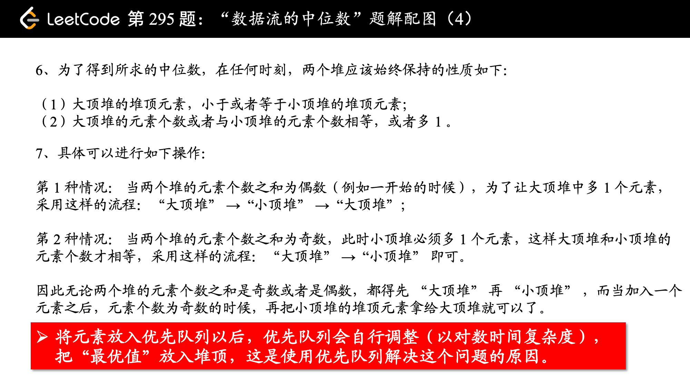

# LeetCode

# 前言

leetcode 刷题记录，整理成册，便于复习。

# 目录

[toc]

# 正文

## 739. 每日温度（中等）递减栈
根据每日气温列表，请重新生成一个列表，对应位置的输入是你需要再等待多久温度才会升高超过该日的天数。如果之后都不会升高，请在该位置用 0 来代替。

例如，给定一个列表 temperatures = [73, 74, 75, 71, 69, 72, 76, 73]，你的输出应该是 [1, 1, 4, 2, 1, 1, 0, 0]。

提示：气温 列表长度的范围是 [1, 30000]。每个气温的值的均为华氏度，都是在 [30, 100] 范围内的整数。

idea：**递减栈**。栈中只存放递减序列。每次入栈，如果当前温度大于栈顶温度，表明栈顶元素第一次遇到了温度大于它的时候，则栈顶元素出栈，计算相差天数即为栈顶温度对应的结果，如果当前温度小于栈顶温度，则入栈。


```python
class Solution(object):
    def dailyTemperatures(self, T):
        """
        :type T: List[int]
        :rtype: List[int]
        """
        stack = [] # 存储日期id
        
        result = []
        
        # 从右向左遍历
        T.reverse()
        
        for i, val in enumerate(T):
            while stack and val >= T[stack[-1]]:
                stack.pop()
            if stack:
                result.append(i-stack[-1])
            else:
                result.append(0)
            stack.append(i)
            
        result.reverse()
        return result
```

## 647. 回文子串（中等）动态规划
给定一个字符串，你的任务是计算这个字符串中有多少个回文子串。

具有不同开始位置或结束位置的子串，即使是由相同的字符组成，也会被计为是不同的子串。

    输入: "abc"  
    输出: 3  
    解释: 三个回文子串: "a", "b", "c".

    输入: "aaa"  
    输出: 6  
    说明: 6个回文子串: "a", "a", "a", "aa", "aa", "aaa".

    输入的字符串长度不会超过1000。

动态规划数组dp[j]记录从j位置到当前遍历的字符位置i的子字符串是否为回文子串。若是记为1，否则记为0。


```python
class Solution(object):
    def countSubstrings(self, s):
        """
        :type s: str
        :rtype: int
        """
        length = len(s)
        result = 0
        
        dp = [0] * length
        
        for i in range(length):
            dp[i] = 1
            result += 1
            
            for j in range(i):
                if s[j] == s[i] and dp[j+1] == 1:
                    dp[j] = 1
                    result += 1
                else:
                    dp[j] = 0
        return result  
```

## 621. 任务调度器（中等）数学智力
给定一个用字符数组表示的 CPU 需要执行的任务列表。其中包含使用大写的 A - Z 字母表示的26 种不同种类的任务。任务可以以任意顺序执行，并且每个任务都可以在 1 个单位时间内执行完。CPU 在任何一个单位时间内都可以执行一个任务，或者在待命状态。

然而，两个相同种类的任务之间必须有长度为 n 的冷却时间，因此至少有连续 n 个单位时间内 CPU 在执行不同的任务，或者在待命状态。

你需要计算完成所有任务所需要的最短时间。

    输入: tasks = ["A","A","A","B","B","B"], n = 2  
    输出: 8  
    执行顺序: A -> B -> (待命) -> A -> B -> (待命) -> A -> B.

    任务的总个数为 [1, 10000]。  
    n 的取值范围为 [0, 100]。

完成所有任务的最短时间取决于出现次数最多的任务数量

上例中，先安排任务A

A -> () -> () -> A -> () -> () ->A

再安排B

A -> B -> (待命) -> A -> B -> (待命) -> A -> B.

观察得，A之后是否还有任务取决于是否存在和A相同次数的任务

结果如下计算

(任务 A 出现的次数 - 1) * (n + 1) + (出现次数为 3 的任务个数)，即：

(3 - 1) * (2 + 1) + 2 = 8

公式算出的值可能会比数组的长度小，如["A","A","B","B"]，n = 0，此时要取数组的长度


```python
class Solution(object):
    def leastInterval(self, tasks, n):
        """
        :type tasks: List[str]
        :type n: int
        :rtype: int
        """
        task_dic = {}
        max_task = tasks[0]
        
        for task in tasks:
            if task in task_dic:
                task_dic[task] += 1
            else:
                task_dic[task] = 1
            if task_dic[task] > task_dic[max_task]:
                max_task = task
        
        replica = 0
        
        for key, values in task_dic.items():
            if values == task_dic[max_task]:
                replica += 1
        
        result = max((task_dic[max_task] - 1) * (n + 1) + replica, len(tasks))
        
        return result
```

## 617. 合并二叉树（简单）dfs 先序 递归

给定两个二叉树，想象当你将它们中的一个覆盖到另一个上时，两个二叉树的一些节点便会重叠。

你需要将他们合并为一个新的二叉树。合并的规则是如果两个节点重叠，那么将他们的值相加作为节点合并后的新值，否则不为 NULL 的节点将直接作为新二叉树的节点。

示例 1:

    输入: 
        Tree 1                     Tree 2                  
            1                         2                             
            / \                       / \                            
            3   2                     1   3                        
        /                           \   \                      
        5                             4   7                  
    输出: 
    合并后的树:
            3
            / \
        4   5
        / \   \ 
        5   4   7

```python
# Definition for a binary tree node.
# class TreeNode(object):
#     def __init__(self, x):
#         self.val = x
#         self.left = None
#         self.right = None

class Solution(object):
    def mergeTrees(self, t1, t2):
        """
        :type t1: TreeNode
        :type t2: TreeNode
        :rtype: TreeNode
        """
        if not t1:
            return t2
        if not t2:
            return t1
        
        t1.val += t2.val
        
        t1.left = self.mergeTrees(t1.left, t2.left)
        t1.right = self.mergeTrees(t1.right, t2.right)
        
        return t1
```

## 581. 最短无序连续子数组（简单）遍历

给定一个整数数组，你需要寻找一个连续的子数组，如果对这个子数组进行升序排序，那么整个数组都会变为升序排序。

你找到的子数组应是最短的，请输出它的长度。

示例 1:


    输入: [2, 6, 4, 8, 10, 9, 15]  
    输出: 5  
    解释: 你只需要对 [6, 4, 8, 10, 9] 进行升序排序，那么整个表都会变为升序排序。

    说明

    1. 输入的数组长度范围在 [1, 10,000]。
    2. 输入的数组可能包含重复元素 ，所以升序的意思是<=。

如果最右端的一部分已经排好序，这部分的每个数都比它左边的最大值要大，同理，如果最左端的一部分排好序，这每个数都比它右边的最小值小。所以我们从左往右遍历，如果i位置上的数比它左边部分最大值小，则这个数肯定要排序， 就这样找到右端不用排序的部分，同理找到左端不用排序的部分，它们之间就是需要排序的部分


```python
class Solution(object):
    def findUnsortedSubarray(self, nums):
        """
        :type nums: List[int]
        :rtype: int
        """
        length = len(nums)
        
        start = -1
        end = -2
        
        max_ = nums[0]
        min_ = nums[-1]
        
        for i in range(length):
            pos = length - 1 - i
            
            max_ = max(max_, nums[i])
            if max_ > nums[i]:
                end = i
            
            min_ = min(min_, nums[pos])
            if min_ < nums[pos]:
                start = pos
                
        return end - start + 1
```

## 560. 和为K的子数组（中等）哈希表 遍历

给定一个整数数组和一个整数 k，你需要找到该数组中和为 k 的连续的子数组的个数。

    示例1:
    输入:nums = [1,1,1], k = 2  
    输出: 2 , [1,1] 与 [1,1] 为两种不同的情况。

    说明：
    1. 数组的长度为 [1, 20,000]。  
    2. 数组中元素的范围是 [-1000, 1000] ，且整数 k 的范围是 [-1e7, 1e7]。

哈希表，遍历数组，计算从第0元素到当前位置的sum。用哈希表保存从第0元素到当前位置的和为sum出现的次数。如果sum-k在哈希表中出现过。则表示从当前位置往前有和为k的连续子数组。初始化dic[0]=1。


```python
class Solution(object):
    def subarraySum(self, nums, k):
        """
        :type nums: List[int]
        :type k: int
        :rtype: int
        """
        dic = {}
        
        dic[0] = 1
        
        sum_ = 0
        
        result = 0
        
        for num in nums:
            sum_ += num
            
            if sum_ - k in dic:
                result += dic[sum_ - k]
                
            if sum_ in dic:
                dic[sum_] += 1
            else:
                dic[sum_] = 1
            
        return result
```

## 494. 目标和（中等）子集和问题 动态规划

给定一个非负整数数组，a1, a2, ..., an, 和一个目标数，S。现在你有两个符号 + 和 -。对于数组中的任意一个整数，你都可以从 + 或 -中选择一个符号添加在前面。

返回可以使最终数组和为目标数 S 的所有添加符号的方法数。

    示例1:
    输入: nums: [1, 1, 1, 1, 1], S: 3  
    输出: 5   
    解释:   
    -1+1+1+1+1 = 3  
    +1-1+1+1+1 = 3  
    +1+1-1+1+1 = 3  
    +1+1+1-1+1 = 3  
    +1+1+1+1-1 = 3  
    一共有5种方法让最终目标和为3。

注意：

1. 数组的长度不会超过20，并且数组中的值全为正数。  
2. 初始的数组的和不会超过1000。  
3. 保证返回的最终结果为32位整数。  

原问题等同于： 找到nums一个正子集和一个负子集，使得总和等于target

我们假设P是正子集，N是负子集 例如： 假设nums = [1, 2, 3, 4, 5]，target = 3，一个可能的解决方案是+1-2+3-4+5 = 3 这里正子集P = [1, 3, 5]和负子集N = [2, 4]

那么让我们看看如何将其转换为子集求和问题：

sum(P) - sum(N) = target  
sum(P) + sum(N) + sum(P) - sum(N) = target + sum(P) + sum(N)  
2sum(P) = target + sum(nums)

寻找子集P，使得sum(P) == (target + sum(nums)) / 2

子集和问题，0-1背包问题，采用动态规划算法求解。

1. 新建数组dp，长度为P+1
2. dp的第x项表示和为x有多少种方法。dp[0] = 1
3. 返回dp[P]

如何更新dp数组

- 遍历nums，遍历的数记为num
 - 逆序从P遍历到num，遍历的数记做j
   - 更新dp[j]=dp[j-num]+dp[j]
   
- 这样遍历的含义是，对每一个在nums数组中的数num而言，dp在从num到P的这些区间里，都可以加上一个num，来到达想要达成的P

举例，对于[1, 2, 3, 4, 5], target=4, 设置数组dp[0]到dp[4]  

- 假如选择了数字2,那么dp[2:5]（也就是2到4）都可以通过加上数字2有所改变，而dp[0:2]（也就是0到1）加上这个2很明显就超了，就不管它。
- 以前没有考虑过数字2,考虑了会怎么样呢？就要更新dp[2:5]，比如说当我们在更新dp[3]的时候，就相当于dp[3] = dp[3] + dp[1],即本来有多少种方法，加上去掉了2以后有多少种方法。因为以前没有考虑过2, 现在知道, 只要整到了1, 就一定可以整到3。

**为什么以这个顺序来遍历呢？**  
假如给定nums = [num1,num2,num3]，我们现在可以理解dp[j] = dp[j-num1] + dp[j-num2] + dp[j-num3]。

但是如何避免不会重复计算或者少算？要知道，我们的nums并不是排序的，我们的遍历也不是从小到大的。

我们不妨跟着流程走一遍

第一次num1，仅仅更新了dp[num1] = 1，其他都是0+0都是0啊都是0  
第二次num2，更新了dp[num2] = 1和dp[num1+num2] = dp[num1+num2] + dp[num1] = 1,先更新后者。  
第三次num3，更新了dp[num3] = 1和dp[num1+num3] += 1和dp[num2+num3] += 1和dp[num1+num2+num3] += 1。按下标从大到小顺序来更新。  
......  
由此可见，这种顺序遍历能得到最后的答案。这里可以跟着IDE的debug功能走一遍，加深理解。


```python
class Solution(object):
    def findTargetSumWays(self, nums, S):
        """
        :type nums: List[int]
        :type S: int
        :rtype: int
        """
        if sum(nums) < S or (sum(nums) + S) % 2 == 1:
            return 0
        
        P = (sum(nums) + S) // 2
        dp = [1] + [0 for _ in range(P)]
        
        for num in nums:
            for j in range(P, num-1, -1):
                dp[j] = dp[j-num] + dp[j]
        
        return dp[P]
```

## 416. 分割等和子集（中等）背包问题 动态规划

给定一个只包含正整数的非空数组。是否可以将这个数组分割成两个子集，使得两个子集的元素和相等。

1. 每个数组中的元素不会超过 100
2. 数组的大小不会超过 200

示例1:

    输入: [1, 5, 11, 5]  
    输出: true  
    解释: 数组可以分割成 [1, 5, 5] 和 [11].  

示例2:

    输入: [1, 2, 3, 5]  
    输出: false  
    解释: 数组不能分割成两个元素和相等的子集.

同样采用动态规划算法求解

0-1背包问题。

dp[i][j]：表示能否从数组的 [0, i] 这个子区间内挑选一些正整数，每个数只能用一次，使得这些数的和等于 j。

根据我们学习的 0-1 背包问题的状态转移推导过程，新来一个数，例如是 nums[i]，根据这个数可能选择也可能不被选择：

- 如果不选择 nums[i]，在 [0, i - 1] 这个子区间内已经有一部分元素，使得它们的和为 j ，那么 dp[i][j] = true；
- 如果选择num[i]，在 [0, i - 1] 这个子区间内就得找到一部分元素，使得它们的和为 j - nums[i] ，我既然这样写出来了，你就应该知道，这里讨论的前提条件是 nums[i] <= j。

得到状态转移方程

dp[i][j] = dp[i-1][j] or dp[i - 1][j - nums[i]], (nums[i] <= j)


```python
class Solution(object):
    def canPartition(self, nums):
        """
        :type nums: List[int]
        :rtype: bool
        """
        sums = sum(nums)
        if sums % 2 == 1:
            return False
        
        target = sums // 2
        
        dp = [[False for _ in range(target + 1)] for _ in range(len(nums))]
        
        # 第一行，看第0个数能否填满给定和j
        for j in range(target + 1):
            dp[0][j] = True if nums[0] == j else False
        
        
        for i in range(1, len(nums)):
            for j in range(target + 1):
                if j >= nums[i]:
                    dp[i][j] = dp[i-1][j] or dp[i-1][j-nums[i]]
                else:
                    dp[i][j] = dp[i-1][j]
                
        return dp[-1][-1]
```

## 406. 根据身高重建队列（中等）插入法

假设有打乱顺序的一群人站成一个队列。 每个人由一个整数对(h, k)表示，其中h是这个人的身高，k是排在这个人前面且身高大于或等于h的人数。 编写一个算法来重建这个队列。

注意：
总人数少于1100人。

示例

    输入:  
    [[7,0], [4,4], [7,1], [5,0], [6,1], [5,2]]  
    输出:  
    [[5,0], [7,0], [5,2], [6,1], [4,4], [7,1]]

排序，然后插入。

假设候选队列为 A，已经站好队的队列为 B.

从 A 里挑身高最高的人 x 出来，插入到 B. 因为 B 中每个人的身高都比 x 要高，因此 x 插入的位置，就是看 x 前面应该有多少人就行了。比如 x 前面有 5 个人，那 x 就插入到队列 B 的第 5 个位置。


```python
class Solution(object):
    def reconstructQueue(self, people):
        """
        :type people: List[List[int]]
        :rtype: List[List[int]]
        """
        people.sort(key=lambda x: x[0], reverse=True)
        
        result = []
        
        for peo in people:
            idx = peo[1]
            result.insert(idx, peo)
            
        return result
```

## 399. 除法求值 （中等）DFS/BFS

给出方程式 A / B = k, 其中 A 和 B 均为代表字符串的变量， k 是一个浮点型数字。根据已知方程式求解问题，并返回计算结果。如果结果不存在，则返回 -1.0。

示例
    给定 a / b = 2.0, b / c = 3.0  
    问题: a / c = ?, b / a = ?, a / e = ?, a / a = ?, x / x = ?   
    返回 [6.0, 0.5, -1.0, 1.0, -1.0 ]

    输入为: vector<pair<string, string>> equations, vector<double>& values, vector<pair<string, string>> queries(方程式，方程式结果，问题方程式)， 其中 equations.size() == values.size()，即方程式的长度与方程式结果长度相等（程式与结果一一对应），并且结果值均为正数。以上为方程式的描述。 返回vector<double>类型。

基于上述例子，输入如下:

    equations(方程式) = [ ["a", "b"], ["b", "c"] ],  
    values(方程式结果) = [2.0, 3.0],  
    queries(问题方程式) = [ ["a", "c"], ["b", "a"], ["a", "e"], ["a", "a"], ["x", "x"] ]. 

输入总是有效的。你可以假设除法运算中不会出现除数为0的情况，且不存在任何矛盾的结果。

思路：

建图，a->b权重为2.0，b->c权重为3.0。a->c权重为2*3

建图后采用dfs或bfs搜索路径，路径权重乘积记为返回结果，找不到则返回-1


```python
class Solution(object):
    def calcEquation(self, equations, values, queries):
        """
        :type equations: List[List[str]]
        :type values: List[float]
        :type queries: List[List[str]]
        :rtype: List[float]
        """
        # 建图
        graph = {} # {equ[0] : [equ[1], ...], ...}
        weight = {}
        
        for idx, equ in enumerate(equations):
            if equ[0] not in graph:
                graph[equ[0]] = [equ[1]]
            else:
                graph[equ[0]].append(equ[1])
            
            if equ[1] not in graph:
                graph[equ[1]] = [equ[0]]
            else:
                graph[equ[1]].append(equ[0])
                
            weight[(equ[0], equ[1])] = values[idx]
            weight[(equ[1], equ[0])] = 1.0 / values[idx]
            
        # DFS
        def dfs(start, end, visited):
            # 如果图中有此边，直接输出
            if (start, end) in weight:
                return weight[(start, end)]
            # 如果不存在结点
            if start not in graph or end not in graph:
                return 0
            # 已经访问过此节点
            if start in visited:
                return 0
            
            visited.append(start)
            res = 0
            for neigh in graph[start]:
                res = dfs(neigh, end, visited) * weight[(start, neigh)]
                # 遍历到不为0的解跳出
                if res != 0:
                    # 添加此边，之后访问节省时间
                    weight[(start, end)] = res
                    break
            visited.remove(start)
            return res
        
        # 逐个求解
        result = []
        for que in queries:
            res = dfs(que[0], que[1], list())
            if res == 0:
                res = -1
            result.append(res)
        return result
```


## 394. 字符串解码（中等）栈 DFS

给定一个经过编码的字符串，返回它解码后的字符串。

编码规则为: k[encoded_string]，表示其中方括号内部的 encoded_string 正好重复 k 次。注意 k 保证为正整数。

你可以认为输入字符串总是有效的；输入字符串中没有额外的空格，且输入的方括号总是符合格式要求的。

此外，你可以认为原始数据不包含数字，所有的数字只表示重复的次数 k ，例如不会出现像 3a 或 2[4] 的输入。

示例
    s = "3[a]2[bc]", 返回 "aaabcbc".  
    s = "3[a2[c]]", 返回 "accaccacc".  
    s = "2[abc]3[cd]ef", 返回 "abcabccdcdcdef".

辅助栈法

- 本题难点在于括号内嵌套括号，需要从内向外生成与拼接字符串，这与栈的先入后出特性对应。
- 算法流程
  1. 构建辅助栈stack, 遍历字符串s中每个字符c；
    - 当c为数字时，将数字字符转化为数字multi，用于后续倍数计算；
    - 当c为字母时，在res尾部添加c；
    - 当c为[时，将当前multi和res入栈，并分别置空置 0：
      - 记录此[前的临时结果res至栈，用于发现对应]后的拼接操作；
      - 记录此[前的倍数multi至栈，用于发现对应]后，获取multi × [...]字符串。
      - 进入到新[后，res和multi重新记录。
    - 当c为]时，stack出栈，拼接字符串res = last_res + cur_multi * res，其中:
      - last_res是上个[到当前[的字符串，例如"3[a2[c]]"中的a；
      - cur_multi是当前[到]内字符串的重复倍数，例如"3[a2[c]]"中的2。
  2. 返回字符串res。


```python
class Solution(object):
    def decodeString(self, s):
        """
        :type s: str
        :rtype: str
        """
        stack = []
        multi = 0
        res = ''
        
        for c in s:
            if c.isdigit():
                multi = int(c) + multi * 10
            if c.isalpha():
                res += c
            if c == '[':
                stack.append([res, multi])
                multi = 0
                res = ''
            if c == ']':
                last_res, cur_multi = stack.pop()
                res = last_res + cur_multi * res
        return res
```

## 347. 前 K 个高频元素（中等）TopK问题 最小堆


给定一个非空的整数数组，返回其中出现频率前 k 高的元素。

示例1:
    输入: nums = [1,1,1,2,2,3], k = 2  
    输出: [1,2]

示例2:
    输入: nums = [1], k = 1  
    输出: [1]

说明
1. 你可以假设给定的 k 总是合理的，且 1 ≤ k ≤ 数组中不相同的元素的个数。
2. 你的算法的时间复杂度必须优于 O(n log n) , n 是数组的大小。

建立容量为k的最小堆保存当前前k个大的元素，每次push维护堆容量，最后pop后逆序输出


```python
class Solution(object):
    def topKFrequent(self, nums, k):
        """
        :type nums: List[int]
        :type k: int
        :rtype: List[int]
        """
        freq = {}
        
        for num in nums:
            if num in freq:
                freq[num] += 1
            else:
                freq[num] = 1
        
        import heapq
        heap = []
        
        for num in freq.keys():
            if len(heap) < k:
                heapq.heappush(heap, (freq[num], num))
            else:
                 heapq.heappushpop(heap, (freq[num], num))
            
        result = []
        for i in range(k):
            result.append(heapq.heappop(heap)[1])
            
        return result[::-1]
```

## 338. 比特位计数（中等）动态规划

给定一个非负整数 num。对于 0 ≤ i ≤ num 范围中的每个数字 i ，计算其二进制数中的 1 的数目并将它们作为数组返回。

示例1:
    输入: 2  
    输出: [0,1,1]

示例2:
    输入: 5  
    输出: [0,1,1,2,1,2]

进阶:
给出时间复杂度为O(n*sizeof(integer))的解答非常容易。但你可以在线性时间O(n)内用一趟扫描做到吗？  
要求算法的空间复杂度为O(n)。  
你能进一步完善解法吗？要求在C++或任何其他语言中不使用任何内置函数（如 C++ 中的 __builtin_popcount）来执行此操作。

动态规划 + 最高有效位

假设有一个整数：

$$x=(1001011101)_2=(605)_{10}$$

我们已经计算了从0到x-1的所有结果

$$x^{'}=(1011101)_2=(93)_{10}$$与x只有一位之差

总之，对于pop count P(x)，我们有以下的状态转移函数：

$$P(x+b)=P(x)+1, b=2^{m}>x$$


```python
class Solution(object):
    def countBits(self, num):
        """
        :type num: int
        :rtype: List[int]
        """
        result = [0] * (num + 1)
        b = 1
        i = 0
        while b <= num:
            while i < b and i + b <= num:
                result[i+b] = result[i] + 1
                i += 1
            i = 0
            b <<= 1
        return result
```

## 337. 打家劫舍 III（中等）树型动态规划

在上次打劫完一条街道之后和一圈房屋后，小偷又发现了一个新的可行窃的地区。这个地区只有一个入口，我们称之为“根”。 除了“根”之外，每栋房子有且只有一个“父“房子与之相连。一番侦察之后，聪明的小偷意识到“这个地方的所有房屋的排列类似于一棵二叉树”。 如果两个直接相连的房子在同一天晚上被打劫，房屋将自动报警。

计算在不触动警报的情况下，小偷一晚能够盗取的最高金额。

示例1:
输入: [3,2,3,null,3,null,1]

     3  
    / \  
    2   3  
    \   \   
     3   1

输出: 7 
解释: 小偷一晚能够盗取的最高金额 = 3 + 3 + 1 = 7.

示例2:
输入: [3,4,5,1,3,null,1]

     3  
    / \  
    4   5  
    / \   \   
    1   3   1

输出: 9
解释: 小偷一晚能够盗取的最高金额 = 4 + 5 = 9.

如果选择了cur这个节点，那么不能选择它的父节点和子节点。对于每个节点，只有选和不选两种情况。用dp[0]表示不选这个节点的盗取金额，dp[1]表示选择这个节点的结果

如果选择了根节点，则不能选择子节点

l[0] + r[0] + cur.val # 当前节点金额加上左右子树且不选择左右子节点时的金额

如果没选择根节点，则选择左右子树任意情况的最大和，


```python
# Definition for a binary tree node.
# class TreeNode(object):
#     def __init__(self, x):
#         self.val = x
#         self.left = None
#         self.right = None

class Solution(object):
    def dp(self, cur):
        if not cur: # 如果节点为空，则无论选不选，金额都为0
            return [0, 0] # 分别表示不选择此节点，选择此节点的金额
        l = self.dp(cur.left) # 考虑左子树的结果
        r = self.dp(cur.right) # 考虑右子树的结果
        
        result = [max(l) + max(r), cur.val + l[0] + r[0]] #第一种情况：不选择此节点，则金额为最大值相加；第二种情况，选择此节点，金额为不选择时的结果
        return result
        
    
    def rob(self, root):
        """
        :type root: TreeNode
        :rtype: int
        """
        return max(self.dp(root))
```

## 322. 零钱兑换（中等）动态规划

给定不同面额的硬币 coins 和一个总金额 amount。编写一个函数来计算可以凑成总金额所需的最少的硬币个数。如果没有任何一种硬币组合能组成总金额，返回 -1。

示例1:  
输入: coins = [1, 2, 5], amount = 11  
输出: 3   
解释: 11 = 5 + 5 + 1  

示例2:
输入: coins = [2], amount = 3  
输出: -1

说明：  
你可以认为每种硬币的数量是无限的。

下面通过对斐波那契数列和这道凑零钱问题详解动态规划。如果只想看本题的答案，请直接翻到最后查看。

动态规划算法似乎是一种很高深莫测的算法，你会在一些面试或算法书籍的高级技巧部分看到相关内容，什么状态转移方程，重叠子问题，最优子结构等高大上的词汇也可能让你望而却步。

而且，当你去看用动态规划解决某个问题的代码时，你会觉得这样解决问题竟然如此巧妙，但却难以理解，你可能惊讶于人家是怎么想到这种解法的。

实际上，动态规划是一种常见的「算法设计技巧」，并没有什么高深莫测，至于各种高大上的术语，那是吓唬别人用的，只要你亲自体验几把，这些名词的含义其实显而易见，再简单不过了。

至于为什么最终的解法看起来如此精妙，是因为**动态规划遵循一套固定的流程：递归的暴力解法 -> 带备忘录的递归解法 -> 非递归的动态规划解法**。这个过程是层层递进的解决问题的过程，你如果没有前面的铺垫，直接看最终的非递归动态规划解法，当然会觉得牛逼而不可及了。

当然，见的多了，思考多了，是可以一步写出非递归的动态规划解法的。任何技巧都需要练习，我们先遵循这个流程走，算法设计也就这些套路，除此之外，真的没啥高深的。

以下，先通过两个个比较简单的例子：斐波那契和凑零钱问题，揭开动态规划的神秘面纱，描述上述三个流程。后续还会写几篇文章探讨如何使用动态规划技巧解决比较复杂的经典问题。

首先，第一个快被举烂了的例子，斐波那契数列。请读者不要嫌弃这个例子简单，因为简单的例子才能让你把精力充分集中在算法背后的通用思想和技巧上，而不会被那些隐晦的细节问题搞的莫名其妙。后续，困难的例子有的是。

### 步骤一、暴力的递归算法

```cpp
int fib(int N) {
    if (N == 1 || N == 2) return 1;
    return fib(N - 1) + fib(N - 2);
}
```

这个不用多说了，学校老师讲递归的时候似乎都是拿这个举例。我们也知道这样写代码虽然简洁易懂，但是十分低效，低效在哪里？假设 n = 20，请画出递归树。

PS：但凡遇到需要递归的问题，最好都画出递归树，这对你分析算法的复杂度，寻找算法低效的原因都有巨大帮助。


这个递归树怎么理解？就是说想要计算原问题 f(20)，我就得先计算出子问题 f(19) 和 f(18)，然后要计算 f(19)，我就要先算出子问题 f(18) 和 f(17)，以此类推。最后遇到 f(1) 或者 f(2) 的时候，结果已知，就能直接返回结果，递归树不再向下生长了。

**递归算法的时间复杂度怎么计算？子问题个数乘以解决一个子问题需要的时间**。

子问题个数，即递归树中节点的总数。显然二叉树节点总数为指数级别，所以子问题个数为 O(2^n)。

解决一个子问题的时间，在本算法中，没有循环，只有 f(n - 1) + f(n - 2) 一个加法操作，时间为 O(1)。

所以，这个算法的时间复杂度为 O(2^n)，指数级别，爆炸。

观察递归树，很明显发现了算法低效的原因：存在大量重复计算，比如 f(18) 被计算了两次，而且你可以看到，以 f(18) 为根的这个递归树体量巨大，多算一遍，会耗费巨大的时间。更何况，还不止 f(18) 这一个节点被重复计算，所以这个算法及其低效。

这就是动态规划问题的第一个性质：**重叠子问题**。下面，我们想办法解决这个问题。

### 步骤二、带备忘录的递归解法

明确了问题，其实就已经把问题解决了一半。即然耗时的原因是重复计算，那么我们可以造一个「备忘录」，每次算出某个子问题的答案后别急着返回，先记到「备忘录」里再返回；每次遇到一个子问题先去「备忘录」里查一查，如果发现之前已经解决过这个问题了，直接把答案拿出来用，不要再耗时去计算了。

一般使用一个数组充当这个「备忘录」，当然你也可以使用哈希表（字典），思想都是一样的。

```cpp
int fib(int N) {
    if (N < 1) return 0;
    // 备忘录全初始化为 0
    vector<int> memo(N + 1, 0);
    return helper(memo, N);
}
int helper(vector<int>& memo, int n) {
    if (n == 1 || n == 2) return 1;
    if (memo[n] != 0) return memo[n];
    // 未被计算过
    memo[n] = helper(memo, n - 1) + helper(memo, n - 2);
    return memo[n];
}
```

现在，画出递归树，你就知道「备忘录」到底做了什么。


实际上，带「备忘录」的递归算法，把一棵存在巨量冗余的递归树通过「剪枝」，改造成了一幅不存在冗余的递归图，极大减少了子问题（即递归图中节点）的个数。

递归算法的时间复杂度怎么算？子问题个数乘以解决一个子问题需要的时间。

子问题个数，即图中节点的总数，由于本算法不存在冗余计算，子问题就是 f(1), f(2), f(3) ... f(20)，数量和输入规模 n = 20 成正比，所以子问题个数为 O(n)。

解决一个子问题的时间，同上，没有什么循环，时间为 O(1)。

所以，本算法的时间复杂度是 O(n)。比起暴力算法，是降维打击。

至此，带备忘录的递归解法的效率已经和动态规划一样了。实际上，这种解法和动态规划的思想已经差不多了，只不过这种方法叫做「自顶向下」，动态规划叫做「自底向上」。

啥叫「自顶向下」？注意我们刚才画的递归树（或者说图），是从上向下延伸，都是从一个规模较大的原问题比如说 f(20)，向下逐渐分解规模，直到 f(1) 和 f(2) 触底，然后逐层返回答案，这就叫「自顶向下」。

啥叫「自底向上」？反过来，我们直接从最底下，最简单，问题规模最小的 f(1) 和 f(2) 开始往上推，直到推到我们想要的答案 f(20)，这就是动态规划的思路，这也是为什么动态规划一般都脱离了递归，而是由循环迭代完成计算。

### 步骤三、动态规划

有了上一步「备忘录」的启发，我们可以把这个「备忘录」独立出来成为一张表，就叫做 DP table 吧，在这张表上完成「自底向上」的推算岂不美哉！

```cpp
int fib(int N) {
    vector<int> dp(N + 1, 0);
    dp[1] = dp[2] = 1;
    for (int i = 3; i <= N; i++)
        dp[i] = dp[i - 1] + dp[i - 2];
    return dp[N];
}
```


画个图就很好理解了，而且你发现这个 DP table 特别像之前那个「剪枝」后的结果，只是反过来算而已。实际上，带备忘录的递归解法中的「备忘录」，最终完成后就是这个 DP table，所以说这两种解法其实是差不多的，大部分情况下，效率也基本相同。

这里，引出「动态转移方程」这个名词，实际上就是描述问题结构的数学形式：


为啥叫「状态转移方程」？为了听起来高端。你把 f(n) 想做一个状态 n，这个状态 n 是由状态 n - 1 和状态 n - 2 相加转移而来，这就叫状态转移，仅此而已。

你会发现，上面的几种解法中的所有操作，例如 return f(n - 1) + f(n - 2)，dp[i] = dp[i - 1] + dp[i - 2]，以及对备忘录或 DP table 的初始化操作，都是围绕这个方程式的不同表现形式。可见列出「状态转移方程」的重要性，它是解决问题的核心。很容易发现，其实状态转移方程直接代表着暴力解法。

千万不要看不起暴力解，动态规划问题最困难的就是写出状态转移方程，即这个暴力解。优化方法无非是用备忘录或者 DP table，再无奥妙可言。

这个例子的最后，讲一个细节优化。细心的读者会发现，根据斐波那契数列的状态转移方程，当前状态只和之前的两个状态有关，其实并不需要那么长的一个 DP table 来存储所有的状态，只要想办法存储之前的两个状态就行了。所以，可以进一步优化，把空间复杂度降为 O(1)：

```cpp
int fib(int n) {
    if (n < 2) return n;
    int prev = 0, curr = 1;
    for (int i = 0; i < n - 1; i++) {
        int sum = prev + curr;
        prev = curr;
        curr = sum;
    }
    return curr;
}
```

有人会问，动态规划的另一个重要特性**「最优子结构」**，怎么没有涉及？下面会涉及。斐波那契数列的例子严格来说不算动态规划，以上旨在演示算法设计螺旋上升的过程。当问题中要求求一个最优解或在代码中看到循环和 max、min 等函数时，十有八九，需要动态规划大显身手。

下面，看第二个例子，凑零钱问题，有了上面的详细铺垫，这个问题会很快解决。

题目：给你 k 种面值的硬币，面值分别为 c1, c2 ... ck，再给一个总金额 n，问你最少需要几枚硬币凑出这个金额，如果不可能凑出，则回答 -1 。

比如说，k = 3，面值分别为 1，2，5，总金额 n = 11，那么最少需要 3 枚硬币，即 11 = 5 + 5 + 1 。下面走流程。

### 一、暴力解法

首先是最困难的一步，写出状态转移方程，这个问题比较好写：


其实，这个方程就用到了「最优子结构」性质：**原问题的解由子问题的最优解构成**。即 f(11) 由 f(10), f(9), f(6) 的最优解转移而来。

记住，**要符合「最优子结构」，子问题间必须互相独立**。啥叫相互独立？你肯定不想看数学证明，我用一个直观的例子来讲解。

比如说，你的原问题是考出最高的总成绩，那么你的子问题就是要把语文考到最高，数学考到最高...... 为了每门课考到最高，你要把每门课相应的选择题分数拿到最高，填空题分数拿到最高...... 当然，最终就是你每门课都是满分，这就是最高的总成绩。

得到了正确的结果：最高的总成绩就是总分。因为这个过程符合最优子结构，“每门科目考到最高”这些子问题是互相独立，互不干扰的。

但是，如果加一个条件：你的语文成绩和数学成绩会互相制约，此消彼长。这样的话，显然你能考到的最高总成绩就达不到总分了，按刚才那个思路就会得到错误的结果。因为子问题并不独立，语文数学成绩无法同时最优，所以最优子结构被破坏。

回到凑零钱问题，显然子问题之间没有相互制约，而是互相独立的。所以这个状态转移方程是可以得到正确答案的。

之后就没啥难点了，按照方程写暴力递归算法即可。

```cpp
int coinChange(vector<int>& coins, int amount) {
    if (amount == 0) return 0;
    int ans = INT_MAX;
    for (int coin : coins) {
        // 金额不可达
        if (amount - coin < 0) continue;
        int subProb = coinChange(coins, amount - coin);
        // 子问题无解
        if (subProb == -1) continue;
        ans = min(ans, subProb + 1);
    }
    return ans == INT_MAX ? -1 : ans;
}
```

画出递归树：


时间复杂度分析：子问题总数 x 每个子问题的时间。子问题总数为递归树节点个数，这个比较难看出来，是 O(n^k)，总之是指数级别的。每个子问题中含有一个 for 循环，复杂度为 O(k)。所以总时间复杂度为 O(k*n^k)，指数级别。

### 二、带备忘录的递归算法

```cpp
int coinChange(vector<int>& coins, int amount) {
    // 备忘录初始化为 -2
    vector<int> memo(amount + 1, -2);
    return helper(coins, amount, memo);
}

int helper(vector<int>& coins, int amount, vector<int>& memo) {
    if (amount == 0) return 0;
    if (memo[amount] != -2) return memo[amount];
    int ans = INT_MAX;
    for (int coin : coins) {
        // 金额不可达
        if (amount - coin < 0) continue;
        int subProb = helper(coins, amount - coin, memo);
        // 子问题无解
        if (subProb == -1) continue;
        ans = min(ans, subProb + 1);
    }
    // 记录本轮答案
    memo[amount] = (ans == INT_MAX) ? -1 : ans;
    return memo[amount];
}
```

不画图了，很显然「备忘录」大大减小了子问题数目，完全消除了子问题的冗余，所以子问题总数不会超过金额数 n，即子问题数目为 O(n)。处理一个子问题的时间不变，仍是 O(k)，所以总的时间复杂度是 O(kn)。

### 三、动态规划

```cpp
int coinChange(vector<int>& coins, int amount) {
    vector<int> dp(amount + 1, amount + 1);
    dp[0] = 0;
    for (int i = 1; i <= amount; i++) {
        for (int coin : coins)
            if (coin <= i)
                dp[i] = min(dp[i], dp[i - coin] + 1);
    }
    return dp[amount] > amount ? -1 : dp[amount];
}
```


```python
class Solution(object):
    def coinChange(self, coins, amount):
        """
        :type coins: List[int]
        :type amount: int
        :rtype: int
        """
        dp = [amount + 1] * (amount + 1)
        
        dp[0] = 0
        
        for i in range(1, amount+1):
            for coin in coins:
                if i >= coin:
                    dp[i] = min(dp[i], dp[i - coin] + 1)
        
        if dp[amount] > amount:
            result = -1
        else:
            result = dp[amount]
            
        return result
```

## 312. 戳气球（困难）多维动态规划

有 n 个气球，编号为0 到 n-1，每个气球上都标有一个数字，这些数字存在数组 nums 中。

现在要求你戳破所有的气球。每当你戳破一个气球 i 时，你可以获得 nums[left] * nums[i] * nums[right] 个硬币。 这里的 left 和 right 代表和 i 相邻的两个气球的序号。注意当你戳破了气球 i 后，气球 left 和气球 right 就变成了相邻的气球。

求所能获得硬币的最大数量。

说明：  
你可以假设 nums[-1] = nums[n] = 1，但注意它们不是真实存在的所以并不能被戳破。  
0 ≤ n ≤ 500, 0 ≤ nums[i] ≤ 100 

示例：  
输入: [3,1,5,8]  
输出: 167   
解释:   
nums = [3,1,5,8] --> [3,5,8] -->   [3,8]   -->  [8]  --> []  
coins =  $3*1*5      +  3*5*8    +  1*3*8      + 1*8*1   = 167$

dp[i][j] 表示戳破 [i+1...j-1] 号气球的最大收益。

假设 k 号气球（i+1 <= k <= j-1）是 [i+1...j-1] 中最后一个被戳破的，则

dp[i][j] = max {for k = range(i+1, j -1) nums[i] * nums[k] * nums[j] + dp[i][k] + dp[k][j]}


```python
class Solution(object):
    def maxCoins(self, nums):
        """
        :type nums: List[int]
        :rtype: int
        """
        nums = [1] + nums + [1]
        
        n = len(nums)
        
        dp = [[0] * len(nums) for _ in range(len(nums))]
        
        # 这里按长度打表, dp[i][j], j-i >= 2
        for length in range(2, n):
            for i in range(n-length):
                j = length + i
                for k in range(i+1, j):
                    dp[i][j] = max(dp[i][j], nums[i]*nums[k]*nums[j] + dp[i][k]+dp[k][j])
        return dp[0][-1]
```

309. 最佳买卖股票时机含冷冻期（中等）动态规划

给定一个整数数组，其中第 i 个元素代表了第 i 天的股票价格.

设计一个算法计算出最大利润。在满足以下约束条件下，你可以尽可能地完成更多的交易（多次买卖一支股票）:

你不能同时参与多笔交易（你必须在再次购买前出售掉之前的股票）。  
卖出股票后，你无法在第二天买入股票 (即冷冻期为 1 天)。

示例：
>输入: [1,2,3,0,2]  
输出: 3   
解释: 对应的交易状态为: [买入, 卖出, 冷冻期, 买入, 卖出]

## 资料：股票问题全解

**121. 买卖股票的最佳时机（简单）**

给定一个数组，它的第 i 个元素是一支给定股票第 i 天的价格。

如果你最多只允许完成一笔交易（即买入和卖出一支股票），设计一个算法来计算你所能获取的最大利润。

注意你不能在买入股票前卖出股票。

示例1：
>输入: [7,1,5,3,6,4]  
输出: 5  
解释: 在第 2 天（股票价格 = 1）的时候买入，在第 5 天（股票价格 = 6）的时候卖出，最大利润 = 6-1 = 5 。  
     注意利润不能是 7-1 = 6, 因为卖出价格需要大于买入价格。

示例2:
>输入: [7,6,4,3,1]  
输出: 0  
解释: 在这种情况下, 没有交易完成, 所以最大利润为 0。

**122. 买卖股票的最佳时机 II（简单）**

给定一个数组，它的第 i 个元素是一支给定股票第 i 天的价格。

设计一个算法来计算你所能获取的最大利润。你可以尽可能地完成更多的交易（多次买卖一支股票）。

注意：你不能同时参与多笔交易（你必须在再次购买前出售掉之前的股票）。

示例1:

>输入: [7,1,5,3,6,4]  
输出: 7  
解释: 在第 2 天（股票价格 = 1）的时候买入，在第 3 天（股票价格 = 5）的时候卖出, 这笔交易所能获得利润 = 5-1 = 4 。  
     随后，在第 4 天（股票价格 = 3）的时候买入，在第 5 天（股票价格 = 6）的时候卖出, 这笔交易所能获得利润 = 6-3 = 3 。  

示例 2:

>输入: [1,2,3,4,5]  
输出: 4  
解释: 在第 1 天（股票价格 = 1）的时候买入，在第 5 天 （股票价格 = 5）的时候卖出, 这笔交易所能获得利润 = 5-1 = 4 。  
     注意你不能在第 1 天和第 2 天接连购买股票，之后再将它们卖出。  
     因为这样属于同时参与了多笔交易，你必须在再次购买前出售掉之前的股票。  

示例3: 

>输入: [7,6,4,3,1]  
输出: 0  
解释: 在这种情况下, 没有交易完成, 所以最大利润为 0。

**123. 买卖股票的最佳时机 III（困难）**

给定一个数组，它的第 i 个元素是一支给定的股票在第 i 天的价格。

设计一个算法来计算你所能获取的最大利润。你最多可以完成 两笔 交易。

注意: 你不能同时参与多笔交易（你必须在再次购买前出售掉之前的股票）。

示例1:
>输入: [3,3,5,0,0,3,1,4]  
输出: 6  
解释: 在第 4 天（股票价格 = 0）的时候买入，在第 6 天（股票价格 = 3）的时候卖出，这笔交易所能获得利润 = 3-0 = 3 。  
     随后，在第 7 天（股票价格 = 1）的时候买入，在第 8 天 （股票价格 = 4）的时候卖出，这笔交易所能获得利润 = 4-1 = 3 。  

示例2:
>输入: [1,2,3,4,5]  
输出: 4  
解释: 在第 1 天（股票价格 = 1）的时候买入，在第 5 天 （股票价格 = 5）的时候卖出, 这笔交易所能获得利润 = 5-1 = 4 。     
     注意你不能在第 1 天和第 2 天接连购买股票，之后再将它们卖出。     
     因为这样属于同时参与了多笔交易，你必须在再次购买前出售掉之前的股票。  

示例3:
>输入: [7,6,4,3,1]   
输出: 0   
解释: 在这个情况下, 没有交易完成, 所以最大利润为 0。  

**188. 买卖股票的最佳时机 IV（困难）**

给定一个数组，它的第 i 个元素是一支给定的股票在第 i 天的价格。

设计一个算法来计算你所能获取的最大利润。你最多可以完成 k 笔交易。

注意: 你不能同时参与多笔交易（你必须在再次购买前出售掉之前的股票）。

示例1:

>输入: [2,4,1], k = 2  
输出: 2  
解释: 在第 1 天 (股票价格 = 2) 的时候买入，在第 2 天 (股票价格 = 4) 的时候卖出，这笔交易所能获得利润 = 4-2 = 2 。

示例2:
>输入: [3,2,6,5,0,3], k = 2  
输出: 7  
解释: 在第 2 天 (股票价格 = 2) 的时候买入，在第 3 天 (股票价格 = 6) 的时候卖出, 这笔交易所能获得利润 = 6-2 = 4 。  
     随后，在第 5 天 (股票价格 = 0) 的时候买入，在第 6 天 (股票价格 = 3) 的时候卖出, 这笔交易所能获得利润 = 3-0 = 3 。

**309. 最佳买卖股票时机含冷冻期（中等）**

给定一个整数数组，其中第 i 个元素代表了第 i 天的股票价格 。

设计一个算法计算出最大利润。在满足以下约束条件下，你可以尽可能地完成更多的交易（多次买卖一支股票）:

- 你不能同时参与多笔交易（你必须在再次购买前出售掉之前的股票）。
- 卖出股票后，你无法在第二天买入股票 (即冷冻期为 1 天)。

示例1:
>输入: [1,2,3,0,2]  
输出: 3   
解释: 对应的交易状态为: [买入, 卖出, 冷冻期, 买入, 卖出]

**714. 买卖股票的最佳时机含手续费（中等）**
给定一个整数数组 prices，其中第 i 个元素代表了第 i 天的股票价格 ；非负整数 fee 代表了交易股票的手续费用。

你可以无限次地完成交易，但是你每次交易都需要付手续费。如果你已经购买了一个股票，在卖出它之前你就不能再继续购买股票了。

返回获得利润的最大值。

示例 1:

>输入: prices = [1, 3, 2, 8, 4, 9], fee = 2  
输出: 8  
解释: 能够达到的最大利润:    
在此处买入 prices[0] = 1  
在此处卖出 prices[3] = 8  
在此处买入 prices[4] = 4  
在此处卖出 prices[5] = 9  
总利润: ((8 - 1) - 2) + ((9 - 4) - 2) = 8.  

注意：
- 0 < prices.length <= 50000.
- 0 < prices[i] < 50000.
- 0 <= fee < 50000.

这 6 道股票买卖问题是有共性的，我们通过对第四题（限制最大交易次数为 k）的分析一道一道解决。因为第四题是一个最泛化的形式，其他的问题都是这个形式的简化。

第一题是只进行一次交易，相当于 k = 1；第二题是不限交易次数，相当于 k = +infinity（正无穷）；第三题是只进行 2 次交易，相当于 k = 2；剩下两道也是不限次数，但是加了交易「冷冻期」和「手续费」的额外条件，其实就是第二题的变种，都很容易处理。

**一、穷举框架**

如何穷举？

递归其实是符合我们思考的逻辑的，一步步推进，遇到无法解决的就丢给递归，一不小心就做出来了，可读性还很好。缺点就是一旦出错，你也不容易找到错误出现的原因。

而这里，我们不用递归思想进行穷举，而是利用「状态」进行穷举。我们具体到每一天，看看总共有几种可能的「状态」，再找出每个「状态」对应的「选择」。我们要穷举所有「状态」，穷举的目的是根据对应的「选择」更新状态。听起来抽象，你只要记住「状态」和「选择」两个词就行，下面实操一下就很容易明白了。

```python
for 状态1 in 状态1的所有取值：
    for 状态2 in 状态2的所有取值：
        for ...
            dp[状态1][状态2][...] = 择优(选择1，选择2...)
```

比如说这个问题，每天都有三种「选择」：买入、卖出、无操作，我们用 buy, sell, rest 表示这三种选择。但问题是，并不是每天都可以任意选择这三种选择的，因为 sell 必须在 buy 之后，buy 必须在 sell 之后。那么 rest 操作还应该分两种状态，一种是 buy 之后的 rest（持有了股票），一种是 sell 之后的 rest（没有持有股票）。而且别忘了，我们还有交易次数 k 的限制，就是说你 buy 还只能在 k > 0 的前提下操作。

很复杂对吧，不要怕，我们现在的目的只是穷举，你有再多的状态，老夫要做的就是一把梭全部列举出来。这个问题的「状态」有三个，第一个是天数，第二个是允许交易的最大次数，第三个是当前的持有状态（即之前说的 rest 的状态，我们不妨用 1 表示持有，0 表示没有持有）。然后我们用一个三维数组就可以装下这几种状态的全部组合：

```python
dp[i][k][0 or 1]
0 <= i <= n-1, 1 <= k <= K
n 为天数，大 K 为最多交易数
此问题共 n × K × 2 种状态，全部穷举就能搞定。

for 0 <= i < n:
    for 1 <= k <= K:
        for s in {0, 1}:
            dp[i][k][s] = max(buy, sell, rest)
```
            
而且我们可以用自然语言描述出每一个状态的含义，比如说 dp[3][2][1] 的含义就是：今天是第三天，我现在手上持有着股票，至今最多进行 2 次交易。再比如 dp[2][3][0] 的含义：今天是第二天，我现在手上没有持有股票，至今最多进行 3 次交易。很容易理解，对吧？

**我们想求的最终答案是 dp[n - 1][K][0]，即最后一天，最多允许 K 次交易，最多获得多少利润**。读者可能问为什么不是 dp[n - 1][K][1]？因为 [1] 代表手上还持有股票，[0] 表示手上的股票已经卖出去了，很显然后者得到的利润一定大于前者。

记住如何解释「状态」，一旦你觉得哪里不好理解，把它翻译成自然语言就容易理解了。

**二、状态转移框架**

现在，我们完成了「状态」的穷举，我们开始思考每种「状态」有哪些「选择」，应该如何更新「状态」。只看「持有状态」，可以画个状态转移图。


通过这个图可以很清楚地看到，每种状态（0 和 1）是如何转移而来的。根据这个图，我们来写一下状态转移方程：

```
dp[i][k][0] = max(dp[i-1][k][0], dp[i-1][k][1] + prices[i])
              max(   选择 rest  ,           选择 sell      )

解释：今天我没有持有股票，有两种可能：
要么是我昨天就没有持有，然后今天选择 rest，所以我今天还是没有持有；
要么是我昨天持有股票，但是今天我 sell 了，所以我今天没有持有股票了。

dp[i][k][1] = max(dp[i-1][k][1], dp[i-1][k-1][0] - prices[i])
              max(   选择 rest  ,           选择 buy         )

解释：今天我持有着股票，有两种可能：
要么我昨天就持有着股票，然后今天选择 rest，所以我今天还持有着股票；
要么我昨天本没有持有，但今天我选择 buy，所以今天我就持有股票了。
```

这个解释应该很清楚了，如果 buy，就要从利润中减去 prices[i]，如果 sell，就要给利润增加 prices[i]。今天的最大利润就是这两种可能选择中较大的那个。而且注意 k 的限制，我们在选择 buy 的时候，把 k 减小了 1，很好理解吧，当然你也可以在 sell 的时候减 1，一样的。

现在，我们已经完成了动态规划中最困难的一步：状态转移方程。如果之前的内容你都可以理解，那么你已经可以秒杀所有问题了，只要套这个框架就行了。不过还差最后一点点，就是定义 base case，即最简单的情况。

```
dp[-1][k][0] = 0
解释：因为 i 是从 0 开始的，所以 i = -1 意味着还没有开始，这时候的利润当然是 0 。
dp[-1][k][1] = -infinity
解释：还没开始的时候，是不可能持有股票的，用负无穷表示这种不可能。
dp[i][0][0] = 0
解释：因为 k 是从 1 开始的，所以 k = 0 意味着根本不允许交易，这时候利润当然是 0 。
dp[i][0][1] = -infinity
解释：不允许交易的情况下，是不可能持有股票的，用负无穷表示这种不可能。
```

把上面的状态转移方程总结一下

```
base case：
dp[-1][k][0] = dp[i][0][0] = 0
dp[-1][k][1] = dp[i][0][1] = -infinity

状态转移方程：
dp[i][k][0] = max(dp[i-1][k][0], dp[i-1][k][1] + prices[i])
dp[i][k][1] = max(dp[i-1][k][1], dp[i-1][k-1][0] - prices[i])
```

读者可能会问，这个数组索引是 -1 怎么编程表示出来呢，负无穷怎么表示呢？这都是细节问题，有很多方法实现。现在完整的框架已经完成，下面开始具体化。

### 121. 买卖股票的最佳时机（简单）k=1

根据状态转移方程

```
dp[i][1][0] = max(dp[i-1][1][0], dp[i-1][1][1] + prices[i])
dp[i][1][1] = max(dp[i-1][1][1], dp[i-1][0][0] - prices[i]) 
            = max(dp[i-1][1][1], -prices[i])
解释：k = 0 的 base case，所以 dp[i-1][0][0] = 0。

现在发现 k 都是 1，不会改变，即 k 对状态转移已经没有影响了。
可以进行进一步化简去掉所有 k：
dp[i][0] = max(dp[i-1][0], dp[i-1][1] + prices[i])
dp[i][1] = max(dp[i-1][1], -prices[i])
```

```cpp
int n = prices.length;
int[][] dp = new int[n][2];
for (int i = 0; i < n; i++) {
    dp[i][0] = Math.max(dp[i-1][0], dp[i-1][1] + prices[i]);
    dp[i][1] = Math.max(dp[i-1][1], -prices[i]);
}
return dp[n - 1][0];
```

```cpp
显然 i = 0 时 dp[i-1] 是不合法的。这是因为我们没有对 i 的 base case 进行处理。可以这样处理

for (int i = 0; i < n; i++) {
    if (i - 1 == -1) {
        dp[i][0] = 0;
        // 解释：
        //   dp[i][0] 
        // = max(dp[-1][0], dp[-1][1] + prices[i])
        // = max(0, -infinity + prices[i]) = 0
        dp[i][1] = -prices[i];
        //解释：
        //   dp[i][1] 
        // = max(dp[-1][1], dp[-1][0] - prices[i])
        // = max(-infinity, 0 - prices[i]) 
        // = -prices[i]
        continue;
    }
    dp[i][0] = Math.max(dp[i-1][0], dp[i-1][1] + prices[i]);
    dp[i][1] = Math.max(dp[i-1][1], -prices[i]);
}
return dp[n - 1][0];
```

第一题就解决了，但是这样处理 base case 很麻烦，而且注意一下状态转移方程，新状态只和相邻的一个状态有关，其实不用整个 dp 数组，只需要一个变量储存相邻的那个状态就足够了，这样可以把空间复杂度降到 O(1):

```cpp
// k == 1
int maxProfit_k_1(int[] prices) {
    int n = prices.length;
    // base case: dp[-1][0] = 0, dp[-1][1] = -infinity
    int dp_i_0 = 0, dp_i_1 = Integer.MIN_VALUE;
    for (int i = 0; i < n; i++) {
        // dp[i][0] = max(dp[i-1][0], dp[i-1][1] + prices[i])
        dp_i_0 = Math.max(dp_i_0, dp_i_1 + prices[i]);
        // dp[i][1] = max(dp[i-1][1], -prices[i])
        dp_i_1 = Math.max(dp_i_1, -prices[i]);
    }
    return dp_i_0;
}
```


```python
import sys

class Solution(object):
    def maxProfit(self, prices):
        """
        :type prices: List[int]
        :rtype: int
        """
        n = len(prices)
        
        dp_i_0 = 0
        dp_i_1 = -sys.maxsize
        
        for i in range(n):
            dp_i_0 = max(dp_i_0, dp_i_1 + prices[i])
            dp_i_1 = max(dp_i_1, -prices[i])
        
        return dp_i_0
```

### 122. 买卖股票的最佳时机 II（简单）

第二题，k = +infinity

如果 k 为正无穷，那么就可以认为 k 和 k - 1 是一样的。可以这样改写框架

```
dp[i][k][0] = max(dp[i-1][k][0], dp[i-1][k][1] + prices[i])
dp[i][k][1] = max(dp[i-1][k][1], dp[i-1][k-1][0] - prices[i])
            = max(dp[i-1][k][1], dp[i-1][k][0] - prices[i])

我们发现数组中的 k 已经不会改变了，也就是说不需要记录 k 这个状态了：
dp[i][0] = max(dp[i-1][0], dp[i-1][1] + prices[i])
dp[i][1] = max(dp[i-1][1], dp[i-1][0] - prices[i])
```

```cpp
int maxProfit_k_inf(int[] prices) {
    int n = prices.length;
    int dp_i_0 = 0, dp_i_1 = Integer.MIN_VALUE;
    for (int i = 0; i < n; i++) {
        int temp = dp_i_0;
        dp_i_0 = Math.max(dp_i_0, dp_i_1 + prices[i]);
        dp_i_1 = Math.max(dp_i_1, temp - prices[i]);
    }
    return dp_i_0;
}
```


```python
import sys

class Solution(object):
    def maxProfit(self, prices):
        """
        :type prices: List[int]
        :rtype: int
        """
        n = len(prices)
        
        dp_i_0 = 0
        dp_i_1 = -sys.maxsize
        
        for i in range(n):
            temp = dp_i_0
            dp_i_0 = max(dp_i_0, dp_i_1 + prices[i])
            dp_i_1 = max(dp_i_1, temp - prices[i])
            
        return dp_i_0
```

### 309. 最佳买卖股票时机含冷冻期（中等）

第三题，k = +infinity with cooldown

每次 sell 之后要等一天才能继续交易。只要把这个特点融入上一题的状态转移方程即可：

```
dp[i][0] = max(dp[i-1][0], dp[i-1][1] + prices[i])
dp[i][1] = max(dp[i-1][1], dp[i-2][0] - prices[i])
解释：第 i 天选择 buy 的时候，要从 i-2 的状态转移，而不是 i-1 。
```

```cpp
int maxProfit_with_cool(int[] prices) {
    int n = prices.length;
    int dp_i_0 = 0, dp_i_1 = Integer.MIN_VALUE;
    int dp_pre_0 = 0; // 代表 dp[i-2][0]
    for (int i = 0; i < n; i++) {
        int temp = dp_i_0;
        dp_i_0 = Math.max(dp_i_0, dp_i_1 + prices[i]);
        dp_i_1 = Math.max(dp_i_1, dp_pre_0 - prices[i]);
        dp_pre_0 = temp;
    }
    return dp_i_0;
}
```


```python
import sys

class Solution(object):
    def maxProfit(self, prices):
        """
        :type prices: List[int]
        :rtype: int
        """
        n = len(prices)
        
        dp_i_0 = 0
        dp_i_1 = -sys.maxsize
        dp_pre_0 = 0
        
        for i in range(n):
            temp = dp_i_0
            
            dp_i_0 = max(dp_i_0, dp_i_1 + prices[i])
            dp_i_1 = max(dp_i_1, dp_pre_0 - prices[i])
            
            dp_pre_0 = temp
        
        return dp_i_0
```

### 714. 买卖股票的最佳时机含手续费（中等）

每次交易要支付手续费，只要把手续费从利润中减去即可。改写方程：

```
dp[i][0] = max(dp[i-1][0], dp[i-1][1] + prices[i])
dp[i][1] = max(dp[i-1][1], dp[i-1][0] - prices[i] - fee)
解释：相当于买入股票的价格升高了。
在第一个式子里减也是一样的，相当于卖出股票的价格减小了。
```

```cpp
int maxProfit_with_fee(int[] prices, int fee) {
    int n = prices.length;
    int dp_i_0 = 0, dp_i_1 = Integer.MIN_VALUE;
    for (int i = 0; i < n; i++) {
        int temp = dp_i_0;
        dp_i_0 = Math.max(dp_i_0, dp_i_1 + prices[i]);
        dp_i_1 = Math.max(dp_i_1, temp - prices[i] - fee);
    }
    return dp_i_0;
}
```


```python
import sys

class Solution(object):
    def maxProfit(self, prices, fee):
        """
        :type prices: List[int]
        :rtype: int
        """
        n = len(prices)
        
        dp_i_0 = 0
        dp_i_1 = -sys.maxsize
        
        for i in range(n):
            temp = dp_i_0
            
            dp_i_0 = max(dp_i_0, dp_i_1 + prices[i])
            dp_i_1 = max(dp_i_1, temp - prices[i] - fee)
            
        return dp_i_0
```

### 123. 买卖股票的最佳时机 III（困难）
第五题，k = 2

k = 2 和前面题目的情况稍微不同，因为上面的情况都和 k 的关系不太大。要么 k 是正无穷，状态转移和 k 没关系了；要么 k = 1，跟 k = 0 这个 base case 挨得近，最后也没有存在感。

这道题 k = 2 和后面要讲的 k 是任意正整数的情况中，对 k 的处理就凸显出来了。我们直接写代码，边写边分析原因。

```
原始的动态转移方程，没有可化简的地方
dp[i][k][0] = max(dp[i-1][k][0], dp[i-1][k][1] + prices[i])
dp[i][k][1] = max(dp[i-1][k][1], dp[i-1][k-1][0] - prices[i])
```

按照之前的代码，我们可能想当然这样写代码（错误的）：

```cpp
int k = 2;
int[][][] dp = new int[n][k + 1][2];
for (int i = 0; i < n; i++)
    if (i - 1 == -1) { /* 处理一下 base case*/ }
    dp[i][k][0] = Math.max(dp[i-1][k][0], dp[i-1][k][1] + prices[i]);
    dp[i][k][1] = Math.max(dp[i-1][k][1], dp[i-1][k-1][0] - prices[i]);
}
return dp[n - 1][k][0];
```

为什么错误？我这不是照着状态转移方程写的吗？

还记得前面总结的「穷举框架」吗？就是说我们必须穷举所有状态。其实我们之前的解法，都在穷举所有状态，只是之前的题目中 k 都被化简掉了。这道题由于没有消掉 k 的影响，所以必须要对 k 进行穷举：

```cpp
int max_k = 2;
int[][][] dp = new int[n][max_k + 1][2];
for (int i = 0; i < n; i++) {
    for (int k = max_k; k >= 1; k--) {
        if (i - 1 == -1) { 
            /* 处理 base case */
            dp[i][k][0] = 0;
            dp[i][k][1] = -prices[i];
            continue;
        }
        dp[i][k][0] = max(dp[i-1][k][0], dp[i-1][k][1] + prices[i]);
        dp[i][k][1] = max(dp[i-1][k][1], dp[i-1][k-1][0] - prices[i]);
    }
}
// 穷举了 n × max_k × 2 个状态，正确。
return dp[n - 1][max_k][0];
```


```python
class Solution(object):
    def maxProfit(self, prices):
        """
        :type prices: List[int]
        :rtype: int
        """
        if not prices:
            return 0
        
        max_k = 2
        n = len(prices)
        
        dp = [None] * n
        for i in range(len(dp)):
            dp[i] = [0]*(max_k+1)
        for i in range(n):
            for j in range(max_k+1):
                dp[i][j] = [0]*2
                
        for i in range(n):
            for k in range(max_k, 0, -1):
                if i-1 == -1:
                    dp[i][k][0] = 0
                    dp[i][k][1] = -prices[i]
                    continue
                dp[i][k][0] = max(dp[i-1][k][0], dp[i-1][k][1] + prices[i])
                dp[i][k][1] = max(dp[i-1][k][1], dp[i-1][k-1][0] - prices[i])
        
        return dp[n-1][max_k][0]
```

### 188. 买卖股票的最佳时机 IV（困难）¶

第六题，k = any integer

有了上一题 k = 2 的铺垫，这题应该和上一题的第一个解法没啥区别。但是出现了一个超内存的错误，原来是传入的 k 值会非常大，dp 数组太大了。现在想想，交易次数 k 最多有多大呢？

一次交易由买入和卖出构成，至少需要两天。所以说有效的限制 k 应该不超过 n/2，如果超过，就没有约束作用了，相当于 k = +infinity。这种情况是之前解决过的。

直接把之前的代码重用：

```cpp
int maxProfit_k_any(int max_k, int[] prices) {
    int n = prices.length;
    if (max_k > n / 2) 
        return maxProfit_k_inf(prices);

    int[][][] dp = new int[n][max_k + 1][2];
    for (int i = 0; i < n; i++) 
        for (int k = max_k; k >= 1; k--) {
            if (i - 1 == -1) { /* 处理 base case */ }
            dp[i][k][0] = max(dp[i-1][k][0], dp[i-1][k][1] + prices[i]);
            dp[i][k][1] = max(dp[i-1][k][1], dp[i-1][k-1][0] - prices[i]);     
        }
    return dp[n - 1][max_k][0];
}
```


```python
class Solution(object):
    def maxProfit_k_inf(self, prices):
        """
        :type prices: List[int]
        :rtype: int
        """
        n = len(prices)
        
        dp_i_0 = 0
        dp_i_1 = -sys.maxsize
        
        for i in range(n):
            temp = dp_i_0
            dp_i_0 = max(dp_i_0, dp_i_1 + prices[i])
            dp_i_1 = max(dp_i_1, temp - prices[i])
            
        return dp_i_0
    
    def maxProfit(self, k, prices):
        """
        :type k: int
        :type prices: List[int]
        :rtype: int
        """
        if not prices:
            return 0
        
        max_k = k
        n = len(prices)
        
        if max_k > n // 2:
            return self.maxProfit_k_inf(prices)
        
        dp = [None] * n
        for i in range(len(dp)):
            dp[i] = [0]*(max_k+1)
        for i in range(n):
            for j in range(max_k+1):
                dp[i][j] = [0]*2
                
        for i in range(n):
            for k in range(max_k, 0, -1):
                if i-1 == -1:
                    dp[i][k][0] = 0
                    dp[i][k][1] = -prices[i]
                    continue
                dp[i][k][0] = max(dp[i-1][k][0], dp[i-1][k][1] + prices[i])
                dp[i][k][1] = max(dp[i-1][k][1], dp[i-1][k-1][0] - prices[i])
        
        return dp[n-1][max_k][0]
```

## 301. 删除无效的括号（困难）

删除最小数量的无效括号，使得输入的字符串有效，返回所有可能的结果。

说明: 输入可能包含了除 ( 和 ) 以外的字符。

示例 1:

>输入: "()())()"  
输出: ["()()()", "(())()"]

示例2:
>输入: "(a)())()"  
输出: ["(a)()()", "(a())()"]

示例3:
>输入: ")("  
输出: [""]


```python
class Solution(object):
    def longestConsecutive(self, nums):
        """
        :type nums: List[int]
        :rtype: int
        """
        nums = set(nums)
        maxlen = 0

        for num in nums:
            if num - 1 not in nums: # 如果是连续序列的头部
                curlen = 1
                curnum = num + 1
                while curnum in nums:
                    curlen += 1
                    curnum += 1
                if curlen > maxlen:
                    maxlen = curlen
            
        return maxlen
```

## 300. 最长上升子序列（中等）动态规划+二分查找

给定一个无序的整数数组，找到其中最长上升子序列的长度。

示例:
>输入: [10,9,2,5,3,7,101,18]  
输出: 4   
解释: 最长的上升子序列是 [2,3,7,101]，它的长度是 4。

说明
- 可能会有多种最长上升子序列的组合，你只需要输出对应的长度即可。
- 你算法的时间复杂度应该为 O(n2) 。

进阶: 你能将算法的时间复杂度降低到 O(n log n) 吗?

本文就借助「最长递增子序列」来讲一种设计动态规划的通用技巧：数学归纳思想。

最长递增子序列（Longest Increasing Subsequence，简写 LIS）是比较经典的一个问题，比较容易想到的是动态规划解法，时间复杂度 O(N^2)，我们借这个问题来由浅入深讲解如何写动态规划。比较难想到的是利用二分查找，时间复杂度是 O(NlogN)，我们通过一种简单的纸牌游戏来辅助理解这种巧妙的解法。

### 一、动态规划解法

动态规划的核心设计思想是数学归纳法。

相信大家对数学归纳法都不陌生，高中就学过，而且思路很简单。比如我们想证明一个数学结论，那么我们先假设这个结论在 k<n 时成立，然后想办法证明 k=n 的时候此结论也成立。如果能够证明出来，那么就说明这个结论对于 k 等于任何数都成立。

类似的，我们设计动态规划算法，不是需要一个 dp 数组吗？我们可以假设 dp[0...i−1] 都已经被算出来了，然后问自己：怎么通过这些结果算出 dp[i]？

直接拿最长递增子序列这个问题举例你就明白了。不过，首先要定义清楚 dp 数组的含义，即 dp[i] 的值到底代表着什么？

我们的定义是这样的：dp[i] 表示以 nums[i] 这个数结尾的最长递增子序列的长度。

举两个例子：


根据这个定义，我们的最终结果（子序列的最大长度）应该是 dp 数组中的最大值。

```cpp
int res = 0;
for (int i = 0; i < dp.size(); i++) {
    res = Math.max(res, dp[i]);
}
return res;
```

读者也许会问，刚才这个过程中每个 dp[i] 的结果是我们肉眼看出来的，我们应该怎么设计算法逻辑来正确计算每个 dp[i] 呢？

这就是动态规划的重头戏了，要思考如何进行状态转移，这里就可以使用数学归纳的思想：

我们已经知道了 dp[0...4] 的所有结果，我们如何通过这些已知结果推出 dp[5] 呢？


根据刚才我们对 dp 数组的定义，现在想求 dp[5] 的值，也就是想求以 nums[5] 为结尾的最长递增子序列。

nums[5] = 3，既然是递增子序列，我们只要找到前面那些结尾比 3 小的子序列，然后把 3 接到最后，就可以形成一个新的递增子序列，而且这个新的子序列长度加一。

当然，可能形成很多种新的子序列，但是我们只要最长的，把最长子序列的长度作为 dp[5] 的值即可。


```cpp
for (int j = 0; j < i; j++) {
    if (nums[i] > nums[j]) 
        dp[i] = Math.max(dp[i], dp[j] + 1);
}
```

这段代码的逻辑就可以算出 dp[5]。到这里，这道算法题我们就基本做完了。读者也许会问，我们刚才只是算了 dp[5] 呀，dp[4], dp[3] 这些怎么算呢？

类似数学归纳法，你已经可以算出 dp[5] 了，其他的就都可以算出来：

```cpp
for (int i = 0; i < nums.length; i++) {
    for (int j = 0; j < i; j++) {
        if (nums[i] > nums[j]) 
            dp[i] = Math.max(dp[i], dp[j] + 1);
    }
}
```

还有一个细节问题，dp 数组应该全部初始化为 1，因为子序列最少也要包含自己，所以长度最小为 1。下面我们看一下完整代码：

```cpp
public int lengthOfLIS(int[] nums) {
    int[] dp = new int[nums.length];
    // dp 数组全都初始化为 1
    Arrays.fill(dp, 1);
    for (int i = 0; i < nums.length; i++) {
        for (int j = 0; j < i; j++) {
            if (nums[i] > nums[j]) 
                dp[i] = Math.max(dp[i], dp[j] + 1);
        }
    }
    
    int res = 0;
    for (int i = 0; i < dp.length; i++) {
        res = Math.max(res, dp[i]);
    }
    return res;
}
```


```python
# n2解法

class Solution(object):
    def lengthOfLIS(self, nums):
        """
        :type nums: List[int]
        :rtype: int
        """
        if not nums:
            return 0
        
        n = len(nums)
        
        dp = [1] * n 
        
        for i in range(n):
            for j in range(i):
                if nums[j] < nums[i]:
                    dp[i] = max(dp[i], dp[j] + 1)
        
        return max(dp)
```

至此，这道题就解决了，时间复杂度 O(N^2)。总结一下动态规划的设计流程：

首先明确 dp 数组所存数据的含义。这步很重要，如果不得当或者不够清晰，会阻碍之后的步骤。

然后根据 dp 数组的定义，运用数学归纳法的思想，假设 dp[0...i−1] 都已知，想办法求出 dp[i]，一旦这一步完成，整个题目基本就解决了。

但如果无法完成这一步，很可能就是 dp 数组的定义不够恰当，需要重新定义 dp 数组的含义；或者可能是 dp 数组存储的信息还不够，不足以推出下一步的答案，需要把 dp 数组扩大成二维数组甚至三维数组。

最后想一想问题的 base case 是什么，以此来初始化 dp 数组，以保证算法正确运行。

### 二、二分查找解法

这个解法的时间复杂度会将为 O(NlogN)，但是说实话，正常人基本想不到这种解法（也许玩过某些纸牌游戏的人可以想出来）。所以如果大家了解一下就好，正常情况下能够给出动态规划解法就已经很不错了。

根据题目的意思，我都很难想象这个问题竟然能和二分查找扯上关系。其实最长递增子序列和一种叫做 patience game 的纸牌游戏有关，甚至有一种排序方法就叫做 patience sorting（耐心排序）。

为了简单期间，后文跳过所有数学证明，通过一个简化的例子来理解一下思路。

首先，给你一排扑克牌，我们像遍历数组那样从左到右一张一张处理这些扑克牌，最终要把这些牌分成若干堆。


处理这些扑克牌要遵循以下规则：

只能把点数小的牌压到点数比它大的牌上。如果当前牌点数较大没有可以放置的堆，则新建一个堆，把这张牌放进去。如果当前牌有多个堆可供选择，则选择最左边的堆放置。

比如说上述的扑克牌最终会被分成这样 5 堆（我们认为 A 的值是最大的，而不是 1）。


为什么遇到多个可选择堆的时候要放到最左边的堆上呢？因为这样可以保证牌堆顶的牌有序（2, 4, 7, 8, Q），证明略


按照上述规则执行，可以算出最长递增子序列，牌的堆数就是最长递增子序列的长度，证明略。


我们只要把处理扑克牌的过程编程写出来即可。每次处理一张扑克牌不是要找一个合适的牌堆顶来放吗，牌堆顶的牌不是有序吗，这就能用到二分查找了：用二分查找来搜索当前牌应放置的位置。

```cpp
public int lengthOfLIS(int[] nums) {
    int[] top = new int[nums.length];
    // 牌堆数初始化为 0
    int piles = 0;
    for (int i = 0; i < nums.length; i++) {
        // 要处理的扑克牌
        int poker = nums[i];

        /***** 搜索左侧边界的二分查找 *****/
        int left = 0, right = piles;
        while (left < right) {
            int mid = (left + right) / 2;
            if (top[mid] > poker) {
                right = mid;
            } else if (top[mid] < poker) {
                left = mid + 1;
            } else {
                right = mid;
            }
        }
        /*********************************/
        
        // 没找到合适的牌堆，新建一堆
        if (left == piles) piles++;
        // 把这张牌放到牌堆顶
        top[left] = poker;
    }
    // 牌堆数就是 LIS 长度
    return piles;
}
```

## 239. 滑动窗口最大值（困难）单调队列，双端队列

给定一个数组 nums，有一个大小为 k 的滑动窗口从数组的最左侧移动到数组的最右侧。你只可以看到在滑动窗口内的 k 个数字。滑动窗口每次只向右移动一位。

返回滑动窗口中的最大值。

 

示例:

输入: nums = [1,3,-1,-3,5,3,6,7], 和 k = 3  
输出: [3,3,5,5,6,7]   
解释:   

      滑动窗口的位置                最大值
---------------               -----
    [1  3  -1] -3  5  3  6  7       3  
     1 [3  -1  -3] 5  3  6  7       3  
     1  3 [-1  -3  5] 3  6  7       5  
     1  3  -1 [-3  5  3] 6  7       5  
     1  3  -1  -3 [5  3  6] 7       6  
     1  3  -1  -3  5 [3  6  7]      7  

提示：
你可以假设 k 总是有效的，在输入数组不为空的情况下，1 ≤ k ≤ 输入数组的大小。

进阶：
你能在线性时间复杂度内解决此题吗？

要求在线性时间复杂度内解决此题。需要在O(1)获取最大值。需要单调队列数据结构

「单调队列」的核心思路和「单调栈」类似。单调队列的 push 方法依然在队尾添加元素，但是要把前面比新元素小的元素都删掉：


如果每个元素被加入时都这样操作，最终单调队列中的元素大小就会保持一个单调递减的顺序

pop时之所以要判断 data.front() == n，是因为我们想删除的队头元素 n 可能已经被「压扁」了，这时候就不用删除了：


```python
from collections import deque

class MonotonicQueue(deque):
    def __init__(self, nums):
        self.data = deque(nums)
        
    def push(self, num):
        while len(self.data) > 0 and self.data[-1] < num:
            self.data.pop()
        self.data.append(num)
    
    def maxima(self):
        return self.data[0]
    
    def MonitonicPop(self, num):
        if len(self.data) >0 and self.data[0] == num:
            self.data.popleft()

class Solution(object):
    def maxSlidingWindow(self, nums, k):
        """
        :type nums: List[int]
        :type k: int
        :rtype: List[int]
        """
        result = []
        window = MonotonicQueue([])
        
        for i in range(len(nums)):
            if i < k-1: # 先把窗口的前 k - 1 填满
                window.push(nums[i]) 
            else: # 窗口向前滑动
                window.push(nums[i])
                result.append(window.maxima())
                window.MonitonicPop(nums[i-k+1]) # 删除最左边的元素
        return result
```

单独看 push 操作的复杂度确实不是 O(1)，但是算法整体的复杂度依然是 O(N) 线性时间。要这样想，nums 中的每个元素最多被 push_back 和 pop_back 一次，没有任何多余操作，所以整体的复杂度还是 O(N)。

空间复杂度就很简单了，就是窗口的大小 O(k)。

有的读者可能觉得「单调队列」和「优先级队列」比较像，实际上差别很大的。

单调队列在添加元素的时候靠删除元素保持队列的单调性，相当于抽取出某个函数中单调递增（或递减）的部分；而优先级队列（二叉堆）相当于自动排序，差别大了去了。

## 238. 除自身以外数组的乘积（中等）

给定长度为 n 的整数数组 nums，其中 n > 1，返回输出数组 output ，其中 output[i] 等于 nums 中除 nums[i] 之外其余各元素的乘积。

示例:

>输入: [1,2,3,4]  
输出: [24,12,8,6]

说明: 请不要使用除法，且在 O(n) 时间复杂度内完成此题。

进阶：  
你可以在常数空间复杂度内完成这个题目吗？（ 出于对空间复杂度分析的目的，输出数组不被视为额外空间。）


```python
class Solution(object):
    def productExceptSelf(self, nums):
        """
        :type nums: List[int]
        :rtype: List[int]
        """
        result = []
        left = [1] * len(nums)
        right = [1] * len(nums)
        
        for i in range(len(nums)):
            if i == 0:
                left[i] = 1
            elif i == 1:
                left[i] = nums[i-1]
            else:
                left[i] = left[i-1] * nums[i-1]
        
        for j in range(len(nums)-1, -1, -1):
            if j == len(nums)-1:
                right[j] = 1
            elif j == len(nums)-2:
                right[j] = nums[-1]
            else:
                right[j] = right[j+1] * nums[j+1]
                
        for i in range(len(left)):
            result.append(left[i]*right[i])
        return result
```

## 221. 最大正方形（中等）动态规划

在一个由 0 和 1 组成的二维矩阵内，找到只包含 1 的最大正方形，并返回其面积。

示例:
>输入:   
1 0 1 0 0  
1 0 1 1 1  
1 1 1 1 1  
1 0 0 1 0  
输出: 4

动态规划问题。设二维数组dp[m][n]，其中dp[i][j]表示以坐标(i,j)为右下角元素的最大正方形的边长。

通过观察我们可以看出当前位置的最大正方形边长为上，左，左上三个位置最大正方形边长的最小值+1。（必须这三个正方形同时满足&&该位置matrix[i][j]==1 的条件下，最大边长）

得到动态规划方程：
如果 matrix[i][j] == 1

```
dp[i][j] = min(dp[i-1][j], dp[i][j-1], dp[i-1][j-1]) + 1
```

否则

```
dp[i][j] = 0
```

并用一个变量maxLen记录下遍历过程中的最大正方形边长，最终返回maxLen*maxLen为最大正方形面积。

复杂度分析
时间复杂度：O（mn）
空间复杂度：O（mn）
m，n为输入矩阵的行列数。


```python
class Solution(object):
    def maximalSquare(self, matrix):
        """
        :type matrix: List[List[str]]
        :rtype: int
        """
        if not matrix:
            return 0
        
        m = len(matrix)
        n = len(matrix[0])
        maxLen = 0
        
        dp = [[0 for _ in range(n)] for _ in range(m)]
        
        for j in range(n):
            dp[0][j] = int(matrix[0][j])
            if maxLen < dp[0][j]:
                maxLen = dp[0][j]
        for i in range(m):
            dp[i][0] = int(matrix[i][0])
            if maxLen < dp[i][0]:
                maxLen = dp[i][0]
        
        
        for i in range(1, m):
            for j in range(1, n):
                if int(matrix[i][j]) == 1:
                    dp[i][j] = min(int(dp[i-1][j]), int(dp[i][j-1]), int(dp[i-1][j-1])) + 1
                    if dp[i][j] > maxLen:
                        maxLen = dp[i][j]
                else:
                    dp[i][j] = 0
                    
        return maxLen*maxLen
```

## 200. 岛屿数量（中等）DFS, BFS, 并查集

给定一个由 '1'（陆地）和 '0'（水）组成的的二维网格，计算岛屿的数量。一个岛被水包围，并且它是通过水平方向或垂直方向上相邻的陆地连接而成的。你可以假设网格的四个边均被水包围。

示例 1:
>输入:  
11110  
11010  
11000  
00000  
输出: 1

示例2:
>输入:  
11000  
11000  
00100    
00011  
输出: 3

### 思路1: 浸水填充法 flood fill

>Flood fill 算法是从一个区域中提取若干个连通的点与其他相邻区域区分开（或分别染成不同颜色）的经典 算法。因为其思路类似洪水从一个区域扩散到所有能到达的区域而得名。在 GNU Go 和 扫雷 中，Flood Fill算法被用来计算需要被清除的区域。

- 从一个区域中提取若干个连通的点与其他相邻区域区分开

从一个点扩散开，找到与其连通的点，这不是什么高深的算法，其实就是从一个点开始，进行一次 “深度优先遍历” 或者 “广度优先遍历”，通过 “深度优先遍历” 或者 “广度优先遍历” 发现一片连着的区域，对于这道题来说，就是从一个是 “陆地” 的格子开始进行一次 “深度优先遍历” 或者 “广度优先遍历”，把与之相连的所有的格子都标记上，视为发现了一个 “岛屿”。

说明：这里做 “标记” 的意思是，通过 “深度优先遍历” 或者 “广度优先遍历” 操作，我发现了一个新的格子，与起始点的那个格子是连通的，我们视为 “标记” 过，也可以说 “被访问过”。

那么每一次进行 “深度优先遍历” 或者 “广度优先遍历” 的条件就是：

1. 这个格子是陆地 1，如果是水域 0 就无从谈论 “岛屿”；
2. 这个格子不能是之前发现 “岛屿” 的过程中执行了 “深度优先遍历” 或者 “广度优先遍历” 操作，而被标记的格子

#### 方法一：深度优先遍历


```python
class Solution(object):
    def __init__(self):
        #        x-1,y
        # x,y-1    x,y      x,y+1
        #        x+1,y
        # 方向数组，它表示了相对于当前位置的 4 个方向的横、纵坐标的偏移量，这是一个常见的技巧
        self.directions = [(-1, 0), (1, 0), (0, -1), (0, 1)]
    
    def dfs(self, grid, i, j, m, n, mark):
        mark[i][j] = True
        for direction in self.directions:
            next_i = i + direction[0]
            next_j = j + direction[1]
            # 只要是陆地，且没有被访问过的，就可以使用 DFS 发现与之相连的陆地，并进行标记
            if 0<=next_i<m and 0<=next_j<n and not mark[next_i][next_j] and grid[next_i][next_j] == '1':
                self.dfs(grid, next_i, next_j, m, n, mark)
    
    def numIslands(self, grid):
        """
        :type grid: List[List[str]]
        :rtype: int
        """
        if not grid:
            return 0
        
        m = len(grid)
        n = len(grid[0])
        
        mark = [[False for _ in range(n)] for _ in range(m)]
        result = 0
        
        # 从第 1 行、第 1 格开始，对每一格尝试进行一次 DFS 操作
        for i in range(m):
            for j in range(n):
                if not mark[i][j] and grid[i][j] == '1':
                    result += 1
                    self.dfs(grid, i, j, m, n, mark)
                    
        return result
```

#### 方法二：广度优先遍历

除了 “深度优先遍历”，你还可以使用 “广度优先遍历”，此时你就不用回溯了。“广度优先遍历” 需要一个 “辅助队列”。

在写 “广度优先遍历” 的时候，要注意一点：

>所有加入队列的结点，都应该马上被标记为 “已经访问”，否则有可能会被重复加入队列。

我一开始在编写的时候，等到队列出队的时候才标记 “已经访问”，事实上，这种做法是错误的。因为如果不在刚刚入队列的时候标记 “已经访问”，相同的结点很可能会重复入队，如果你遇到“超时”的提示，你不妨把你的队列打印出来看一下，就很清楚看到我说的这一点。


```python
from collections import deque

class Solution(object):
    def __init__(self):
        self.directions = [(-1, 0), (1, 0), (0, -1), (0, 1)]
    
    def numIslands(self, grid):
        """
        :type grid: List[List[str]]
        :rtype: int
        """
        if not grid:
            return 0
        
        m = len(grid)
        n = len(grid[0])
        
        mark = [[False for _ in range(n)] for _ in range(m)]
        result = 0
        
        for i in range(m):
            for j in range(n):
                if not mark[i][j] and grid[i][j] == '1':
                    result += 1
                    
                    queue = deque()
                    queue.append((i, j))
                    mark[i][j] = True

                    while queue:
                        cur_i, cur_j = queue.popleft()
                        
                        for direction in self.directions:
                            next_i = cur_i + direction[0]
                            next_j = cur_j + direction[1]
                        
                            if 0<=next_i<m and 0<=next_j<n and not mark[next_i][next_j] and grid[next_i][next_j] == '1':
                                queue.append((next_i, next_j))
                                
                                mark[next_i][next_j] = True
                    
                    
        return result
```

#### 方法三：并查集

## 152. 乘积最大子序列（中等）动态规划

给定一个整数数组 nums ，找出一个序列中乘积最大的连续子序列（该序列至少包含一个数）。

示例 1:
>输入: [2,3,-2,4]  
输出: 6  
解释: 子数组 [2,3] 有最大乘积 6。

示例2:
>输入: [-2,0,-1]  
输出: 0  
解释: 结果不能为 2, 因为 [-2,-1] 不是子数组。

标签：动态规划
- 遍历数组时计算当前最大值，不断更新
- imax表示以当前节点为终结节点的最大连续子序列乘积 imin表示以当前节点为终结节点的最小连续子序列乘积，则当前最大值为 imax = max(imax * nums[i], nums[i])
- 由于存在负数，那么会导致最大的变最小的，最小的变最大的。因此还需要维护当前最小值imin，imin = min(imin * nums[i], nums[i])
- 当负数出现时则imax与imin进行交换再进行下一步计算
- 时间复杂度：O(n)


```python
import sys

class Solution(object):
    def maxProduct(self, nums):
        """
        :type nums: List[int]
        :rtype: int
        """
        imax = 1
        imin = 1
        
        result = -sys.maxsize
        
        for i in range(len(nums)):
            if nums[i] < 0:
                imax, imin = imin, imax
            
            imax = max(imax * nums[i], nums[i])
            imin = min(imin * nums[i], nums[i])
            
            if imax > result:
                result = imax
        
        return result
```

## 139. 单词拆分（中等）动态规划

给定一个非空字符串 s 和一个包含非空单词列表的字典 wordDict，判定 s 是否可以被空格拆分为一个或多个在字典中出现的单词。

说明：

拆分时可以重复使用字典中的单词。
你可以假设字典中没有重复的单词。

示例 1：
>输入: s = "leetcode", wordDict = ["leet", "code"]  
输出: true  
解释: 返回 true 因为 "leetcode" 可以被拆分成 "leet code"。

示例2:
>输入: s = "applepenapple", wordDict = ["apple", "pen"]  
输出: true  
解释: 返回 true 因为 "applepenapple" 可以被拆分成 "apple pen apple"。
     注意你可以重复使用字典中的单词。

示例3:
>输入: s = "catsandog", wordDict = ["cats", "dog", "sand", "and", "cat"]  
输出: false

定义状态：

dp[i]表示以s[i]结尾的字符串是否可以被空格拆分为一个或多个在字典中出现的单词。

状态转移方程：

dp[r]
- 不拆分时，即拆分为1个单词时，s[0:r+1] in word set 则为true
- 拆分时，s[l+1:r+1] in word set 且 dp[l] == True 时，dp[r]为true。其中l遍历[0, ..., r-1]


```python
class Solution(object):
    def wordBreak(self, s, wordDict):
        """
        :type s: str
        :type wordDict: List[str]
        :rtype: bool
        """
        dp = [False] * len(s)

        if s[0] in wordDict:
            dp[0] = True

        for r in range(1, len(s)):
            if s[0:r+1] in wordDict:
                dp[r] = True
            else:
                for l in range(r):
                    if dp[l] == True and s[l+1:r+1] in wordDict:
                        dp[r] = True
                        break

        return dp[-1]
```


```python

```

## 124. 二叉树中的最大路径和（困难）递归

给定一个非空二叉树，返回其最大路径和。

本题中，路径被定义为一条从树中任意节点出发，达到任意节点的序列。该路径至少包含一个节点，且不一定经过根节点。

示例 1:
输入: [1,2,3]  
           1  
          / \  
         2   3  
输出: 6

示例2:
输入: [-10,9,20,null,null,15,7]  
   -10  
   / \  
  9  20  
&nbsp;       /  \    
       15   7  
输出: 42

思路

二叉树abc，a是根结点（递归中的root），bc是左右子结点（代表其递归后的最优解）。
最大的路径，可能的路径情况：

   a  
   / \  
  b   c  
  
1. b + a + c。
2. b + a + a的父结点。
3. a + c + a的父结点。

其中情况 1 ，表示如果不联络父结点的情况，或本身是根结点的情况。
这种情况是没法递归的，但是结果有可能是全局最大路径和。
情况 2 和 3 ，递归时计算 a + b 和 a + c ，选择一个更优的方案返回，也就是上面说的递归后的最优解啦。

另外结点有可能是负值，最大和肯定就要想办法舍弃负值（max(0, x)）。
但是上面3种情况，无论哪种，a作为联络点，都不能够舍弃。

代码中使用 val 来记录全局最大路径和。
ret 是情况 2 和 3 。
lmr 是情况 1 。

所要做的就是递归，递归时记录好全局最大和，返回联络最大和。


```python
# Definition for a binary tree node.
# class TreeNode(object):
#     def __init__(self, x):
#         self.val = x
#         self.left = None
#         self.right = None
import sys

class Solution(object):
    def __init__(self):
        self.result = -sys.maxsize
    
    def help(self, root):

        if not root:
            return 0
        
        left = self.help(root.left)
        right = self.help(root.right)
        
        lmr = root.val + max(0, left) + max(0, right)
        ret = root.val + max(0, max(left, right))
        
        self.result = max(self.result, max(lmr, ret))
        
        return ret
        
        
    
    def maxPathSum(self, root):
        """
        :type root: TreeNode
        :rtype: int
        """
        self.help(root)
        
        return self.result
```

## 84. 柱状图中最大的矩形（困难）

给定 n 个非负整数，用来表示柱状图中各个柱子的高度。每个柱子彼此相邻，且宽度为 1 。

求在该柱状图中，能够勾勒出来的矩形的最大面积。



示例:

输入: [2,1,5,6,2,3]  
输出: 10


### 一. 暴力解法（超时）O(n^2) 94/96

两个柱子之间的矩形高度由最小的柱子决定。

考虑所有两两柱子形成的矩形面积，宽为距离，高为之间最小柱子高度


```python
import sys

class Solution(object):
    def largestRectangleArea(self, heights):
        """
        :type heights: List[int]
        :rtype: int
        """
        n = len(heights)
        maxArea = 0
        
        for i in range(n):
            minHeight = sys.maxsize
            for j in range(i, n):
                width = j - i + 1
                
                minHeight = min(minHeight, heights[j])
                
                curArea = width * minHeight
                if curArea > maxArea:
                    maxArea = curArea
        
        return maxArea
```

### 二. 分治法（超时）94/96 平均O(nlogn) 最坏情况O(n^2)

观察发现最大面积矩形存在3种情况
1. 确定了最矮柱子后，宽尽可能向左右方向延伸
2. 最大面积矩形位于最矮柱子的左边（子问题）
3. 最大面积矩形位于最矮柱子的右边（子问题）




```python
class Solution(object):
    def calculateArea(self, heights, start, end):
        if start > end:
            return 0
        minIndex = start
        for i in range(start, end+1):
            if heights[minIndex] > heights[i]:
                minIndex = i
        return max(heights[minIndex]*(end-start+1), self.calculateArea(heights, start, minIndex-1), self.calculateArea(heights, minIndex+1, end))

    def largestRectangleArea(self, heights):
        """
        :type heights: List[int]
        :rtype: int
        """
        return self.calculateArea(heights, 0, len(heights)-1)
```

### 三. 栈

首先，要想找到以第i根柱子为最矮柱子所能延伸的最大面积是什么？

是以i 为中心，向左找第一个小于 heights[i] 的位置 left_i；向右找第一个小于 heights[i] 的位置 right_i，即最大面积为 heights[i] * (right_i - left_i -1)

利用单调栈

维护一个单调递增的栈，就可以找到 left_i 和 right_i。

在这种方法中，我们维护一个栈。一开始，我们把 -1 放进栈的顶部来表示开始。初始化时，按照从左到右的顺序，我们不断将柱子的序号放进栈中，直到遇到相邻柱子呈下降关系，也就是 a[i−1]>a[i] 。现在，我们开始将栈中的序号弹出，直到遇到 stack[j] 满足a[stack[j]]≤a[i] 。每次我们弹出下标时，我们用弹出元素作为高，用当前元素与 stack[top−1] 之间的那些柱子作为宽，形成最大面积矩形。

也就是当我们弹出 stack[top] 时，记当前元素在原数组中的下标为 i ，当前弹出元素为高的最大矩形面积为：

(i−stack[top−1]−1)×a[stack[top]].

更进一步，当我们到达数组的尾部时，我们将栈中剩余元素全部弹出栈。在弹出每一个元素是，我们用下面的式子来求面积： 

(stack[top]−stack[top−1])×a[stack[top]]，其中，stack[top]表示刚刚被弹出的元素。因此，我们可以通过每次比较新计算的矩形面积来获得最大的矩形面积。


```python
class Solution(object):
    def largestRectangleArea(self, heights):
        """
        :type heights: List[int]
        :rtype: int
        """
        stack = []
        heights = [0] + heights + [0]
        result = 0

        for i in range(len(heights)):
            while stack and heights[stack[-1]] > heights[i]:
                tmp = stack.pop()
                result = max(result, heights[tmp]*(i-stack[-1]-1))
            stack.append(i)
            
        return result
```

## 85. 最大矩形（困难）动态规划

给定一个仅包含 0 和 1 的二维二进制矩阵，找出只包含 1 的最大矩形，并返回其面积。

示例:

输入:  
[  
  ["1","0","1","0","0"],  
  ["1","0","1","1","1"],  
  ["1","1","1","1","1"],  
  ["1","0","0","1","0"]  
]  
输出: 6  

### 一. 动态规划，柱状图矩形面积（利用84题）


算法有了，就是求出每一层的 heights[] 然后传给上一题的函数就可以了。

利用上一题的栈解法。


```python
class Solution(object):
    def largestRectangleArea(self, heights):
        """
        :type heights: List[int]
        :rtype: int
        """
        stack = []
        heights = [0] + heights + [0]
        result = 0

        for i in range(len(heights)):
            while stack and heights[stack[-1]] > heights[i]:
                tmp = stack.pop()
                result = max(result, heights[tmp]*(i-stack[-1]-1))
            stack.append(i)
            
        return result
    def maximalRectangle(self, matrix):
        """
        :type matrix: List[List[str]]
        :rtype: int
        """
        if not matrix:
            return 0
        
        m = len(matrix)
        n = len(matrix[0])
        result = 0
        heights = [0] * n
        
        for row in range(m):
            # 遍历每一列，更新高度
            for col in range(n):
                if matrix[row][col] == '1':
                    heights[col] += 1
                else:
                    heights[col] = 0
            result = max(result, self.largestRectangleArea(heights))
            
        return result
```

## 62. 不同路径（中等）动态规划

一个机器人位于一个 m x n 网格的左上角 （起始点在下图中标记为“Start” ）。

机器人每次只能向下或者向右移动一步。机器人试图达到网格的右下角（在下图中标记为“Finish”）。

问总共有多少条不同的路径？

说明：m 和 n 的值均不超过 100。

>示例 1:  
输入: m = 3, n = 2  
输出: 3  
解释:  
从左上角开始，总共有 3 条路径可以到达右下角。  
1. 向右 -> 向右 -> 向下
2. 向右 -> 向下 -> 向右
3. 向下 -> 向右 -> 向右

>示例2:  
输入: m = 7, n = 3  
输出: 28

### 一. 排列组合


```python
import math

class Solution(object):
    def uniquePaths(self, m, n):
        """
        :type m: int
        :type n: int
        :rtype: int
        """
        
        return math.factorial(m+n-2) / math.factorial(n-1) / math.factorial(m-1)
```

### 二. 动态规划

我们令 dp[i][j] 是到达 i, j 最多路径

动态方程：dp[i][j] = dp[i-1][j] + dp[i][j-1]

注意，对于第一行 dp[0][j]，或者第一列 dp[i][0]，由于都是在边界，所以只能为 1

时间复杂度：O(m∗n)

空间复杂度：O(m∗n)

优化：因为我们每次只需要 dp[i-1][j],dp[i][j-1]

所以我们只要记录这两个数，直接看代码吧！


```python
class Solution(object):
    def uniquePaths(self, m, n):
        """
        :type m: int
        :type n: int
        :rtype: int
        """
        dp = [[1]*n]+[[1]+[0]*(n-1) for _ in range(m-1)]

        for i in range(1, m):
            for j in range(1, n):
                dp[i][j] = dp[i-1][j] + dp[i][j-1]

        return dp[-1][-1]
```

## 48. 旋转图像（中等）

给定一个 n × n 的二维矩阵表示一个图像。

将图像顺时针旋转 90 度。

说明：

你必须在原地旋转图像，这意味着你需要直接修改输入的二维矩阵。请不要使用另一个矩阵来旋转图像。

示例 1:
>给定 matrix =   
[  
  [1,2,3],  
  [4,5,6],  
  [7,8,9]  
],  
原地旋转输入矩阵，使其变为:  
[  
  [7,4,1],  
  [8,5,2],  
  [9,6,3]  
]  

示例2:  
>给定 matrix =  
[  
  [ 5, 1, 9,11],  
  [ 2, 4, 8,10],  
  [13, 3, 6, 7],  
  [15,14,12,16]  
],   
原地旋转输入矩阵，使其变为:  
[  
  [15,13, 2, 5],  
  [14, 3, 4, 1],  
  [12, 6, 8, 9],  
  [16, 7,10,11]  
]

先转置，再每一行翻转


```python
class Solution(object):
    def rotate(self, matrix):
        """
        :type matrix: List[List[int]]
        :rtype: None Do not return anything, modify matrix in-place instead.
        """
        # transpose matrix
        for i in range(len(matrix)):
            for j in range(i+1, len(matrix[0])):
                matrix[j][i], matrix[i][j] = matrix[i][j], matrix[j][i]

        for i in range(len(matrix)):
            for j in range(len(matrix)//2):
                matrix[i][j], matrix[i][len(matrix[0])-j-1] = matrix[i][len(matrix[0])-j-1], matrix[i][j]

        return matrix
```

## 42. 接雨水（困难）动态规划

给定 n 个非负整数表示每个宽度为 1 的柱子的高度图，计算按此排列的柱子，下雨之后能接多少雨水。


上面是由数组 [0,1,0,2,1,0,1,3,2,1,2,1] 表示的高度图，在这种情况下，可以接 6 个单位的雨水（蓝色部分表示雨水）

示例1:
>输入: [0,1,0,2,1,0,1,3,2,1,2,1]  
输出: 6

求每一列的水，我们只需要关注当前列，以及左边最高的墙，右边最高的墙就够了。

装水的多少，当然根据木桶效应，我们只需要看左边最高的墙和右边最高的墙中较矮的一个就够了。


```python
class Solution(object):
    def trap(self, height):
        """
        :type height: List[int]
        :rtype: int
        """
        n = len(height)
        maxLeft = [0] * n
        maxRight = [0] * n
        result = 0

        for i in range(1, n):
            maxLeft[i] = max(maxLeft[i-1], height[i-1])
        
        for i in range(n-2, -1, -1):
            maxRight[i] = max(maxRight[i+1], height[i+1])
        
        for i in range(n):
            minHeight = min(maxLeft[i], maxRight[i])

            if minHeight > height[i]:
                result += minHeight - height[i]

        return result
```

## 72. 编辑距离 （困难）动态规划

给定两个单词 word1 和 word2，计算出将 word1 转换成 word2 所使用的最少操作数 。

你可以对一个单词进行如下三种操作：

插入一个字符
删除一个字符
替换一个字符

示例 1:
>输入: word1 = "horse", word2 = "ros"  
输出: 3  
解释:   
horse -> rorse (将 'h' 替换为 'r')  
rorse -> rose (删除 'r')  
rose -> ros (删除 'e')  

示例2:
>输入: word1 = "intention", word2 = "execution"  
输出: 5  
解释:   
intention -> inention (删除 't')  
inention -> enention (将 'i' 替换为 'e')  
enention -> exention (将 'n' 替换为 'x')  
exention -> exection (将 'n' 替换为 'c')  
exection -> execution (插入 'u')  


**解决两个字符串的动态规划问题，一般都是用两个指针 i,j 分别指向两个字符串的最后，然后一步步往前走，缩小问题的规模**

设两个字符串分别为 "rad" 和 "apple"，为了把 s1 变成 s2，算法会这样进行：


可以发现操作不只有三个，其实还有第四个操作，就是什么都不要做（skip）

因为这两个字符本来就相同，为了使编辑距离最小，显然不应该对它们有任何操作，直接往前移动 i,j 即可。

还有一个很容易处理的情况，就是 j 走完 s2 时，如果 i 还没走完 s1，那么只能用删除操作把 s1 缩短为 s2。

### 代码详解

类似的，如果 i 走完 s1 时 j 还没走完了 s2，那就只能用插入操作把 s2 剩下的字符全部插入 s1。等会会看到，这两种情况就是算法的 base case。

base case 是 i 走完 s1 或 j 走完 s2，可以直接返回另一个字符串剩下的长度。

对于每对字符 s1[i] 和 s2[j]，可以有四种操作：

```python
if s1[i] == s2[j]:
    啥都别做（skip）
    i, j 同时向前移动
else:
    三选一：
        插入（insert）
        删除（delete）
        替换（replace）
```

有这个框架，问题就已经解决了。读者也许会问，这个「三选一」到底该怎么选择呢？很简单，全试一遍，哪个操作最后得到的编辑距离最小，就选谁。这里需要递归技巧，理解需要点技巧，先看下代码：

```python
def minDistance(s1, s2) -> int:
    # 返回 s1[0..i] 和 s2[0..j] 的最小编辑距离
    def dp(i, j):
        # base case
        if i == -1: return j + 1
        if j == -1: return i + 1
        
        if s1[i] == s2[j]:
            return dp(i - 1, j - 1)  # 啥都不做
            # 解释：
            # 本来就相等，不需要任何操作
            # s1[0..i] 和 s2[0..j] 的最小编辑距离等于
            # s1[0..i-1] 和 s2[0..j-1] 的最小编辑距离
            # 也就是说 dp(i, j) 等于 dp(i-1, j-1)
        else:
            return min(
                dp(i, j - 1) + 1,    # 插入
                # 解释：
                # 我直接在 s1[i] 后插入一个和 s2[j] 一样的字符
                # 那么 s2[j] 就被匹配了，前移 j，继续跟 i 对比
                # 别忘了操作数加一
                dp(i - 1, j) + 1,    # 删除
                # 解释：
                # 我直接把 s[i] 这个字符删掉
                # 前移 i，继续跟 j 对比
                # 操作数加一
                dp(i - 1, j - 1) + 1 # 替换
                # 解释：
                # 我直接把 s1[i] 替换成 s2[j]，这样它俩就匹配了
                # 同时前移 i，j 继续对比
                # 操作数加一
            )
    
    # i，j 初始化指向最后一个索引
    return dp(len(s1) - 1, len(s2) - 1)
```

现在，你应该完全理解这段短小精悍的代码了。还有点小问题就是，这个解法是暴力解法，存在重叠子问题，需要用动态规划技巧来优化。
```python
def dp(i, j):
    dp(i - 1, j - 1) #1
    dp(i, j - 1)     #2
    dp(i - 1, j)     #3
```


对于子问题 dp(i-1, j-1)，如何通过原问题 dp(i, j) 得到呢？有不止一条路径，比如 dp(i, j) -> #1 和 dp(i, j) -> #2 -> #3。一旦发现一条重复路径，就说明存在巨量重复路径，也就是重叠子问题。

### 动态规划优化

首先明确 dp 数组的含义，dp 数组是一个二维数组，长这样：


有了之前递归解法的铺垫，应该很容易理解。dp[..][0] 和 dp[0][..] 对应 base case，dp[i][j] 的含义和之前的 dp 函数类似：

```python
def dp(i, j) -> int
# 返回 s1[0..i] 和 s2[0..j] 的最小编辑距离

dp[i-1][j-1]
# 存储 s1[0..i] 和 s2[0..j] 的最小编辑距离
```

dp 函数的 base case 是 i,j 等于 -1，而数组索引至少是 0，所以 dp 数组会偏移一位。

既然 dp 数组和递归 dp 函数含义一样，也就可以直接套用之前的思路写代码，唯一不同的是，DP table 是自底向上求解，递归解法是自顶向下求解：

```cpp
int minDistance(String s1, String s2) {
    int m = s1.length(), n = s2.length();
    int[][] dp = new int[m + 1][n + 1];
    // base case 
    for (int i = 1; i <= m; i++)
        dp[i][0] = i;
    for (int j = 1; j <= n; j++)
        dp[0][j] = j;
    // 自底向上求解
    for (int i = 1; i <= m; i++)
        for (int j = 1; j <= n; j++)
            if (s1.charAt(i-1) == s2.charAt(j-1))
                dp[i][j] = dp[i - 1][j - 1];
            else               
                dp[i][j] = min(
                    dp[i - 1][j] + 1,
                    dp[i][j - 1] + 1,
                    dp[i-1][j-1] + 1
                );
    // 储存着整个 s1 和 s2 的最小编辑距离
    return dp[m][n];
}

int min(int a, int b, int c) {
    return Math.min(a, Math.min(b, c));
}
```


```python
class Solution(object):
    def minDistance(self, word1, word2):
        """
        :type word1: str
        :type word2: str
        :rtype: int
        """
        m = len(word1)
        n = len(word2)

        dp = [[0 for _ in range(n+1)] for _ in range(m+1)]

        for i in range(m+1):
            dp[i][0] = i
        for j in range(n+1):
            dp[0][j] = j
        
        for i in range(1, m+1):
            for j in range(1, n+1):
                if word1[i-1] == word2[j-1]:
                    dp[i][j] = dp[i-1][j-1]
                else:
                    dp[i][j] = min(dp[i-1][j], dp[i][j-1], dp[i-1][j-1])+1
        return dp[-1][-1]
```

## 543. 二叉树的直径（简单）

给定一棵二叉树，你需要计算它的直径长度。一棵二叉树的直径长度是任意两个结点路径长度中的最大值。这条路径可能穿过根结点。

示例 :
给定二叉树

          1
         / \
        2   3
       / \     
      4   5    
返回 3, 它的长度是路径 [4,2,1,3] 或者 [5,2,1,3]。

注意：两结点之间的路径长度是以它们之间边的数目表示。

想法

任意一条路径可以被写成两个 箭头（不同方向），每个箭头代表一条从某些点向下遍历到子节点的路径。

假设我们知道对于每个节点最长箭头距离分别为 L, R，那么最优路径经过 L + R + 1 个节点。

算法

按照常用方法计算一个节点的深度：max(depth of node.left, depth of node.right) + 1。在计算的同时，经过这个节点的路径长度为 1 + (depth of node.left) + (depth of node.right) 。搜索每个节点并记录这些路径经过的点数最大值，期望长度是结果 - 1。


```python
# Definition for a binary tree node.
# class TreeNode(object):
#     def __init__(self, x):
#         self.val = x
#         self.left = None
#         self.right = None

class Solution(object):
    def __init__(self):
        self.result = 0 # 保存最大路径的节点数
    
    def calculatedia(self, root): # 计算一个节点的深度
        if not root:
            return 0

        left = self.calculatedia(root.left) # 左子节点深度
        right = self.calculatedia(root.right) # 右子节点深度

        # 计算深度的同时用经过这个节点的路径的节点数来更新最大路径的节点数
        curdia = left + right + 1
        if curdia > self.result:
            self.result = curdia
            
        return max(left, right) + 1 # 返回左右子节点深度最大值+1

    def diameterOfBinaryTree(self, root):
        """
        :type root: TreeNode
        :rtype: int
        """
        if not root:
            return 0

        self.calculatedia(root)
        
        return self.result - 1 # 路径长度为节点数-1
```

## 461. 汉明距离（简单）位操作

两个整数之间的汉明距离指的是这两个数字对应二进制位不同的位置的数目。

给出两个整数 x 和 y，计算它们之间的汉明距离。

注意：
0 ≤ x, y < 231.

示例:
输入: x = 1, y = 4  
输出: 2  
解释:  

    1   (0 0 0 1)  

    4   (0 1 0 0)

           ↑   ↑  
       
上面的箭头指出了对应二进制位不同的位置。


```python
class Solution(object):
    def hammingDistance(self, x, y):
        """
        :type x: int
        :type y: int
        :rtype: int
        """
        result = 0
        while x != 0 or y != 0:
            if x & 1 != y & 1:
                result += 1
            
            x >>= 1
            y >>= 1
        
        return result
```

## 538. 把二叉搜索树转换为累加树（简单）dfs 中序遍历

给定一个二叉搜索树（Binary Search Tree），把它转换成为累加树（Greater Tree)，使得每个节点的值是原来的节点值加上所有大于它的节点值之和。

例如：

    输入: 二叉搜索树:
                  5
                /   \
               2     13

    输出: 转换为累加树:
                 18
                /   \
              20     13
              
累加计算应该从最大值到最小值依次进行，使用右子树、当前结点、左子树的中序方法进行遍历。


```python
# Definition for a binary tree node.
# class TreeNode(object):
#     def __init__(self, x):
#         self.val = x
#         self.left = None
#         self.right = None

class Solution(object):
    def helper(self, root):
        if root:
            self.helper(root.right)

            self.pre = self.pre + root.val
            root.val = self.pre

            self.helper(root.left)


    def convertBST(self, root):
        """
        :type root: TreeNode
        :rtype: TreeNode
        """
        self.pre = 0

        self.helper(root)

        return root
```

## 448. 找到所有数组中消失的数字（简单）哈希表

给定一个范围在  1 ≤ a[i] ≤ n ( n = 数组大小 ) 的 整型数组，数组中的元素一些出现了两次，另一些只出现一次。

找到所有在 [1, n] 范围之间没有出现在数组中的数字。

您能在不使用额外空间且时间复杂度为O(n)的情况下完成这个任务吗? 你可以假定返回的数组不算在额外空间内。

示例:

>输入:  
[4,3,2,7,8,2,3,1]  
输出:  
[5,6]  


        # 将所有正数作为数组下标，置对应数组值为负值。那么，仍为正数的位置即为（未出现过）消失的数字。
        # 举个例子：
        # 原始数组：[4,3,2,7,8,2,3,1]
        # 重置后为：[-4,-3,-2,-7,8,2,-3,-1]
        # 结论：[8,2] 分别对应的index为[5,6]（消失的数字）
        

实际上相当于利用正负号构建了一个简易的哈希表,用来存储每个数字的状态


```python
class Solution(object):
    def findDisappearedNumbers(self, nums):
        """
        :type nums: List[int]
        :rtype: List[int]
        """
        for num in nums:
            index = abs(num) - 1
            nums[index] = -abs(nums[index])
        
        result = []
        for i, num in enumerate(nums):
            if num > 0:
                result.append(i+1)

        return result
```

## 236. 二叉树的最近公共祖先（中等）LCA 递归 + 回溯

给定一个二叉树, 找到该树中两个指定节点的最近公共祖先。

百度百科中最近公共祖先的定义为：“对于有根树 T 的两个结点 p、q，最近公共祖先表示为一个结点 x，满足 x 是 p、q 的祖先且 x 的深度尽可能大（一个节点也可以是它自己的祖先）。”

例如，给定如下二叉树:  root = [3,5,1,6,2,0,8,null,null,7,4]


示例 1:

    输入: root = [3,5,1,6,2,0,8,null,null,7,4], p = 5, q = 1
    输出: 3
    解释: 节点 5 和节点 1 的最近公共祖先是节点 3。
示例 2:

    输入: root = [3,5,1,6,2,0,8,null,null,7,4], p = 5, q = 4
    输出: 5
    解释: 节点 5 和节点 4 的最近公共祖先是节点 5。因为根据定义最近公共祖先节点可以为节点本身。

说明:

    所有节点的值都是唯一的。
    p、q 为不同节点且均存在于给定的二叉树中。

### dfs
这种方法非常直观。先深度遍历该树。当你遇到节点 p 或 q 时，返回一些布尔标记。该标志有助于确定是否在任何路径中找到了所需的节点。最小公共祖先将是两个子树递归都返回真标志的节点。它也可以是一个节点，它本身是p或q中的一个，对于这个节点,子树递归返回一个真标志。

让我们看看基于这个想法的形式算法。


```python
# Definition for a binary tree node.
# class TreeNode(object):
#     def __init__(self, x):
#         self.val = x
#         self.left = None
#         self.right = None

class Solution(object):
    def Ancestor(self, root, p, q):
        '''
        如果root是p或q的祖先，则返回True，否则False

        采用递归dfs后序遍历，
        '''
        if not root:
            return False

        # 如果p或q在左子树中，则返回True
        ifInleft = self.Ancestor(root.left, p, q)

        # 如果p或q在右子树中，则返回True
        ifInright = self.Ancestor(root.right, p, q)

        # 如果当前节点就是p或q，则True
        ifThisNode = root == p or root == q

        # 如果3个bool中有两个为True, 则当前root为公共祖先，更新root
        if ifInleft + ifInright + ifThisNode >= 2:
            self.result = root
        
        return ifInleft or ifInright or ifThisNode

        


    def lowestCommonAncestor(self, root, p, q):
        """
        :type root: TreeNode
        :type p: TreeNode
        :type q: TreeNode
        :rtype: TreeNode
        """
        self.result = None

        self.Ancestor(root, p, q)

        return self.result
```

## 215. 数组中的第K个最大元素（中等）最小堆 保存最大的k个元素，返回堆顶元素即为第k的最大元素

在未排序的数组中找到第 k 个最大的元素。请注意，你需要找的是数组排序后的第 k 个最大的元素，而不是第 k 个不同的元素。

    示例 1:

    输入: [3,2,1,5,6,4] 和 k = 2
    输出: 5
    示例 2:

    输入: [3,2,3,1,2,4,5,5,6] 和 k = 4
    输出: 4
    说明:

    你可以假设 k 总是有效的，且 1 ≤ k ≤ 数组的长度。
    


```python
import heapq

class Solution(object):
    def findKthLargest(self, nums, k):
        """
        :type nums: List[int]
        :type k: int
        :rtype: int
        """
        heap = []

        for i in range(len(nums)):
            if len(heap) < k:
                heapq.heappush(heap, nums[i])
            else:
                heapq.heappushpop(heap, nums[i])
        
        return heap[0]
```

## 207. 课程表（中等）拓扑排序

现在你总共有 n 门课需要选，记为 0 到 n-1。

在选修某些课程之前需要一些先修课程。 例如，想要学习课程 0 ，你需要先完成课程 1 ，我们用一个匹配来表示他们: [0,1]

给定课程总量以及它们的先决条件，判断是否可能完成所有课程的学习？

示例 1:

    输入: 2, [[1,0]] 
    输出: true
    解释: 总共有 2 门课程。学习课程 1 之前，你需要完成课程 0。所以这是可能的。
    示例 2:

    输入: 2, [[1,0],[0,1]]
    输出: false
    解释: 总共有 2 门课程。学习课程 1 之前，你需要先完成​课程 0；并且学习课程 0 之前，你还应先完成课程 1。这是不可能的。
    说明:

输入的先决条件是由边缘列表表示的图形，而不是邻接矩阵。详情请参见图的表示法。
你可以假定输入的先决条件中没有重复的边。


拓扑排序实际上应用的是贪心算法。贪心算法简而言之：每一步最优，全局就最优。

具体到拓扑排序，每一次都从图中删除没有前驱的顶点，这里并不需要真正的做删除操作，我们可以设置一个入度数组，每一轮都输出入度为 0 的结点，并移除它、修改它指向的结点的入度（−1即可），依次得到的结点序列就是拓扑排序的结点序列。如果图中还有结点没有被移除，则说明“不能完成所有课程的学习”。

拓扑排序保证了每个活动（在这题中是“课程”）的所有前驱活动都排在该活动的前面，并且可以完成所有活动。拓扑排序的结果不唯一。拓扑排序还可以用于检测一个有向图是否有环。相关的概念还有 AOV 网，这里就不展开了。

算法流程：

1、在开始排序前，扫描对应的存储空间（使用邻接表），将入度为 0 的结点放入队列。

2、只要队列非空，就从队首取出入度为 0 的结点，将这个结点输出到结果集中，并且将这个结点的所有邻接结点（它指向的结点）的入度减 1，在减 1 以后，如果这个被减 1 的结点的入度为 0 ，就继续入队。

3、当队列为空的时候，检查结果集中的顶点个数是否和课程数相等即可。

思考这里为什么要使用队列？（马上就会给出答案。）

在代码具体实现的时候，除了保存入度为 0 的队列，我们还需要两个辅助的数据结构：

1、邻接表：通过结点的索引，我们能够得到这个结点的后继结点；

2、入度数组：通过结点的索引，我们能够得到指向这个结点的结点个数。

这个两个数据结构在遍历题目给出的邻边以后就可以很方便地得到。


```python
class Solution(object):
    def canFinish(self, numCourses, prerequisites):
        """
        :type numCourses: int
        :type prerequisites: List[List[int]]
        :rtype: bool
        """
        if not prerequisites:
            return True

        # 入度数组，保存每个节点的入度数
        indegree = [0 for _ in range(numCourses)]

        # 邻接表，保存每个节点的邻居节点
        adj = [set() for _ in range(numCourses)]

        # 初始化
        for prerequisite in prerequisites:
            indegree[prerequisite[0]] += 1
            adj[prerequisite[1]].add(prerequisite[0])

        # 先把所有入度为0的节点加入队列中
        queue = []

        for i in range(numCourses):
            if indegree[i] == 0:
                queue.append(i)
        
        counter = 0
        while queue:
            top = queue.pop(0)
            counter += 1
            for ad in adj[top]:
                indegree[ad] -= 1
                if indegree[ad] == 0:
                    queue.append(ad)
        
        return counter == numCourses
```

## 198. 打家劫舍（简单）

你是一个专业的小偷，计划偷窃沿街的房屋。每间房内都藏有一定的现金，影响你偷窃的唯一制约因素就是相邻的房屋装有相互连通的防盗系统，如果两间相邻的房屋在同一晚上被小偷闯入，系统会自动报警。

给定一个代表每个房屋存放金额的非负整数数组，计算你在不触动警报装置的情况下，能够偷窃到的最高金额。

示例 1:

    输入: [1,2,3,1]
    输出: 4
    解释: 偷窃 1 号房屋 (金额 = 1) ，然后偷窃 3 号房屋 (金额 = 3)。
         偷窃到的最高金额 = 1 + 3 = 4 。
示例 2:

    输入: [2,7,9,3,1]
    输出: 12
    解释: 偷窃 1 号房屋 (金额 = 2), 偷窃 3 号房屋 (金额 = 9)，接着偷窃 5 号房屋 (金额 = 1)。
         偷窃到的最高金额 = 2 + 9 + 1 = 12 。


```python
class Solution(object):
    def rob(self, nums):
        """
        :type nums: List[int]
        :rtype: int
        """
        if not nums:
            return 0
        # dp[i] 表示只偷窃前i个房屋的最高金额
        dp = [0] * len(nums)

        # dp[i+1] = max(dp[i], dp[i-1] + nums[i+1])
        dp[0] = nums[0]

        for i in range(len(nums)-1):
            dp[i+1] = max(dp[i], dp[i-1] + nums[i+1])

        return dp[-1]
```

## 169. 求众数（简单）哈希表

给定一个大小为 n 的数组，找到其中的众数。众数是指在数组中出现次数大于 ⌊ n/2 ⌋ 的元素。

你可以假设数组是非空的，并且给定的数组总是存在众数。

示例 1:

    输入: [3,2,3]
    输出: 3
示例 2:

    输入: [2,2,1,1,1,2,2]
    输出: 2


```python
class Solution(object):
    def majorityElement(self, nums):
        """
        :type nums: List[int]
        :rtype: int
        """
        dic = {}

        for num in nums:
            if num in dic:
                dic[num] += 1
            else:
                dic[num] = 1
        
        for key, value in dic.items():
            if value > len(nums) // 2:
                return key
```

## 240. 搜索二维矩阵 II（中等）从左下角开始查找

编写一个高效的算法来搜索 m x n 矩阵 matrix 中的一个目标值 target。该矩阵具有以下特性：

每行的元素从左到右升序排列。
每列的元素从上到下升序排列。
示例:

现有矩阵 matrix 如下：

    [
      [1,   4,  7, 11, 15],
      [2,   5,  8, 12, 19],
      [3,   6,  9, 16, 22],
      [10, 13, 14, 17, 24],
      [18, 21, 23, 26, 30]
    ]
给定 target = 5，返回 true。

给定 target = 20，返回 false。

从最右上角的元素开始找，如果这个元素比target大，则说明找更小的，往左走；如果这个元素比target小，则说明应该找更大的，往下走。

画个图看代码就很容易理解，总之就是从右上角开始找，如果矩阵的元素小了就往下走，如果矩阵元素大了就往左走。如果某个时刻相等了，就说明找到了，如果一直走出矩阵边界了还没找到，则说明不存在。


```python
class Solution(object):
    def searchMatrix(self, matrix, target):
        """
        :type matrix: List[List[int]]
        :type target: int
        :rtype: bool
        """
        if not matrix:
            return False
        
        # 从左下角的元素开始搜索
        row = len(matrix) - 1
        col = 0

        while row >= 0 and col <= len(matrix[0]) - 1:
            if matrix[row][col] > target:
                row -= 1
            elif matrix[row][col] < target:
                col += 1
            else:
                return True
        
        return False
```

## 279. 完全平方数（中等）动态规划

给定正整数 n，找到若干个完全平方数（比如 1, 4, 9, 16, ...）使得它们的和等于 n。你需要让组成和的完全平方数的个数最少。

示例 1:

    输入: n = 12
    输出: 3 
    解释: 12 = 4 + 4 + 4.
示例 2:

    输入: n = 13
    输出: 2
    解释: 13 = 4 + 9.


```python
import math

class Solution(object):
    def numSquares(self, n):
        """
        :type n: int
        :rtype: int
        """
        dp = [0] * (n+1)

        # 初始化为1的和，个数即为i
        
        for i in range(n+1):
            dp[i] = i
        
        for i in range(1, n+1):
            for j in range(1, int(math.sqrt(i))+1):
                dp[i] = min(dp[i], dp[i-j*j]+1)

        return dp[-1]
```

## 96. 不同的二叉搜索树（中等）树型动态规划

给定一个整数 n，求以 1 ... n 为节点组成的二叉搜索树有多少种？

示例:

    输入: 3
    输出: 5
    解释:
    给定 n = 3, 一共有 5 种不同结构的二叉搜索树:

       1         3     3      2      1
        \       /     /      / \      \
         3     2     1      1   3      2
        /     /       \                 \
       2     1         2                 3
       
思路

- 标签：动态规划
- 假设n个节点存在二叉排序树的个数是G(n)，令f(i)为以i为根的二叉搜索树的个数，则

- G(n)=f(1)+f(2)+f(3)+f(4)+...+f(n)

- 当i为根节点时，其左子树节点个数为i-1个，右子树节点为n-i，则f(i)=G(i−1)∗G(n−i)

- 综合两个公式可以得到 卡特兰数 公式G(n)=G(0)∗G(n−1)+G(1)∗(n−2)+...+G(n−1)∗G(0)


```python
class Solution(object):
    def numTrees(self, n):
        """
        :type n: int
        :rtype: int
        """
        # G(n)表示以 1 ... n 为节点组成的二叉搜索树个数
        # G(n) = f(1) + ... + f(n)
        # f(i)表示以i为根节点的n个节点二叉搜索树个数
        # f(i) = G(i-1) * G(n-i)
        # G(n) = G(0) * G(n-1) + G(1) * G(n-2) + ... + G(n-1) * G(0)

        dp = [0] * (n+1)
        dp[0] = 1

        for i in range(1, n+1):
            for j in range(i):
                dp[i] += dp[j] * dp[i-j-1]

        return dp[-1]
```

## 70. 爬楼梯（简单）动态规划

假设你正在爬楼梯。需要 n 阶你才能到达楼顶。

每次你可以爬 1 或 2 个台阶。你有多少种不同的方法可以爬到楼顶呢？

注意：给定 n 是一个正整数。

示例 1：

    输入： 2
    输出： 2
    解释： 有两种方法可以爬到楼顶。
    1.  1 阶 + 1 阶
    2.  2 阶
示例 2：

    输入： 3
    输出： 3
    解释： 有三种方法可以爬到楼顶。
    1.  1 阶 + 1 阶 + 1 阶
    2.  1 阶 + 2 阶
    3.  2 阶 + 1 阶


```python
class Solution(object):
    def climbStairs(self, n):
        """
        :type n: int
        :rtype: int
        """
        if n < 3:
            return n

        dp = [0] * (n+1)
        dp[1] = 1
        dp[2] = 2

        for i in range(3, n+1):
            dp[i] = dp[i-2] + dp[i-1]

        return dp[-1]
```

## 64. 最小路径和（中等）动态规划

给定一个包含非负整数的 m x n 网格，请找出一条从左上角到右下角的路径，使得路径上的数字总和为最小。

说明：每次只能向下或者向右移动一步。

示例:

    输入:
    [
      [1,3,1],
      [1,5,1],
      [4,2,1]
    ]
    输出: 7
    解释: 因为路径 1→3→1→1→1 的总和最小。


```python
class Solution(object):
    def minPathSum(self, grid):
        """
        :type grid: List[List[int]]
        :rtype: int
        """
        m = len(grid)
        n = len(grid[0])

        dp = [[0 for _ in range(n)] for _ in range(m)]
        dp[0][0] = grid[0][0]
        for j in range(1, n):
            dp[0][j] = dp[0][j-1] + grid[0][j]
        for i in range(1, m):
            dp[i][0] = dp[i-1][0] + grid[i][0]

        for i in range(1, m):
            for j in range(1, n):
                dp[i][j] = min(dp[i-1][j], dp[i][j-1]) + grid[i][j]
        
        return dp[-1][-1]
```

## 53. 最大子序和（简单）动态规划

给定一个整数数组 nums ，找到一个具有最大和的连续子数组（子数组最少包含一个元素），返回其最大和。

示例:

    输入: [-2,1,-3,4,-1,2,1,-5,4],
    输出: 6
    解释: 连续子数组 [4,-1,2,1] 的和最大，为 6。
进阶:

如果你已经实现复杂度为 O(n) 的解法，尝试使用更为精妙的分治法求解。


```python
class Solution(object):
    def maxSubArray(self, nums):
        """
        :type nums: List[int]
        :rtype: int
        """
        result = nums[0]

        dp = [0] * len(nums)

        dp[0] = nums[0]

        for i in range(1, len(nums)):
            dp[i] = max(dp[i-1] + nums[i], nums[i])
            if dp[i] > result:
                result = dp[i]

        return result
```

## 32. 最长有效括号（困难）动态规划 栈

给定一个只包含 '(' 和 ')' 的字符串，找出最长的包含有效括号的子串的长度。

示例 1:

    输入: "(()"
    输出: 2
    解释: 最长有效括号子串为 "()"
示例 2:

    输入: ")()())"
    输出: 4
    解释: 最长有效括号子串为 "()()"
    
### 动态规划

我们用 dp[i] 表示以 i 结尾的最长有效括号；


当s[i] 为(,dp[i] 必然等于0,因为不可能组成有效的括号;

那么s[i] 为 )

2.1 当 s[i-1] 为 (，那么 dp[i] = dp[i-2] + 2；

2.2 当 s[i-1] 为 ) 并且 s[i-dp[i-1] - 1] 为 (，那么 dp[i] = dp[i-1] + 2 + dp[i-dp[i-1]-2]；

时间复杂度：
O(n)


```python
class Solution(object):
    def longestValidParentheses(self, s):
        """
        :type s: str
        :rtype: int
        """
        if len(s) < 2:
            return 0

        result = 0
        # dp[i]表示以i为结尾的字符串的最长有效括号长度
        dp = [0] * len(s)

        if s[0] == '(' and s[1] == ')':
            dp[1] = 2
            result = 2
        debug = []
        for i in range(2, len(s)):
            if s[i] == ')':
                if s[i-1] == '(':
                    dp[i] = dp[i-2] + 2
                if s[i-1] == ')':
                    if s[i-1-dp[i-1]] == '(' and i-1-dp[i-1] >=0:
                        debug.append(i-1-dp[i-1])
                        dp[i] = dp[i-1] + 2 + dp[i-2-dp[i-1]]
                if dp[i] > result:
                    result = dp[i]

        return result
```

### 栈

对于这种括号匹配问题，一般都是使用栈

我们先找到所有可以匹配的索引号，然后找出最长连续数列！

例如：s = )(()())，我们用栈可以找到，

位置 2 和位置 3 匹配，

位置 4 和位置 5 匹配，

位置 1 和位置 6 匹配，

这个数组为：2,3,4,5,1,6 这是通过栈找到的,我们按递增排序！1,2,3,4,5,6

找出该数组的最长连续数列的长度就是最长有效括号长度！

所以时间复杂度来自排序：O(nlogn)

接下来我们思考，是否可以省略排序的过程,在弹栈时候进行操作呢?

直接看代码理解!所以时间复杂度为：O(n)

## 226. 翻转二叉树（简单）dfs

翻转一棵二叉树。

示例：

输入：

         4
       /   \
      2     7
     / \   / \
    1   3 6   9
输出：

         4
       /   \
      7     2
     / \   / \
    9   6 3   1


```python
# Definition for a binary tree node.
# class TreeNode(object):
#     def __init__(self, x):
#         self.val = x
#         self.left = None
#         self.right = None

class Solution(object):
    def invertTree(self, root):
        """
        :type root: TreeNode
        :rtype: TreeNode
        """
        if root:
            root.left = self.invertTree(root.left)
            root.right = self.invertTree(root.right)
            root.left, root.right = root.right, root.left
        
        return root
```

## 142. 环形链表 II（中等）

给定一个链表，返回链表开始入环的第一个节点。 如果链表无环，则返回 null。

为了表示给定链表中的环，我们使用整数 pos 来表示链表尾连接到链表中的位置（索引从 0 开始）。 如果 pos 是 -1，则在该链表中没有环。

说明：不允许修改给定的链表。

 

示例 1：

    输入：head = [3,2,0,-4], pos = 1
    输出：tail connects to node index 1
    解释：链表中有一个环，其尾部连接到第二个节点。

示例 2：

    输入：head = [1,2], pos = 0
    输出：tail connects to node index 0
    解释：链表中有一个环，其尾部连接到第一个节点。

示例 3：

    输入：head = [1], pos = -1
    输出：no cycle
    解释：链表中没有环。

## 437. 路径总和 III（简单）两次dfs

给定一个二叉树，它的每个结点都存放着一个整数值。

找出路径和等于给定数值的路径总数。

路径不需要从根节点开始，也不需要在叶子节点结束，但是路径方向必须是向下的（只能从父节点到子节点）。

二叉树不超过1000个节点，且节点数值范围是 [-1000000,1000000] 的整数。

示例：

    root = [10,5,-3,3,2,null,11,3,-2,null,1], sum = 8

          10
         /  \
        5   -3
       / \    \
      3   2   11
     / \   \
    3  -2   1

    返回 3。和等于 8 的路径有:

    1.  5 -> 3
    2.  5 -> 2 -> 1
    3.  -3 -> 11
    
    

分析：用到了两个递归  
第一个递归：用于遍历每个结点  
第二个递归：从该节点开始向下找存在的路径个数


```python
# Definition for a binary tree node.
# class TreeNode(object):
#     def __init__(self, x):
#         self.val = x
#         self.left = None
#         self.right = None

class Solution(object):

    def pathSum(self, root, sum):
        """
        :type root: TreeNode
        :type sum: int
        :rtype: int
        """
        if not root:
            return 0

        def dfs(root, sum):
            count = 0
            if not root:
                return 0
            if root.val == sum:
                count += 1
            count += dfs(root.left, sum-root.val)
            count += dfs(root.right, sum-root.val)

            return count
        
        return dfs(root, sum) + self.pathSum(root.left, sum) + self.pathSum(root.right, sum)
```

## 283. 移动零（简单）
给定一个数组 nums，编写一个函数将所有 0 移动到数组的末尾，同时保持非零元素的相对顺序。

示例:

    输入: [0,1,0,3,12]
    输出: [1,3,12,0,0]
说明:

必须在原数组上操作，不能拷贝额外的数组。  
尽量减少操作次数。

思路：可以先把所有非0的元素移到前面，然后将后面的位置补0。  
使用指针i，指向需要插入的下标，使用指针j指向遍历的下标。遍历一遍，如果j指向的位置为0，则i不变，j++后移；如果j指向的位置不为0，则将j位置的元素值赋值到i位置，然后i++。


```python
class Solution(object):
    def moveZeroes(self, nums):
        """
        :type nums: List[int]
        :rtype: None Do not return anything, modify nums in-place instead.
        """
        i = 0
        for j in range(len(nums)):
            if nums[j] != 0:
                nums[i] = nums[j]
                i += 1
        
        for k in range(i, len(nums)):
            nums[k] = 0

        return nums
```

## 287. 寻找重复数（中等）快慢指针

给定一个包含 n + 1 个整数的数组 nums，其数字都在 1 到 n 之间（包括 1 和 n），可知至少存在一个重复的整数。假设只有一个重复的整数，找出这个重复的数。

示例 1:

    输入: [1,3,4,2,2]
    输出: 2
示例 2:

    输入: [3,1,3,4,2]
    输出: 3
说明：

不能更改原数组（假设数组是只读的）。  
只能使用额外的 O(1) 的空间。  
时间复杂度小于 O(n2) 。  
数组中只有一个重复的数字，但它可能不止重复出现一次。


排序，哈希的方法时间、空间复杂度过高

### 数组形式的链表

题目设定的问题是N+1个元素都在[1,n]这个范围内。这样我们可以用那个类似于 ‘缺失的第一个正数’ 这种解法来做，但是题意限制了我们不能修改原数组，我们只能另寻他法。也就是本编题解讲的方法，将这个题目给的特殊的数组当作一个链表来看，数组的下标就是指向元素的指针，把数组的元素也看作指针。如0是指针，指向nums[0]，而nums[0]也是指针，指向nums[nums[0]].

假设有这样一个样例：[1,2,3,4,5,6,7,8,9,5]。如果我们按照上面的循环下去就会得到这样一个路径: 1 2 3 4 5 [6 7 8 9] [6 7 8 9] [6 7 8 9] . . .这样就有了一个环，也就是6 7 8 9。point会一直在环中循环的前进。
这时我们设置两个一快(fast)一慢(slow)两个指针，一个每次走两步，一个每次走一步，这样让他们一直走下去，直到他们在重复的序列中相遇

slow和fast会在环中相遇，先假设一些量：起点到环的入口长度为m，环的周长为c，在fast和slow相遇时slow走了n步。则fast走了2n步，fast比slow多走了n步，而这n步全用在了在环里循环（n%c==0）。
当fast和last相遇之后，我们设置第三个指针finder，它从起点开始和slow(在fast和slow相遇处)同步前进，当finder和slow相遇时，就是在环的入口处相遇，也就是重复的那个数字相遇

### 为什么finder和slow相遇在入口
fast和slow相遇时，slow在环中行进的距离是n-m，其中n%c==0。这时我们再让slow前进m步——也就是在环中走了n步了。而n%c==0即slow在环里面走的距离是环的周长的整数倍，就回到了环的入口了，而入口就是重复的数字。
我们不知道起点到入口的长度m，所以弄个finder和slow一起走，他们必定会在入口处相遇。


```python
class Solution(object):
    def findDuplicate(self, nums):
        """
        :type nums: List[int]
        :rtype: int
        """
        fast = 0
        slow = 0
        while True:
            fast = nums[nums[fast]]
            slow = nums[slow]
            if fast == slow:
                break

        finder = 0
        while True:
            finder = nums[finder]
            slow = nums[slow]
            if slow == finder:
                break
        
        return slow
```

## 滑动窗口通用思想解决子串问题

本文详解「滑动窗口」这种高级双指针技巧的算法框架，带你秒杀几道难度较大的子字符串匹配问题：

    76. 最小覆盖子串

    438. 找到字符串中所有字母异位词

    3. 无重复字符的最长子串

## 76. 最小覆盖子串（困难）

给你一个字符串 S、一个字符串 T，请在字符串 S 里面找出：包含 T 所有字母的最小子串。

示例：

    输入: S = "ADOBECODEBANC", T = "ABC"
    输出: "BANC"
说明：

如果 S 中不存这样的子串，则返回空字符串 ""。
如果 S 中存在这样的子串，我们保证它是唯一的答案。

滑动窗口算法的思路是这样：

1、我们在字符串 S 中使用双指针中的左右指针技巧，初始化 left = right = 0，把索引闭区间 [left, right] 称为一个「窗口」。

2、我们先不断地增加 right 指针扩大窗口 [left, right]，直到窗口中的字符串符合要求（包含了 T 中的所有字符）。

3、此时，我们停止增加 right，转而不断增加 left 指针缩小窗口 [left, right]，直到窗口中的字符串不再符合要求（不包含 T 中的所有字符了）。同时，每次增加 left，我们都要更新一轮结果。

4、重复第 2 和第 3 步，直到 right 到达字符串 S 的尽头。

这个思路其实也不难，第 2 步相当于在寻找一个「可行解」，然后第 3 步在优化这个「可行解」，最终找到最优解。左右指针轮流前进，窗口大小增增减减，窗口不断向右滑动。

下面画图理解一下，needs 和 window 相当于计数器，分别记录 T 中字符出现次数和窗口中的相应字符的出现次数。

初始状态：


增加 right，直到窗口 [left, right] 包含了 T 中所有字符：


现在开始增加 left，缩小窗口 [left, right]。


直到窗口中的字符串不再符合要求，left 不再继续移动。



之后重复上述过程，先移动 right，再移动 left…… 直到 right 指针到达字符串 S 的末端，算法结束。

如果你能够理解上述过程，恭喜，你已经完全掌握了滑动窗口算法思想。至于如何具体到问题，如何得出此题的答案，都是编程问题，等会提供一套模板，理解一下就会了。

上述过程可以简单地写出如下伪码框架：

```cpp
string s, t;
// 在 s 中寻找 t 的「最小覆盖子串」
int left = 0, right = 0;
string res = s;

while(right < s.size()) {
    window.add(s[right]);
    right++;
    // 如果符合要求，移动 left 缩小窗口
    while (window 符合要求) {
        // 如果这个窗口的子串更短，则更新 res
        res = minLen(res, window);
        window.remove(s[left]);
        left++;
    }
}
return res;
```

如果上述代码你也能够理解，那么你离解题更近了一步。现在就剩下一个比较棘手的问题：如何判断 window 即子串 s[left...right] 是否符合要求，是否包含 t 的所有字符呢？

可以用两个哈希表当作计数器解决。用一个哈希表 needs 记录字符串 t 中包含的字符及出现次数，用另一个哈希表 window 记录当前「窗口」中包含的字符及出现的次数，如果 window 包含所有 needs 中的键，且这些键对应的值都大于等于 needs 中的值，那么就可以知道当前「窗口」符合要求了，可以开始移动 left 指针了。

现在将上面的框架继续细化：

```cpp
string s, t;
// 在 s 中寻找 t 的「最小覆盖子串」
int left = 0, right = 0;
string res = s;

// 相当于两个计数器
unordered_map<char, int> window;
unordered_map<char, int> needs;
for (char c : t) needs[c]++;

// 记录 window 中已经有多少字符符合要求了
int match = 0; 

while (right < s.size()) {
    char c1 = s[right];
    if (needs.count(c1)) {
        window[c1]++; // 加入 window
        if (window[c1] == needs[c1])
            // 字符 c1 的出现次数符合要求了
            match++;
    }
    right++;

    // window 中的字符串已符合 needs 的要求了
    while (match == needs.size()) {
        // 更新结果 res
        res = minLen(res, window);
        char c2 = s[left];
        if (needs.count(c2)) {
            window[c2]--; // 移出 window
            if (window[c2] < needs[c2])
                // 字符 c2 出现次数不再符合要求
                match--;
        }
        left++;
    }
}
return res;
```

这个算法的时间复杂度是 O(M + N)，M 和 N 分别是字符串 S 和 T 的长度。因为我们先用 for 循环遍历了字符串 T 来初始化 needs，时间 O(N)，之后的两个 while 循环最多执行 2M 次，时间 O(M)。


```python
import sys

class Solution(object):
    def minWindow(self, s, t):
        """
        :type s: str
        :type t: str
        :rtype: str
        """
        window = {}
        need = {}
        minLen = sys.maxsize

        for char in t:
            need[char] = need.get(char, 0) + 1
        
        left = 0
        right = 0

        start = 0

        # 记录 need 中有多少字符满足要求
        match = 0

        while right < len(s):
            c1 = s[right]
            if c1 in need:
                window[c1] = window.get(c1, 0) + 1

                if window[c1] == need[c1]:
                    match += 1

            right += 1

            while match == len(need):
                if right - left < minLen:
                    start = left
                    minLen = right - left
                c2 = s[left]
                if c2 in need:
                    window[c2] -= 1
                    if window[c2] < need[c2]:
                        match -= 1
                left += 1
        
        return '' if minLen == sys.maxsize else s[start:start+minLen]
```

## 438. 找到字符串中所有字母异位词（简单）

给定一个字符串 s 和一个非空字符串 p，找到 s 中所有是 p 的字母异位词的子串，返回这些子串的起始索引。

字符串只包含小写英文字母，并且字符串 s 和 p 的长度都不超过 20100。

说明：

字母异位词指字母相同，但排列不同的字符串。
不考虑答案输出的顺序。

示例 1:
    输入:
    s: "cbaebabacd" p: "abc"

    输出:
    [0, 6]

    解释:
    起始索引等于 0 的子串是 "cba", 它是 "abc" 的字母异位词。
    起始索引等于 6 的子串是 "bac", 它是 "abc" 的字母异位词。

示例2:
    输入:
    s: "abab" p: "ab"

    输出:
    [0, 1, 2]

    解释:
    起始索引等于 0 的子串是 "ab", 它是 "ab" 的字母异位词。
    起始索引等于 1 的子串是 "ba", 它是 "ab" 的字母异位词。
    起始索引等于 2 的子串是 "ab", 它是 "ab" 的字母异位词。
    
只要把上一道题的代码改中更新 res 部分的代码稍加修改就成了这道题的解

因为这道题和上一道的场景类似，也需要 window 中包含串 t 的所有字符，但上一道题要找长度最短的子串，这道题要找长度相同的子串，也就是「字母异位词」嘛。


```python
class Solution(object):
    def findAnagrams(self, s, p):
        """
        :type s: str
        :type p: str
        :rtype: List[int]
        """
        window = {}
        need = {}
        result = []

        for char in p:
            need[char] = need.get(char, 0) + 1
        
        left = 0
        right = 0

        # 记录 need 中有多少字符满足要求
        match = 0

        while right < len(s):
            c1 = s[right]
            if c1 in need:
                window[c1] = window.get(c1, 0) + 1

                if window[c1] == need[c1]:
                    match += 1

            right += 1

            while match == len(need):
                if right - left == len(p):
                    result.append(left)

                c2 = s[left]
                if c2 in need:
                    window[c2] -= 1
                    if window[c2] < need[c2]:
                        match -= 1
                left += 1
        
        return result
```

## 3. 无重复字符的最长子串（中等）
给定一个字符串，请你找出其中不含有重复字符的 最长子串 的长度。

示例 1:

    输入: "abcabcbb"
    输出: 3 
    解释: 因为无重复字符的最长子串是 "abc"，所以其长度为 3。
示例 2:

    输入: "bbbbb"
    输出: 1
    解释: 因为无重复字符的最长子串是 "b"，所以其长度为 1。
示例 3:

    输入: "pwwkew"
    输出: 3
    解释: 因为无重复字符的最长子串是 "wke"，所以其长度为 3。
         请注意，你的答案必须是 子串 的长度，"pwke" 是一个子序列，不是子串。
         
遇到子串问题，首先想到的就是滑动窗口技巧。

类似之前的思路，使用 window 作为计数器记录窗口中的字符出现次数，然后先向右移动 right，当 window 中出现重复字符时，开始移动 left 缩小窗口，如此往复：

需要注意的是，因为我们要求的是最长子串，所以需要在每次移动 right 增大窗口时更新 res，而不是像之前的题目在移动 left 缩小窗口时更新 res。


```python
class Solution(object):
    def lengthOfLongestSubstring(self, s):
        """
        :type s: str
        :rtype: int
        """
        result = 0
        window = {}
        left = 0
        right = 0

        while right < len(s):
            c1 = s[right]
            window[c1] = window.get(c1, 0) + 1
            right += 1
            while window[c1] > 1:
                c2 = s[left]
                window[c2] -= 1
                left += 1
            result = max(result, right-left)
        
        return result
```

## 234. 回文链表（简单）快慢指针+翻转

请判断一个链表是否为回文链表。

示例 1:

    输入: 1->2
    输出: false
示例 2:

    输入: 1->2->2->1
    输出: true
进阶：
你能否用 O(n) 时间复杂度和 O(1) 空间复杂度解决此题？


```python
# Definition for singly-linked list.
# class ListNode(object):
#     def __init__(self, x):
#         self.val = x
#         self.next = None

class Solution(object):
    def isPalindrome(self, head):
        """
        :type head: ListNode
        :rtype: bool
        """
        if not head:
            return True

        fast = slow = head
        while fast and fast.next:
            fast = fast.next.next
            slow = slow.next

        if not slow.next:
            return head.val == slow.val

        # 如果长度为奇数，slow位于链表中间位置
        # 如果长度为偶数，slow位于len//2（从0开始）
        head2 = slow

        
        # 翻转后半部分链表
        pre = None
        while head2:
            tmp = head2.next
            head2.next = pre
            pre = head2
            head2 = tmp
        
        result = []
        head2 = pre
        while head2:
            result.append(head2.val)
            if head2.val != head.val:
                return False
            head2 = head2.next
            head = head.next

        return True
```

## 208. 实现 Trie (前缀树)（中等）

实现一个 Trie (前缀树)，包含 insert, search, 和 startsWith 这三个操作。

示例:

    Trie trie = new Trie();

    trie.insert("apple");
    trie.search("apple");   // 返回 true
    trie.search("app");     // 返回 false
    trie.startsWith("app"); // 返回 true
    trie.insert("app");   
    trie.search("app");     // 返回 true
说明:

你可以假设所有的输入都是由小写字母 a-z 构成的。
保证所有输入均为非空字符串。

## 4. 寻找两个有序数组的中位数（困难）

给定两个大小为 m 和 n 的有序数组 nums1 和 nums2。

请你找出这两个有序数组的中位数，并且要求算法的时间复杂度为 O(log(m + n))。

你可以假设 nums1 和 nums2 不会同时为空。

示例 1:

    nums1 = [1, 3]
    nums2 = [2]

    则中位数是 2.0
示例 2:

    nums1 = [1, 2]
    nums2 = [3, 4]

    则中位数是 (2 + 3)/2 = 2.5
    
两个有序数组求中位数，问题一般化为，求两个有序数组的第k个数，当k = (m+n)/2时为原问题的解。
怎么求第k个数？分别求出第一个和第二个数组的第 k / 2个数 a 和 b，然后比较 a 和 b，当a < b ，说明第 k 个数位于 a数组的第 k / 2个数后半段，或者b数组的 第 k / 2 个数前半段，问题规模缩小了一半，然后递归处理就行。
时间复杂度是 O(log(m+n))


```python

```

## 141. 环形链表（简单）快慢指针

给定一个链表，判断链表中是否有环。

为了表示给定链表中的环，我们使用整数 pos 来表示链表尾连接到链表中的位置（索引从 0 开始）。 如果 pos 是 -1，则在该链表中没有环。

示例 1：

    输入：head = [3,2,0,-4], pos = 1
    输出：true
    解释：链表中有一个环，其尾部连接到第二个节点。


示例 2：

    输入：head = [1,2], pos = 0
    输出：true
    解释：链表中有一个环，其尾部连接到第一个节点。


示例 3：

    输入：head = [1], pos = -1
    输出：false
    解释：链表中没有环。

进阶：

    你能用 O(1)（即，常量）内存解决此问题吗？


```python
# Definition for singly-linked list.
# class ListNode(object):
#     def __init__(self, x):
#         self.val = x
#         self.next = None

class Solution(object):
    def hasCycle(self, head):
        """
        :type head: ListNode
        :rtype: bool
        """
        fast = slow = head
        while fast and fast.next:
            fast = fast.next.next
            slow = slow.next

            if not slow:
                return False
            if slow == fast:
                return True
```

## 142. 环形链表 II（中等）快慢指针

给定一个链表，返回链表开始入环的第一个节点。 如果链表无环，则返回 null。

为了表示给定链表中的环，我们使用整数 pos 来表示链表尾连接到链表中的位置（索引从 0 开始）。 如果 pos 是 -1，则在该链表中没有环。

说明：不允许修改给定的链表。

 

示例 1：

    输入：head = [3,2,0,-4], pos = 1
    输出：tail connects to node index 1
    解释：链表中有一个环，其尾部连接到第二个节点。


示例 2：

    输入：head = [1,2], pos = 0
    输出：tail connects to node index 0
    解释：链表中有一个环，其尾部连接到第一个节点。


示例 3：

    输入：head = [1], pos = -1
    输出：no cycle
    解释：链表中没有环。


进阶：
你是否可以不用额外空间解决此题？


```python
# Definition for singly-linked list.
# class ListNode(object):
#     def __init__(self, x):
#         self.val = x
#         self.next = None

class Solution(object):
    def detectCycle(self, head):
        """
        :type head: ListNode
        :rtype: ListNode
        """
        fast = slow = head
        cycle = False
        while fast and fast.next:
            fast = fast.next.next
            slow = slow.next

            if slow == fast:
                cycle = True
                break
        
        if cycle:
            fast = head
            while fast and slow:
                if fast == slow:
                    return slow
                fast = fast.next
                slow = slow.next
        return None
```


```python

```

## 19. 删除链表的倒数第N个节点（中等）双指针

给定一个链表，删除链表的倒数第 n 个节点，并且返回链表的头结点。

示例：

    给定一个链表: 1->2->3->4->5, 和 n = 2.

    当删除了倒数第二个节点后，链表变为 1->2->3->5.
说明：

给定的 n 保证是有效的。

进阶：

你能尝试使用一趟扫描实现吗？


```python
# Definition for singly-linked list.
# class ListNode(object):
#     def __init__(self, x):
#         self.val = x
#         self.next = None

class Solution(object):
    def removeNthFromEnd(self, head, n):
        """
        :type head: ListNode
        :type n: int
        :rtype: ListNode
        """
        dummy = ListNode(0)
        dummy.next = head
        cur = dummy

        for i in range(n+1):
            cur = cur.next

        cur2 = dummy
        pre = None
        while cur:
            cur = cur.next
            pre = cur2
            cur2 = cur2.next

        if cur2 and cur2.next:
            cur2.next = cur2.next.next

        return dummy.next
```

## 21. 合并两个有序链表（简单）

将两个有序链表合并为一个新的有序链表并返回。新链表是通过拼接给定的两个链表的所有节点组成的。 

示例：

    输入：1->2->4, 1->3->4
    输出：1->1->2->3->4->4


```python
# Definition for singly-linked list.
# class ListNode(object):
#     def __init__(self, x):
#         self.val = x
#         self.next = None

class Solution(object):
    def mergeTwoLists(self, l1, l2):
        """
        :type l1: ListNode
        :type l2: ListNode
        :rtype: ListNode
        """
        dummy = ListNode(0)
        cur = dummy
        p1 = l1
        p2 = l2

        while p1 and p2:
            if p1.val <= p2.val:
                cur.next = p1
                p1 = p1.next
            else:
                cur.next = p2
                p2 = p2.next
            cur = cur.next
        
        if p1:
            cur.next = p1
        if p2:
            cur.next = p2

        return dummy.next
```

## 23. 合并K个排序链表（困难）优先队列

合并 k 个排序链表，返回合并后的排序链表。请分析和描述算法的复杂度。

示例:

    输入:
    [
      1->4->5,
      1->3->4,
      2->6
    ]
    输出: 1->1->2->3->4->4->5->6


```python
# Definition for singly-linked list.
# class ListNode(object):
#     def __init__(self, x):
#         self.val = x
#         self.next = None

class Solution(object):
    def mergeKLists(self, lists):
        """
        :type lists: List[ListNode]
        :rtype: ListNode
        """
        import heapq
        dummy = ListNode(0)
        p = dummy
        head = []

        for i in range(len(lists)):
            if lists[i]:
                heapq.heappush(head, (lists[i].val, i))
                lists[i] = lists[i].next
        
        while head:
            val, idx = heapq.heappop(head)
            p.next = ListNode(val)
            p = p.next

            if lists[idx]:
                heapq.heappush(head, (lists[idx].val, idx))
                lists[idx] = lists[idx].next
        
        return dummy.next
```

## 148. 排序链表（中等）归并排序

在 O(n log n) 时间复杂度和常数级空间复杂度下，对链表进行排序。

示例 1:

    输入: 4->2->1->3
    输出: 1->2->3->4
示例 2:

    输入: -1->5->3->4->0
    输出: -1->0->3->4->5

由于题目要求空间复杂度是 O(1)，因此不能使用递归。因此这里使用 bottom-to-up 的算法来解决。

bottom-to-up 的归并思路是这样的：先两个两个的 merge，完成一趟后，再 4 个4个的 merge，直到结束。举个简单的例子：[4,3,1,7,8,9,2,11,5,6].

    step=1: (3->4)->(1->7)->(8->9)->(2->11)->(5->6)
    step=2: (1->3->4->7)->(2->8->9->11)->(5->6)
    step=4: (1->2->3->4->7->8->9->11)->5->6
    step=8: (1->2->3->4->5->6->7->8->9->11)

- merge(l1, l2)，双路归并，我相信这个操作大家已经非常熟练的，就不做介绍了。
- cut(l, n)，可能有些同学没有听说过，它其实就是一种 split 操作，即断链操作。不过我感觉使用 cut 更准确一些，它表示，将链表 l 切掉前 n 个节点，并返回后半部分的链表头。
- 额外再补充一个 dummyHead 大法

伪代码

```cpp
current = dummy.next;
tail = dummy;
for (step = 1; step < length; step *= 2) {
	while (current) {
		// left->@->@->@->@->@->@->null
		left = current;

		// left->@->@->null   right->@->@->@->@->null
		right = cut(current, step); // 将 current 切掉前 step 个头切下来。

		// left->@->@->null   right->@->@->null   current->@->@->null
		current = cut(right, step); // 将 right 切掉前 step 个头切下来。
		
		// dummy.next -> @->@->@->@->null，最后一个节点是 tail，始终记录
		//                        ^
		//                        tail
		tail.next = merge(left, right);
		while (tail->next) tail = tail->next; // 保持 tail 为尾部
	}
}
```


```python
# Definition for singly-linked list.
# class ListNode(object):
#     def __init__(self, x):
#         self.val = x
#         self.next = None

class Solution(object):
    def cut(self, head, step):
        for i in range(step-1):
            if not head:
                break
            head = head.next

        if not head:
            return None
        newhead = head.next
        head.next = None
        return newhead
    
    def merge(self, left, right):
        p1 = left
        p2 = right
        dummy = ListNode(0)
        cur = dummy

        while p1 and p2:
            if p1.val <= p2.val:
                cur.next = p1
                p1 = p1.next
            else:
                cur.next = p2
                p2 = p2.next
            cur = cur.next

        if p1:
            cur.next = p1
        if p2:
            cur.next = p2

        return dummy.next
            

    def sortList(self, head):
        """
        :type head: ListNode
        :rtype: ListNode
        """
        dummy = ListNode(0)
        dummy.next = head

        length = 0
        
        temp = head
        while temp:
            length += 1
            temp = temp.next
        
        step = 1
        while step < length:
            current = dummy.next
            tail = dummy
            
            while current:
            
                left = current

                right = self.cut(left, step)

                current = self.cut(right, step)

                tail.next = self.merge(left, right)

                while tail.next:
                    tail = tail.next
            
            step *= 2
        return dummy.next
```

## 160. 相交链表（简单）双指针

编写一个程序，找到两个单链表相交的起始节点。
 

示例 1：


    输入：intersectVal = 8, listA = [4,1,8,4,5], listB = [5,0,1,8,4,5], skipA = 2, skipB = 3
    输出：Reference of the node with value = 8
    输入解释：相交节点的值为 8 （注意，如果两个列表相交则不能为 0）。从各自的表头开始算起，链表 A 为 [4,1,8,4,5]，链表 B 为 [5,0,1,8,4,5]。在 A 中，相交节点前有 2 个节点；在 B 中，相交节点前有 3 个节点。
 

示例 2：


    输入：intersectVal = 2, listA = [0,9,1,2,4], listB = [3,2,4], skipA = 3, skipB = 1
    输出：Reference of the node with value = 2
    输入解释：相交节点的值为 2 （注意，如果两个列表相交则不能为 0）。从各自的表头开始算起，链表 A 为 [0,9,1,2,4]，链表 B 为 [3,2,4]。在 A 中，相交节点前有 3 个节点；在 B 中，相交节点前有 1 个节点。


示例 3：


    输入：intersectVal = 0, listA = [2,6,4], listB = [1,5], skipA = 3, skipB = 2
    输出：null
    输入解释：从各自的表头开始算起，链表 A 为 [2,6,4]，链表 B 为 [1,5]。由于这两个链表不相交，所以 intersectVal 必须为 0，而 skipA 和 skipB 可以是任意值。
    解释：这两个链表不相交，因此返回 null。
 

注意：

    如果两个链表没有交点，返回 null.
    在返回结果后，两个链表仍须保持原有的结构。
    可假定整个链表结构中没有循环。
    程序尽量满足 O(n) 时间复杂度，且仅用 O(1) 内存。


创建两个指针 pA 和 pB，分别初始化为链表 A 和 B 的头结点。然后让它们向后逐结点遍历。
当 pA 到达链表的尾部时，将它重定位到链表 B 的头结点 (你没看错，就是链表 B); 类似的，当 pB 到达链表的尾部时，将它重定位到链表 A 的头结点。
若在某一时刻 pA 和 pB 相遇，则 pA/pB 为相交结点。


```python
# Definition for singly-linked list.
# class ListNode(object):
#     def __init__(self, x):
#         self.val = x
#         self.next = None

class Solution(object):
    def getIntersectionNode(self, headA, headB):
        """
        :type head1, head1: ListNode
        :rtype: ListNode
        """
        p1 = headA
        p2 = headB

        while p1 != p2:
            if p1:
                p1 = p1.next
            else:
                p1 = headB
            
            if p2:
                p2 = p2.next
            else:
                p2 = headA
        
        return p1
```

## 94. 二叉树的中序遍历（中等）栈

给定一个二叉树，返回它的中序 遍历。

示例:

    输入: [1,null,2,3]
       1
        \
         2
        /
       3

    输出: [1,3,2]
进阶: 递归算法很简单，你可以通过迭代算法完成吗？


```python
# Definition for a binary tree node.
# class TreeNode(object):
#     def __init__(self, x):
#         self.val = x
#         self.left = None
#         self.right = None

class Solution(object):
    def inorderTraversal(self, root):
        """
        :type root: TreeNode
        :rtype: List[int]
        """
        stack = []
        cur = root
        result = []

        while cur or stack:
            while cur:
                stack.append(cur)
                cur = cur.left
            
            cur = stack.pop()
            result.append(cur.val)
            cur = cur.right

        return result
```

## 98. 验证二叉搜索树（中等）先序遍历

给定一个二叉树，判断其是否是一个有效的二叉搜索树。

假设一个二叉搜索树具有如下特征：

节点的左子树只包含小于当前节点的数。
节点的右子树只包含大于当前节点的数。
所有左子树和右子树自身必须也是二叉搜索树。  
示例 1:

    输入:
        2
       / \
      1   3
    输出: true
示例 2:

    输入:
        5
       / \
      1   4
         / \
        3   6
    输出: false
    解释: 输入为: [5,1,4,null,null,3,6]。
         根节点的值为 5 ，但是其右子节点值为 4 。


```python
# Definition for a binary tree node.
# class TreeNode(object):
#     def __init__(self, x):
#         self.val = x
#         self.left = None
#         self.right = None

class Solution(object):
    def __init__(self):
        self.result = []

    def preOrder(self, root):
        if not root:
            return True

        left = self.preOrder(root.left)

        if self.result:
            if self.result[-1] >= root.val:
                return False

        self.result.append(root.val)

        right = self.preOrder(root.right)

        return left and right
 

    def isValidBST(self, root):
        """
        :type root: TreeNode
        :rtype: bool
        """
        return self.preOrder(root)
```

## 101. 对称二叉树（简单）dfs

给定一个二叉树，检查它是否是镜像对称的。

例如，二叉树 [1,2,2,3,4,4,3] 是对称的。

        1
       / \
      2   2
     / \ / \
    3  4 4  3
但是下面这个 [1,2,2,null,3,null,3] 则不是镜像对称的:

        1
       / \
      2   2
       \   \
       3    3
说明:

如果你可以运用递归和迭代两种方法解决这个问题，会很加分。


```python
# Definition for a binary tree node.
# class TreeNode(object):
#     def __init__(self, x):
#         self.val = x
#         self.left = None
#         self.right = None

class Solution(object):
    def isMirror(self, t1, t2):
        if not t1 and not t2:
            return True
        if not t1 or not t2:
            return False

        return t1.val == t2.val and self.isMirror(t1.left, t2.right) and self.isMirror(t1.right, t2.left)

    def isSymmetric(self, root):
        """
        :type root: TreeNode
        :rtype: bool
        """
        return self.isMirror(root, root)
```

## 102. 二叉树的层次遍历（中等）bfs

给定一个二叉树，返回其按层次遍历的节点值。 （即逐层地，从左到右访问所有节点）。

例如:
给定二叉树: [3,9,20,null,null,15,7],

        3
       / \
      9  20
        /  \
       15   7
返回其层次遍历结果：

    [
      [3],
      [9,20],
      [15,7]
    ]


```python
# Definition for a binary tree node.
# class TreeNode(object):
#     def __init__(self, x):
#         self.val = x
#         self.left = None
#         self.right = None

class Solution(object):
    def levelOrder(self, root):
        """
        :type root: TreeNode
        :rtype: List[List[int]]
        """
        if not root:
            return []

        result = [[]]

        stack = [(root, 0)]

        while stack:
            cur, hight = stack.pop(0)
            if cur.left:
                stack.append((cur.left, hight+1))
            if cur.right:
                stack.append((cur.right, hight+1))

            if len(result) <= hight:
                result.append([])
            result[hight].append(cur.val)

        return result
```

## 104. 二叉树的最大深度（简单）

给定一个二叉树，找出其最大深度。

二叉树的深度为根节点到最远叶子节点的最长路径上的节点数。

说明: 叶子节点是指没有子节点的节点。

示例：
给定二叉树 [3,9,20,null,null,15,7]，

        3
       / \
      9  20
        /  \
       15   7
    返回它的最大深度 3 。


```python
# Definition for a binary tree node.
# class TreeNode(object):
#     def __init__(self, x):
#         self.val = x
#         self.left = None
#         self.right = None

class Solution(object):
    def maxDepth(self, root):
        """
        :type root: TreeNode
        :rtype: int
        """
        if not root:
            return 0

        return max(self.maxDepth(root.left), self.maxDepth(root.right)) + 1
```

## 105. 从前序与中序遍历序列构造二叉树（中等）

根据一棵树的前序遍历与中序遍历构造二叉树。

注意:
你可以假设树中没有重复的元素。

例如，给出

前序遍历 preorder = [3,9,20,15,7]
中序遍历 inorder = [9,3,15,20,7]
返回如下的二叉树：

        3
       / \
      9  20
        /  \
       15   7


```python

```

## 114. 二叉树展开为链表（中等）先序遍历

给定一个二叉树，原地将它展开为链表。

例如，给定二叉树

        1
       / \
      2   5
     / \   \
    3   4   6
将其展开为：

    1
     \
      2
       \
        3
         \
          4
           \
            5
             \
              6
              
可以发现展开的顺序其实就是二叉树的先序遍历。算法和 94 题 中序遍历的 Morris 算法有些神似，我们需要两步完成这道题。

    将左子树插入到右子树的地方
    将原来的右子树接到左子树的最右边节点
    考虑新的右子树的根节点，一直重复上边的过程，直到新的右子树为 null


```python
# Definition for a binary tree node.
# class TreeNode(object):
#     def __init__(self, x):
#         self.val = x
#         self.left = None
#         self.right = None

class Solution(object):
    def flatten(self, root):
        """
        :type root: TreeNode
        :rtype: None Do not return anything, modify root in-place instead.
        """
        cur = root
        while cur:
            tmp = cur.right
            cur.right = cur.left
            cur.left = None
            #cur.right最右子节点
            rightnode = cur
            curright = cur
            while curright.right:
                rightnode = curright.right
                curright = curright.right
            rightnode.right = tmp
            cur = cur.right
```

## 11. 盛最多水的容器（中等）双指针

给定 n 个非负整数 a1，a2，...，an，每个数代表坐标中的一个点 (i, ai) 。在坐标内画 n 条垂直线，垂直线 i 的两个端点分别为 (i, ai) 和 (i, 0)。找出其中的两条线，使得它们与 x 轴共同构成的容器可以容纳最多的水。

说明：你不能倾斜容器，且 n 的值至少为 2。


图中垂直线代表输入数组 [1,8,6,2,5,4,8,3,7]。在此情况下，容器能够容纳水（表示为蓝色部分）的最大值为 49。


示例:

输入: [1,8,6,2,5,4,8,3,7]
输出: 49


```python
class Solution(object):
    def maxArea(self, height):
        """
        :type height: List[int]
        :rtype: int
        """
        i = 0
        j = len(height) - 1

        result = 0

        while i < j:
            result = max((j-i)*min(height[i], height[j]), result)
            if height[i] <= height[j]:
                i += 1
            else:
                j -= 1
        
        return result
```

## 17. 电话号码的字母组合（中等）

给定一个仅包含数字 2-9 的字符串，返回所有它能表示的字母组合。

给出数字到字母的映射如下（与电话按键相同）。注意 1 不对应任何字母。


示例:

    输入："23"
    输出：["ad", "ae", "af", "bd", "be", "bf", "cd", "ce", "cf"].


```python
class Solution(object):
    def letterCombinations(self, digits):
        """
        :type digits: str
        :rtype: List[str]
        """
        if not digits:
            return []

        result = ['']

        dic = {'2':'abc', '3':'def', '4':'ghi', '5':'jkl', '6':'mno', '7':'pqrs', '8':'tuv', '9':'wxyz'}

        for digit in digits:
            string = dic[digit]
            newres = []

            for s in string:
                for res in result:
                    newres.append(res+s)
            result = newres

        return result
            
```

## 10. 正则表达式匹配（困难）

给你一个字符串 s 和一个字符规律 p，请你来实现一个支持 '.' 和 '*' 的正则表达式匹配。

'.' 匹配任意单个字符
'*' 匹配零个或多个前面的那一个元素
所谓匹配，是要涵盖 整个 字符串 s的，而不是部分字符串。

说明:

s 可能为空，且只包含从 a-z 的小写字母。
p 可能为空，且只包含从 a-z 的小写字母，以及字符 . 和 *。
示例 1:

    输入:
    s = "aa"
    p = "a"
    输出: false
    解释: "a" 无法匹配 "aa" 整个字符串。
示例 2:

    输入:
    s = "aa"
    p = "a*"
    输出: true
    解释: 因为 '*' 代表可以匹配零个或多个前面的那一个元素, 在这里前面的元素就是 'a'。因此，字符串 "aa" 可被视为 'a' 重复了一次。
示例 3:

    输入:
    s = "ab"
    p = ".*"
    输出: true
    解释: ".*" 表示可匹配零个或多个（'*'）任意字符（'.'）。
示例 4:

    输入:
    s = "aab"
    p = "c*a*b"
    输出: true
    解释: 因为 '*' 表示零个或多个，这里 'c' 为 0 个, 'a' 被重复一次。因此可以匹配字符串 "aab"。
示例 5:

    输入:
    s = "mississippi"
    p = "mis*is*p*."
    输出: false


```python

```

## 136. 只出现一次的数字（简单）

给定一个非空整数数组，除了某个元素只出现一次以外，其余每个元素均出现两次。找出那个只出现了一次的元素。

说明：

你的算法应该具有线性时间复杂度。 你可以不使用额外空间来实现吗？

示例 1:

    输入: [2,2,1]
    输出: 1
示例 2:

    输入: [4,1,2,1,2]
    输出: 4


```python
class Solution(object):
    def singleNumber(self, nums):
        """
        :type nums: List[int]
        :rtype: int
        """
        result = nums[0]

        for num in nums[1:]:
            result ^= num
        
        return result
```

## 79. 单词搜索（中等）dfs 类似200

给定一个二维网格和一个单词，找出该单词是否存在于网格中。

单词必须按照字母顺序，通过相邻的单元格内的字母构成，其中“相邻”单元格是那些水平相邻或垂直相邻的单元格。同一个单元格内的字母不允许被重复使用。

示例:

    board =
    [
      ['A','B','C','E'],
      ['S','F','C','S'],
      ['A','D','E','E']
    ]

    给定 word = "ABCCED", 返回 true.
    给定 word = "SEE", 返回 true.
    给定 word = "ABCB", 返回 false.


```python
class Solution(object):
    def help(self, board, word, i, j, m, n, idx, marked):
        if idx == len(word) - 1:
            return word[idx] == board[i][j]

        direction = [[-1, 0], [1, 0], [0, 1], [0, -1]]

        if word[idx] == board[i][j]:
            marked[i][j] = True
            for direc in direction:
                new_i = i + direc[0]
                new_j = j + direc[1]

                if 0 <= new_i < m and 0 <= new_j < n and not marked[new_i][new_j] and self.help(board, word, new_i, new_j, m, n, idx+1, marked):
                    return True
            marked[i][j] = False

        return False

    def exist(self, board, word):
        """
        :type board: List[List[str]]
        :type word: str
        :rtype: bool
        """
        m = len(board)
        if m == 0:
            return False
        n = len(board[0])

        marked = [[False for _ in range(n)] for _ in range(m)]

        idx = 0
        for i in range(m):
            for j in range(n):
                if self.help(board, word, i, j, m, n, idx, marked):
                    return True
        return False
```

## 78. 子集（中等）递归+回溯

给定一组不含重复元素的整数数组 nums，返回该数组所有可能的子集（幂集）。

说明：解集不能包含重复的子集。

示例:

    输入: nums = [1,2,3]
    输出:
    [
      [3],
      [1],
      [2],
      [1,2,3],
      [1,3],
      [2,3],
      [1,2],
      []
    ]


```python
class Solution(object):
    
    def subsets(self, nums):
        """
        :type nums: List[int]
        :rtype: List[List[int]]
        """
        result = []
        n = len(nums)

        def help(temp, i):
            result.append(temp)

            for j in range(i, n):
                help(temp+[nums[j]], j+1)

        help([], 0)
        return result
```

## 75. 颜色分类（中等）

给定一个包含红色、白色和蓝色，一共 n 个元素的数组，原地对它们进行排序，使得相同颜色的元素相邻，并按照红色、白色、蓝色顺序排列。

此题中，我们使用整数 0、 1 和 2 分别表示红色、白色和蓝色。

注意:
不能使用代码库中的排序函数来解决这道题。

示例:

    输入: [2,0,2,1,1,0]
    输出: [0,0,1,1,2,2]
进阶：

一个直观的解决方案是使用计数排序的两趟扫描算法。
首先，迭代计算出0、1 和 2 元素的个数，然后按照0、1、2的排序，重写当前数组。
你能想出一个仅使用常数空间的一趟扫描算法吗？

本解法的思路是沿着数组移动 curr 指针，若nums[curr] = 0，则将其与 nums[p0]互换；若 nums[curr] = 2 ，则与 nums[p2]互换。

算法

    初始化0的最右边界：p0 = 0。在整个算法执行过程中 nums[idx < p0] = 0.

    初始化2的最左边界 ：p2 = n - 1。在整个算法执行过程中 nums[idx > p2] = 2.

    初始化当前考虑的元素序号 ：curr = 0.

    While curr <= p2 :

    若 nums[curr] = 0 ：交换第 curr个 和 第p0个 元素，并将指针都向右移。

    若 nums[curr] = 2 ：交换第 curr个和第 p2个元素，并将 p2指针左移 。

    若 nums[curr] = 1 ：将指针curr右移。
    
因为curr左边的值已经扫描过了，所以curr要++继续扫描下一位，而与p2交换的值，curr未扫描，要停下来扫描一下，所以curr不用++。


```python
class Solution(object):
    def sortColors(self, nums):
        """
        :type nums: List[int]
        :rtype: None Do not return anything, modify nums in-place instead.
        """
        p0 = 0
        p2 = len(nums) - 1
        curr = 0

        while curr <= p2:
            if nums[curr] == 0:
                nums[p0], nums[curr] = nums[curr], nums[p0]
                curr += 1
                p0 += 1
            elif nums[curr] == 2:
                nums[p2], nums[curr] = nums[curr], nums[p2]
                p2 -= 1
            elif nums[curr] == 1:
                curr += 1
```

## 56. 合并区间（中等）

给出一个区间的集合，请合并所有重叠的区间。

示例 1:

    输入: [[1,3],[2,6],[8,10],[15,18]]
    输出: [[1,6],[8,10],[15,18]]
    解释: 区间 [1,3] 和 [2,6] 重叠, 将它们合并为 [1,6].
示例 2:

    输入: [[1,4],[4,5]]
    输出: [[1,5]]
    解释: 区间 [1,4] 和 [4,5] 可被视为重叠区间。

## 55. 跳跃游戏（中等）贪心法

给定一个非负整数数组，你最初位于数组的第一个位置。

数组中的每个元素代表你在该位置可以跳跃的最大长度。

判断你是否能够到达最后一个位置。

示例 1:

    输入: [2,3,1,1,4]
    输出: true
    解释: 从位置 0 到 1 跳 1 步, 然后跳 3 步到达最后一个位置。
示例 2:

    输入: [3,2,1,0,4]
    输出: false
    解释: 无论怎样，你总会到达索引为 3 的位置。但该位置的最大跳跃长度是 0 ， 所以你永远不可能到达最后一个位置。
    
### 动态规划

```python
class Solution(object):
    def canJump(self, nums):
        """
        :type nums: List[int]
        :rtype: bool
        """
        dp = [True] + [False] * (len(nums) - 1)

        for i in range(1, len(nums)):
            for j in range(1, i+1):
                if dp[i-j] and nums[i-j] >= j:
                    dp[i] = True
                    break

        return dp[-1]
```

O(n^2)，超时

### 贪心法

下面我们使用贪心的思路看下这个问题，我们记录一个的坐标代表当前可达的最后节点，这个坐标初始等于nums.length-1，
然后我们每判断完是否可达，都向前移动这个坐标，直到遍历结束。

如果这个坐标等于0，那么认为可达，否则不可达。


```python
class Solution(object):
    def canJump(self, nums):
        """
        :type nums: List[int]
        :rtype: bool
        """
        lastposition = len(nums) - 1

        for i in range(len(nums)-1, -1, -1):
            if nums[i] + i >= lastposition:
                lastposition = i
        
        return lastposition == 0
```

## 49. 字母异位词分组（中等）哈希表

给定一个字符串数组，将字母异位词组合在一起。字母异位词指字母相同，但排列不同的字符串。

示例:

    输入: ["eat", "tea", "tan", "ate", "nat", "bat"],
    输出:
    [
      ["ate","eat","tea"],
      ["nat","tan"],
      ["bat"]
    ]
说明：

所有输入均为小写字母。
不考虑答案输出的顺序。


```python
from collections import Counter

class Solution(object):
    def groupAnagrams(self, strs):
        """
        :type strs: List[str]
        :rtype: List[List[str]]
        """
        word = []
        result = []
        index = 0

        for s in strs:
            if Counter(s) in word:              
                result[word.index(Counter(s))].append(s)
            else:
                word.append(Counter(s))
                result.append([s])

        return result
```

## 46. 全排列（中等）回溯算法

给定一个没有重复数字的序列，返回其所有可能的全排列。

示例:

    输入: [1,2,3]
    输出:
    [
      [1,2,3],
      [1,3,2],
      [2,1,3],
      [2,3,1],
      [3,1,2],
      [3,2,1]
    ]
    
    
方法：“回溯搜索”算法即“深度优先遍历 + 状态重置 + 剪枝”（这道题没有剪枝）

这里我们介绍什么是“状态”。

在递归树里，辅助数组 used 记录的情况和当前已经选出数组成的一个排序，我们统称为当前的“状态”。

下面解释“状态重置”。

在程序执行到上面这棵树的叶子结点的时候，此时递归到底，当前根结点到叶子结点走过的路径就构成一个全排列，把它加入结果集，我把这一步称之为“结算”。此时递归方法要返回了，对于方法返回以后，要做两件事情：

（1）释放对最后一个数的占用；
（2）将最后一个数从当前选取的排列中弹出。

事实上在每一层的方法执行完毕，即将要返回的时候都需要这么做。这棵树上的每一个结点都会被访问 2 次，绕一圈回到第 1 次来到的那个结点，第 2 次回到结点的“状态”要和第 1 次来到这个结点时候的“状态”相同，这种程序员赋予程序的操作叫做“状态重置”。

“状态重置”是“回溯”的重要操作，“回溯搜索”是有方向的搜索，否则我们要写多重循环，代码量不可控。


```python
class Solution(object):
    def __dfs(self, nums, index, pre, used, res):
        if index == len(nums):
            res.append(pre[:])
            return 
        
        for i in range(len(nums)):
            if not used[i]:
                pre.append(nums[i])
                used[i] = True

                self.__dfs(nums, index+1, pre, used, res)

                used[i] = False
                pre.pop()


    def permute(self, nums):
        """
        :type nums: List[int]
        :rtype: List[List[int]]
        """
        if len(nums) == 0:
            return []


        used = [False] * len(nums)

        pre = []

        res = []

        self.__dfs(nums, 0, pre, used, res)

        return res
```

## 39. 组合总和（中等）回溯

给定一个无重复元素的数组 candidates 和一个目标数 target ，找出 candidates 中所有可以使数字和为 target 的组合。

candidates 中的数字可以无限制重复被选取。

说明：

所有数字（包括 target）都是正整数。
解集不能包含重复的组合。 
示例 1:

    输入: candidates = [2,3,6,7], target = 7,
    所求解集为:
    [
      [7],
      [2,2,3]
    ]
示例 2:

    输入: candidates = [2,3,5], target = 8,
    所求解集为:
    [
      [2,2,2,2],
      [2,3,3],
      [3,5]
    ]


```python
class Solution(object):
    def __dfs(self, candidates, index, pre, target, res):
        for i, candidate in enumerate(candidates):
            if i < index:
                continue
            if candidate > target:
                return
            elif candidate == target:
                res.append(pre[:]+[candidate])
                return 
            else:
                pre.append(candidate)
                self.__dfs(candidates, i, pre, target-candidate, res)
                pre.pop()


    def combinationSum(self, candidates, target):
        """
        :type candidates: List[int]
        :type target: int
        :rtype: List[List[int]]
        """
        res = []
        pre = []
        index = 0

        self.__dfs(sorted(candidates), index, pre, target, res)

        return res
```

## 34. 在排序数组中查找元素的第一个和最后一个位置（中等）二分查找

给定一个按照升序排列的整数数组 nums，和一个目标值 target。找出给定目标值在数组中的开始位置和结束位置。

你的算法时间复杂度必须是 O(log n) 级别。

如果数组中不存在目标值，返回 [-1, -1]。

示例 1:

    输入: nums = [5,7,7,8,8,10], target = 8
    输出: [3,4]
示例 2:

    输入: nums = [5,7,7,8,8,10], target = 6
    输出: [-1,-1]


```python
class Solution(object):
    def searchLeft(self, nums, target):

        left = 0
        right = len(nums)

        while left < right:
            mid = (left + right) // 2
            if nums[mid] > target:
                right = mid
            elif nums[mid] < target:
                left = mid + 1
            else:
                right = mid
        
        if left == len(nums):
            return -1
        if nums[left] == target:
            return left
        else:
            return -1

    def searchRight(self, nums, target):

        left = 0
        right = len(nums)

        while left < right:
            mid = (left + right) // 2
            if nums[mid] > target:
                right = mid
            elif nums[mid] < target:
                left = mid + 1
            else:
                left = mid + 1

        if left == 0:
            return -1
        if nums[left-1] == target:
            return left-1
        else:
            return -1

    def searchRange(self, nums, target):
        """
        :type nums: List[int]
        :type target: int
        :rtype: List[int]
        """

        return [self.searchLeft(nums, target), self.searchRight(nums, target)]
```

## 33. 搜索旋转排序数组（中等）

假设按照升序排序的数组在预先未知的某个点上进行了旋转。

( 例如，数组 [0,1,2,4,5,6,7] 可能变为 [4,5,6,7,0,1,2] )。

搜索一个给定的目标值，如果数组中存在这个目标值，则返回它的索引，否则返回 -1 。

你可以假设数组中不存在重复的元素。

你的算法时间复杂度必须是 O(log n) 级别。

示例 1:

    输入: nums = [4,5,6,7,0,1,2], target = 0
    输出: 4
示例 2:

    输入: nums = [4,5,6,7,0,1,2], target = 3
    输出: -1


```python

```

## 31. 下一个排列（中等）

实现获取下一个排列的函数，算法需要将给定数字序列重新排列成字典序中下一个更大的排列。

如果不存在下一个更大的排列，则将数字重新排列成最小的排列（即升序排列）。

必须原地修改，只允许使用额外常数空间。

以下是一些例子，输入位于左侧列，其相应输出位于右侧列。

    1,2,3 → 1,3,2
    3,2,1 → 1,2,3
    1,1,5 → 1,5,1


```python
class Solution(object):
    def nextPermutation(self, nums):
        """
        :type nums: List[int]
        :rtype: None Do not return anything, modify nums in-place instead.
        """
        find = False
        maxk = 0
        for k in range(len(nums)-1):
            if nums[k] < nums[k+1]:
                find = True
                maxk = k

        if not find:
            nums.reverse()
            return 

        maxl = 0
        for l in range(maxk+1, len(nums)):
            if nums[l] > nums[maxk]:
                maxl = l

        nums[maxk], nums[maxl] = nums[maxl], nums[maxk]

        i = maxk+1
        j = len(nums) - 1
        while i <= j:
            nums[j], nums[i] = nums[i], nums[j]
            i += 1
            j -= 1
```

## 22. 括号生成（中等）回溯

给出 n 代表生成括号的对数，请你写出一个函数，使其能够生成所有可能的并且有效的括号组合。

例如，给出 n = 3，生成结果为：

    [
      "((()))",
      "(()())",
      "(())()",
      "()(())",
      "()()()"
    ]


```python
class Solution(object):
    def __init__(self):
        self.pre = ''

    def __dfs(self, left, right, n, res, idx):
        if left == right and left == n:
            res.append(self.pre)
            return 
        
        if left < right:
            return 

        if idx == 1:
            # n-left, n-right 剩下可生成数
            for l in range(1, n-left+1):
                self.pre = self.pre+'('*l
                self.__dfs(left+l, right, n, res, 2)
                self.pre = self.pre[:-l]
        elif idx == 2:
            for r in range(1, n-right+1):
                self.pre = self.pre+')'*r
                self.__dfs(left, right+r, n, res, 1)
                self.pre = self.pre[:-r]

        
    def generateParenthesis(self, n):
        """
        :type n: int
        :rtype: List[str]
        """
        left = 0
        right = 0
        res = []
        idx = 1

        self.__dfs(left, right, n, res, idx)

        return res
```

## 20. 有效的括号（简单）

给定一个只包括 '('，')'，'{'，'}'，'['，']' 的字符串，判断字符串是否有效。

有效字符串需满足：

左括号必须用相同类型的右括号闭合。
左括号必须以正确的顺序闭合。
注意空字符串可被认为是有效字符串。

示例 1:

    输入: "()"
    输出: true
示例 2:

    输入: "()[]{}"
    输出: true
示例 3:

    输入: "(]"
    输出: false


```python
class Solution(object):
    def isValid(self, s):
        """
        :type s: str
        :rtype: bool
        """
        stack = []
        for l in s:
            if l in '([{':
                stack.append(l)
            else:
                if not stack:
                    return False
                if l == '}' and stack[-1] == '{' or l == ']' and stack[-1] == '[' or l == ')' and stack[-1] == '(':
                    stack.pop()
                else:
                    return False
        
        if not stack:
            return True
        
        return False
```

## 155. 最小栈（简单）

设计一个支持 push，pop，top 操作，并能在常数时间内检索到最小元素的栈。

    push(x) -- 将元素 x 推入栈中。
    pop() -- 删除栈顶的元素。
    top() -- 获取栈顶元素。
    getMin() -- 检索栈中的最小元素。
示例:

    MinStack minStack = new MinStack();
    minStack.push(-2);
    minStack.push(0);
    minStack.push(-3);
    minStack.getMin();   --> 返回 -3.
    minStack.pop();
    minStack.top();      --> 返回 0.
    minStack.getMin();   --> 返回 -2.


```python
class MinStack(object):

    def __init__(self):
        """
        initialize your data structure here.
        """
        self.stack = []
        self.minstack = []
        

    def push(self, x):
        """
        :type x: int
        :rtype: None
        """
        self.stack.append(x)
        if self.minstack:
            if x > self.minstack[-1]:
                self.minstack.append(self.minstack[-1])
            else:
                self.minstack.append(x)
        else:
            self.minstack.append(x)
        
        

    def pop(self):
        """
        :rtype: None
        """
        self.stack.pop()
        self.minstack.pop()
        

    def top(self):
        """
        :rtype: int
        """
        return self.stack[-1]

    def getMin(self):
        """
        :rtype: int
        """
        if not self.minstack:
            return None
        return self.minstack[-1]


# Your MinStack object will be instantiated and called as such:
# obj = MinStack()
# obj.push(x)
# obj.pop()
# param_3 = obj.top()
# param_4 = obj.getMin()
```

## 206. 反转链表（简单）

反转一个单链表。

示例:

    输入: 1->2->3->4->5->NULL
    输出: 5->4->3->2->1->NULL
进阶:
你可以迭代或递归地反转链表。你能否用两种方法解决这道题？


```python
# Definition for singly-linked list.
# class ListNode(object):
#     def __init__(self, x):
#         self.val = x
#         self.next = None

class Solution(object):
    def reverseList(self, head):
        """
        :type head: ListNode
        :rtype: ListNode
        """
        cur = head
        pre = None

        while cur:
            tmp = cur.next
            cur.next = pre
            pre = cur
            cur = tmp

        return pre
```

## 146. LRU缓存机制（中等）哈希链表

运用你所掌握的数据结构，设计和实现一个  LRU (最近最少使用) 缓存机制。它应该支持以下操作： 获取数据 get 和 写入数据 put 。

获取数据 get(key) - 如果密钥 (key) 存在于缓存中，则获取密钥的值（总是正数），否则返回 -1。
写入数据 put(key, value) - 如果密钥不存在，则写入其数据值。当缓存容量达到上限时，它应该在写入新数据之前删除最近最少使用的数据值，从而为新的数据值留出空间。

进阶:

你是否可以在 O(1) 时间复杂度内完成这两种操作？

示例:

    LRUCache cache = new LRUCache( 2 /* 缓存容量 */ );

    cache.put(1, 1);
    cache.put(2, 2);
    cache.get(1);       // 返回  1
    cache.put(3, 3);    // 该操作会使得密钥 2 作废
    cache.get(2);       // 返回 -1 (未找到)
    cache.put(4, 4);    // 该操作会使得密钥 1 作废
    cache.get(1);       // 返回 -1 (未找到)
    cache.get(3);       // 返回  3
    cache.get(4);       // 返回  4


```python

```

## 5. 最长回文子串（中等）动态规划

给定一个字符串 s，找到 s 中最长的回文子串。你可以假设 s 的最大长度为 1000。

示例 1：

    输入: "babad"
    输出: "bab"
    注意: "aba" 也是一个有效答案。
示例 2：

    输入: "cbbd"
    输出: "bb"
    
1、定义 “状态”；  
2、找到 “状态转移方程”。

记号说明： 下文中，使用记号 s[l, r] 表示原始字符串的一个子串，l、r 分别是区间的左右边界的索引值，使用左闭、右闭区间表示左右边界可以取到。举个例子，当 s = 'babad' 时，s[0, 1] = 'ba' ，s[2, 4] = 'bad'。

1、定义 “状态”，这里 “状态”数组是二维数组。

dp[l][r] 表示子串 s[l, r]（包括区间左右端点）是否构成回文串，是一个二维布尔型数组。即如果子串 s[l, r] 是回文串，那么 dp[l][r] = true。

2、找到 “状态转移方程”。

首先，我们很清楚一个事实：

1、当子串只包含 1 个字符，它一定是回文子串；

2、当子串包含 2 个以上字符的时候：如果 s[l, r] 是一个回文串，例如 “abccba”，那么这个回文串两边各往里面收缩一个字符（如果可以的话）的子串 s[l + 1, r - 1] 也一定是回文串，即：如果 dp[l][r] == true 成立，一定有 dp[l + 1][r - 1] = true 成立。
根据这一点，我们可以知道，给出一个子串 s[l, r] ，如果 s[l] != s[r]，那么这个子串就一定不是回文串。如果 s[l] == s[r] 成立，就接着判断 s[l + 1] 与 s[r - 1]，这很像中心扩散法的逆方法。

事实上，当 s[l] == s[r] 成立的时候，dp[l][r] 的值由 dp[l + 1][r - l] 决定，这一点也不难思考：当左右边界字符串相等的时候，整个字符串是否是回文就完全由“原字符串去掉左右边界”的子串是否回文决定。但是这里还需要再多考虑一点点：“原字符串去掉左右边界”的子串的边界情况。

1、当原字符串的元素个数为 3 个的时候，如果左右边界相等，那么去掉它们以后，只剩下 1 个字符，它一定是回文串，故原字符串也一定是回文串；

2、当原字符串的元素个数为 2 个的时候，如果左右边界相等，那么去掉它们以后，只剩下 0 个字符，显然原字符串也一定是回文串。
把上面两点归纳一下，只要 s[l + 1, r - 1] 至少包含两个元素，就有必要继续做判断，否则直接根据左右边界是否相等就能得到原字符串的回文性。而“s[l + 1, r - 1] 至少包含两个元素”等价于 l + 1 < r - 1，整理得 l - r < -2，或者 r - l > 2。

综上，如果一个字符串的左右边界相等，以下二者之一成立即可：
1、去掉左右边界以后的字符串不构成区间，即“ s[l + 1, r - 1] 至少包含两个元素”的反面，即 l - r >= -2，或者 r - l <= 2；
2、去掉左右边界以后的字符串是回文串，具体说，它的回文性决定了原字符串的回文性。

于是整理成“状态转移方程”：

dp[l, r] = (s[l] == s[r] and (l - r >= -2 or dp[l + 1, r - 1]))
或者

dp[l, r] = (s[l] == s[r] and (r - l <= 2 or dp[l + 1, r - 1]))


```python
class Solution(object):
    def longestPalindrome(self, s):
        """
        :type s: str
        :rtype: str
        """
        if len(s) <= 1:
            return s
        result = s[0]
        n = len(s)
        # dp[i][j] 保存到i到j是否为回文
        dp = [[False for _ in range(n)] for _ in range(n)]

        for r in range(1, len(s)):
            for l in range(r):
                if s[l] == s[r] and (r-l <= 2 or dp[l+1][r-1]):
                    dp[l][r] = True
                    if len(result) < r-l+1:
                        result = s[l:r+1]

        return result
```


```python

```

## 33. 搜索旋转排序数组（中等）二分法

假设按照升序排序的数组在预先未知的某个点上进行了旋转。

( 例如，数组 [0,1,2,4,5,6,7] 可能变为 [4,5,6,7,0,1,2] )。

搜索一个给定的目标值，如果数组中存在这个目标值，则返回它的索引，否则返回 -1 。

你可以假设数组中不存在重复的元素。

你的算法时间复杂度必须是 O(log n) 级别。

示例 1:

    输入: nums = [4,5,6,7,0,1,2], target = 0
    输出: 4
示例 2:

    输入: nums = [4,5,6,7,0,1,2], target = 3
    输出: -1


```python
class Solution(object):
    def search(self, nums, target):
        """
        :type nums: List[int]
        :type target: int
        :rtype: int
        """
        left = 0
        right = len(nums) - 1

        while left < right:
            mid = (left + right) // 2
            
            if nums[0] <= nums[mid] and nums[0] <= target <= nums[mid]:
                right = mid
            elif nums[0] > nums[mid] and nums[0] > nums[mid] >= target:
                right = mid
            elif nums[0] > nums[mid] and target >= nums[0] > nums[mid]:
                right = mid
            else:
                left = mid + 1
        
        return left if left == right and nums[left] == target else -1
```

## 15. 三数之和（中等）

给定一个包含 n 个整数的数组 nums，判断 nums 中是否存在三个元素 a，b，c ，使得 a + b + c = 0 ？找出所有满足条件且不重复的三元组。

注意：答案中不可以包含重复的三元组。

    例如, 给定数组 nums = [-1, 0, 1, 2, -1, -4]，

    满足要求的三元组集合为：
    [
      [-1, 0, 1],
      [-1, -1, 2]
    ]


```python
class Solution(object):
    def threeSum(self, nums):
        """
        :type nums: List[int]
        :rtype: List[List[int]]
        """
        nums.sort()
        n = len(nums)
        result = []
        for i in range(n):
            if i > 0 and nums[i] == nums[i-1]:
                continue
            left = i + 1
            right = n - 1
            while left < right:
                cur_sum = nums[left] + nums[right] + nums[i]
                if cur_sum == 0:
                    result.append([nums[left], nums[right], nums[i]])
                    while left < right and nums[left] == nums[left+1]:
                        left += 1
                    while left < right and nums[right] == nums[right-1]:
                        right -= 1
                    left += 1
                    right -= 1
                elif cur_sum > 0:
                    right -= 1
                else:
                    left += 1
        return result
```

## 146. LRU缓存机制（中等）哈希链表

运用你所掌握的数据结构，设计和实现一个  LRU (最近最少使用) 缓存机制。它应该支持以下操作： 获取数据 get 和 写入数据 put 。

获取数据 get(key) - 如果密钥 (key) 存在于缓存中，则获取密钥的值（总是正数），否则返回 -1。  
写入数据 put(key, value) - 如果密钥不存在，则写入其数据值。当缓存容量达到上限时，它应该在写入新数据之前删除最近最少使用的数据值，从而为新的数据值留出空间。

进阶:

你是否可以在 O(1) 时间复杂度内完成这两种操作？

示例:

    LRUCache cache = new LRUCache( 2 /* 缓存容量 */ );

    cache.put(1, 1);
    cache.put(2, 2);
    cache.get(1);       // 返回  1
    cache.put(3, 3);    // 该操作会使得密钥 2 作废
    cache.get(2);       // 返回 -1 (未找到)
    cache.put(4, 4);    // 该操作会使得密钥 1 作废
    cache.get(1);       // 返回 -1 (未找到)
    cache.get(3);       // 返回  3
    cache.get(4);       // 返回  4

LRU 算法实际上是让你设计数据结构：首先要接收一个 capacity 参数作为缓存的最大容量，然后实现两个 API，一个是 put(key, val) 方法存入键值对，另一个是 get(key) 方法获取 key 对应的 val，如果 key 不存在则返回 -1。

注意哦，get 和 put 方法必须都是 O(1) 的时间复杂度，我们举个具体例子来看看 LRU 算法怎么工作。

```cpp
/* 缓存容量为 2 */
LRUCache cache = new LRUCache(2);
// 你可以把 cache 理解成一个队列
// 假设左边是队头，右边是队尾
// 最近使用的排在队头，久未使用的排在队尾
// 圆括号表示键值对 (key, val)

cache.put(1, 1);
// cache = [(1, 1)]
cache.put(2, 2);
// cache = [(2, 2), (1, 1)]
cache.get(1);       // 返回 1
// cache = [(1, 1), (2, 2)]
// 解释：因为最近访问了键 1，所以提前至队头
// 返回键 1 对应的值 1
cache.put(3, 3);
// cache = [(3, 3), (1, 1)]
// 解释：缓存容量已满，需要删除内容空出位置
// 优先删除久未使用的数据，也就是队尾的数据
// 然后把新的数据插入队头
cache.get(2);       // 返回 -1 (未找到)
// cache = [(3, 3), (1, 1)]
// 解释：cache 中不存在键为 2 的数据
cache.put(1, 4);    
// cache = [(1, 4), (3, 3)]
// 解释：键 1 已存在，把原始值 1 覆盖为 4
// 不要忘了也要将键值对提前到队头
```

分析上面的操作过程，要让 put 和 get 方法的时间复杂度为 O(1)，我们可以总结出 cache 这个数据结构必要的条件：查找快，插入快，删除快，有顺序之分。

因为显然 cache 必须有顺序之分，以区分最近使用的和久未使用的数据；而且我们要在 cache 中查找键是否已存在；如果容量满了要删除最后一个数据；每次访问还要把数据插入到队头。

那么，什么数据结构同时符合上述条件呢？哈希表查找快，但是数据无固定顺序；链表有顺序之分，插入删除快，但是查找慢。所以结合一下，形成一种新的数据结构：哈希链表。

LRU 缓存算法的核心数据结构就是哈希链表，双向链表和哈希表的结合体。这个数据结构长这样：


思想很简单，就是借助哈希表赋予了链表快速查找的特性嘛：可以快速查找某个 key 是否存在缓存（链表）中，同时可以快速删除、添加节点。回想刚才的例子，这种数据结构是不是完美解决了 LRU 缓存的需求？

也许读者会问，为什么要是双向链表，单链表行不行？另外，既然哈希表中已经存了 key，为什么链表中还要存键值对呢，只存值不就行了？

- 有新数据（意味着数据之前没有被缓存过）时，加入到列表头
- 缓存到达最大容量时，需要淘汰数据多出来的数据，此时淘汰列表尾部的数据
- 当缓存中有数据被命中，则将数据移动到列表头部（相当于新加入缓存）

在Python的collections包中，已经内置了这种实用的结构OrderedDict，OrderedDict是dict的子类，但是存储在内部的元素是有序的（列表的特点）超时。。。。。。


```python
from collections import OrderedDict

class LRUCache(object):

    def __init__(self, capacity):
        """
        :type capacity: int
        """
        self.capacity = capacity
        self.queue = OrderedDict()
        

    def get(self, key):
        """
        :type key: int
        :rtype: int
        """
        if key not in self.queue:
            return -1
        value = self.queue.pop(key)
        self.queue[key] = value
        return self.queue[key]
        

    def put(self, key, value):
        """
        :type key: int
        :type value: int
        :rtype: None
        """
        if key in self.queue:
            self.queue.pop(key)
        elif len(self.queue.items()) == self.capacity:
            self.queue.popitem(last=False)
        self.queue[key] = value
        


# Your LRUCache object will be instantiated and called as such:
# obj = LRUCache(capacity)
# param_1 = obj.get(key)
# obj.put(key,value)
```

但是因为字典本身是无序的，所以我们还需要一个类似于队列的结构来记录访问的先后顺序，这个队列需要支持如下几种操作：

    在末尾加入一项
    去除最前端一项
    将队列中某一项移到末尾

### 首先考虑列表结构。

对于列表加入有 append()，删除有 pop() 操作，这两个都是 O(1) 的时间复杂度。而对于将队列中某一项移到末尾，因为列表中存储的是哈希表的 key，考虑这样一种情况：
```python
# 操作
cache = LRUCache(4)
cache.put(3, 2)
cache.put(2, 1)
cache.put(1, 1)
# 操作之后队列：
# queue = [3, 2, 1]
```
此时我们再进行 cache.put(2, 2) 的操作，因为2已经存在在哈希表中，这说明队列中已经存在值为2的元素，那么问题来了，如何在常数时间内把它挑出来移到队尾呢？

答案是不行，所以用列表无法实现常数时间复杂度。

### 之后再考虑单链表。

对于单链表，哈希表的结构类似于 {key: ListNode(value)}，即键所对应的是一个节点地址，节点的值是 value。对于链表，遇到上面那种情况时可以在常数的时间内找到对应的节点，但是如果想将它移到尾部则需要从头遍历到该节点才能保证链表不断，对于这种情况需要的时间复杂度也是 O(n)

为了解决移到末尾这个问题，需要使用双链表来记录，结构大概如下图所示：




```python
class ListNode:
    def __init__(self, key=None, value=None):
        self.key = key
        self.value = value
        self.prev = None
        self.next = None


class LRUCache:
    def __init__(self, capacity: int):
        self.capacity = capacity
        self.hashmap = {}
        # 新建两个节点 head 和 tail
        self.head = ListNode()
        self.tail = ListNode()
        # 初始化链表为 head <-> tail
        self.head.next = self.tail
        self.tail.prev = self.head

    # 因为get与put操作都可能需要将双向链表中的某个节点移到末尾，所以定义一个方法
    def move_node_to_tail(self, key):
            # 先将哈希表key指向的节点拎出来，为了简洁起名node
            #      hashmap[key]                               hashmap[key]
            #           |                                          |
            #           V              -->                         V
            # prev <-> node <-> next         pre <-> next   ...   node
            node = self.hashmap[key]
            node.prev.next = node.next
            node.next.prev = node.prev
            # 之后将node插入到尾节点前
            #                 hashmap[key]                 hashmap[key]
            #                      |                            |
            #                      V        -->                 V
            # prev <-> tail  ...  node                prev <-> node <-> tail
            node.prev = self.tail.prev
            node.next = self.tail
            self.tail.prev.next = node
            self.tail.prev = node

    def get(self, key: int) -> int:
        if key in self.hashmap:
            # 如果已经在链表中了久把它移到末尾（变成最新访问的）
            self.move_node_to_tail(key)
        res = self.hashmap.get(key, -1)
        if res == -1:
            return res
        else:
            return res.value

    def put(self, key: int, value: int) -> None:
        if key in self.hashmap:
            # 如果key本身已经在哈希表中了就不需要在链表中加入新的节点
            # 但是需要更新字典该值对应节点的value
            self.hashmap[key].value = value
            # 之后将该节点移到末尾
            self.move_node_to_tail(key)
        else:
            if len(self.hashmap) == self.capacity:
                # 去掉哈希表对应项
                self.hashmap.pop(self.head.next.key)
                # 去掉最久没有被访问过的节点，即头节点之后的节点
                self.head.next = self.head.next.next
                self.head.next.prev = self.head
            # 如果不在的话就插入到尾节点前
            new = ListNode(key, value)
            self.hashmap[key] = new
            new.prev = self.tail.prev
            new.next = self.tail
            self.tail.prev.next = new
            self.tail.prev = new
```

## 7. 整数反转（简单）

给出一个 32 位的有符号整数，你需要将这个整数中每位上的数字进行反转。

示例 1:

    输入: 123
    输出: 321
 示例 2:

    输入: -123
    输出: -321
示例 3:

    输入: 120
    输出: 21
注意:

假设我们的环境只能存储得下 32 位的有符号整数，则其数值范围为 [−231,  231 − 1]。请根据这个假设，如果反转后整数溢出那么就返回 0。


```python

```

## 54. 四数相加 II（中等）

给定四个包含整数的数组列表 A , B , C , D ,计算有多少个元组 (i, j, k, l) ，使得 A[i] + B[j] + C[k] + D[l] = 0。

为了使问题简单化，所有的 A, B, C, D 具有相同的长度 N，且 0 ≤ N ≤ 500 。所有整数的范围在 -228 到 228 - 1 之间，最终结果不会超过 231 - 1 。

例如:

    输入:
    A = [ 1, 2]
    B = [-2,-1]
    C = [-1, 2]
    D = [ 0, 2]

    输出:
    2

    解释:
    两个元组如下:
    1. (0, 0, 0, 1) -> A[0] + B[0] + C[0] + D[1] = 1 + (-2) + (-1) + 2 = 0
    2. (1, 1, 0, 0) -> A[1] + B[1] + C[0] + D[0] = 2 + (-1) + (-1) + 0 = 0


```python
import collections

class Solution(object):
    def fourSumCount(self, A, B, C, D):
        """
        :type A: List[int]
        :type B: List[int]
        :type C: List[int]
        :type D: List[int]
        :rtype: int
        """
        dic = collections.Counter(a + b for a in A for b in B)

        return sum(dic.get(-c-d, 0) for c in C for d in D)
```

## 412. Fizz Buzz（简单）

写一个程序，输出从 1 到 n 数字的字符串表示。

1. 如果 n 是3的倍数，输出“Fizz”；

2. 如果 n 是5的倍数，输出“Buzz”；

3.如果 n 同时是3和5的倍数，输出 “FizzBuzz”。

    示例：

    n = 15,

    返回:
    [
        "1",
        "2",
        "Fizz",
        "4",
        "Buzz",
        "Fizz",
        "7",
        "8",
        "Fizz",
        "Buzz",
        "11",
        "Fizz",
        "13",
        "14",
        "FizzBuzz"
    ]


```python
class Solution(object):
    def fizzBuzz(self, n):
        """
        :type n: int
        :rtype: List[str]
        """
        result = [''] * n

        for i in range(1, n//3+1):
            result[i*3-1] += 'Fizz'
        for i in range(1, n//5+1):
            result[i*5-1] += 'Buzz'
        
        for i in range(len(result)):
            if result[i] == '':
                result[i] = str(i+1)

        return result
```

## 395. 至少有K个重复字符的最长子串（中等）

找到给定字符串（由小写字符组成）中的最长子串 T ， 要求 T 中的每一字符出现次数都不少于 k 。输出 T 的长度。

示例 1:

    输入:
    s = "aaabb", k = 3

    输出:
    3

    最长子串为 "aaa" ，其中 'a' 重复了 3 次。
示例 2:

    输入:
    s = "ababbc", k = 2

    输出:
    5

    最长子串为 "ababb" ，其中 'a' 重复了 2 次， 'b' 重复了 3 次。
    
    
分治。

核心思想：如果某个字符 x 在整个字符串中出现的次数 <k，那么 x 不可能出现在最终要求的子串中。因此，可以将原字符串截断为：

    x 左侧字符子串 + x + x 右侧字符子串
因此，问题就被拆分为对左子串、右子串求解这两个子问题。

Python，用的是递归。

先遍历一遍统计字符串S中每个字母出现的次数,然后再遍历一遍找到出现次数小于k的一个字母对应的位置（假设S[mid]对应的字母出现次数小于k）。那么包含S[mid]的子串显然不可能符合题目要求。

所以原问题求S[start,end]字符串对应的答案就等价于求S[start,mid-1]和S[mid+1,end]对应的2个答案的最大值。也即longestSubstring(S[start,end])=max(longestSubstring(S[start,mid-1]) , longestSubstring(S[mid+1,end]))

(如果mid不存在，则说明原字符串S完全符合要求，所以答案即为S.size())


```python
class Solution(object):
    def longestSubstring(self, s, k):
        """
        :type s: str
        :type k: int
        :rtype: int
        """
        def find(s, k, left, right):
            if left > right:
                return 0

            dic = {}
            for i in range(left, right+1):
                c = s[i]
                if c not in dic:
                    dic[c] = [i]
                else:
                    dic[c] += [i]

            for key in dic:
                counter = len(dic[key])
                if counter < k:
                    pos = dic[key][0]
                    return max(find(s, k, left, pos-1), find(s, k, pos+1, right))
            
            return right-left+1
        
        return find(s, k, 0, len(s)-1)
```

## 387. 字符串中的第一个唯一字符（简单）

给定一个字符串，找到它的第一个不重复的字符，并返回它的索引。如果不存在，则返回 -1。

案例:

    s = "leetcode"
    返回 0.

    s = "loveleetcode",
    返回 2.


```python
import sys
class Solution(object):
    def firstUniqChar(self, s):
        """
        :type s: str
        :rtype: int
        """
        dic = {}
        for i in range(len(s)):
            c = s[i]
            if c in dic:
                dic[c] = -1
            else:
                dic[c] = i

        result = -1
        for key in dic:
            if result == -1:
                result = dic[key]
            else:
                if dic[key] != -1:
                    result = min(result, dic[key])
        
        return result
```

## 384. 打乱数组（中等）洗牌算法

打乱一个没有重复元素的数组。

    示例:

    // 以数字集合 1, 2 和 3 初始化数组。
    int[] nums = {1,2,3};
    Solution solution = new Solution(nums);

    // 打乱数组 [1,2,3] 并返回结果。任何 [1,2,3]的排列返回的概率应该相同。
    solution.shuffle();

    // 重设数组到它的初始状态[1,2,3]。
    solution.reset();

    // 随机返回数组[1,2,3]打乱后的结果。
    solution.shuffle();

### 一、洗牌算法

此类算法都是靠随机选取元素交换来获取随机性，直接看代码（伪码），该算法有 4 种形式，都是正确的：


```cpp
// 得到一个在闭区间 [min, max] 内的随机整数
int randInt(int min, int max);

// 第一种写法
void shuffle(int[] arr) {
    int n = arr.length();
    /******** 区别只有这两行 ********/
    for (int i = 0 ; i < n; i++) {
        // 从 i 到最后随机选一个元素
        int rand = randInt(i, n - 1);
        /*************************/
        swap(arr[i], arr[rand]);
    }
}

// 第二种写法
    for (int i = 0 ; i < n - 1; i++)
        int rand = randInt(i, n - 1);

// 第三种写法
    for (int i = n - 1 ; i >= 0; i--)
        int rand = randInt(0, i);

// 第四种写法
    for (int i = n - 1 ; i > 0; i--)
        int rand = randInt(0, i);
```

**分析洗牌算法正确性的准则：产生的结果必须有 n! 种可能，否则就是错误的。**这个很好解释，因为一个长度为 n 的数组的全排列就有 n! 种，也就是说打乱结果总共有 n! 种。算法必须能够反映这个事实，才是正确的。

我们先用这个准则分析一下第一种写法的正确性：

```cpp
// 假设传入这样一个 arr
int[] arr = {1,3,5,7,9};

void shuffle(int[] arr) {
    int n = arr.length(); // 5
    for (int i = 0 ; i < n; i++) {
        int rand = randInt(i, n - 1);
        swap(arr[i], arr[rand]);
    }
}
```

for 循环第一轮迭代时，i = 0，rand 的取值范围是 [0, 4]，有 5 个可能的取值。

for 循环第二轮迭代时，i = 1，rand 的取值范围是 [1, 4]，有 4 个可能的取值。

后面以此类推，直到最后一次迭代，i = 4，rand 的取值范围是 [4, 4]，只有 1 个可能的取值。

可以看到，整个过程产生的所有可能结果有 n! = 5! = 5*4*3*2*1 种，所以这个算法是正确的。

如果读者思考过洗牌算法，可能会想出如下的算法，但是这种写法是错误的：
```cpp
void shuffle(int[] arr) {
    int n = arr.length();
    for (int i = 0 ; i < n; i++) {
        // 每次都从闭区间 [0, n-1]
        // 中随机选取元素进行交换
        int rand = randInt(0, n - 1);
        swap(arr[i], arr[rand]);
    }
}
```

现在你应该明白这种写法为什么会错误了。因为这种写法得到的所有可能结果有 n^n 种，而不是 n! 种，而且 n^n 不可能是 n! 的整数倍。

上面我们从直觉上简单解释了洗牌算法正确的准则，没有数学证明，我想大家也懒得证明。对于概率问题我们可以使用「蒙特卡罗方法」进行简单验证。

### 二、蒙特卡罗方法验证正确性

类似的，我们可以对同一个数组进行一百万次洗牌，统计各种结果出现的次数，把频率作为概率，可以很容易看出洗牌算法是否正确。整体思想很简单，不过实现起来也有些技巧的，下面简单分析几种实现思路。

第一种思路，我们把数组 arr 的所有排列组合都列举出来，做成一个直方图（假设 arr = {1,2,3}）：

每次进行洗牌算法后，就把得到的打乱结果对应的频数加一，重复进行 100 万次，如果每种结果出现的总次数差不多，那就说明每种结果出现的概率应该是相等的。写一下这个思路的伪代码：
```cpp
void shuffle(int[] arr);

// 蒙特卡罗
int N = 1000000;
HashMap count; // 作为直方图
for (i = 0; i < N; i++) {
    int[] arr = {1,2,3};
    shuffle(arr);
    // 此时 arr 已被打乱
    count[arr] += 1；
}
for (int feq : count.values()) 
    print(feq / N + " "); // 频率
```

第二种思路，可以这样想，arr 数组中全都是 0，只有一个 1。我们对 arr 进行 100 万次打乱，记录每个索引位置出现 1 的次数，如果每个索引出现的次数差不多，也可以说明每种打乱结果的概率是相等的。

```cpp
void shuffle(int[] arr);

// 蒙特卡罗方法
int N = 1000000;    
int[] arr = {1,0,0,0,0};
int[] count = new int[arr.length];
for (int i = 0; i < N; i++) {
    shuffle(arr); // 打乱 arr
    for (int j = 0; j < arr.length; j++) 
        if (arr[j] == 1) {
            count[j]++;
            break;
        }
}
for (int feq : count) 
    print(feq / N + " "); // 频率
```


```python
import random
class Solution(object):

    def __init__(self, nums):
        """
        :type nums: List[int]
        """
        self.nums = nums
        

    def reset(self):
        """
        Resets the array to its original configuration and return it.
        :rtype: List[int]
        """
        return self.nums
        

    def shuffle(self):
        """
        Returns a random shuffling of the array.
        :rtype: List[int]
        """
        nums = self.nums[:]
        for i in range(len(nums)):
            pos = random.randint(i, len(nums)-1)
            nums[i], nums[pos] = nums[pos], nums[i]

        return nums

            
        


# Your Solution object will be instantiated and called as such:
# obj = Solution(nums)
# param_1 = obj.reset()
# param_2 = obj.shuffle()
```

## 380. 常数时间插入、删除和获取随机元素（中等）哈希 数组

设计一个支持在平均 时间复杂度 O(1) 下，执行以下操作的数据结构。

insert(val)：当元素 val 不存在时，向集合中插入该项。
remove(val)：元素 val 存在时，从集合中移除该项。
getRandom：随机返回现有集合中的一项。每个元素应该有相同的概率被返回。
示例 :

    // 初始化一个空的集合。
    RandomizedSet randomSet = new RandomizedSet();

    // 向集合中插入 1 。返回 true 表示 1 被成功地插入。
    randomSet.insert(1);

    // 返回 false ，表示集合中不存在 2 。
    randomSet.remove(2);

    // 向集合中插入 2 。返回 true 。集合现在包含 [1,2] 。
    randomSet.insert(2);

    // getRandom 应随机返回 1 或 2 。
    randomSet.getRandom();

    // 从集合中移除 1 ，返回 true 。集合现在包含 [2] 。
    randomSet.remove(1);

    // 2 已在集合中，所以返回 false 。
    randomSet.insert(2);

    // 由于 2 是集合中唯一的数字，getRandom 总是返回 2 。
    randomSet.getRandom();
    
    
    
    O(1)解法，组合使用哈希表和数组
    插入时：用哈希表来判断是否已存在O(1)，数组末尾增加一个元素O(1)，哈希表记录｛值：索引｝O(1)
    删除时：用哈希表来定位O(1)，把数组最后一个元素取下来顶替被删除元素位置O(1)，更新哈希表O(1)
    取随机数时：随机从数组里面挑一个O(1)


```python
import random
class RandomizedSet(object):

    def __init__(self):
        """
        Initialize your data structure here.
        """
        self.idx = {}
        self.nums = []
        

    def insert(self, val):
        """
        Inserts a value to the set. Returns true if the set did not already contain the specified element.
        :type val: int
        :rtype: bool
        """
        if val not in self.idx:
            self.nums.append(val)
            self.idx[val] = len(self.nums) - 1
            return True
        return False
        

    def remove(self, val):
        """
        Removes a value from the set. Returns true if the set contained the specified element.
        :type val: int
        :rtype: bool
        """
        if val in self.idx:
            idx = self.idx[val]
            
            self.nums[idx] = self.nums[-1]
            self.idx[self.nums[idx]] = idx
            self.nums.pop(-1)
            self.idx.pop(val)
            
            return True
        return False
            

        

    def getRandom(self):
        """
        Get a random element from the set.
        :rtype: int
        """
        return self.nums[random.randint(0, len(self.nums)-1)]
        


# Your RandomizedSet object will be instantiated and called as such:
# obj = RandomizedSet()
# param_1 = obj.insert(val)
# param_2 = obj.remove(val)
# param_3 = obj.getRandom()
```

## 378. 有序矩阵中第K小的元素（中等）

给定一个 n x n 矩阵，其中每行和每列元素均按升序排序，找到矩阵中第k小的元素。
请注意，它是排序后的第k小元素，而不是第k个元素。

示例:

    matrix = [
       [ 1,  5,  9],
       [10, 11, 13],
       [12, 13, 15]
    ],
    k = 8,

    返回 13。
说明: 
你可以假设 k 的值永远是有效的, 1 ≤ k ≤ n2 。


解法：二分查找法，根据题目可得左上角元素最小，右下角元素最大，计算中间值。然后计算小于等于目标值的元素个数，根据递增规则，从右上角开始查找，类似于题目“二维数组的查找”

时间复杂度：O(nlogk) ，k=最大值-最小值


最小值low在左上角，最大值high在右下角，那么要找的元素区间在[low,high]。
mid=(low+high)/2，如果小于等于mid的数量小于k，则可以pass掉小于等于mid的值，即要找的元素一定大于mid，则low=mid+1。
这样每次折半，时间复杂度是log(high-low)，由于32位的int值，其最大log为32(因为除以2相当于右移1位)
矩阵里查找小于某个值的数量，时间复杂度最小可以是O(N+N), 即O(N)
所以总体时间复杂度是log(high-low)*O(N)，32算常数，即O(N)。

其他想法：如果一个matrix是[[1,2][3,2100000000]],k是2，那么其实遍历整个矩阵也只需要4次，但是二分查找却需要32*4次。

1.找出二维矩阵中最小的数left，最大的数right，那么第k小的数必定在left~right之间
2.mid=(left+right) / 2；在二维矩阵中寻找小于等于mid的元素个数count
3.若这个count小于k，表明第k小的数在右半部分且不包含mid，即left=mid+1, right=right，又保证了第k小的数在left~right之间
4.若这个count大于k，表明第k小的数在左半部分且可能包含mid，即left=left, right=mid，又保证了第k小的数在left~right之间
5.因为每次循环中都保证了第k小的数在left~right之间，当left==right时，第k小的数即被找出，等于right

注意：这里的left mid right是数值，不是索引位置。


```python
class Solution(object):
    def findNotBiggerThanMid(self, matrix, mid):
        # 以列为单位找，找到每一列最后一个<=mid的数即知道每一列有多少个数<=mid
        n = len(matrix)
        # 从左下角开始查找
        row = n - 1
        col = 0
        count = 0

        while row >= 0 and col <= n - 1:
            if matrix[row][col] <= mid:
                # 第col列有row+1个元素<=mid
                count += row + 1
                col += 1
            else:
                # 第col列目前的数大于mid，需要继续在当前列往上找
                row -= 1

        return count


    def kthSmallest(self, matrix, k):
        """
        :type matrix: List[List[int]]
        :type k: int
        :rtype: int
        """
        left = matrix[0][0]
        right = matrix[-1][-1]
        while left < right:
            mid = (left + right) // 2
            count = self.findNotBiggerThanMid(matrix, mid)
            if count < k:
                left = mid + 1
            else:
                right = mid
        return right
```

## 371. 两整数之和（简单）

不使用运算符 + 和 - ，计算两整数 a 、b 之和。

示例 1:

    输入: a = 1, b = 2
    输出: 3
示例 2:

    输入: a = -2, b = 3
    输出: 1
    
1. a + b 的问题拆分为 (a 和 b 的无进位结果) + (a 和 b 的进位结果)
2. 无进位加法使用异或运算计算得出
3. 进位结果使用与运算和移位运算计算得出
4. 循环此过程，直到进位为 0


```python
class Solution(object):
    def getSum(self, a, b):
        """
        :type a: int
        :type b: int
        :rtype: int
        """
        # 2^32
        MASK = 0x100000000
        # 整型最大值
        MAX_INT = 0x7FFFFFFF
        MIN_INT = MAX_INT + 1
        while b != 0:
            # 计算进位
            carry = (a & b) << 1 
            # 取余范围限制在 [0, 2^32-1] 范围内
            a = (a ^ b) % MASK
            b = carry % MASK
        return a if a <= MAX_INT else ~((a % MIN_INT) ^ MAX_INT)   
```

## 350. 两个数组的交集 II（简单）

给定两个数组，编写一个函数来计算它们的交集。

示例 1:

    输入: nums1 = [1,2,2,1], nums2 = [2,2]
    输出: [2,2]
示例 2:

    输入: nums1 = [4,9,5], nums2 = [9,4,9,8,4]
    输出: [4,9]
说明：

输出结果中每个元素出现的次数，应与元素在两个数组中出现的次数一致。
我们可以不考虑输出结果的顺序。  
进阶:

    如果给定的数组已经排好序呢？你将如何优化你的算法？
    如果 nums1 的大小比 nums2 小很多，哪种方法更优？
    如果 nums2 的元素存储在磁盘上，磁盘内存是有限的，并且你不能一次加载所有的元素到内存中，你该怎么办？


```python
class Solution(object):
    def intersect(self, nums1, nums2):
        """
        :type nums1: List[int]
        :type nums2: List[int]
        :rtype: List[int]
        """
        result = []
        dic = {}
        for num in nums1:
            if num in dic:
                dic[num] += 1
            else:
                dic[num] = 1
        
        for num in nums2:
            if num in dic:
                dic[num] -= 1

                result.append(num)

                if dic[num] == 0:
                    dic.pop(num)
        
        return result
```

### 进阶 双指针


## 344. 反转字符串（简单）

编写一个函数，其作用是将输入的字符串反转过来。输入字符串以字符数组 char[] 的形式给出。

不要给另外的数组分配额外的空间，你必须原地修改输入数组、使用 O(1) 的额外空间解决这一问题。

你可以假设数组中的所有字符都是 ASCII 码表中的可打印字符。

 

示例 1：

    输入：["h","e","l","l","o"]
    输出：["o","l","l","e","h"]
示例 2：

    输入：["H","a","n","n","a","h"]
    输出：["h","a","n","n","a","H"]


```python
class Solution(object):
    def reverseString(self, s):
        """
        :type s: List[str]
        :rtype: None Do not return anything, modify s in-place instead.
        """
        length = len(s)
        mid = length // 2 - 1

        for i in range(mid+1):
            s[i], s[length-1-i] = s[length-1-i], s[i]

        return s
```

## 341. 扁平化嵌套列表迭代器（中等）

给定一个嵌套的整型列表。设计一个迭代器，使其能够遍历这个整型列表中的所有整数。

列表中的项或者为一个整数，或者是另一个列表。

示例 1:

    输入: [[1,1],2,[1,1]]
    输出: [1,1,2,1,1]
    解释: 通过重复调用 next 直到 hasNext 返回false，next 返回的元素的顺序应该是: [1,1,2,1,1]。
示例 2:

    输入: [1,[4,[6]]]
    输出: [1,4,6]
    解释: 通过重复调用 next 直到 hasNext 返回false，next 返回的元素的顺序应该是: [1,4,6]。


```python

```

## 334. 递增的三元子序列（中等）

给定一个未排序的数组，判断这个数组中是否存在长度为 3 的递增子序列。

数学表达式如下:

如果存在这样的 i, j, k,  且满足 0 ≤ i < j < k ≤ n-1，  
使得 arr[i] < arr[j] < arr[k] ，返回 true ; 否则返回 false 。  
说明: 要求算法的时间复杂度为 O(n)，空间复杂度为 O(1) 。

示例 1:

    输入: [1,2,3,4,5]
    输出: true
示例 2:

    输入: [5,4,3,2,1]
    输出: false
    
首先，如果只有一个最小值，然后找不到中间值，那么这个数组必然不包含递增的三个数（因为连递增的两个数都找不到）。

然后假设我们找到了两个递增的值，那么如果下一个值小于最小值，我们就应该将最小值的指针定位到这个值上。我们尽可能的使用最小值，防止后面出现了更小的一对递增值，而即使不出现，也不妨碍我们找到解（因为最终是看能否找到大于中间值的值）。
如果下一个值大于最小值，且小于中间值，则我们使用该值作为中间值(因为如果最小的中间值都得不到解，那么就是false，这样也保证了覆盖所有的情况)。

最后，如果找到了大于中间值的值，则为true.


```python
import sys

class Solution(object):
    def increasingTriplet(self, nums):
        """
        :type nums: List[int]
        :rtype: bool
        """
        i = 0
        small = sys.maxsize
        big = sys.maxsize
        while i < len(nums):
            if small > nums[i]:
                small = nums[i]
            elif small < nums[i] and big >= nums[i]:
                big = nums[i]
            elif nums[i] > big:
                return True
            i += 1
        return False
```

## 328. 奇偶链表（中等）

给定一个单链表，把所有的奇数节点和偶数节点分别排在一起。请注意，这里的奇数节点和偶数节点指的是节点编号的奇偶性，而不是节点的值的奇偶性。

请尝试使用原地算法完成。你的算法的空间复杂度应为 O(1)，时间复杂度应为 O(nodes)，nodes 为节点总数。

示例 1:

    输入: 1->2->3->4->5->NULL
    输出: 1->3->5->2->4->NULL
示例 2:

    输入: 2->1->3->5->6->4->7->NULL 
    输出: 2->3->6->7->1->5->4->NULL
说明:

应当保持奇数节点和偶数节点的相对顺序。

链表的第一个节点视为奇数节点，第二个节点视为偶数节点，以此类推。


```python
# Definition for singly-linked list.
# class ListNode(object):
#     def __init__(self, x):
#         self.val = x
#         self.next = None

class Solution(object):
    def oddEvenList(self, head):
        """
        :type head: ListNode
        :rtype: ListNode
        """
        if not head:
            return None
        odd = head
        even = head.next
        evenHead = even
        while even and even.next:
            odd.next = even.next
            odd = odd.next
            even.next = odd.next
            even = even.next
        odd.next = evenHead
        return head
```

## 326. 3的幂（简单）

给定一个整数，写一个函数来判断它是否是 3 的幂次方。

示例 1:

    输入: 27
    输出: true
示例 2:

    输入: 0
    输出: false
示例 3:

    输入: 9
    输出: true
示例 4:

    输入: 45
    输出: false
    
进阶：
你能不使用循环或者递归来完成本题吗？


```python
import math

class Solution(object):
    def isPowerOfThree(self, n):
        """
        :type n: int
        :rtype: bool
        """ 
        if n <= 0:
            return False
        res = math.log10(n) / math.log10(3) 

        if abs(int(round(res)) - res) < 1e-10:
            return True
        else:
            return False
```

## 324. 摆动排序 II（中等）

给定一个无序的数组 nums，将它重新排列成 nums[0] < nums[1] > nums[2] < nums[3]... 的顺序。

示例 1:

    输入: nums = [1, 5, 1, 1, 6, 4]
    输出: 一个可能的答案是 [1, 4, 1, 5, 1, 6]
示例 2:

    输入: nums = [1, 3, 2, 2, 3, 1]
    输出: 一个可能的答案是 [2, 3, 1, 3, 1, 2]
说明:
你可以假设所有输入都会得到有效的结果。

进阶:
你能用 O(n) 时间复杂度和 / 或原地 O(1) 额外空间来实现吗？


```python
class Solution(object):
    def wiggleSort(self, nums):
        """
        :type nums: List[int]
        :rtype: None Do not return anything, modify nums in-place instead.
        """
        nums.sort(reverse=True)

        nums[1::2], nums[0::2] = nums[:len(nums)//2], nums[len(nums)//2:]
```

## 315. 计算右侧小于当前元素的个数（困难）

给定一个整数数组 nums，按要求返回一个新数组 counts。数组 counts 有该性质： counts[i] 的值是  nums[i] 右侧小于 nums[i] 的元素的数量。

示例:

    输入: [5,2,6,1]
    输出: [2,1,1,0] 
    解释:
    5 的右侧有 2 个更小的元素 (2 和 1).
    2 的右侧仅有 1 个更小的元素 (1).
    6 的右侧有 1 个更小的元素 (1).
    1 的右侧有 0 个更小的元素.


```python

```

## 295. 数据流的中位数（困难）堆

中位数是有序列表中间的数。如果列表长度是偶数，中位数则是中间两个数的平均值。

例如，

[2,3,4] 的中位数是 3

[2,3] 的中位数是 (2 + 3) / 2 = 2.5

设计一个支持以下两种操作的数据结构：

    void addNum(int num) - 从数据流中添加一个整数到数据结构中。
    double findMedian() - 返回目前所有元素的中位数。
示例：

    addNum(1)
    addNum(2)
    findMedian() -> 1.5
    addNum(3) 
    findMedian() -> 2
进阶:

    如果数据流中所有整数都在 0 到 100 范围内，你将如何优化你的算法？
    如果数据流中 99% 的整数都在 0 到 100 范围内，你将如何优化你的算法？
    
一种最容易想到的思路是，数据流新进来一个数，都把它与已经读出来的数进行一次排序，这样中位数就可以很容易得到。这样做“不好”的地方是：

排序的时间复杂度为 O(NlogN)，但事实上，我对除了中位数以外的其它位置的元素并不关心。
事实上，我们只关心在中间的那两个数（或者一个数），其它数没有必要进行 “比较” 和 “交换” 的操作。

在我们学习过的数据结构里，堆就有类似的性质，每次都从堆里得到一个 “最值” 而其它元素无需排序，这样就可以以 O(logN) 的复杂度每次都从堆中取出最值。






1、数据是如何在两个堆之间流动的，脑子里要建立如下动态的过程：为了找到添加新数据以后，数据流的中位数，我们让这个新数据在大顶堆和小顶堆中都走了一遍。而为了让大顶堆的元素多 1 个，我们让从小顶堆中又拿出一个元素“送回”给大顶堆；

2、将元素放入优先队列以后，优先队列会以对数时间复杂度自行调整，把“最优值”放入堆顶，这是使用优先队列解决这个问题的原因。如果不太熟悉优先队列的朋友们，请复习一下优先队列的相关知识，包括基本操作，理解上浮和下沉。

复杂度分析：

时间复杂度：O(logN)，优先队列的出队入队操作都是对数级别的，数据在两个堆中间来回操作是常数级别的，综上时间复杂度是 O(logN) 级别的。

空间复杂度：O(N)，使用了三个辅助空间，其中两个堆的空间复杂度是 O(N/2)，一个表示数据流元素个数的计数器 count，占用空间 O(1)，综上空间复杂度为 O(N)。

1。如果数据流中所有整数都在 0 到 100 范围内，你将如何优化你的算法？

不用建堆了，用一个int[101] arr记录某个数据出现的次数。要取中位数时，第一次遍历数组累加得出总个数。然后除以2得出要找的数的位置p并知道是奇数还是偶数，然后第二次遍历数组，p-=arr[i]，当p变为1和0时分别记下i、j。奇数个数则返回j，偶数个数则返回(i+j)/2。

2。如果数据流中 99% 的整数都在 0 到 100 范围内，你将如何优化你的算法？

同样参照1的思路，用int[102] arr记录数据出现的次数，arr[101]记录大于100的数的次数。由于数据主要分布在100及以内，可知中间的2个数还是在100或以内，1的算法仍然有效。


```python
import heapq
class MedianFinder(object):

    def __init__(self):
        """
        initialize your data structure here.
        """
        self.count = 0
        self.max_heap = []
        self.min_heap = []
        

    def addNum(self, num):
        """
        :type num: int
        :rtype: None
        """
        heapq.heappush(self.max_heap, (-num, num))
        _, temp = heapq.heappop(self.max_heap)
        heapq.heappush(self.min_heap, temp)

        if self.count % 2 == 0:
            temp = heapq.heappop(self.min_heap)
            heapq.heappush(self.max_heap, (-temp, temp))
        
        self.count += 1


        

    def findMedian(self):
        """
        :rtype: float
        """
        if self.count % 2 == 0:
            return (self.max_heap[0][1] + self.min_heap[0]) / 2.0
        else:
            return self.max_heap[0][1]


# Your MedianFinder object will be instantiated and called as such:
# obj = MedianFinder()
# obj.addNum(num)
# param_2 = obj.findMedian()
```

## 289. 生命游戏（中等）

根据百度百科，生命游戏，简称为生命，是英国数学家约翰·何顿·康威在1970年发明的细胞自动机。

给定一个包含 m × n 个格子的面板，每一个格子都可以看成是一个细胞。每个细胞具有一个初始状态 live（1）即为活细胞， 或 dead（0）即为死细胞。每个细胞与其八个相邻位置（水平，垂直，对角线）的细胞都遵循以下四条生存定律：

如果活细胞周围八个位置的活细胞数少于两个，则该位置活细胞死亡；
如果活细胞周围八个位置有两个或三个活细胞，则该位置活细胞仍然存活；
如果活细胞周围八个位置有超过三个活细胞，则该位置活细胞死亡；
如果死细胞周围正好有三个活细胞，则该位置死细胞复活；
根据当前状态，写一个函数来计算面板上细胞的下一个（一次更新后的）状态。下一个状态是通过将上述规则同时应用于当前状态下的每个细胞所形成的，其中细胞的出生和死亡是同时发生的。

示例:

    输入: 
    [
      [0,1,0],
      [0,0,1],
      [1,1,1],
      [0,0,0]
    ]
    输出: 
    [
      [0,0,0],
      [1,0,1],
      [0,1,1],
      [0,1,0]
    ]
进阶:

    你可以使用原地算法解决本题吗？请注意，面板上所有格子需要同时被更新：你不能先更新某些格子，然后使用它们的更新后的值再更新其他格子。
    本题中，我们使用二维数组来表示面板。原则上，面板是无限的，但当活细胞侵占了面板边界时会造成问题。你将如何解决这些问题？


```python

```

## 268. 缺失数字（简单）

给定一个包含 0, 1, 2, ..., n 中 n 个数的序列，找出 0 .. n 中没有出现在序列中的那个数。

示例 1:

    输入: [3,0,1]
    输出: 2
示例 2:

    输入: [9,6,4,2,3,5,7,0,1]
    输出: 8
说明:
你的算法应具有线性时间复杂度。你能否仅使用额外常数空间来实现?


```python
class Solution(object):
    def missingNumber(self, nums):
        """
        :type nums: List[int]
        :rtype: int
        """
        return sum(range(len(nums)+1)) - sum(nums) 
```

## 242. 有效的字母异位词（简单）

给定两个字符串 s 和 t ，编写一个函数来判断 t 是否是 s 的字母异位词。

示例 1:

    输入: s = "anagram", t = "nagaram"
    输出: true
示例 2:

    输入: s = "rat", t = "car"
    输出: false
    说明:
    你可以假设字符串只包含小写字母。

进阶:
如果输入字符串包含 unicode 字符怎么办？你能否调整你的解法来应对这种情况？


```python
from collections import Counter

class Solution(object):
    def isAnagram(self, s, t):
        """
        :type s: str
        :type t: str
        :rtype: bool
        """
        return Counter(s) == Counter(t)
```

## 237. 删除链表中的节点（简单）

请编写一个函数，使其可以删除某个链表中给定的（非末尾）节点，你将只被给定要求被删除的节点。

现有一个链表 -- head = [4,5,1,9]，它可以表示为:

示例 1:

    输入: head = [4,5,1,9], node = 5
    输出: [4,1,9]
    解释: 给定你链表中值为 5 的第二个节点，那么在调用了你的函数之后，该链表应变为 4 -> 1 -> 9.
示例 2:

    输入: head = [4,5,1,9], node = 1
    输出: [4,5,9]
    解释: 给定你链表中值为 1 的第三个节点，那么在调用了你的函数之后，该链表应变为 4 -> 5 -> 9.
 

说明:

    链表至少包含两个节点。
    链表中所有节点的值都是唯一的。
    给定的节点为非末尾节点并且一定是链表中的一个有效节点。
    不要从你的函数中返回任何结果。


```python
# Definition for singly-linked list.
# class ListNode(object):
#     def __init__(self, x):
#         self.val = x
#         self.next = None

class Solution(object):
    def deleteNode(self, node):
        """
        :type node: ListNode
        :rtype: void Do not return anything, modify node in-place instead.
        """
        node.val = node.next.val
        node.next = node.next.next
```

## 230. 二叉搜索树中第K小的元素（中等）中序遍历

给定一个二叉搜索树，编写一个函数 kthSmallest 来查找其中第 k 个最小的元素。

说明：
你可以假设 k 总是有效的，1 ≤ k ≤ 二叉搜索树元素个数。

示例 1:

    输入: root = [3,1,4,null,2], k = 1
       3
      / \
     1   4
      \
       2
    输出: 1
示例 2:

    输入: root = [5,3,6,2,4,null,null,1], k = 3
           5
          / \
         3   6
        / \
       2   4
      /
     1
    输出: 3
进阶：
如果二叉搜索树经常被修改（插入/删除操作）并且你需要频繁地查找第 k 小的值，你将如何优化 kthSmallest 函数？


```python
# Definition for a binary tree node.
# class TreeNode(object):
#     def __init__(self, x):
#         self.val = x
#         self.left = None
#         self.right = None

class Solution(object):
    def kthSmallest(self, root, k):
        """
        :type root: TreeNode
        :type k: int
        :rtype: int
        """
        result = []
        cur = root
        stack = []
        while cur or stack:
            if cur:
                stack.append(cur)
                cur = cur.left
            else:
                cur = stack.pop()
                result.append(cur.val)
                if len(result) == k:
                    break
                cur = cur.right
        
        return result[-1]
```

## 227. 基本计算器 II（中等）

实现一个基本的计算器来计算一个简单的字符串表达式的值。

字符串表达式仅包含非负整数，+， - ，*，/ 四种运算符和空格  。 整数除法仅保留整数部分。

示例 1:

    输入: "3+2*2"
    输出: 7
示例 2:

    输入: " 3/2 "
    输出: 1
示例 3:

    输入: " 3+5 / 2 "
    输出: 5
说明：

你可以假设所给定的表达式都是有效的。
请不要使用内置的库函数 eval。


```python

```

## 217. 存在重复元素（简单）

给定一个整数数组，判断是否存在重复元素。

如果任何值在数组中出现至少两次，函数返回 true。如果数组中每个元素都不相同，则返回 false。

示例 1:

    输入: [1,2,3,1]
    输出: true
示例 2:

    输入: [1,2,3,4]
    输出: false
示例 3:

    输入: [1,1,1,3,3,4,3,2,4,2]
    输出: true


```python
class Solution(object):
    def containsDuplicate(self, nums):
        """
        :type nums: List[int]
        :rtype: bool
        """
        dic = {}
        for num in nums:
            if num not in dic:
                dic[num] = 1
            else:
                return True

        return False
```

## 204. 计数质数（简单）

统计所有小于非负整数 n 的质数的数量。

示例:

    输入: 10
    输出: 4
    解释: 小于 10 的质数一共有 4 个, 它们是 2, 3, 5, 7 。


```python

```

## 73. 矩阵置零（中等）

给定一个 m x n 的矩阵，如果一个元素为 0，则将其所在行和列的所有元素都设为 0。请使用原地算法。

示例 1:

    输入: 
    [
      [1,1,1],
      [1,0,1],
      [1,1,1]
    ]
    输出: 
    [
      [1,0,1],
      [0,0,0],
      [1,0,1]
    ]
示例 2:

    输入: 
    [
      [0,1,2,0],
      [3,4,5,2],
      [1,3,1,5]
    ]
    输出: 
    [
      [0,0,0,0],
      [0,4,5,0],
      [0,3,1,0]
    ]
进阶:

    一个直接的解决方案是使用  O(mn) 的额外空间，但这并不是一个好的解决方案。
    一个简单的改进方案是使用 O(m + n) 的额外空间，但这仍然不是最好的解决方案。
你能想出一个常数空间的解决方案吗？


```python
class Solution(object):
    def setZeroes(self, matrix):
        """
        :type matrix: List[List[int]]
        :rtype: None Do not return anything, modify matrix in-place instead.
        """
        helper = []
        m = len(matrix)
        n = len(matrix[0])
        for i in range(m):
            for j in range(n):
                if matrix[i][j] == 0:
                    helper.append([i, j])
        
        for i, j in helper:
            for col in range(n):
                matrix[i][col] = 0
            for row in range(m):
                matrix[row][j] = 0
```

## 69. x 的平方根（简单）二分法+牛顿迭代法

实现 int sqrt(int x) 函数。

计算并返回 x 的平方根，其中 x 是非负整数。

由于返回类型是整数，结果只保留整数的部分，小数部分将被舍去。

示例 1:

    输入: 4
    输出: 2
示例 2:

    输入: 8
    输出: 2
    说明: 8 的平方根是 2.82842..., 
         由于返回类型是整数，小数部分将被舍去。
         
         
二分查找法应用于搜索平方根的思想很简单，其实就是“猜”，但是是有策略的“猜”，用“排除法”在有限的区间里，一次排除一半的区间元素，最后只剩下一个数，这个数就是题目要求的向下取整的平方根整数。

牛顿法最初提出的时候，是用于求解方程的根，它的基本思想是“以直代曲”，在迭代中搜索得到方程的近似解。

方法一：二分法

思路分析：使用二分法搜索平方根的思想很简单，就类似于小时候我们看的电视节目中的“猜价格”游戏，高了就往低了猜，低了就往高了猜，范围越来越小。因此，使用二分法猜算术平方根就很自然。

一个数的平方根肯定不会超过它自己，不过直觉还告诉我们，一个数的平方根最多不会超过它的一半，如果这个数越大越是如此，因此我们要计算一下，这个边界是多少。为此，解如下不等式：

(a/2)^2 >= a

意即：如果一个数的一半的平方大于它自己，那么这个数的取值范围。解以上不等式得 a≥4 或者 a≤0。

于是边界值就是 
于是边界值就是 4，那么对 0、1、2、3 分别计算结果，很容易知道，这 4 个数的平方根依次是 0、1、1、1。

注意：这 4 个特值如果没有考虑到，有可能导致你设置的搜索边界不正确。在使用二分法寻找平方根的时候，要特别注意边界值的选择，以下给出两个参考代码。

**注意：这里一定取右中位数，如果取左中位数，代码可能会进入死循环。**


```python
class Solution(object):
    def mySqrt(self, x):
        """
        :type x: int
        :rtype: int
        """
        if x == 0:
            return 0

        left = 1
        right = x // 2
        while left < right:
            mid = (left + right + 1) // 2 
            if mid * mid > x:
                right = mid - 1
            else:
                left = mid
        
        return left
```

### 牛顿法

x = x - f(x) / f'(x)


```python
class Solution(object):
    def mySqrt(self, x):
        """
        :type x: int
        :rtype: int
        """
        if x == 0:
            return 0
        res = 1.0

        while abs(res * res - x) > 1e-6:
            res = (res + x / res) / 2
        
        return int(res)
```

## 66. 加一（简单）

给定一个由整数组成的非空数组所表示的非负整数，在该数的基础上加一。

最高位数字存放在数组的首位， 数组中每个元素只存储单个数字。

你可以假设除了整数 0 之外，这个整数不会以零开头。

示例 1:

    输入: [1,2,3]
    输出: [1,2,4]
    解释: 输入数组表示数字 123。
示例 2:

    输入: [4,3,2,1]
    输出: [4,3,2,2]
    解释: 输入数组表示数字 4321。


```python
class Solution(object):
    def plusOne(self, digits):
        """
        :type digits: List[int]
        :rtype: List[int]
        """
        carry = 1

        for i in range(len(digits)-1, -1, -1):
            digits[i] += carry
            if digits[i] == 10:
                digits[i] = 0
                carry = 1
            else:
                carry = 0
                break

        if carry:
            digits = [1, 0] + digits[1:]

        return digits
```

## 54. 螺旋矩阵（中等）

给定一个包含 m x n 个元素的矩阵（m 行, n 列），请按照顺时针螺旋顺序，返回矩阵中的所有元素。

示例 1:

    输入:
    [
     [ 1, 2, 3 ],
     [ 4, 5, 6 ],
     [ 7, 8, 9 ]
    ]
    输出: [1,2,3,6,9,8,7,4,5]
示例 2:

    输入:
    [
      [1, 2, 3, 4],
      [5, 6, 7, 8],
      [9,10,11,12]
    ]
    输出: [1,2,3,4,8,12,11,10,9,5,6,7]


```python
class Solution(object):
    def helper(self, matrix):
        if not matrix:
            return []
        m = len(matrix)
        n = len(matrix[0])

        temp = [[0 for _ in range(m)] for _ in range(n)]

        for i in range(m):
            for j in range(n):
                temp[j][i] = matrix[i][j]

        for j in range(m):
            for i in range(n//2):
                temp[i][j], temp[n-i-1][j] = temp[n-i-1][j], temp[i][j]

        return temp
        

    def spiralOrder(self, matrix):
        """
        :type matrix: List[List[int]]
        :rtype: List[int]
        """
        if not matrix:
            return []
        result = []

        while len(matrix)>2:
            # 打印第一行
            result += matrix[0]

            # 逆时针旋转90度 = 转置 + 按列逆序
            matrix = self.helper(matrix[1:])

        result += matrix[0]

        # 逆时针旋转90度 = 转置 + 按列逆序
        matrix = self.helper(matrix[1:])

        #print(matrix)
        if matrix:
            for num in matrix:
                result += num

        return result
```

## 50. Pow(x, n)（中等）

实现 pow(x, n) ，即计算 x 的 n 次幂函数。

示例 1:

    输入: 2.00000, 10
    输出: 1024.00000
示例 2:

    输入: 2.10000, 3
    输出: 9.26100
示例 3:

    输入: 2.00000, -2
    输出: 0.25000
    解释: 2^-2 = 1/2^2 = 1/4 = 0.25
说明:

-100.0 < x < 100.0
n 是 32 位有符号整数，其数值范围是 [−2^31, 2^31 − 1] 。


```python

```

## 41. 缺失的第一个正数（中等）桶排序

给定一个未排序的整数数组，找出其中没有出现的最小的正整数。

示例 1:

    输入: [1,2,0]
    输出: 3
示例 2:

    输入: [3,4,-1,1]
    输出: 2
示例 3:

    输入: [7,8,9,11,12]
    输出: 1
说明:

你的算法的时间复杂度应为O(n)，并且只能使用常数级别的空间。


```python
class Solution(object):
    def firstMissingPositive(self, nums):
        """
        :type nums: List[int]
        :rtype: int
        """
        n = len(nums)
        for i in range(n):
            while 1 <= nums[i] <= n and nums[i] != nums[nums[i]-1]:
                nums[nums[i]-1], nums[i] = nums[i], nums[nums[i]-1]

        for i in range(n):
            if nums[i] != i+1:
                return i+1
        
        return n + 1
```

## 38. 报数（简单）

报数序列是一个整数序列，按照其中的整数的顺序进行报数，得到下一个数。其前五项如下：

    1.     1
    2.     11
    3.     21
    4.     1211
    5.     111221
1 被读作  "one 1"  ("一个一") , 即 11。  
11 被读作 "two 1s" ("两个一"）, 即 21。  
21 被读作 "one 2",  "one 1" （"一个二" ,  "一个一") , 即 1211。

给定一个正整数 n（1 ≤ n ≤ 30），输出报数序列的第 n 项。

注意：整数顺序将表示为一个字符串。

 

示例 1:

    输入: 1
    输出: "1"
示例 2:

    输入: 4
    输出: "1211"


```python

```

## 36. 有效的数独（中等）

判断一个 9x9 的数独是否有效。只需要根据以下规则，验证已经填入的数字是否有效即可。

数字 1-9 在每一行只能出现一次。
数字 1-9 在每一列只能出现一次。
数字 1-9 在每一个以粗实线分隔的 3x3 宫内只能出现一次。

数独部分空格内已填入了数字，空白格用 '.' 表示。

示例 1:

    输入:
    [
      ["5","3",".",".","7",".",".",".","."],
      ["6",".",".","1","9","5",".",".","."],
      [".","9","8",".",".",".",".","6","."],
      ["8",".",".",".","6",".",".",".","3"],
      ["4",".",".","8",".","3",".",".","1"],
      ["7",".",".",".","2",".",".",".","6"],
      [".","6",".",".",".",".","2","8","."],
      [".",".",".","4","1","9",".",".","5"],
      [".",".",".",".","8",".",".","7","9"]
    ]
    输出: true
示例 2:

    输入:
    [
      ["8","3",".",".","7",".",".",".","."],
      ["6",".",".","1","9","5",".",".","."],
      [".","9","8",".",".",".",".","6","."],
      ["8",".",".",".","6",".",".",".","3"],
      ["4",".",".","8",".","3",".",".","1"],
      ["7",".",".",".","2",".",".",".","6"],
      [".","6",".",".",".",".","2","8","."],
      [".",".",".","4","1","9",".",".","5"],
      [".",".",".",".","8",".",".","7","9"]
    ]
    输出: false
    解释: 除了第一行的第一个数字从 5 改为 8 以外，空格内其他数字均与 示例1 相同。
         但由于位于左上角的 3x3 宫内有两个 8 存在, 因此这个数独是无效的。
说明:

    一个有效的数独（部分已被填充）不一定是可解的。
    只需要根据以上规则，验证已经填入的数字是否有效即可。
    给定数独序列只包含数字 1-9 和字符 '.' 。
    给定数独永远是 9x9 形式的。


```python

```

## 14. 最长公共前缀（简单）

编写一个函数来查找字符串数组中的最长公共前缀。

如果不存在公共前缀，返回空字符串 ""。

示例 1:

    输入: ["flower","flow","flight"]
    输出: "fl"
示例 2:

    输入: ["dog","racecar","car"]
    输出: ""
    解释: 输入不存在公共前缀。
说明:

所有输入只包含小写字母 a-z 。


```python
class Solution(object):
    def longestCommonPrefix(self, strs):
        """
        :type strs: List[str]
        :rtype: str
        """
        if not strs:
            return ''

        if len(strs) == 1:
            return strs[0]

        result = ''
        string = strs[0]

        for i in range(len(string)+1):

            for s in strs[1:]:
                if len(s[:i]) < len(string[:i]):
                    return result
                if string[:i] == s[:i]:
                    continue
                else:
                    return result
            
            result = string[:i]

        return result
```

## 116. 填充每个节点的下一个右侧节点指针（中等）

给定一个完美二叉树，其所有叶子节点都在同一层，每个父节点都有两个子节点。二叉树定义如下：

    struct Node {
      int val;
      Node *left;
      Node *right;
      Node *next;
    }
填充它的每个 next 指针，让这个指针指向其下一个右侧节点。如果找不到下一个右侧节点，则将 next 指针设置为 NULL。

初始状态下，所有 next 指针都被设置为 NULL。

    输入：{"$id":"1","left":{"$id":"2","left":{"$id":"3","left":null,"next":null,"right":null,"val":4},"next":null,"right":{"$id":"4","left":null,"next":null,"right":null,"val":5},"val":2},"next":null,"right":{"$id":"5","left":{"$id":"6","left":null,"next":null,"right":null,"val":6},"next":null,"right":{"$id":"7","left":null,"next":null,"right":null,"val":7},"val":3},"val":1}

    输出：{"$id":"1","left":{"$id":"2","left":{"$id":"3","left":null,"next":{"$id":"4","left":null,"next":{"$id":"5","left":null,"next":{"$id":"6","left":null,"next":null,"right":null,"val":7},"right":null,"val":6},"right":null,"val":5},"right":null,"val":4},"next":{"$id":"7","left":{"$ref":"5"},"next":null,"right":{"$ref":"6"},"val":3},"right":{"$ref":"4"},"val":2},"next":null,"right":{"$ref":"7"},"val":1}


提示：

    你只能使用常量级额外空间。
    使用递归解题也符合要求，本题中递归程序占用的栈空间不算做额外的空间复杂度。


```python

```

## 91. 解码方法（中等）

一条包含字母 A-Z 的消息通过以下方式进行了编码：

    'A' -> 1
    'B' -> 2
    ...
    'Z' -> 26
给定一个只包含数字的非空字符串，请计算解码方法的总数。

示例 1:

    输入: "12"
    输出: 2
    解释: 它可以解码为 "AB"（1 2）或者 "L"（12）。
示例 2:

    输入: "226"
    输出: 3
    解释: 它可以解码为 "BZ" (2 26), "VF" (22 6), 或者 "BBF" (2 2 6) 。


```python
class Solution(object):
    def numDecodings(self, s):
        """
        :type s: str
        :rtype: int
        """

        if s[0] == '0':
            return 0

        pre = 1
        cur = 1

        for i in range(1, len(s)):
            tmp = cur
            if s[i] == '0':
                if s[i-1] == '1' or s[i-1] == '2':
                    cur = pre
                else:
                    return 0
            elif s[i-1] == '1' or (s[i-1] == '2' and s[i] >= '1' and s[i] <= '6'):
                cur += pre
            
            pre = tmp

        return cur
```

## 134. 加油站（中等）

在一条环路上有 N 个加油站，其中第 i 个加油站有汽油 gas[i] 升。

你有一辆油箱容量无限的的汽车，从第 i 个加油站开往第 i+1 个加油站需要消耗汽油 cost[i] 升。你从其中的一个加油站出发，开始时油箱为空。

如果你可以绕环路行驶一周，则返回出发时加油站的编号，否则返回 -1。

说明: 

如果题目有解，该答案即为唯一答案。  
输入数组均为非空数组，且长度相同。  
输入数组中的元素均为非负数。
示例 1:

    输入: 
    gas  = [1,2,3,4,5]
    cost = [3,4,5,1,2]

    输出: 3

    解释:
    从 3 号加油站(索引为 3 处)出发，可获得 4 升汽油。此时油箱有 = 0 + 4 = 4 升汽油
    开往 4 号加油站，此时油箱有 4 - 1 + 5 = 8 升汽油
    开往 0 号加油站，此时油箱有 8 - 2 + 1 = 7 升汽油
    开往 1 号加油站，此时油箱有 7 - 3 + 2 = 6 升汽油
    开往 2 号加油站，此时油箱有 6 - 4 + 3 = 5 升汽油
    开往 3 号加油站，你需要消耗 5 升汽油，正好足够你返回到 3 号加油站。
    因此，3 可为起始索引。
示例 2:

    输入: 
    gas  = [2,3,4]
    cost = [3,4,3]

    输出: -1

    解释:
    你不能从 0 号或 1 号加油站出发，因为没有足够的汽油可以让你行驶到下一个加油站。
    我们从 2 号加油站出发，可以获得 4 升汽油。 此时油箱有 = 0 + 4 = 4 升汽油
    开往 0 号加油站，此时油箱有 4 - 3 + 2 = 3 升汽油
    开往 1 号加油站，此时油箱有 3 - 3 + 3 = 3 升汽油
    你无法返回 2 号加油站，因为返程需要消耗 4 升汽油，但是你的油箱只有 3 升汽油。
    因此，无论怎样，你都不可能绕环路行驶一周。


```python

```

## 204. 计数质数（简单）埃氏筛法

统计所有小于非负整数 n 的质数的数量。

示例:

    输入: 10
    输出: 4
    解释: 小于 10 的质数一共有 4 个, 它们是 2, 3, 5, 7 。


```python
class Solution(object):
    def isPrim(self, n):
        i = 2
        while i * i <= n:
            if n % i == 0:
                return False
            i += 1

        return True

    def countPrimes(self, n):
        """
        :type n: int
        :rtype: int
        """
        isPrimes = [True] * n

        i = 2
        while i * i < n:
            if self.isPrim(i):
                j = i * i
                while j < n:
                    isPrimes[j] = False
                    j += i
            i += 1

        count = 0
        for i in range(2, n):
            if isPrimes[i]:
                count += 1

        return count
```

## 202. 快乐数（简单）

编写一个算法来判断一个数是不是“快乐数”。

一个“快乐数”定义为：对于一个正整数，每一次将该数替换为它每个位置上的数字的平方和，然后重复这个过程直到这个数变为 1，也可能是无限循环但始终变不到 1。如果可以变为 1，那么这个数就是快乐数。

示例: 

    输入: 19
    输出: true
    解释: 
    1^2 + 9^2 = 82
    8^2 + 2^2 = 68
    6^2 + 8^2 = 100
    1^2 + 0^2 + 0^2 = 1


```python
class Solution(object):
    def isHappy(self, n):
        """
        :type n: int
        :rtype: bool
        """
        repeat = set()

        pre = n
        while True:
            repeat.add(pre)
            newnum = 0
            for s in str(pre):
                newnum += int(s)**2
            if newnum == 1:
                return True
            if newnum in repeat:
                return False

            pre = newnum
```

## 191. 位1的个数（简单）

编写一个函数，输入是一个无符号整数，返回其二进制表达式中数字位数为 ‘1’ 的个数（也被称为汉明重量）。

 

示例 1：

    输入：00000000000000000000000000001011
    输出：3
    解释：输入的二进制串 00000000000000000000000000001011 中，共有三位为 '1'。
示例 2：

    输入：00000000000000000000000010000000
    输出：1
    解释：输入的二进制串 00000000000000000000000010000000 中，共有一位为 '1'。
示例 3：

    输入：11111111111111111111111111111101
    输出：31
    解释：输入的二进制串 11111111111111111111111111111101 中，共有 31 位为 '1'。


```python
class Solution(object):
    def hammingWeight(self, n):
        """
        :type n: int
        :rtype: int
        """
        n = bin(n)
        count = 0
        for s in n:
            if s == '1':
                count += 1

        return count
```

## 189. 旋转数组（简单）

给定一个数组，将数组中的元素向右移动 k 个位置，其中 k 是非负数。

示例 1:

    输入: [1,2,3,4,5,6,7] 和 k = 3
    输出: [5,6,7,1,2,3,4]
    解释:
    向右旋转 1 步: [7,1,2,3,4,5,6]
    向右旋转 2 步: [6,7,1,2,3,4,5]
    向右旋转 3 步: [5,6,7,1,2,3,4]
示例 2:

    输入: [-1,-100,3,99] 和 k = 2
    输出: [3,99,-1,-100]
    解释: 
    向右旋转 1 步: [99,-1,-100,3]
    向右旋转 2 步: [3,99,-1,-100]
说明:

尽可能想出更多的解决方案，至少有三种不同的方法可以解决这个问题。
要求使用空间复杂度为 O(1) 的 原地 算法。


```python
class Solution(object):
    def rotate(self, nums, k):
        """
        :type nums: List[int]
        :type k: int
        :rtype: None Do not return anything, modify nums in-place instead.
        """
        n = len(nums)
        k = k % n
        nums[:] = nums[-k:] + nums[:-k]
```

## 179. 最大数（中等）排序

给定一组非负整数，重新排列它们的顺序使之组成一个最大的整数。

示例 1:

    输入: [10,2]
    输出: 210
示例 2:

    输入: [3,30,34,5,9]
    输出: 9534330
    说明: 输出结果可能非常大，所以你需要返回一个字符串而不是整数。


```python
class largerNum(str):
    def __lt__(x, y):
        return x + y > y + x

class Solution(object):
    def largestNumber(self, nums):
        """
        :type nums: List[int]
        :rtype: str
        """
        
        
        result = ''.join(sorted(map(str, nums), key=largerNum))
        return '0' if result[0] == '0' else result
```

## 172. 阶乘后的零（简单）

给定一个整数 n，返回 n! 结果尾数中零的数量。

示例 1:

    输入: 3
    输出: 0
    解释: 3! = 6, 尾数中没有零。
示例 2:

    输入: 5
    输出: 1
    解释: 5! = 120, 尾数中有 1 个零.
说明: 你算法的时间复杂度应为 O(log n) 。


```python
class Solution(object):
    def trailingZeroes(self, n):
        """
        :type n: int
        :rtype: int
        """
        count = 0

        while n >= 5:
            count += n // 5
            n //= 5

        return count
```

## 171. Excel表列序号（简单）

给定一个Excel表格中的列名称，返回其相应的列序号。

例如，

    A -> 1
    B -> 2
    C -> 3
    ...
    Z -> 26
    AA -> 27
    AB -> 28 
    ...
示例 1:

    输入: "A"
    输出: 1
示例 2:

    输入: "AB"
    输出: 28


```python
class Solution(object):
    def titleToNumber(self, s):
        """
        :type s: str
        :rtype: int
        """
        result = 0

        for string in s:
            str2num = ord(string) - 64
            result = result * 26 + str2num

        return result
```

## 166. 分数到小数（中等）

给定两个整数，分别表示分数的分子 numerator 和分母 denominator，以字符串形式返回小数。

如果小数部分为循环小数，则将循环的部分括在括号内。

示例 1:

    输入: numerator = 1, denominator = 2
    输出: "0.5"
示例 2:

    输入: numerator = 2, denominator = 1
    输出: "2"
示例 3:

    输入: numerator = 2, denominator = 3
    输出: "0.(6)"


```python

```

## 162. 寻找峰值（中等）二分法

峰值元素是指其值大于左右相邻值的元素。

给定一个输入数组 nums，其中 nums[i] ≠ nums[i+1]，找到峰值元素并返回其索引。

数组可能包含多个峰值，在这种情况下，返回任何一个峰值所在位置即可。

你可以假设 nums[-1] = nums[n] = -∞。

示例 1:

    输入: nums = [1,2,3,1]
    输出: 2
    解释: 3 是峰值元素，你的函数应该返回其索引 2。
示例 2:

    输入: nums = [1,2,1,3,5,6,4]
    输出: 1 或 5 
    解释: 你的函数可以返回索引 1，其峰值元素为 2；
         或者返回索引 5， 其峰值元素为 6。
说明:

你的解法应该是 O(logN) 时间复杂度的。

    首先要注意题目条件，在题目描述中出现了 nums[-1] = nums[n] = -∞，这就代表着 只要数组中存在一个元素比相邻元素大，那么沿着它一定可以找到一个峰值
    根据上述结论，我们就可以使用二分查找找到峰值
    查找时，左指针 l，右指针 r，以其保持左右顺序为循环条件
    根据左右指针计算中间位置 m，并比较 m 与 m+1 的值，如果 m 较大，则左侧存在峰值，r = m，如果 m + 1 较大，则右侧存在峰值，l = m + 1


```python
class Solution(object):
    def findPeakElement(self, nums):
        """
        :type nums: List[int]
        :rtype: int
        """
        left = 0
        right = len(nums) - 1

        while left < right:
            mid = (left + right) // 2
            if nums[mid] < nums[mid + 1]:
                left = mid + 1
            else:
                right = mid
        
        return left
```

## 130. 被围绕的区域（中等）

给定一个二维的矩阵，包含 'X' 和 'O'（字母 O）。

找到所有被 'X' 围绕的区域，并将这些区域里所有的 'O' 用 'X' 填充。

示例:

    X X X X
    X O O X
    X X O X
    X O X X
    运行你的函数后，矩阵变为：

    X X X X
    X X X X
    X X X X
    X O X X
解释:

被围绕的区间不会存在于边界上，换句话说，任何边界上的 'O' 都不会被填充为 'X'。 任何不在边界上，或不与边界上的 'O' 相连的 'O' 最终都会被填充为 'X'。如果两个元素在水平或垂直方向相邻，则称它们是“相连”的。


```python
class Solution(object):
    def helper(self, board, i, j, m, n):
        if i < 0 or i > m-1 or j < 0 or j > n-1 or board[i][j] == 'X' or board[i][j] == '#':
            return
        # 如果i, j为'O'，用'#'替换
        board[i][j] = '#'

        self.helper(board, i-1, j, m, n)
        self.helper(board, i+1, j, m, n)
        self.helper(board, i, j-1, m, n)
        self.helper(board, i, j+1, m, n)


    def solve(self, board):
        """
        :type board: List[List[str]]
        :rtype: None Do not return anything, modify board in-place instead.
        """
        if not board:
            return
        m = len(board)
        n = len(board[0])

        # 遍历边界
        i = 0
        for j in range(n):
            self.helper(board, i, j, m, n)

        i = m-1
        for j in range(n):
            self.helper(board, i, j, m, n)
        
        j = 0
        for i in range(1, m-1):
            self.helper(board, i, j, m, n)

        j = n-1
        for i in range(1, m-1):
            self.helper(board, i, j, m, n)
        
        for i in range(m):
            for j in range(n):
                if board[i][j] == 'O':
                    board[i][j] = 'X'
                elif board[i][j] == '#':
                    board[i][j] = 'O'
```

## 329. 矩阵中的最长递增路径（困难）

给定一个整数矩阵，找出最长递增路径的长度。

对于每个单元格，你可以往上，下，左，右四个方向移动。 你不能在对角线方向上移动或移动到边界外（即不允许环绕）。

示例 1:

    输入: nums = 
    [
      [9,9,4],
      [6,6,8],
      [2,1,1]
    ] 
    输出: 4 
    解释: 最长递增路径为 [1, 2, 6, 9]。
示例 2:

    输入: nums = 
    [
      [3,4,5],
      [3,2,6],
      [2,2,1]
    ] 
    输出: 4 
    解释: 最长递增路径是 [3, 4, 5, 6]。注意不允许在对角线方向上移动。


```python

```

## 315. 计算右侧小于当前元素的个数（困难）归并排序+索引数组

给定一个整数数组 nums，按要求返回一个新数组 counts。数组 counts 有该性质： counts[i] 的值是  nums[i] 右侧小于 nums[i] 的元素的数量。

示例:

    输入: [5,2,6,1]
    输出: [2,1,1,0] 
    解释:
    5 的右侧有 2 个更小的元素 (2 和 1).
    2 的右侧仅有 1 个更小的元素 (1).
    6 的右侧有 1 个更小的元素 (1).
    1 的右侧有 0 个更小的元素.

先考虑归并排序操作

求解 “逆序对” 的关键在于：当其中一个数字放进最终归并以后的有序数组中的时候，这个数字与之前看过的数字个数（或者是未看过的数字个数）可以直接统计出来，而不必一个一个数”。


```python

```

## 292. Nim 游戏（简单）智力

你和你的朋友，两个人一起玩 Nim 游戏：桌子上有一堆石头，每次你们轮流拿掉 1 - 3 块石头。 拿掉最后一块石头的人就是获胜者。你作为先手。

你们是聪明人，每一步都是最优解。 编写一个函数，来判断你是否可以在给定石头数量的情况下赢得游戏。

示例:

    输入: 4
    输出: false 
    解释: 如果堆中有 4 块石头，那么你永远不会赢得比赛；
         因为无论你拿走 1 块、2 块 还是 3 块石头，最后一块石头总是会被你的朋友拿走。


```python
class Solution(object):
    def canWinNim(self, n):
        """
        :type n: int
        :rtype: bool
        """
        if n % 4 == 0:
            return False
        else:
            return True
```

## 235. 二叉搜索树的最近公共祖先（简单）迭代

给定一个二叉搜索树, 找到该树中两个指定节点的最近公共祖先。

百度百科中最近公共祖先的定义为：“对于有根树 T 的两个结点 p、q，最近公共祖先表示为一个结点 x，满足 x 是 p、q 的祖先且 x 的深度尽可能大（一个节点也可以是它自己的祖先）。”

例如，给定如下二叉搜索树:  root = [6,2,8,0,4,7,9,null,null,3,5]

示例 1:

    输入: root = [6,2,8,0,4,7,9,null,null,3,5], p = 2, q = 8
    输出: 6 
    解释: 节点 2 和节点 8 的最近公共祖先是 6。

回忆 236: 二叉树的lca采用dfs+回溯解决。这里简化为二叉搜索树。

1. 从根节点开始遍历树
2. 如果节点 p 和节点 q 都在右子树上，那么以右孩子为根节点继续 1 的操作
3. 如果节点 p 和节点 q 都在左子树上，那么以左孩子为根节点继续 1 的操作
4. 如果条件 2 和条件 3 都不成立，这就意味着我们已经找到节 p 和节点 q 的 LCA 了


```python
# Definition for a binary tree node.
# class TreeNode(object):
#     def __init__(self, x):
#         self.val = x
#         self.left = None
#         self.right = None

class Solution(object):
    def lowestCommonAncestor(self, root, p, q):
        """
        :type root: TreeNode
        :type p: TreeNode
        :type q: TreeNode
        :rtype: TreeNode
        """
        parent_val = root.val
        p_val = p.val
        q_val = q.val
        
        cur = root
        while cur:
            if cur.val > p.val and cur.val > q.val:
                cur = cur.left
            elif cur.val < p.val and cur.val < q.val:
                cur = cur.right
            else:
                return cur
```

## 89. 格雷编码（中等）镜像反射

格雷编码是一个二进制数字系统，在该系统中，两个连续的数值仅有一个位数的差异。

给定一个代表编码总位数的非负整数 n，打印其格雷编码序列。格雷编码序列必须以 0 开头。

示例 1:

    输入: 2
    输出: [0,1,3,2]
    解释:
    00 - 0
    01 - 1
    11 - 3
    10 - 2

    对于给定的 n，其格雷编码序列并不唯一。
    例如，[0,2,3,1] 也是一个有效的格雷编码序列。

    00 - 0
    10 - 2
    11 - 3
    01 - 1
示例 2:

    输入: 0
    输出: [0]
    解释: 我们定义格雷编码序列必须以 0 开头。
         给定编码总位数为 n 的格雷编码序列，其长度为 2^n。当 n = 0 时，长度为 2^0 = 1。
         因此，当 n = 0 时，其格雷编码序列为 [0]。
         


```python
class Solution(object):
    def grayCode(self, n):
        """
        :type n: int
        :rtype: List[int]
        """
        res = [0]
        head = 1
        for i in range(0, n):
            for j in range(len(res)-1, -1, -1):
                temp = res[j] + head
                res.append(temp)
            
            head <<= 1
        
        return res
```

## 61. 旋转链表（中等）遍历

给定一个链表，旋转链表，将链表每个节点向右移动 k 个位置，其中 k 是非负数。

示例 1:

    输入: 1->2->3->4->5->NULL, k = 2
    输出: 4->5->1->2->3->NULL
    解释:
    向右旋转 1 步: 5->1->2->3->4->NULL
    向右旋转 2 步: 4->5->1->2->3->NULL
示例 2:

    输入: 0->1->2->NULL, k = 4
    输出: 2->0->1->NULL
    解释:
    向右旋转 1 步: 2->0->1->NULL
    向右旋转 2 步: 1->2->0->NULL
    向右旋转 3 步: 0->1->2->NULL
    向右旋转 4 步: 2->0->1->NULL


```python
# Definition for singly-linked list.
# class ListNode(object):
#     def __init__(self, x):
#         self.val = x
#         self.next = None

class Solution(object):
    def rotateRight(self, head, k):
        """
        :type head: ListNode
        :type k: int
        :rtype: ListNode
        """
        if not head:
            return None
        length = 0
        node = head
        pre = ListNode(0)
        pre.next = node
        while node:
            length += 1
            pre = node
            node = node.next

        pre.next = head
        
        k = k % length

        p = length - k
        new_head = head
        pre = ListNode(0)
        pre.next = new_head
        while p:
            pre = new_head
            new_head = new_head.next
            p -= 1
        
        pre.next = None
        return new_head
```

## 59. 螺旋矩阵 II（中等）模拟填充

给定一个正整数 n，生成一个包含 1 到 n^2 所有元素，且元素按顺时针顺序螺旋排列的正方形矩阵。

示例:

    输入: 3
    输出:
    [
     [ 1, 2, 3 ],
     [ 8, 9, 4 ],
     [ 7, 6, 5 ]
    ]


```python
class Solution(object):
    def generateMatrix(self, n):
        """
        :type n: int
        :rtype: List[List[int]]
        """
        result = [[0 for _ in range(n)] for _ in range(n)]

        tar = n * n

        num = 1

        l = 0
        r = n - 1
        t = 0
        d = n - 1

        while num <= tar:
            for j in range(l, r+1):
                result[t][j] = num
                num += 1
            t += 1

            for i in range(t, d+1):
                result[i][r] = num
                num += 1
            r -= 1

            for j in range(r, l-1, -1):
                result[d][j] = num
                num += 1
            
            d -= 1

            for i in range(d, t-1, -1):
                result[i][l] = num
                num += 1
            
            l += 1
        
        return result
```

## 43. 字符串相乘（中等）

给定两个以字符串形式表示的非负整数 num1 和 num2，返回 num1 和 num2 的乘积，它们的乘积也表示为字符串形式。

示例 1:

    输入: num1 = "2", num2 = "3"
    输出: "6"
示例 2:

    输入: num1 = "123", num2 = "456"
    输出: "56088"
    
    说明：

    num1 和 num2 的长度小于110。
    num1 和 num2 只包含数字 0-9。
    num1 和 num2 均不以零开头，除非是数字 0 本身。
    不能使用任何标准库的大数类型（比如 BigInteger）或直接将输入转换为整数来处理。


```python

```

## 26. 删除排序数组中的重复项（简单）

给定一个排序数组，你需要在原地删除重复出现的元素，使得每个元素只出现一次，返回移除后数组的新长度。

不要使用额外的数组空间，你必须在原地修改输入数组并在使用 O(1) 额外空间的条件下完成。

示例 1:

    给定数组 nums = [1,1,2], 

    函数应该返回新的长度 2, 并且原数组 nums 的前两个元素被修改为 1, 2。 

    你不需要考虑数组中超出新长度后面的元素。
示例 2:

    给定 nums = [0,0,1,1,1,2,2,3,3,4],

    函数应该返回新的长度 5, 并且原数组 nums 的前五个元素被修改为 0, 1, 2, 3, 4。

    你不需要考虑数组中超出新长度后面的元素。
说明:

    为什么返回数值是整数，但输出的答案是数组呢?

    请注意，输入数组是以“引用”方式传递的，这意味着在函数里修改输入数组对于调用者是可见的。

    你可以想象内部操作如下:

    // nums 是以“引用”方式传递的。也就是说，不对实参做任何拷贝
    int len = removeDuplicates(nums);

    // 在函数里修改输入数组对于调用者是可见的。
    // 根据你的函数返回的长度, 它会打印出数组中该长度范围内的所有元素。
    for (int i = 0; i < len; i++) {
        print(nums[i]);
    }


```python
class Solution(object):
    def removeDuplicates(self, nums):
        """
        :type nums: List[int]
        :rtype: int
        """
        if not nums:
            return 0

        pre = nums[0]
        t = 1

        for i in range(1, len(nums)):
            if pre == nums[i]:
                continue
            else:
                nums[t] = nums[i]
                pre = nums[i]
                t += 1

        return t
```

## 16. 最接近的三数之和（中等）

给定一个包括 n 个整数的数组 nums 和 一个目标值 target。找出 nums 中的三个整数，使得它们的和与 target 最接近。返回这三个数的和。假定每组输入只存在唯一答案。

    例如，给定数组 nums = [-1，2，1，-4], 和 target = 1.

    与 target 最接近的三个数的和为 2. (-1 + 2 + 1 = 2).


```python

```

## 63. 不同路径 II （中等）

一个机器人位于一个 m x n 网格的左上角 （起始点在下图中标记为“Start” ）。

机器人每次只能向下或者向右移动一步。机器人试图达到网格的右下角（在下图中标记为“Finish”）。

现在考虑网格中有障碍物。那么从左上角到右下角将会有多少条不同的路径？

网格中的障碍物和空位置分别用 1 和 0 来表示。

说明：m 和 n 的值均不超过 100。

示例 1:

    输入:
    [
      [0,0,0],
      [0,1,0],
      [0,0,0]
    ]
    输出: 2
    解释:
    3x3 网格的正中间有一个障碍物。
    从左上角到右下角一共有 2 条不同的路径：
    1. 向右 -> 向右 -> 向下 -> 向下
    2. 向下 -> 向下 -> 向右 -> 向右


```python
class Solution(object):
    def uniquePathsWithObstacles(self, obstacleGrid):
        """
        :type obstacleGrid: List[List[int]]
        :rtype: int
        """
        m = len(obstacleGrid)
        n = len(obstacleGrid[0])

        dp = [[0 for _ in range(n)] for _ in range(m)]

        i = 0
        for j in range(n):
            if obstacleGrid[i][j] == 1:
                dp[i][j] = 0
                break
            else:
                dp[i][j] = 1
        for k in range(j+1, n):
            dp[i][k] = 0

        j = 0
        for i in range(m):
            if obstacleGrid[i][j] == 1:
                dp[i][j] = 0
                break
            else:
                dp[i][j] = 1
        for k in range(i+1, m):
            dp[k][j] = 0


        for i in range(1, m):
            for j in range(1, n):
                if obstacleGrid[i][j] == 1:
                    dp[i][j] = 0
                else:
                    dp[i][j] = dp[i-1][j] + dp[i][j-1]

        return dp[-1][-1]
```

## 95. 不同的二叉搜索树 II（中等）dfs

给定一个整数 n，生成所有由 1 ... n 为节点所组成的二叉搜索树。

示例:

    输入: 3
    输出:
    [
      [1,null,3,2],
      [3,2,null,1],
      [3,1,null,null,2],
      [2,1,3],
      [1,null,2,null,3]
    ]
    解释:
    以上的输出对应以下 5 种不同结构的二叉搜索树：

       1         3     3      2      1
        \       /     /      / \      \
         3     2     1      1   3      2
        /     /       \                 \
       2     1         2                 3


```python

```

## 120. 三角形最小路径和（中等）

给定一个三角形，找出自顶向下的最小路径和。每一步只能移动到下一行中相邻的结点上。

    例如，给定三角形：

    [
         [2],
        [3,4],
       [6,5,7],
      [4,1,8,3]
    ]
    自顶向下的最小路径和为 11（即，2 + 3 + 5 + 1 = 11）。

说明：

如果你可以只使用 O(n) 的额外空间（n 为三角形的总行数）来解决这个问题，那么你的算法会很加分。


```python
import copy

class Solution(object):
    def minimumTotal(self, triangle):
        """
        :type triangle: List[List[int]]
        :rtype: int
        """
        n = len(triangle)

        dp = copy.deepcopy(triangle)

        for i in range(1, n):
            dp[i][0] = triangle[i][0] + dp[i-1][0]
            for j in range(1, len(triangle[i])-1):
                dp[i][j] = min(dp[i-1][j-1], dp[i-1][j]) + triangle[i][j]
            dp[i][-1] = dp[i-1][-1] + triangle[i][-1]

        return min(dp[-1])
```

## 213. 打家劫舍 II（中等）

你是一个专业的小偷，计划偷窃沿街的房屋，每间房内都藏有一定的现金。这个地方所有的房屋都围成一圈，这意味着第一个房屋和最后一个房屋是紧挨着的。同时，相邻的房屋装有相互连通的防盗系统，如果两间相邻的房屋在同一晚上被小偷闯入，系统会自动报警。

给定一个代表每个房屋存放金额的非负整数数组，计算你在不触动警报装置的情况下，能够偷窃到的最高金额。

示例 1:

    输入: [2,3,2]
    输出: 3
    解释: 你不能先偷窃 1 号房屋（金额 = 2），然后偷窃 3 号房屋（金额 = 2）, 因为他们是相邻的。
    示例 2:

    输入: [1,2,3,1]
    输出: 4
    解释: 你可以先偷窃 1 号房屋（金额 = 1），然后偷窃 3 号房屋（金额 = 3）。
         偷窃到的最高金额 = 1 + 3 = 4 。


```python
class Solution(object):
    def rob(self, nums):
        """
        :type nums: List[int]
        :rtype: int
        """
        if not nums:
            return 0
        if len(nums) == 1:
            return nums[0]
        result = 0
        n = len(nums)
        dp = n * [0]

        dp[0] = nums[0]
        dp[1] = nums[1] if nums[1] > nums[0] else nums[0]
        for i in range(2, n-1):
            dp[i] = max(dp[i-2] + nums[i], dp[i-1])
        result = dp[n-2]

        dp = n * [0]

        dp[0] = 0
        dp[1] = nums[1]
        for i in range(2, n):
            dp[i] = max(dp[i-2] + nums[i], dp[i-1])
        result = max(result, dp[n-1])

        return result
```

## 174. 地下城游戏（困难）

一些恶魔抓住了公主（P）并将她关在了地下城的右下角。地下城是由 M x N 个房间组成的二维网格。我们英勇的骑士（K）最初被安置在左上角的房间里，他必须穿过地下城并通过对抗恶魔来拯救公主。

骑士的初始健康点数为一个正整数。如果他的健康点数在某一时刻降至 0 或以下，他会立即死亡。

有些房间由恶魔守卫，因此骑士在进入这些房间时会失去健康点数（若房间里的值为负整数，则表示骑士将损失健康点数）；其他房间要么是空的（房间里的值为 0），要么包含增加骑士健康点数的魔法球（若房间里的值为正整数，则表示骑士将增加健康点数）。

为了尽快到达公主，骑士决定每次只向右或向下移动一步。

 

编写一个函数来计算确保骑士能够拯救到公主所需的最低初始健康点数。

例如，考虑到如下布局的地下城，如果骑士遵循最佳路径 右 -> 右 -> 下 -> 下，则骑士的初始健康点数至少为 7。

    -2 (K)	-3	3
    -5	-10	1
    10	30	-5 (P)
 

说明:

骑士的健康点数没有上限。

任何房间都可能对骑士的健康点数造成威胁，也可能增加骑士的健康点数，包括骑士进入的左上角房间以及公主被监禁的右下角房间。


```python

```

