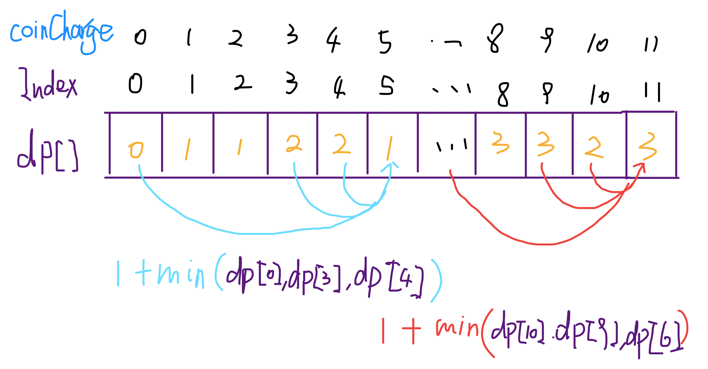

## 394. 字符串解码（中等）栈 DFS

给定一个经过编码的字符串，返回它解码后的字符串。

编码规则为: k[encoded_string]，表示其中方括号内部的 encoded_string 正好重复 k 次。注意 k 保证为正整数。

你可以认为输入字符串总是有效的；输入字符串中没有额外的空格，且输入的方括号总是符合格式要求的。

此外，你可以认为原始数据不包含数字，所有的数字只表示重复的次数 k ，例如不会出现像 3a 或 2[4] 的输入。

示例
> s = "3[a]2[bc]", 返回 "aaabcbc".  
s = "3[a2[c]]", 返回 "accaccacc".  
s = "2[abc]3[cd]ef", 返回 "abcabccdcdcdef".

辅助栈法

- 本题难点在于括号内嵌套括号，需要从内向外生成与拼接字符串，这与栈的先入后出特性对应。
- 算法流程
  1. 构建辅助栈stack, 遍历字符串s中每个字符c；
    - 当c为数字时，将数字字符转化为数字multi，用于后续倍数计算；
    - 当c为字母时，在res尾部添加c；
    - 当c为[时，将当前multi和res入栈，并分别置空置 0：
      - 记录此[前的临时结果res至栈，用于发现对应]后的拼接操作；
      - 记录此[前的倍数multi至栈，用于发现对应]后，获取multi × [...]字符串。
      - 进入到新[后，res和multi重新记录。
    - 当c为]时，stack出栈，拼接字符串res = last_res + cur_multi * res，其中:
      - last_res是上个[到当前[的字符串，例如"3[a2[c]]"中的a；
      - cur_multi是当前[到]内字符串的重复倍数，例如"3[a2[c]]"中的2。
  2. 返回字符串res。


```python
class Solution(object):
    def decodeString(self, s):
        """
        :type s: str
        :rtype: str
        """
        stack = []
        multi = 0
        res = ''
        
        for c in s:
            if c.isdigit():
                multi = int(c) + multi * 10
            if c.isalpha():
                res += c
            if c == '[':
                stack.append([res, multi])
                multi = 0
                res = ''
            if c == ']':
                last_res, cur_multi = stack.pop()
                res = last_res + cur_multi * res
        return res
```

## 347. 前 K 个高频元素（中等）TopK问题 最小堆


给定一个非空的整数数组，返回其中出现频率前 k 高的元素。

示例1:
> 输入: nums = [1,1,1,2,2,3], k = 2  
输出: [1,2]

示例2:
> 输入: nums = [1], k = 1  
输出: [1]

说明
1. 你可以假设给定的 k 总是合理的，且 1 ≤ k ≤ 数组中不相同的元素的个数。
2. 你的算法的时间复杂度必须优于 O(n log n) , n 是数组的大小。

建立容量为k的最小堆保存当前前k个大的元素，每次push维护堆容量，最后pop后逆序输出


```python
class Solution(object):
    def topKFrequent(self, nums, k):
        """
        :type nums: List[int]
        :type k: int
        :rtype: List[int]
        """
        freq = {}
        
        for num in nums:
            if num in freq:
                freq[num] += 1
            else:
                freq[num] = 1
        
        import heapq
        heap = []
        
        for num in freq.keys():
            if len(heap) < k:
                heapq.heappush(heap, (freq[num], num))
            else:
                 heapq.heappushpop(heap, (freq[num], num))
            
        result = []
        for i in range(k):
            result.append(heapq.heappop(heap)[1])
            
        return result[::-1]
```

## 338. 比特位计数（中等）动态规划

给定一个非负整数 num。对于 0 ≤ i ≤ num 范围中的每个数字 i ，计算其二进制数中的 1 的数目并将它们作为数组返回。

示例1:
> 输入: 2  
输出: [0,1,1]

示例2:
>输入: 5  
输出: [0,1,1,2,1,2]

进阶:
给出时间复杂度为O(n*sizeof(integer))的解答非常容易。但你可以在线性时间O(n)内用一趟扫描做到吗？  
要求算法的空间复杂度为O(n)。  
你能进一步完善解法吗？要求在C++或任何其他语言中不使用任何内置函数（如 C++ 中的 __builtin_popcount）来执行此操作。

动态规划 + 最高有效位

假设有一个整数：

$$x=(1001011101)_2=(605)_{10}$$

我们已经计算了从0到x-1的所有结果

$$x^{'}=(1011101)_2=(93)_{10}$$与x只有一位之差

总之，对于pop count P(x)，我们有以下的状态转移函数：

$$P(x+b)=P(x)+1, b=2^{m}>x$$


```python
class Solution(object):
    def countBits(self, num):
        """
        :type num: int
        :rtype: List[int]
        """
        result = [0] * (num + 1)
        b = 1
        i = 0
        while b <= num:
            while i < b and i + b <= num:
                result[i+b] = result[i] + 1
                i += 1
            i = 0
            b <<= 1
        return result
```

## 337. 打家劫舍 III（中等）树型动态规划

在上次打劫完一条街道之后和一圈房屋后，小偷又发现了一个新的可行窃的地区。这个地区只有一个入口，我们称之为“根”。 除了“根”之外，每栋房子有且只有一个“父“房子与之相连。一番侦察之后，聪明的小偷意识到“这个地方的所有房屋的排列类似于一棵二叉树”。 如果两个直接相连的房子在同一天晚上被打劫，房屋将自动报警。

计算在不触动警报的情况下，小偷一晚能够盗取的最高金额。

示例1:
输入: [3,2,3,null,3,null,1]

     3  
    / \  
    2   3  
    \   \   
     3   1

输出: 7 
解释: 小偷一晚能够盗取的最高金额 = 3 + 3 + 1 = 7.

示例2:
输入: [3,4,5,1,3,null,1]

     3  
    / \  
    4   5  
    / \   \   
    1   3   1

输出: 9
解释: 小偷一晚能够盗取的最高金额 = 4 + 5 = 9.

如果选择了cur这个节点，那么不能选择它的父节点和子节点。对于每个节点，只有选和不选两种情况。用dp[0]表示不选这个节点的盗取金额，dp[1]表示选择这个节点的结果

如果选择了根节点，则不能选择子节点

l[0] + r[0] + cur.val # 当前节点金额加上左右子树且不选择左右子节点时的金额

如果没选择根节点，则选择左右子树任意情况的最大和，


```python
# Definition for a binary tree node.
# class TreeNode(object):
#     def __init__(self, x):
#         self.val = x
#         self.left = None
#         self.right = None

class Solution(object):
    def dp(self, cur):
        if not cur: # 如果节点为空，则无论选不选，金额都为0
            return [0, 0] # 分别表示不选择此节点，选择此节点的金额
        l = self.dp(cur.left) # 考虑左子树的结果
        r = self.dp(cur.right) # 考虑右子树的结果
        
        result = [max(l) + max(r), cur.val + l[0] + r[0]] #第一种情况：不选择此节点，则金额为最大值相加；第二种情况，选择此节点，金额为不选择时的结果
        return result
        
    
    def rob(self, root):
        """
        :type root: TreeNode
        :rtype: int
        """
        return max(self.dp(root))
```

## 322. 零钱兑换（中等）动态规划

给定不同面额的硬币 coins 和一个总金额 amount。编写一个函数来计算可以凑成总金额所需的最少的硬币个数。如果没有任何一种硬币组合能组成总金额，返回 -1。

示例1:  
输入: coins = [1, 2, 5], amount = 11  
输出: 3   
解释: 11 = 5 + 5 + 1  

示例2:
输入: coins = [2], amount = 3  
输出: -1

说明：  
你可以认为每种硬币的数量是无限的。

引自[labuladong solution](https://leetcode-cn.com/problems/coin-change/solution/dong-tai-gui-hua-tao-lu-xiang-jie-by-wei-lai-bu-ke/)

下面通过对斐波那契数列和这道凑零钱问题详解动态规划。如果只想看本题的答案，请直接翻到最后查看。

动态规划算法似乎是一种很高深莫测的算法，你会在一些面试或算法书籍的高级技巧部分看到相关内容，什么状态转移方程，重叠子问题，最优子结构等高大上的词汇也可能让你望而却步。

而且，当你去看用动态规划解决某个问题的代码时，你会觉得这样解决问题竟然如此巧妙，但却难以理解，你可能惊讶于人家是怎么想到这种解法的。

实际上，动态规划是一种常见的「算法设计技巧」，并没有什么高深莫测，至于各种高大上的术语，那是吓唬别人用的，只要你亲自体验几把，这些名词的含义其实显而易见，再简单不过了。

至于为什么最终的解法看起来如此精妙，是因为**动态规划遵循一套固定的流程：递归的暴力解法 -> 带备忘录的递归解法 -> 非递归的动态规划解法**。这个过程是层层递进的解决问题的过程，你如果没有前面的铺垫，直接看最终的非递归动态规划解法，当然会觉得牛逼而不可及了。

当然，见的多了，思考多了，是可以一步写出非递归的动态规划解法的。任何技巧都需要练习，我们先遵循这个流程走，算法设计也就这些套路，除此之外，真的没啥高深的。

以下，先通过两个个比较简单的例子：斐波那契和凑零钱问题，揭开动态规划的神秘面纱，描述上述三个流程。后续还会写几篇文章探讨如何使用动态规划技巧解决比较复杂的经典问题。

首先，第一个快被举烂了的例子，斐波那契数列。请读者不要嫌弃这个例子简单，因为简单的例子才能让你把精力充分集中在算法背后的通用思想和技巧上，而不会被那些隐晦的细节问题搞的莫名其妙。后续，困难的例子有的是。

### 步骤一、暴力的递归算法

```cpp
int fib(int N) {
    if (N == 1 || N == 2) return 1;
    return fib(N - 1) + fib(N - 2);
}
```

这个不用多说了，学校老师讲递归的时候似乎都是拿这个举例。我们也知道这样写代码虽然简洁易懂，但是十分低效，低效在哪里？假设 n = 20，请画出递归树。

PS：但凡遇到需要递归的问题，最好都画出递归树，这对你分析算法的复杂度，寻找算法低效的原因都有巨大帮助。


这个递归树怎么理解？就是说想要计算原问题 f(20)，我就得先计算出子问题 f(19) 和 f(18)，然后要计算 f(19)，我就要先算出子问题 f(18) 和 f(17)，以此类推。最后遇到 f(1) 或者 f(2) 的时候，结果已知，就能直接返回结果，递归树不再向下生长了。

**递归算法的时间复杂度怎么计算？子问题个数乘以解决一个子问题需要的时间**。

子问题个数，即递归树中节点的总数。显然二叉树节点总数为指数级别，所以子问题个数为 O(2^n)。

解决一个子问题的时间，在本算法中，没有循环，只有 f(n - 1) + f(n - 2) 一个加法操作，时间为 O(1)。

所以，这个算法的时间复杂度为 O(2^n)，指数级别，爆炸。

观察递归树，很明显发现了算法低效的原因：存在大量重复计算，比如 f(18) 被计算了两次，而且你可以看到，以 f(18) 为根的这个递归树体量巨大，多算一遍，会耗费巨大的时间。更何况，还不止 f(18) 这一个节点被重复计算，所以这个算法及其低效。

这就是动态规划问题的第一个性质：**重叠子问题**。下面，我们想办法解决这个问题。

### 步骤二、带备忘录的递归解法

明确了问题，其实就已经把问题解决了一半。即然耗时的原因是重复计算，那么我们可以造一个「备忘录」，每次算出某个子问题的答案后别急着返回，先记到「备忘录」里再返回；每次遇到一个子问题先去「备忘录」里查一查，如果发现之前已经解决过这个问题了，直接把答案拿出来用，不要再耗时去计算了。

一般使用一个数组充当这个「备忘录」，当然你也可以使用哈希表（字典），思想都是一样的。

```cpp
int fib(int N) {
    if (N < 1) return 0;
    // 备忘录全初始化为 0
    vector<int> memo(N + 1, 0);
    return helper(memo, N);
}
int helper(vector<int>& memo, int n) {
    if (n == 1 || n == 2) return 1;
    if (memo[n] != 0) return memo[n];
    // 未被计算过
    memo[n] = helper(memo, n - 1) + helper(memo, n - 2);
    return memo[n];
}
```

现在，画出递归树，你就知道「备忘录」到底做了什么。


实际上，带「备忘录」的递归算法，把一棵存在巨量冗余的递归树通过「剪枝」，改造成了一幅不存在冗余的递归图，极大减少了子问题（即递归图中节点）的个数。

递归算法的时间复杂度怎么算？子问题个数乘以解决一个子问题需要的时间。

子问题个数，即图中节点的总数，由于本算法不存在冗余计算，子问题就是 f(1), f(2), f(3) ... f(20)，数量和输入规模 n = 20 成正比，所以子问题个数为 O(n)。

解决一个子问题的时间，同上，没有什么循环，时间为 O(1)。

所以，本算法的时间复杂度是 O(n)。比起暴力算法，是降维打击。

至此，带备忘录的递归解法的效率已经和动态规划一样了。实际上，这种解法和动态规划的思想已经差不多了，只不过这种方法叫做「自顶向下」，动态规划叫做「自底向上」。

啥叫「自顶向下」？注意我们刚才画的递归树（或者说图），是从上向下延伸，都是从一个规模较大的原问题比如说 f(20)，向下逐渐分解规模，直到 f(1) 和 f(2) 触底，然后逐层返回答案，这就叫「自顶向下」。

啥叫「自底向上」？反过来，我们直接从最底下，最简单，问题规模最小的 f(1) 和 f(2) 开始往上推，直到推到我们想要的答案 f(20)，这就是动态规划的思路，这也是为什么动态规划一般都脱离了递归，而是由循环迭代完成计算。

### 步骤三、动态规划

有了上一步「备忘录」的启发，我们可以把这个「备忘录」独立出来成为一张表，就叫做 DP table 吧，在这张表上完成「自底向上」的推算岂不美哉！

```cpp
int fib(int N) {
    vector<int> dp(N + 1, 0);
    dp[1] = dp[2] = 1;
    for (int i = 3; i <= N; i++)
        dp[i] = dp[i - 1] + dp[i - 2];
    return dp[N];
}
```


画个图就很好理解了，而且你发现这个 DP table 特别像之前那个「剪枝」后的结果，只是反过来算而已。实际上，带备忘录的递归解法中的「备忘录」，最终完成后就是这个 DP table，所以说这两种解法其实是差不多的，大部分情况下，效率也基本相同。

这里，引出「动态转移方程」这个名词，实际上就是描述问题结构的数学形式：


为啥叫「状态转移方程」？为了听起来高端。你把 f(n) 想做一个状态 n，这个状态 n 是由状态 n - 1 和状态 n - 2 相加转移而来，这就叫状态转移，仅此而已。

你会发现，上面的几种解法中的所有操作，例如 return f(n - 1) + f(n - 2)，dp[i] = dp[i - 1] + dp[i - 2]，以及对备忘录或 DP table 的初始化操作，都是围绕这个方程式的不同表现形式。可见列出「状态转移方程」的重要性，它是解决问题的核心。很容易发现，其实状态转移方程直接代表着暴力解法。

千万不要看不起暴力解，动态规划问题最困难的就是写出状态转移方程，即这个暴力解。优化方法无非是用备忘录或者 DP table，再无奥妙可言。

这个例子的最后，讲一个细节优化。细心的读者会发现，根据斐波那契数列的状态转移方程，当前状态只和之前的两个状态有关，其实并不需要那么长的一个 DP table 来存储所有的状态，只要想办法存储之前的两个状态就行了。所以，可以进一步优化，把空间复杂度降为 O(1)：

```cpp
int fib(int n) {
    if (n < 2) return n;
    int prev = 0, curr = 1;
    for (int i = 0; i < n - 1; i++) {
        int sum = prev + curr;
        prev = curr;
        curr = sum;
    }
    return curr;
}
```

有人会问，动态规划的另一个重要特性**「最优子结构」**，怎么没有涉及？下面会涉及。斐波那契数列的例子严格来说不算动态规划，以上旨在演示算法设计螺旋上升的过程。当问题中要求求一个最优解或在代码中看到循环和 max、min 等函数时，十有八九，需要动态规划大显身手。

下面，看第二个例子，凑零钱问题，有了上面的详细铺垫，这个问题会很快解决。

题目：给你 k 种面值的硬币，面值分别为 c1, c2 ... ck，再给一个总金额 n，问你最少需要几枚硬币凑出这个金额，如果不可能凑出，则回答 -1 。

比如说，k = 3，面值分别为 1，2，5，总金额 n = 11，那么最少需要 3 枚硬币，即 11 = 5 + 5 + 1 。下面走流程。

### 一、暴力解法

首先是最困难的一步，写出状态转移方程，这个问题比较好写：


其实，这个方程就用到了「最优子结构」性质：**原问题的解由子问题的最优解构成**。即 f(11) 由 f(10), f(9), f(6) 的最优解转移而来。

记住，**要符合「最优子结构」，子问题间必须互相独立**。啥叫相互独立？你肯定不想看数学证明，我用一个直观的例子来讲解。

比如说，你的原问题是考出最高的总成绩，那么你的子问题就是要把语文考到最高，数学考到最高...... 为了每门课考到最高，你要把每门课相应的选择题分数拿到最高，填空题分数拿到最高...... 当然，最终就是你每门课都是满分，这就是最高的总成绩。

得到了正确的结果：最高的总成绩就是总分。因为这个过程符合最优子结构，“每门科目考到最高”这些子问题是互相独立，互不干扰的。

但是，如果加一个条件：你的语文成绩和数学成绩会互相制约，此消彼长。这样的话，显然你能考到的最高总成绩就达不到总分了，按刚才那个思路就会得到错误的结果。因为子问题并不独立，语文数学成绩无法同时最优，所以最优子结构被破坏。

回到凑零钱问题，显然子问题之间没有相互制约，而是互相独立的。所以这个状态转移方程是可以得到正确答案的。

之后就没啥难点了，按照方程写暴力递归算法即可。

```cpp
int coinChange(vector<int>& coins, int amount) {
    if (amount == 0) return 0;
    int ans = INT_MAX;
    for (int coin : coins) {
        // 金额不可达
        if (amount - coin < 0) continue;
        int subProb = coinChange(coins, amount - coin);
        // 子问题无解
        if (subProb == -1) continue;
        ans = min(ans, subProb + 1);
    }
    return ans == INT_MAX ? -1 : ans;
}
```

画出递归树：


时间复杂度分析：子问题总数 x 每个子问题的时间。子问题总数为递归树节点个数，这个比较难看出来，是 O(n^k)，总之是指数级别的。每个子问题中含有一个 for 循环，复杂度为 O(k)。所以总时间复杂度为 O(k*n^k)，指数级别。

### 二、带备忘录的递归算法

```cpp
int coinChange(vector<int>& coins, int amount) {
    // 备忘录初始化为 -2
    vector<int> memo(amount + 1, -2);
    return helper(coins, amount, memo);
}

int helper(vector<int>& coins, int amount, vector<int>& memo) {
    if (amount == 0) return 0;
    if (memo[amount] != -2) return memo[amount];
    int ans = INT_MAX;
    for (int coin : coins) {
        // 金额不可达
        if (amount - coin < 0) continue;
        int subProb = helper(coins, amount - coin, memo);
        // 子问题无解
        if (subProb == -1) continue;
        ans = min(ans, subProb + 1);
    }
    // 记录本轮答案
    memo[amount] = (ans == INT_MAX) ? -1 : ans;
    return memo[amount];
}
```

不画图了，很显然「备忘录」大大减小了子问题数目，完全消除了子问题的冗余，所以子问题总数不会超过金额数 n，即子问题数目为 O(n)。处理一个子问题的时间不变，仍是 O(k)，所以总的时间复杂度是 O(kn)。

### 三、动态规划

```cpp
int coinChange(vector<int>& coins, int amount) {
    vector<int> dp(amount + 1, amount + 1);
    dp[0] = 0;
    for (int i = 1; i <= amount; i++) {
        for (int coin : coins)
            if (coin <= i)
                dp[i] = min(dp[i], dp[i - coin] + 1);
    }
    return dp[amount] > amount ? -1 : dp[amount];
}
```




```python
class Solution(object):
    def coinChange(self, coins, amount):
        """
        :type coins: List[int]
        :type amount: int
        :rtype: int
        """
        dp = [amount + 1] * (amount + 1)
        
        dp[0] = 0
        
        for i in range(1, amount+1):
            for coin in coins:
                if i >= coin:
                    dp[i] = min(dp[i], dp[i - coin] + 1)
        
        if dp[amount] > amount:
            result = -1
        else:
            result = dp[amount]
            
        return result
```

## 312. 戳气球（困难）多维动态规划

有 n 个气球，编号为0 到 n-1，每个气球上都标有一个数字，这些数字存在数组 nums 中。

现在要求你戳破所有的气球。每当你戳破一个气球 i 时，你可以获得 nums[left] * nums[i] * nums[right] 个硬币。 这里的 left 和 right 代表和 i 相邻的两个气球的序号。注意当你戳破了气球 i 后，气球 left 和气球 right 就变成了相邻的气球。

求所能获得硬币的最大数量。

说明：  
你可以假设 nums[-1] = nums[n] = 1，但注意它们不是真实存在的所以并不能被戳破。  
0 ≤ n ≤ 500, 0 ≤ nums[i] ≤ 100 

示例：  
输入: [3,1,5,8]  
输出: 167   
解释:   
nums = [3,1,5,8] --> [3,5,8] -->   [3,8]   -->  [8]  --> []  
coins =  $3*1*5      +  3*5*8    +  1*3*8      + 1*8*1   = 167$

dp[i][j] 表示戳破 [i+1...j-1] 号气球的最大收益。

假设 k 号气球（i+1 <= k <= j-1）是 [i+1...j-1] 中最后一个被戳破的，则

dp[i][j] = max {for k = range(i+1, j -1) nums[i] * nums[k] * nums[j] + dp[i][k] + dp[k][j]}


```python
class Solution(object):
    def maxCoins(self, nums):
        """
        :type nums: List[int]
        :rtype: int
        """
        nums = [1] + nums + [1]
        
        n = len(nums)
        
        dp = [[0] * len(nums) for _ in range(len(nums))]
        
        # 这里按长度打表, dp[i][j], j-i >= 2
        for length in range(2, n):
            for i in range(n-length):
                j = length + i
                for k in range(i+1, j):
                    dp[i][j] = max(dp[i][j], nums[i]*nums[k]*nums[j] + dp[i][k]+dp[k][j])
        return dp[0][-1]
```

## 309. 最佳买卖股票时机含冷冻期（中等）动态规划

给定一个整数数组，其中第 i 个元素代表了第 i 天的股票价格.

设计一个算法计算出最大利润。在满足以下约束条件下，你可以尽可能地完成更多的交易（多次买卖一支股票）:

你不能同时参与多笔交易（你必须在再次购买前出售掉之前的股票）。  
卖出股票后，你无法在第二天买入股票 (即冷冻期为 1 天)。

示例：
>输入: [1,2,3,0,2]  
输出: 3   
解释: 对应的交易状态为: [买入, 卖出, 冷冻期, 买入, 卖出]

## 资料：股票问题全解

### 121. 买卖股票的最佳时机（简单）

给定一个数组，它的第 i 个元素是一支给定股票第 i 天的价格。

如果你最多只允许完成一笔交易（即买入和卖出一支股票），设计一个算法来计算你所能获取的最大利润。

注意你不能在买入股票前卖出股票。

示例1：
>输入: [7,1,5,3,6,4]  
输出: 5  
解释: 在第 2 天（股票价格 = 1）的时候买入，在第 5 天（股票价格 = 6）的时候卖出，最大利润 = 6-1 = 5 。  
     注意利润不能是 7-1 = 6, 因为卖出价格需要大于买入价格。

示例2:
>输入: [7,6,4,3,1]  
输出: 0  
解释: 在这种情况下, 没有交易完成, 所以最大利润为 0。

### 122. 买卖股票的最佳时机 II（简单）

给定一个数组，它的第 i 个元素是一支给定股票第 i 天的价格。

设计一个算法来计算你所能获取的最大利润。你可以尽可能地完成更多的交易（多次买卖一支股票）。

注意：你不能同时参与多笔交易（你必须在再次购买前出售掉之前的股票）。

示例1:

>输入: [7,1,5,3,6,4]  
输出: 7  
解释: 在第 2 天（股票价格 = 1）的时候买入，在第 3 天（股票价格 = 5）的时候卖出, 这笔交易所能获得利润 = 5-1 = 4 。  
     随后，在第 4 天（股票价格 = 3）的时候买入，在第 5 天（股票价格 = 6）的时候卖出, 这笔交易所能获得利润 = 6-3 = 3 。  

示例 2:

>输入: [1,2,3,4,5]  
输出: 4  
解释: 在第 1 天（股票价格 = 1）的时候买入，在第 5 天 （股票价格 = 5）的时候卖出, 这笔交易所能获得利润 = 5-1 = 4 。  
     注意你不能在第 1 天和第 2 天接连购买股票，之后再将它们卖出。  
     因为这样属于同时参与了多笔交易，你必须在再次购买前出售掉之前的股票。  

示例3: 

>输入: [7,6,4,3,1]  
输出: 0  
解释: 在这种情况下, 没有交易完成, 所以最大利润为 0。

### 123. 买卖股票的最佳时机 III（困难）

给定一个数组，它的第 i 个元素是一支给定的股票在第 i 天的价格。

设计一个算法来计算你所能获取的最大利润。你最多可以完成 两笔 交易。

注意: 你不能同时参与多笔交易（你必须在再次购买前出售掉之前的股票）。

示例1:
>输入: [3,3,5,0,0,3,1,4]  
输出: 6  
解释: 在第 4 天（股票价格 = 0）的时候买入，在第 6 天（股票价格 = 3）的时候卖出，这笔交易所能获得利润 = 3-0 = 3 。  
     随后，在第 7 天（股票价格 = 1）的时候买入，在第 8 天 （股票价格 = 4）的时候卖出，这笔交易所能获得利润 = 4-1 = 3 。  

示例2:
>输入: [1,2,3,4,5]  
输出: 4  
解释: 在第 1 天（股票价格 = 1）的时候买入，在第 5 天 （股票价格 = 5）的时候卖出, 这笔交易所能获得利润 = 5-1 = 4 。     
     注意你不能在第 1 天和第 2 天接连购买股票，之后再将它们卖出。     
     因为这样属于同时参与了多笔交易，你必须在再次购买前出售掉之前的股票。  

示例3:
>输入: [7,6,4,3,1]   
输出: 0   
解释: 在这个情况下, 没有交易完成, 所以最大利润为 0。  

### 188. 买卖股票的最佳时机 IV（困难）

给定一个数组，它的第 i 个元素是一支给定的股票在第 i 天的价格。

设计一个算法来计算你所能获取的最大利润。你最多可以完成 k 笔交易。

注意: 你不能同时参与多笔交易（你必须在再次购买前出售掉之前的股票）。

示例1:

>输入: [2,4,1], k = 2  
输出: 2  
解释: 在第 1 天 (股票价格 = 2) 的时候买入，在第 2 天 (股票价格 = 4) 的时候卖出，这笔交易所能获得利润 = 4-2 = 2 。

示例2:
>输入: [3,2,6,5,0,3], k = 2  
输出: 7  
解释: 在第 2 天 (股票价格 = 2) 的时候买入，在第 3 天 (股票价格 = 6) 的时候卖出, 这笔交易所能获得利润 = 6-2 = 4 。  
     随后，在第 5 天 (股票价格 = 0) 的时候买入，在第 6 天 (股票价格 = 3) 的时候卖出, 这笔交易所能获得利润 = 3-0 = 3 。

### 309. 最佳买卖股票时机含冷冻期（中等）

给定一个整数数组，其中第 i 个元素代表了第 i 天的股票价格 。

设计一个算法计算出最大利润。在满足以下约束条件下，你可以尽可能地完成更多的交易（多次买卖一支股票）:

- 你不能同时参与多笔交易（你必须在再次购买前出售掉之前的股票）。
- 卖出股票后，你无法在第二天买入股票 (即冷冻期为 1 天)。

示例1:
>输入: [1,2,3,0,2]  
输出: 3   
解释: 对应的交易状态为: [买入, 卖出, 冷冻期, 买入, 卖出]

### 714. 买卖股票的最佳时机含手续费（中等）
给定一个整数数组 prices，其中第 i 个元素代表了第 i 天的股票价格 ；非负整数 fee 代表了交易股票的手续费用。

你可以无限次地完成交易，但是你每次交易都需要付手续费。如果你已经购买了一个股票，在卖出它之前你就不能再继续购买股票了。

返回获得利润的最大值。

示例 1:

>输入: prices = [1, 3, 2, 8, 4, 9], fee = 2  
输出: 8  
解释: 能够达到的最大利润:    
在此处买入 prices[0] = 1  
在此处卖出 prices[3] = 8  
在此处买入 prices[4] = 4  
在此处卖出 prices[5] = 9  
总利润: ((8 - 1) - 2) + ((9 - 4) - 2) = 8.  

注意：
- 0 < prices.length <= 50000.
- 0 < prices[i] < 50000.
- 0 <= fee < 50000.

[引用出处1](https://leetcode.com/problems/best-time-to-buy-and-sell-stock-with-transaction-fee/discuss/108870/Most-consistent-ways-of-dealing-with-the-series-of-stock-problems)

[引用出处2](https://leetcode-cn.com/problems/best-time-to-buy-and-sell-stock-with-cooldown/solution/yi-ge-fang-fa-tuan-mie-6-dao-gu-piao-wen-ti-by-lab/)

这 6 道股票买卖问题是有共性的，我们通过对第四题（限制最大交易次数为 k）的分析一道一道解决。因为第四题是一个最泛化的形式，其他的问题都是这个形式的简化。

第一题是只进行一次交易，相当于 k = 1；第二题是不限交易次数，相当于 k = +infinity（正无穷）；第三题是只进行 2 次交易，相当于 k = 2；剩下两道也是不限次数，但是加了交易「冷冻期」和「手续费」的额外条件，其实就是第二题的变种，都很容易处理。

### 一、穷举框架

如何穷举？

递归其实是符合我们思考的逻辑的，一步步推进，遇到无法解决的就丢给递归，一不小心就做出来了，可读性还很好。缺点就是一旦出错，你也不容易找到错误出现的原因。

而这里，我们不用递归思想进行穷举，而是利用「状态」进行穷举。我们具体到每一天，看看总共有几种可能的「状态」，再找出每个「状态」对应的「选择」。我们要穷举所有「状态」，穷举的目的是根据对应的「选择」更新状态。听起来抽象，你只要记住「状态」和「选择」两个词就行，下面实操一下就很容易明白了。

```python
for 状态1 in 状态1的所有取值：
    for 状态2 in 状态2的所有取值：
        for ...
            dp[状态1][状态2][...] = 择优(选择1，选择2...)
```

比如说这个问题，每天都有三种「选择」：买入、卖出、无操作，我们用 buy, sell, rest 表示这三种选择。但问题是，并不是每天都可以任意选择这三种选择的，因为 sell 必须在 buy 之后，buy 必须在 sell 之后。那么 rest 操作还应该分两种状态，一种是 buy 之后的 rest（持有了股票），一种是 sell 之后的 rest（没有持有股票）。而且别忘了，我们还有交易次数 k 的限制，就是说你 buy 还只能在 k > 0 的前提下操作。

很复杂对吧，不要怕，我们现在的目的只是穷举，你有再多的状态，老夫要做的就是一把梭全部列举出来。这个问题的「状态」有三个，第一个是天数，第二个是允许交易的最大次数，第三个是当前的持有状态（即之前说的 rest 的状态，我们不妨用 1 表示持有，0 表示没有持有）。然后我们用一个三维数组就可以装下这几种状态的全部组合：

```python
dp[i][k][0 or 1]
0 <= i <= n-1, 1 <= k <= K
n 为天数，大 K 为最多交易数
此问题共 n × K × 2 种状态，全部穷举就能搞定。

for 0 <= i < n:
    for 1 <= k <= K:
        for s in {0, 1}:
            dp[i][k][s] = max(buy, sell, rest)
```
            
而且我们可以用自然语言描述出每一个状态的含义，比如说 dp[3][2][1] 的含义就是：今天是第三天，我现在手上持有着股票，至今最多进行 2 次交易。再比如 dp[2][3][0] 的含义：今天是第二天，我现在手上没有持有股票，至今最多进行 3 次交易。很容易理解，对吧？

**我们想求的最终答案是 dp[n - 1][K][0]，即最后一天，最多允许 K 次交易，最多获得多少利润**。读者可能问为什么不是 dp[n - 1][K][1]？因为 [1] 代表手上还持有股票，[0] 表示手上的股票已经卖出去了，很显然后者得到的利润一定大于前者。

记住如何解释「状态」，一旦你觉得哪里不好理解，把它翻译成自然语言就容易理解了。

### 二、状态转移框架

现在，我们完成了「状态」的穷举，我们开始思考每种「状态」有哪些「选择」，应该如何更新「状态」。只看「持有状态」，可以画个状态转移图。


通过这个图可以很清楚地看到，每种状态（0 和 1）是如何转移而来的。根据这个图，我们来写一下状态转移方程：

```
dp[i][k][0] = max(dp[i-1][k][0], dp[i-1][k][1] + prices[i])
              max(   选择 rest  ,           选择 sell      )

解释：今天我没有持有股票，有两种可能：
要么是我昨天就没有持有，然后今天选择 rest，所以我今天还是没有持有；
要么是我昨天持有股票，但是今天我 sell 了，所以我今天没有持有股票了。

dp[i][k][1] = max(dp[i-1][k][1], dp[i-1][k-1][0] - prices[i])
              max(   选择 rest  ,           选择 buy         )

解释：今天我持有着股票，有两种可能：
要么我昨天就持有着股票，然后今天选择 rest，所以我今天还持有着股票；
要么我昨天本没有持有，但今天我选择 buy，所以今天我就持有股票了。
```

这个解释应该很清楚了，如果 buy，就要从利润中减去 prices[i]，如果 sell，就要给利润增加 prices[i]。今天的最大利润就是这两种可能选择中较大的那个。而且注意 k 的限制，我们在选择 buy 的时候，把 k 减小了 1，很好理解吧，当然你也可以在 sell 的时候减 1，一样的。

现在，我们已经完成了动态规划中最困难的一步：状态转移方程。如果之前的内容你都可以理解，那么你已经可以秒杀所有问题了，只要套这个框架就行了。不过还差最后一点点，就是定义 base case，即最简单的情况。

```
dp[-1][k][0] = 0
解释：因为 i 是从 0 开始的，所以 i = -1 意味着还没有开始，这时候的利润当然是 0 。
dp[-1][k][1] = -infinity
解释：还没开始的时候，是不可能持有股票的，用负无穷表示这种不可能。
dp[i][0][0] = 0
解释：因为 k 是从 1 开始的，所以 k = 0 意味着根本不允许交易，这时候利润当然是 0 。
dp[i][0][1] = -infinity
解释：不允许交易的情况下，是不可能持有股票的，用负无穷表示这种不可能。
```

把上面的状态转移方程总结一下

```
base case：
dp[-1][k][0] = dp[i][0][0] = 0
dp[-1][k][1] = dp[i][0][1] = -infinity

状态转移方程：
dp[i][k][0] = max(dp[i-1][k][0], dp[i-1][k][1] + prices[i])
dp[i][k][1] = max(dp[i-1][k][1], dp[i-1][k-1][0] - prices[i])
```

读者可能会问，这个数组索引是 -1 怎么编程表示出来呢，负无穷怎么表示呢？这都是细节问题，有很多方法实现。现在完整的框架已经完成，下面开始具体化。

### 121. 买卖股票的最佳时机（简单）k=1

根据状态转移方程

```
dp[i][1][0] = max(dp[i-1][1][0], dp[i-1][1][1] + prices[i])
dp[i][1][1] = max(dp[i-1][1][1], dp[i-1][0][0] - prices[i]) 
            = max(dp[i-1][1][1], -prices[i])
解释：k = 0 的 base case，所以 dp[i-1][0][0] = 0。

现在发现 k 都是 1，不会改变，即 k 对状态转移已经没有影响了。
可以进行进一步化简去掉所有 k：
dp[i][0] = max(dp[i-1][0], dp[i-1][1] + prices[i])
dp[i][1] = max(dp[i-1][1], -prices[i])
```

```cpp
int n = prices.length;
int[][] dp = new int[n][2];
for (int i = 0; i < n; i++) {
    dp[i][0] = Math.max(dp[i-1][0], dp[i-1][1] + prices[i]);
    dp[i][1] = Math.max(dp[i-1][1], -prices[i]);
}
return dp[n - 1][0];
```

```cpp
显然 i = 0 时 dp[i-1] 是不合法的。这是因为我们没有对 i 的 base case 进行处理。可以这样处理

for (int i = 0; i < n; i++) {
    if (i - 1 == -1) {
        dp[i][0] = 0;
        // 解释：
        //   dp[i][0] 
        // = max(dp[-1][0], dp[-1][1] + prices[i])
        // = max(0, -infinity + prices[i]) = 0
        dp[i][1] = -prices[i];
        //解释：
        //   dp[i][1] 
        // = max(dp[-1][1], dp[-1][0] - prices[i])
        // = max(-infinity, 0 - prices[i]) 
        // = -prices[i]
        continue;
    }
    dp[i][0] = Math.max(dp[i-1][0], dp[i-1][1] + prices[i]);
    dp[i][1] = Math.max(dp[i-1][1], -prices[i]);
}
return dp[n - 1][0];
```

第一题就解决了，但是这样处理 base case 很麻烦，而且注意一下状态转移方程，新状态只和相邻的一个状态有关，其实不用整个 dp 数组，只需要一个变量储存相邻的那个状态就足够了，这样可以把空间复杂度降到 O(1):

```cpp
// k == 1
int maxProfit_k_1(int[] prices) {
    int n = prices.length;
    // base case: dp[-1][0] = 0, dp[-1][1] = -infinity
    int dp_i_0 = 0, dp_i_1 = Integer.MIN_VALUE;
    for (int i = 0; i < n; i++) {
        // dp[i][0] = max(dp[i-1][0], dp[i-1][1] + prices[i])
        dp_i_0 = Math.max(dp_i_0, dp_i_1 + prices[i]);
        // dp[i][1] = max(dp[i-1][1], -prices[i])
        dp_i_1 = Math.max(dp_i_1, -prices[i]);
    }
    return dp_i_0;
}
```


```python
import sys

class Solution(object):
    def maxProfit(self, prices):
        """
        :type prices: List[int]
        :rtype: int
        """
        n = len(prices)
        
        dp_i_0 = 0
        dp_i_1 = -sys.maxsize
        
        for i in range(n):
            dp_i_0 = max(dp_i_0, dp_i_1 + prices[i])
            dp_i_1 = max(dp_i_1, -prices[i])
        
        return dp_i_0
```

### 122. 买卖股票的最佳时机 II（简单）

第二题，k = +infinity

如果 k 为正无穷，那么就可以认为 k 和 k - 1 是一样的。可以这样改写框架

```
dp[i][k][0] = max(dp[i-1][k][0], dp[i-1][k][1] + prices[i])
dp[i][k][1] = max(dp[i-1][k][1], dp[i-1][k-1][0] - prices[i])
            = max(dp[i-1][k][1], dp[i-1][k][0] - prices[i])

我们发现数组中的 k 已经不会改变了，也就是说不需要记录 k 这个状态了：
dp[i][0] = max(dp[i-1][0], dp[i-1][1] + prices[i])
dp[i][1] = max(dp[i-1][1], dp[i-1][0] - prices[i])
```

```cpp
int maxProfit_k_inf(int[] prices) {
    int n = prices.length;
    int dp_i_0 = 0, dp_i_1 = Integer.MIN_VALUE;
    for (int i = 0; i < n; i++) {
        int temp = dp_i_0;
        dp_i_0 = Math.max(dp_i_0, dp_i_1 + prices[i]);
        dp_i_1 = Math.max(dp_i_1, temp - prices[i]);
    }
    return dp_i_0;
}
```


```python
import sys

class Solution(object):
    def maxProfit(self, prices):
        """
        :type prices: List[int]
        :rtype: int
        """
        n = len(prices)
        
        dp_i_0 = 0
        dp_i_1 = -sys.maxsize
        
        for i in range(n):
            temp = dp_i_0
            dp_i_0 = max(dp_i_0, dp_i_1 + prices[i])
            dp_i_1 = max(dp_i_1, temp - prices[i])
            
        return dp_i_0
```

### 309. 最佳买卖股票时机含冷冻期（中等）

第三题，k = +infinity with cooldown

每次 sell 之后要等一天才能继续交易。只要把这个特点融入上一题的状态转移方程即可：

```
dp[i][0] = max(dp[i-1][0], dp[i-1][1] + prices[i])
dp[i][1] = max(dp[i-1][1], dp[i-2][0] - prices[i])
解释：第 i 天选择 buy 的时候，要从 i-2 的状态转移，而不是 i-1 。
```

```cpp
int maxProfit_with_cool(int[] prices) {
    int n = prices.length;
    int dp_i_0 = 0, dp_i_1 = Integer.MIN_VALUE;
    int dp_pre_0 = 0; // 代表 dp[i-2][0]
    for (int i = 0; i < n; i++) {
        int temp = dp_i_0;
        dp_i_0 = Math.max(dp_i_0, dp_i_1 + prices[i]);
        dp_i_1 = Math.max(dp_i_1, dp_pre_0 - prices[i]);
        dp_pre_0 = temp;
    }
    return dp_i_0;
}
```


```python
import sys

class Solution(object):
    def maxProfit(self, prices):
        """
        :type prices: List[int]
        :rtype: int
        """
        n = len(prices)
        
        dp_i_0 = 0
        dp_i_1 = -sys.maxsize
        dp_pre_0 = 0
        
        for i in range(n):
            temp = dp_i_0
            
            dp_i_0 = max(dp_i_0, dp_i_1 + prices[i])
            dp_i_1 = max(dp_i_1, dp_pre_0 - prices[i])
            
            dp_pre_0 = temp
        
        return dp_i_0
```

### 714. 买卖股票的最佳时机含手续费（中等）

每次交易要支付手续费，只要把手续费从利润中减去即可。改写方程：

```
dp[i][0] = max(dp[i-1][0], dp[i-1][1] + prices[i])
dp[i][1] = max(dp[i-1][1], dp[i-1][0] - prices[i] - fee)
解释：相当于买入股票的价格升高了。
在第一个式子里减也是一样的，相当于卖出股票的价格减小了。
```

```cpp
int maxProfit_with_fee(int[] prices, int fee) {
    int n = prices.length;
    int dp_i_0 = 0, dp_i_1 = Integer.MIN_VALUE;
    for (int i = 0; i < n; i++) {
        int temp = dp_i_0;
        dp_i_0 = Math.max(dp_i_0, dp_i_1 + prices[i]);
        dp_i_1 = Math.max(dp_i_1, temp - prices[i] - fee);
    }
    return dp_i_0;
}
```


```python
import sys

class Solution(object):
    def maxProfit(self, prices, fee):
        """
        :type prices: List[int]
        :rtype: int
        """
        n = len(prices)
        
        dp_i_0 = 0
        dp_i_1 = -sys.maxsize
        
        for i in range(n):
            temp = dp_i_0
            
            dp_i_0 = max(dp_i_0, dp_i_1 + prices[i])
            dp_i_1 = max(dp_i_1, temp - prices[i] - fee)
            
        return dp_i_0
```

### 123. 买卖股票的最佳时机 III（困难）
第五题，k = 2

k = 2 和前面题目的情况稍微不同，因为上面的情况都和 k 的关系不太大。要么 k 是正无穷，状态转移和 k 没关系了；要么 k = 1，跟 k = 0 这个 base case 挨得近，最后也没有存在感。

这道题 k = 2 和后面要讲的 k 是任意正整数的情况中，对 k 的处理就凸显出来了。我们直接写代码，边写边分析原因。

```
原始的动态转移方程，没有可化简的地方
dp[i][k][0] = max(dp[i-1][k][0], dp[i-1][k][1] + prices[i])
dp[i][k][1] = max(dp[i-1][k][1], dp[i-1][k-1][0] - prices[i])
```

按照之前的代码，我们可能想当然这样写代码（错误的）：

```cpp
int k = 2;
int[][][] dp = new int[n][k + 1][2];
for (int i = 0; i < n; i++)
    if (i - 1 == -1) { /* 处理一下 base case*/ }
    dp[i][k][0] = Math.max(dp[i-1][k][0], dp[i-1][k][1] + prices[i]);
    dp[i][k][1] = Math.max(dp[i-1][k][1], dp[i-1][k-1][0] - prices[i]);
}
return dp[n - 1][k][0];
```

为什么错误？我这不是照着状态转移方程写的吗？

还记得前面总结的「穷举框架」吗？就是说我们必须穷举所有状态。其实我们之前的解法，都在穷举所有状态，只是之前的题目中 k 都被化简掉了。这道题由于没有消掉 k 的影响，所以必须要对 k 进行穷举：

```cpp
int max_k = 2;
int[][][] dp = new int[n][max_k + 1][2];
for (int i = 0; i < n; i++) {
    for (int k = max_k; k >= 1; k--) {
        if (i - 1 == -1) { 
            /* 处理 base case */
            dp[i][k][0] = 0;
            dp[i][k][1] = -prices[i];
            continue;
        }
        dp[i][k][0] = max(dp[i-1][k][0], dp[i-1][k][1] + prices[i]);
        dp[i][k][1] = max(dp[i-1][k][1], dp[i-1][k-1][0] - prices[i]);
    }
}
// 穷举了 n × max_k × 2 个状态，正确。
return dp[n - 1][max_k][0];
```


```python
class Solution(object):
    def maxProfit(self, prices):
        """
        :type prices: List[int]
        :rtype: int
        """
        if not prices:
            return 0
        
        max_k = 2
        n = len(prices)
        
        dp = [None] * n
        for i in range(len(dp)):
            dp[i] = [0]*(max_k+1)
        for i in range(n):
            for j in range(max_k+1):
                dp[i][j] = [0]*2
                
        for i in range(n):
            for k in range(max_k, 0, -1):
                if i-1 == -1:
                    dp[i][k][0] = 0
                    dp[i][k][1] = -prices[i]
                    continue
                dp[i][k][0] = max(dp[i-1][k][0], dp[i-1][k][1] + prices[i])
                dp[i][k][1] = max(dp[i-1][k][1], dp[i-1][k-1][0] - prices[i])
        
        return dp[n-1][max_k][0]
```

### 188. 买卖股票的最佳时机 IV（困难）¶

第六题，k = any integer

有了上一题 k = 2 的铺垫，这题应该和上一题的第一个解法没啥区别。但是出现了一个超内存的错误，原来是传入的 k 值会非常大，dp 数组太大了。现在想想，交易次数 k 最多有多大呢？

一次交易由买入和卖出构成，至少需要两天。所以说有效的限制 k 应该不超过 n/2，如果超过，就没有约束作用了，相当于 k = +infinity。这种情况是之前解决过的。

直接把之前的代码重用：

```cpp
int maxProfit_k_any(int max_k, int[] prices) {
    int n = prices.length;
    if (max_k > n / 2) 
        return maxProfit_k_inf(prices);

    int[][][] dp = new int[n][max_k + 1][2];
    for (int i = 0; i < n; i++) 
        for (int k = max_k; k >= 1; k--) {
            if (i - 1 == -1) { /* 处理 base case */ }
            dp[i][k][0] = max(dp[i-1][k][0], dp[i-1][k][1] + prices[i]);
            dp[i][k][1] = max(dp[i-1][k][1], dp[i-1][k-1][0] - prices[i]);     
        }
    return dp[n - 1][max_k][0];
}
```


```python
class Solution(object):
    def maxProfit_k_inf(self, prices):
        """
        :type prices: List[int]
        :rtype: int
        """
        n = len(prices)
        
        dp_i_0 = 0
        dp_i_1 = -sys.maxsize
        
        for i in range(n):
            temp = dp_i_0
            dp_i_0 = max(dp_i_0, dp_i_1 + prices[i])
            dp_i_1 = max(dp_i_1, temp - prices[i])
            
        return dp_i_0
    
    def maxProfit(self, k, prices):
        """
        :type k: int
        :type prices: List[int]
        :rtype: int
        """
        if not prices:
            return 0
        
        max_k = k
        n = len(prices)
        
        if max_k > n // 2:
            return self.maxProfit_k_inf(prices)
        
        dp = [None] * n
        for i in range(len(dp)):
            dp[i] = [0]*(max_k+1)
        for i in range(n):
            for j in range(max_k+1):
                dp[i][j] = [0]*2
                
        for i in range(n):
            for k in range(max_k, 0, -1):
                if i-1 == -1:
                    dp[i][k][0] = 0
                    dp[i][k][1] = -prices[i]
                    continue
                dp[i][k][0] = max(dp[i-1][k][0], dp[i-1][k][1] + prices[i])
                dp[i][k][1] = max(dp[i-1][k][1], dp[i-1][k-1][0] - prices[i])
        
        return dp[n-1][max_k][0]
```
