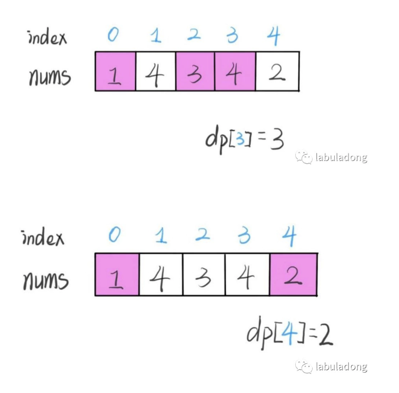
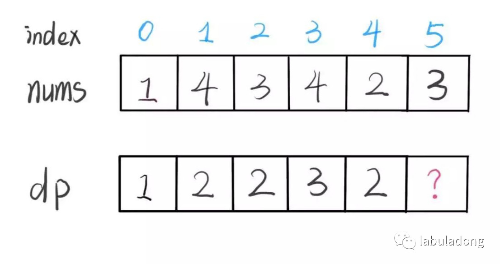
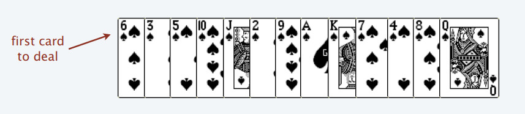
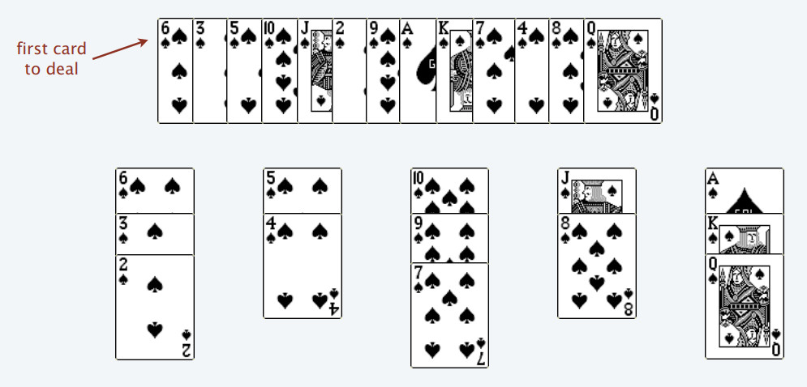
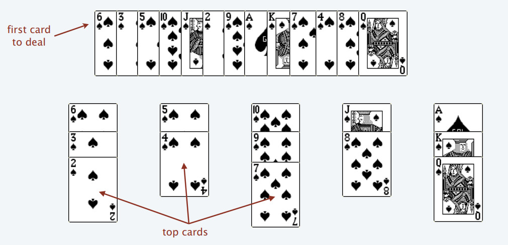
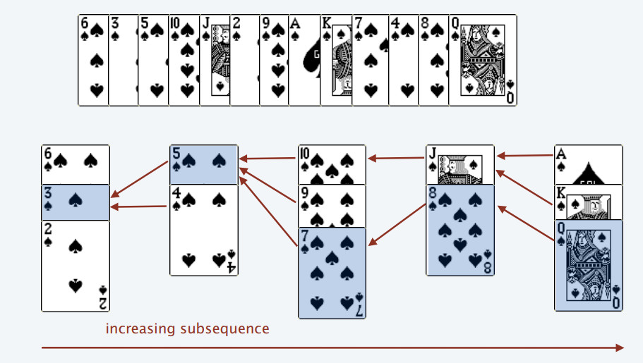

## 301. 删除无效的括号（困难）

删除最小数量的无效括号，使得输入的字符串有效，返回所有可能的结果。

说明: 输入可能包含了除 ( 和 ) 以外的字符。

示例 1:

>输入: "()())()"  
输出: ["()()()", "(())()"]

示例2:
>输入: "(a)())()"  
输出: ["(a)()()", "(a())()"]

示例3:
>输入: ")("  
输出: [""]


```python
class Solution(object):
    def longestConsecutive(self, nums):
        """
        :type nums: List[int]
        :rtype: int
        """
        nums = set(nums)
        maxlen = 0

        for num in nums:
            if num - 1 not in nums: # 如果是连续序列的头部
                curlen = 1
                curnum = num + 1
                while curnum in nums:
                    curlen += 1
                    curnum += 1
                if curlen > maxlen:
                    maxlen = curlen
            
        return maxlen
```

## 300. 最长上升子序列（中等）动态规划+二分查找

给定一个无序的整数数组，找到其中最长上升子序列的长度。

示例:
>输入: [10,9,2,5,3,7,101,18]  
输出: 4   
解释: 最长的上升子序列是 [2,3,7,101]，它的长度是 4。

说明
- 可能会有多种最长上升子序列的组合，你只需要输出对应的长度即可。
- 你算法的时间复杂度应该为 O(n2) 。

进阶: 你能将算法的时间复杂度降低到 O(n log n) 吗?

本文就借助「最长递增子序列」来讲一种设计动态规划的通用技巧：数学归纳思想。

最长递增子序列（Longest Increasing Subsequence，简写 LIS）是比较经典的一个问题，比较容易想到的是动态规划解法，时间复杂度 O(N^2)，我们借这个问题来由浅入深讲解如何写动态规划。比较难想到的是利用二分查找，时间复杂度是 O(NlogN)，我们通过一种简单的纸牌游戏来辅助理解这种巧妙的解法。

### 一、动态规划解法

动态规划的核心设计思想是数学归纳法。

相信大家对数学归纳法都不陌生，高中就学过，而且思路很简单。比如我们想证明一个数学结论，那么我们先假设这个结论在 k<n 时成立，然后想办法证明 k=n 的时候此结论也成立。如果能够证明出来，那么就说明这个结论对于 k 等于任何数都成立。

类似的，我们设计动态规划算法，不是需要一个 dp 数组吗？我们可以假设 dp[0...i−1] 都已经被算出来了，然后问自己：怎么通过这些结果算出 dp[i]？

直接拿最长递增子序列这个问题举例你就明白了。不过，首先要定义清楚 dp 数组的含义，即 dp[i] 的值到底代表着什么？

我们的定义是这样的：dp[i] 表示以 nums[i] 这个数结尾的最长递增子序列的长度。

举两个例子：




根据这个定义，我们的最终结果（子序列的最大长度）应该是 dp 数组中的最大值。

```cpp
int res = 0;
for (int i = 0; i < dp.size(); i++) {
    res = Math.max(res, dp[i]);
}
return res;
```

读者也许会问，刚才这个过程中每个 dp[i] 的结果是我们肉眼看出来的，我们应该怎么设计算法逻辑来正确计算每个 dp[i] 呢？

这就是动态规划的重头戏了，要思考如何进行状态转移，这里就可以使用数学归纳的思想：

我们已经知道了 dp[0...4] 的所有结果，我们如何通过这些已知结果推出 dp[5] 呢？



根据刚才我们对 dp 数组的定义，现在想求 dp[5] 的值，也就是想求以 nums[5] 为结尾的最长递增子序列。

nums[5] = 3，既然是递增子序列，我们只要找到前面那些结尾比 3 小的子序列，然后把 3 接到最后，就可以形成一个新的递增子序列，而且这个新的子序列长度加一。

当然，可能形成很多种新的子序列，但是我们只要最长的，把最长子序列的长度作为 dp[5] 的值即可。


```cpp
for (int j = 0; j < i; j++) {
    if (nums[i] > nums[j]) 
        dp[i] = Math.max(dp[i], dp[j] + 1);
}
```

这段代码的逻辑就可以算出 dp[5]。到这里，这道算法题我们就基本做完了。读者也许会问，我们刚才只是算了 dp[5] 呀，dp[4], dp[3] 这些怎么算呢？

类似数学归纳法，你已经可以算出 dp[5] 了，其他的就都可以算出来：

```cpp
for (int i = 0; i < nums.length; i++) {
    for (int j = 0; j < i; j++) {
        if (nums[i] > nums[j]) 
            dp[i] = Math.max(dp[i], dp[j] + 1);
    }
}
```

还有一个细节问题，dp 数组应该全部初始化为 1，因为子序列最少也要包含自己，所以长度最小为 1。下面我们看一下完整代码：

```cpp
public int lengthOfLIS(int[] nums) {
    int[] dp = new int[nums.length];
    // dp 数组全都初始化为 1
    Arrays.fill(dp, 1);
    for (int i = 0; i < nums.length; i++) {
        for (int j = 0; j < i; j++) {
            if (nums[i] > nums[j]) 
                dp[i] = Math.max(dp[i], dp[j] + 1);
        }
    }
    
    int res = 0;
    for (int i = 0; i < dp.length; i++) {
        res = Math.max(res, dp[i]);
    }
    return res;
}
```


```python
# n2解法

class Solution(object):
    def lengthOfLIS(self, nums):
        """
        :type nums: List[int]
        :rtype: int
        """
        if not nums:
            return 0
        
        n = len(nums)
        
        dp = [1] * n 
        
        for i in range(n):
            for j in range(i):
                if nums[j] < nums[i]:
                    dp[i] = max(dp[i], dp[j] + 1)
        
        return max(dp)
```

至此，这道题就解决了，时间复杂度 O(N^2)。总结一下动态规划的设计流程：

首先明确 dp 数组所存数据的含义。这步很重要，如果不得当或者不够清晰，会阻碍之后的步骤。

然后根据 dp 数组的定义，运用数学归纳法的思想，假设 dp[0...i−1] 都已知，想办法求出 dp[i]，一旦这一步完成，整个题目基本就解决了。

但如果无法完成这一步，很可能就是 dp 数组的定义不够恰当，需要重新定义 dp 数组的含义；或者可能是 dp 数组存储的信息还不够，不足以推出下一步的答案，需要把 dp 数组扩大成二维数组甚至三维数组。

最后想一想问题的 base case 是什么，以此来初始化 dp 数组，以保证算法正确运行。

### 二、二分查找解法

这个解法的时间复杂度会将为 O(NlogN)，但是说实话，正常人基本想不到这种解法（也许玩过某些纸牌游戏的人可以想出来）。所以如果大家了解一下就好，正常情况下能够给出动态规划解法就已经很不错了。

根据题目的意思，我都很难想象这个问题竟然能和二分查找扯上关系。其实最长递增子序列和一种叫做 patience game 的纸牌游戏有关，甚至有一种排序方法就叫做 patience sorting（耐心排序）。

为了简单期间，后文跳过所有数学证明，通过一个简化的例子来理解一下思路。

首先，给你一排扑克牌，我们像遍历数组那样从左到右一张一张处理这些扑克牌，最终要把这些牌分成若干堆。



处理这些扑克牌要遵循以下规则：

只能把点数小的牌压到点数比它大的牌上。如果当前牌点数较大没有可以放置的堆，则新建一个堆，把这张牌放进去。如果当前牌有多个堆可供选择，则选择最左边的堆放置。

比如说上述的扑克牌最终会被分成这样 5 堆（我们认为 A 的值是最大的，而不是 1）。



为什么遇到多个可选择堆的时候要放到最左边的堆上呢？因为这样可以保证牌堆顶的牌有序（2, 4, 7, 8, Q），证明略



按照上述规则执行，可以算出最长递增子序列，牌的堆数就是最长递增子序列的长度，证明略。



我们只要把处理扑克牌的过程编程写出来即可。每次处理一张扑克牌不是要找一个合适的牌堆顶来放吗，牌堆顶的牌不是有序吗，这就能用到二分查找了：用二分查找来搜索当前牌应放置的位置。

```cpp
public int lengthOfLIS(int[] nums) {
    int[] top = new int[nums.length];
    // 牌堆数初始化为 0
    int piles = 0;
    for (int i = 0; i < nums.length; i++) {
        // 要处理的扑克牌
        int poker = nums[i];

        /***** 搜索左侧边界的二分查找 *****/
        int left = 0, right = piles;
        while (left < right) {
            int mid = (left + right) / 2;
            if (top[mid] > poker) {
                right = mid;
            } else if (top[mid] < poker) {
                left = mid + 1;
            } else {
                right = mid;
            }
        }
        /*********************************/
        
        // 没找到合适的牌堆，新建一堆
        if (left == piles) piles++;
        // 把这张牌放到牌堆顶
        top[left] = poker;
    }
    // 牌堆数就是 LIS 长度
    return piles;
}
```

## 239. 滑动窗口最大值（困难）单调队列，双端队列

给定一个数组 nums，有一个大小为 k 的滑动窗口从数组的最左侧移动到数组的最右侧。你只可以看到在滑动窗口内的 k 个数字。滑动窗口每次只向右移动一位。

返回滑动窗口中的最大值。

 

示例:

输入: nums = [1,3,-1,-3,5,3,6,7], 和 k = 3  
输出: [3,3,5,5,6,7]   
解释:   

      滑动窗口的位置                最大值
---------------               -----
    [1  3  -1] -3  5  3  6  7       3  
     1 [3  -1  -3] 5  3  6  7       3  
     1  3 [-1  -3  5] 3  6  7       5  
     1  3  -1 [-3  5  3] 6  7       5  
     1  3  -1  -3 [5  3  6] 7       6  
     1  3  -1  -3  5 [3  6  7]      7  

提示：
你可以假设 k 总是有效的，在输入数组不为空的情况下，1 ≤ k ≤ 输入数组的大小。

进阶：
你能在线性时间复杂度内解决此题吗？

要求在线性时间复杂度内解决此题。需要在O(1)获取最大值。需要单调队列数据结构

「单调队列」的核心思路和「单调栈」类似。单调队列的 push 方法依然在队尾添加元素，但是要把前面比新元素小的元素都删掉：


如果每个元素被加入时都这样操作，最终单调队列中的元素大小就会保持一个单调递减的顺序

pop时之所以要判断 data.front() == n，是因为我们想删除的队头元素 n 可能已经被「压扁」了，这时候就不用删除了：


```python
from collections import deque

class MonotonicQueue(deque):
    def __init__(self, nums):
        self.data = deque(nums)
        
    def push(self, num):
        while len(self.data) > 0 and self.data[-1] < num:
            self.data.pop()
        self.data.append(num)
    
    def maxima(self):
        return self.data[0]
    
    def MonitonicPop(self, num):
        if len(self.data) >0 and self.data[0] == num:
            self.data.popleft()

class Solution(object):
    def maxSlidingWindow(self, nums, k):
        """
        :type nums: List[int]
        :type k: int
        :rtype: List[int]
        """
        result = []
        window = MonotonicQueue([])
        
        for i in range(len(nums)):
            if i < k-1: # 先把窗口的前 k - 1 填满
                window.push(nums[i]) 
            else: # 窗口向前滑动
                window.push(nums[i])
                result.append(window.maxima())
                window.MonitonicPop(nums[i-k+1]) # 删除最左边的元素
        return result
```

单独看 push 操作的复杂度确实不是 O(1)，但是算法整体的复杂度依然是 O(N) 线性时间。要这样想，nums 中的每个元素最多被 push_back 和 pop_back 一次，没有任何多余操作，所以整体的复杂度还是 O(N)。

空间复杂度就很简单了，就是窗口的大小 O(k)。

有的读者可能觉得「单调队列」和「优先级队列」比较像，实际上差别很大的。

单调队列在添加元素的时候靠删除元素保持队列的单调性，相当于抽取出某个函数中单调递增（或递减）的部分；而优先级队列（二叉堆）相当于自动排序，差别大了去了。

## 238. 除自身以外数组的乘积（中等）

给定长度为 n 的整数数组 nums，其中 n > 1，返回输出数组 output ，其中 output[i] 等于 nums 中除 nums[i] 之外其余各元素的乘积。

示例:

>输入: [1,2,3,4]  
输出: [24,12,8,6]

说明: 请不要使用除法，且在 O(n) 时间复杂度内完成此题。

进阶：  
你可以在常数空间复杂度内完成这个题目吗？（ 出于对空间复杂度分析的目的，输出数组不被视为额外空间。）


```python
class Solution(object):
    def productExceptSelf(self, nums):
        """
        :type nums: List[int]
        :rtype: List[int]
        """
        result = []
        left = [1] * len(nums)
        right = [1] * len(nums)
        
        for i in range(len(nums)):
            if i == 0:
                left[i] = 1
            elif i == 1:
                left[i] = nums[i-1]
            else:
                left[i] = left[i-1] * nums[i-1]
        
        for j in range(len(nums)-1, -1, -1):
            if j == len(nums)-1:
                right[j] = 1
            elif j == len(nums)-2:
                right[j] = nums[-1]
            else:
                right[j] = right[j+1] * nums[j+1]
                
        for i in range(len(left)):
            result.append(left[i]*right[i])
        return result
```

## 221. 最大正方形（中等）动态规划

在一个由 0 和 1 组成的二维矩阵内，找到只包含 1 的最大正方形，并返回其面积。

示例:
>输入:   
1 0 1 0 0  
1 0 1 1 1  
1 1 1 1 1  
1 0 0 1 0  
输出: 4

动态规划问题。设二维数组dp[m][n]，其中dp[i][j]表示以坐标(i,j)为右下角元素的最大正方形的边长。

通过观察我们可以看出当前位置的最大正方形边长为上，左，左上三个位置最大正方形边长的最小值+1。（必须这三个正方形同时满足&&该位置matrix[i][j]==1 的条件下，最大边长）

得到动态规划方程：
如果 matrix[i][j] == 1

```
dp[i][j] = min(dp[i-1][j], dp[i][j-1], dp[i-1][j-1]) + 1
```

否则

```
dp[i][j] = 0
```

并用一个变量maxLen记录下遍历过程中的最大正方形边长，最终返回maxLen*maxLen为最大正方形面积。

复杂度分析
时间复杂度：O（mn）
空间复杂度：O（mn）
m，n为输入矩阵的行列数。


```python
class Solution(object):
    def maximalSquare(self, matrix):
        """
        :type matrix: List[List[str]]
        :rtype: int
        """
        if not matrix:
            return 0
        
        m = len(matrix)
        n = len(matrix[0])
        maxLen = 0
        
        dp = [[0 for _ in range(n)] for _ in range(m)]
        
        for j in range(n):
            dp[0][j] = int(matrix[0][j])
            if maxLen < dp[0][j]:
                maxLen = dp[0][j]
        for i in range(m):
            dp[i][0] = int(matrix[i][0])
            if maxLen < dp[i][0]:
                maxLen = dp[i][0]
        
        
        for i in range(1, m):
            for j in range(1, n):
                if int(matrix[i][j]) == 1:
                    dp[i][j] = min(int(dp[i-1][j]), int(dp[i][j-1]), int(dp[i-1][j-1])) + 1
                    if dp[i][j] > maxLen:
                        maxLen = dp[i][j]
                else:
                    dp[i][j] = 0
                    
        return maxLen*maxLen
```

## 200. 岛屿数量（中等）DFS, BFS, 并查集

给定一个由 '1'（陆地）和 '0'（水）组成的的二维网格，计算岛屿的数量。一个岛被水包围，并且它是通过水平方向或垂直方向上相邻的陆地连接而成的。你可以假设网格的四个边均被水包围。

示例 1:
>输入:  
11110  
11010  
11000  
00000  
输出: 1

示例2:
>输入:  
11000  
11000  
00100    
00011  
输出: 3

### 思路1: 浸水填充法 flood fill

>Flood fill 算法是从一个区域中提取若干个连通的点与其他相邻区域区分开（或分别染成不同颜色）的经典 算法。因为其思路类似洪水从一个区域扩散到所有能到达的区域而得名。在 GNU Go 和 扫雷 中，Flood Fill算法被用来计算需要被清除的区域。

- 从一个区域中提取若干个连通的点与其他相邻区域区分开

从一个点扩散开，找到与其连通的点，这不是什么高深的算法，其实就是从一个点开始，进行一次 “深度优先遍历” 或者 “广度优先遍历”，通过 “深度优先遍历” 或者 “广度优先遍历” 发现一片连着的区域，对于这道题来说，就是从一个是 “陆地” 的格子开始进行一次 “深度优先遍历” 或者 “广度优先遍历”，把与之相连的所有的格子都标记上，视为发现了一个 “岛屿”。

说明：这里做 “标记” 的意思是，通过 “深度优先遍历” 或者 “广度优先遍历” 操作，我发现了一个新的格子，与起始点的那个格子是连通的，我们视为 “标记” 过，也可以说 “被访问过”。

那么每一次进行 “深度优先遍历” 或者 “广度优先遍历” 的条件就是：

1. 这个格子是陆地 1，如果是水域 0 就无从谈论 “岛屿”；
2. 这个格子不能是之前发现 “岛屿” 的过程中执行了 “深度优先遍历” 或者 “广度优先遍历” 操作，而被标记的格子

#### 方法一：深度优先遍历


```python
class Solution(object):
    def __init__(self):
        #        x-1,y
        # x,y-1    x,y      x,y+1
        #        x+1,y
        # 方向数组，它表示了相对于当前位置的 4 个方向的横、纵坐标的偏移量，这是一个常见的技巧
        self.directions = [(-1, 0), (1, 0), (0, -1), (0, 1)]
    
    def dfs(self, grid, i, j, m, n, mark):
        mark[i][j] = True
        for direction in self.directions:
            next_i = i + direction[0]
            next_j = j + direction[1]
            # 只要是陆地，且没有被访问过的，就可以使用 DFS 发现与之相连的陆地，并进行标记
            if 0<=next_i<m and 0<=next_j<n and not mark[next_i][next_j] and grid[next_i][next_j] == '1':
                self.dfs(grid, next_i, next_j, m, n, mark)
    
    def numIslands(self, grid):
        """
        :type grid: List[List[str]]
        :rtype: int
        """
        if not grid:
            return 0
        
        m = len(grid)
        n = len(grid[0])
        
        mark = [[False for _ in range(n)] for _ in range(m)]
        result = 0
        
        # 从第 1 行、第 1 格开始，对每一格尝试进行一次 DFS 操作
        for i in range(m):
            for j in range(n):
                if not mark[i][j] and grid[i][j] == '1':
                    result += 1
                    self.dfs(grid, i, j, m, n, mark)
                    
        return result
```

#### 方法二：广度优先遍历

除了 “深度优先遍历”，你还可以使用 “广度优先遍历”，此时你就不用回溯了。“广度优先遍历” 需要一个 “辅助队列”。

在写 “广度优先遍历” 的时候，要注意一点：

>所有加入队列的结点，都应该马上被标记为 “已经访问”，否则有可能会被重复加入队列。

我一开始在编写的时候，等到队列出队的时候才标记 “已经访问”，事实上，这种做法是错误的。因为如果不在刚刚入队列的时候标记 “已经访问”，相同的结点很可能会重复入队，如果你遇到“超时”的提示，你不妨把你的队列打印出来看一下，就很清楚看到我说的这一点。


```python
from collections import deque

class Solution(object):
    def __init__(self):
        self.directions = [(-1, 0), (1, 0), (0, -1), (0, 1)]
    
    def numIslands(self, grid):
        """
        :type grid: List[List[str]]
        :rtype: int
        """
        if not grid:
            return 0
        
        m = len(grid)
        n = len(grid[0])
        
        mark = [[False for _ in range(n)] for _ in range(m)]
        result = 0
        
        for i in range(m):
            for j in range(n):
                if not mark[i][j] and grid[i][j] == '1':
                    result += 1
                    
                    queue = deque()
                    queue.append((i, j))
                    mark[i][j] = True

                    while queue:
                        cur_i, cur_j = queue.popleft()
                        
                        for direction in self.directions:
                            next_i = cur_i + direction[0]
                            next_j = cur_j + direction[1]
                        
                            if 0<=next_i<m and 0<=next_j<n and not mark[next_i][next_j] and grid[next_i][next_j] == '1':
                                queue.append((next_i, next_j))
                                
                                mark[next_i][next_j] = True
                    
                    
        return result
```

#### 方法三：并查集

## 152. 乘积最大子序列（中等）动态规划

给定一个整数数组 nums ，找出一个序列中乘积最大的连续子序列（该序列至少包含一个数）。

示例 1:
>输入: [2,3,-2,4]  
输出: 6  
解释: 子数组 [2,3] 有最大乘积 6。

示例2:
>输入: [-2,0,-1]  
输出: 0  
解释: 结果不能为 2, 因为 [-2,-1] 不是子数组。

标签：动态规划
- 遍历数组时计算当前最大值，不断更新
- imax表示以当前节点为终结节点的最大连续子序列乘积 imin表示以当前节点为终结节点的最小连续子序列乘积，则当前最大值为 imax = max(imax * nums[i], nums[i])
- 由于存在负数，那么会导致最大的变最小的，最小的变最大的。因此还需要维护当前最小值imin，imin = min(imin * nums[i], nums[i])
- 当负数出现时则imax与imin进行交换再进行下一步计算
- 时间复杂度：O(n)


```python
import sys

class Solution(object):
    def maxProduct(self, nums):
        """
        :type nums: List[int]
        :rtype: int
        """
        imax = 1
        imin = 1
        
        result = -sys.maxsize
        
        for i in range(len(nums)):
            if nums[i] < 0:
                imax, imin = imin, imax
            
            imax = max(imax * nums[i], nums[i])
            imin = min(imin * nums[i], nums[i])
            
            if imax > result:
                result = imax
        
        return result
```

## 139. 单词拆分（中等）动态规划

给定一个非空字符串 s 和一个包含非空单词列表的字典 wordDict，判定 s 是否可以被空格拆分为一个或多个在字典中出现的单词。

说明：

拆分时可以重复使用字典中的单词。
你可以假设字典中没有重复的单词。

示例 1：
>输入: s = "leetcode", wordDict = ["leet", "code"]  
输出: true  
解释: 返回 true 因为 "leetcode" 可以被拆分成 "leet code"。

示例2:
>输入: s = "applepenapple", wordDict = ["apple", "pen"]  
输出: true  
解释: 返回 true 因为 "applepenapple" 可以被拆分成 "apple pen apple"。
     注意你可以重复使用字典中的单词。

示例3:
>输入: s = "catsandog", wordDict = ["cats", "dog", "sand", "and", "cat"]  
输出: false

定义状态：

dp[i]表示以s[i]结尾的字符串是否可以被空格拆分为一个或多个在字典中出现的单词。

状态转移方程：

dp[r]
- 不拆分时，即拆分为1个单词时，s[0:r+1] in word set 则为true
- 拆分时，s[l+1:r+1] in word set 且 dp[l] == True 时，dp[r]为true。其中l遍历[0, ..., r-1]


```python
class Solution(object):
    def wordBreak(self, s, wordDict):
        """
        :type s: str
        :type wordDict: List[str]
        :rtype: bool
        """
        dp = [False] * len(s)

        if s[0] in wordDict:
            dp[0] = True

        for r in range(1, len(s)):
            if s[0:r+1] in wordDict:
                dp[r] = True
            else:
                for l in range(r):
                    if dp[l] == True and s[l+1:r+1] in wordDict:
                        dp[r] = True
                        break

        return dp[-1]
```


```python

```
