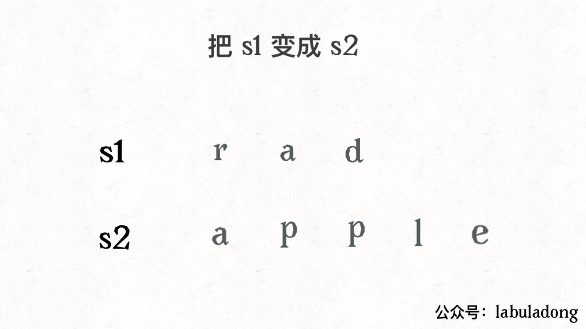

## 124. 二叉树中的最大路径和（困难）递归

给定一个非空二叉树，返回其最大路径和。

本题中，路径被定义为一条从树中任意节点出发，达到任意节点的序列。该路径至少包含一个节点，且不一定经过根节点。

示例 1:
输入: [1,2,3]  
           1  
          / \  
         2   3  
输出: 6

示例2:
输入: [-10,9,20,null,null,15,7]  
   -10  
   / \  
  9  20  
&nbsp;       /  \    
       15   7  
输出: 42

思路

二叉树abc，a是根结点（递归中的root），bc是左右子结点（代表其递归后的最优解）。
最大的路径，可能的路径情况：

   a  
   / \  
  b   c  
  
1. b + a + c。
2. b + a + a的父结点。
3. a + c + a的父结点。

其中情况 1 ，表示如果不联络父结点的情况，或本身是根结点的情况。
这种情况是没法递归的，但是结果有可能是全局最大路径和。
情况 2 和 3 ，递归时计算 a + b 和 a + c ，选择一个更优的方案返回，也就是上面说的递归后的最优解啦。

另外结点有可能是负值，最大和肯定就要想办法舍弃负值（max(0, x)）。
但是上面3种情况，无论哪种，a作为联络点，都不能够舍弃。

代码中使用 val 来记录全局最大路径和。
ret 是情况 2 和 3 。
lmr 是情况 1 。

所要做的就是递归，递归时记录好全局最大和，返回联络最大和。


```python
# Definition for a binary tree node.
# class TreeNode(object):
#     def __init__(self, x):
#         self.val = x
#         self.left = None
#         self.right = None
import sys

class Solution(object):
    def __init__(self):
        self.result = -sys.maxsize
    
    def help(self, root):

        if not root:
            return 0
        
        left = self.help(root.left)
        right = self.help(root.right)
        
        lmr = root.val + max(0, left) + max(0, right)
        ret = root.val + max(0, max(left, right))
        
        self.result = max(self.result, max(lmr, ret))
        
        return ret
        
        
    
    def maxPathSum(self, root):
        """
        :type root: TreeNode
        :rtype: int
        """
        self.help(root)
        
        return self.result
```

## 84. 柱状图中最大的矩形（困难）

给定 n 个非负整数，用来表示柱状图中各个柱子的高度。每个柱子彼此相邻，且宽度为 1 。

求在该柱状图中，能够勾勒出来的矩形的最大面积。


示例:

输入: [2,1,5,6,2,3]  
输出: 10


### 一. 暴力解法（超时）O(n^2) 94/96

两个柱子之间的矩形高度由最小的柱子决定。

考虑所有两两柱子形成的矩形面积，宽为距离，高为之间最小柱子高度


```python
import sys

class Solution(object):
    def largestRectangleArea(self, heights):
        """
        :type heights: List[int]
        :rtype: int
        """
        n = len(heights)
        maxArea = 0
        
        for i in range(n):
            minHeight = sys.maxsize
            for j in range(i, n):
                width = j - i + 1
                
                minHeight = min(minHeight, heights[j])
                
                curArea = width * minHeight
                if curArea > maxArea:
                    maxArea = curArea
        
        return maxArea
```

### 二. 分治法（超时）94/96 平均O(nlogn) 最坏情况O(n^2)

观察发现最大面积矩形存在3种情况
1. 确定了最矮柱子后，宽尽可能向左右方向延伸
2. 最大面积矩形位于最矮柱子的左边（子问题）
3. 最大面积矩形位于最矮柱子的右边（子问题）


```python
class Solution(object):
    def calculateArea(self, heights, start, end):
        if start > end:
            return 0
        minIndex = start
        for i in range(start, end+1):
            if heights[minIndex] > heights[i]:
                minIndex = i
        return max(heights[minIndex]*(end-start+1), self.calculateArea(heights, start, minIndex-1), self.calculateArea(heights, minIndex+1, end))

    def largestRectangleArea(self, heights):
        """
        :type heights: List[int]
        :rtype: int
        """
        return self.calculateArea(heights, 0, len(heights)-1)
```

### 三. 栈

首先，要想找到以第i根柱子为最矮柱子所能延伸的最大面积是什么？

是以i 为中心，向左找第一个小于 heights[i] 的位置 left_i；向右找第一个小于 heights[i] 的位置 right_i，即最大面积为 heights[i] * (right_i - left_i -1)

利用单调栈

维护一个单调递增的栈，就可以找到 left_i 和 right_i。

在这种方法中，我们维护一个栈。一开始，我们把 -1 放进栈的顶部来表示开始。初始化时，按照从左到右的顺序，我们不断将柱子的序号放进栈中，直到遇到相邻柱子呈下降关系，也就是 a[i−1]>a[i] 。现在，我们开始将栈中的序号弹出，直到遇到 stack[j] 满足a[stack[j]]≤a[i] 。每次我们弹出下标时，我们用弹出元素作为高，用当前元素与 stack[top−1] 之间的那些柱子作为宽，形成最大面积矩形。

也就是当我们弹出 stack[top] 时，记当前元素在原数组中的下标为 i ，当前弹出元素为高的最大矩形面积为：

(i−stack[top−1]−1)×a[stack[top]].

更进一步，当我们到达数组的尾部时，我们将栈中剩余元素全部弹出栈。在弹出每一个元素是，我们用下面的式子来求面积： 

(stack[top]−stack[top−1])×a[stack[top]]，其中，stack[top]表示刚刚被弹出的元素。因此，我们可以通过每次比较新计算的矩形面积来获得最大的矩形面积。


```python
class Solution(object):
    def largestRectangleArea(self, heights):
        """
        :type heights: List[int]
        :rtype: int
        """
        stack = []
        heights = [0] + heights + [0]
        result = 0

        for i in range(len(heights)):
            while stack and heights[stack[-1]] > heights[i]:
                tmp = stack.pop()
                result = max(result, heights[tmp]*(i-stack[-1]-1))
            stack.append(i)
            
        return result
```

## 85. 最大矩形（困难）动态规划

给定一个仅包含 0 和 1 的二维二进制矩阵，找出只包含 1 的最大矩形，并返回其面积。

示例:

输入:  
[  
  ["1","0","1","0","0"],  
  ["1","0","1","1","1"],  
  ["1","1","1","1","1"],  
  ["1","0","0","1","0"]  
]  
输出: 6  

### 一. 动态规划，柱状图矩形面积（利用84题）


算法有了，就是求出每一层的 heights[] 然后传给上一题的函数就可以了。

利用上一题的栈解法。


```python
class Solution(object):
    def largestRectangleArea(self, heights):
        """
        :type heights: List[int]
        :rtype: int
        """
        stack = []
        heights = [0] + heights + [0]
        result = 0

        for i in range(len(heights)):
            while stack and heights[stack[-1]] > heights[i]:
                tmp = stack.pop()
                result = max(result, heights[tmp]*(i-stack[-1]-1))
            stack.append(i)
            
        return result
    def maximalRectangle(self, matrix):
        """
        :type matrix: List[List[str]]
        :rtype: int
        """
        if not matrix:
            return 0
        
        m = len(matrix)
        n = len(matrix[0])
        result = 0
        heights = [0] * n
        
        for row in range(m):
            # 遍历每一列，更新高度
            for col in range(n):
                if matrix[row][col] == '1':
                    heights[col] += 1
                else:
                    heights[col] = 0
            result = max(result, self.largestRectangleArea(heights))
            
        return result
```

## 62. 不同路径（中等）动态规划

一个机器人位于一个 m x n 网格的左上角 （起始点在下图中标记为“Start” ）。

机器人每次只能向下或者向右移动一步。机器人试图达到网格的右下角（在下图中标记为“Finish”）。

问总共有多少条不同的路径？

说明：m 和 n 的值均不超过 100。

>示例 1:  
输入: m = 3, n = 2  
输出: 3  
解释:  
从左上角开始，总共有 3 条路径可以到达右下角。  
1. 向右 -> 向右 -> 向下
2. 向右 -> 向下 -> 向右
3. 向下 -> 向右 -> 向右

>示例2:  
输入: m = 7, n = 3  
输出: 28

### 一. 排列组合


```python
import math

class Solution(object):
    def uniquePaths(self, m, n):
        """
        :type m: int
        :type n: int
        :rtype: int
        """
        
        return math.factorial(m+n-2) / math.factorial(n-1) / math.factorial(m-1)
```

### 二. 动态规划

我们令 dp[i][j] 是到达 i, j 最多路径

动态方程：dp[i][j] = dp[i-1][j] + dp[i][j-1]

注意，对于第一行 dp[0][j]，或者第一列 dp[i][0]，由于都是在边界，所以只能为 1

时间复杂度：O(m∗n)

空间复杂度：O(m∗n)

优化：因为我们每次只需要 dp[i-1][j],dp[i][j-1]

所以我们只要记录这两个数，直接看代码吧！


```python
class Solution(object):
    def uniquePaths(self, m, n):
        """
        :type m: int
        :type n: int
        :rtype: int
        """
        dp = [[1]*n]+[[1]+[0]*(n-1) for _ in range(m-1)]

        for i in range(1, m):
            for j in range(1, n):
                dp[i][j] = dp[i-1][j] + dp[i][j-1]

        return dp[-1][-1]
```

## 48. 旋转图像（中等）

给定一个 n × n 的二维矩阵表示一个图像。

将图像顺时针旋转 90 度。

说明：

你必须在原地旋转图像，这意味着你需要直接修改输入的二维矩阵。请不要使用另一个矩阵来旋转图像。

示例 1:
>给定 matrix =   
[  
  [1,2,3],  
  [4,5,6],  
  [7,8,9]  
],  
原地旋转输入矩阵，使其变为:  
[  
  [7,4,1],  
  [8,5,2],  
  [9,6,3]  
]  

示例2:  
>给定 matrix =  
[  
  [ 5, 1, 9,11],  
  [ 2, 4, 8,10],  
  [13, 3, 6, 7],  
  [15,14,12,16]  
],   
原地旋转输入矩阵，使其变为:  
[  
  [15,13, 2, 5],  
  [14, 3, 4, 1],  
  [12, 6, 8, 9],  
  [16, 7,10,11]  
]

先转置，再每一行翻转


```python
class Solution(object):
    def rotate(self, matrix):
        """
        :type matrix: List[List[int]]
        :rtype: None Do not return anything, modify matrix in-place instead.
        """
        # transpose matrix
        for i in range(len(matrix)):
            for j in range(i+1, len(matrix[0])):
                matrix[j][i], matrix[i][j] = matrix[i][j], matrix[j][i]

        for i in range(len(matrix)):
            for j in range(len(matrix)//2):
                matrix[i][j], matrix[i][len(matrix[0])-j-1] = matrix[i][len(matrix[0])-j-1], matrix[i][j]

        return matrix
```

## 42. 接雨水（困难）动态规划

给定 n 个非负整数表示每个宽度为 1 的柱子的高度图，计算按此排列的柱子，下雨之后能接多少雨水。


上面是由数组 [0,1,0,2,1,0,1,3,2,1,2,1] 表示的高度图，在这种情况下，可以接 6 个单位的雨水（蓝色部分表示雨水）

示例1:
>输入: [0,1,0,2,1,0,1,3,2,1,2,1]  
输出: 6

求每一列的水，我们只需要关注当前列，以及左边最高的墙，右边最高的墙就够了。

装水的多少，当然根据木桶效应，我们只需要看左边最高的墙和右边最高的墙中较矮的一个就够了。


```python
class Solution(object):
    def trap(self, height):
        """
        :type height: List[int]
        :rtype: int
        """
        n = len(height)
        maxLeft = [0] * n
        maxRight = [0] * n
        result = 0

        for i in range(1, n):
            maxLeft[i] = max(maxLeft[i-1], height[i-1])
        
        for i in range(n-2, -1, -1):
            maxRight[i] = max(maxRight[i+1], height[i+1])
        
        for i in range(n):
            minHeight = min(maxLeft[i], maxRight[i])

            if minHeight > height[i]:
                result += minHeight - height[i]

        return result
```

## 72. 编辑距离 （困难）动态规划

给定两个单词 word1 和 word2，计算出将 word1 转换成 word2 所使用的最少操作数 。

你可以对一个单词进行如下三种操作：

插入一个字符
删除一个字符
替换一个字符

示例 1:
>输入: word1 = "horse", word2 = "ros"  
输出: 3  
解释:   
horse -> rorse (将 'h' 替换为 'r')  
rorse -> rose (删除 'r')  
rose -> ros (删除 'e')  

示例2:
>输入: word1 = "intention", word2 = "execution"  
输出: 5  
解释:   
intention -> inention (删除 't')  
inention -> enention (将 'i' 替换为 'e')  
enention -> exention (将 'n' 替换为 'x')  
exention -> exection (将 'n' 替换为 'c')  
exection -> execution (插入 'u')  


**解决两个字符串的动态规划问题，一般都是用两个指针 i,j 分别指向两个字符串的最后，然后一步步往前走，缩小问题的规模**

设两个字符串分别为 "rad" 和 "apple"，为了把 s1 变成 s2，算法会这样进行：




可以发现操作不只有三个，其实还有第四个操作，就是什么都不要做（skip）

因为这两个字符本来就相同，为了使编辑距离最小，显然不应该对它们有任何操作，直接往前移动 i,j 即可。

还有一个很容易处理的情况，就是 j 走完 s2 时，如果 i 还没走完 s1，那么只能用删除操作把 s1 缩短为 s2。

### 代码详解

类似的，如果 i 走完 s1 时 j 还没走完了 s2，那就只能用插入操作把 s2 剩下的字符全部插入 s1。等会会看到，这两种情况就是算法的 base case。

base case 是 i 走完 s1 或 j 走完 s2，可以直接返回另一个字符串剩下的长度。

对于每对字符 s1[i] 和 s2[j]，可以有四种操作：

```python
if s1[i] == s2[j]:
    啥都别做（skip）
    i, j 同时向前移动
else:
    三选一：
        插入（insert）
        删除（delete）
        替换（replace）
```

有这个框架，问题就已经解决了。读者也许会问，这个「三选一」到底该怎么选择呢？很简单，全试一遍，哪个操作最后得到的编辑距离最小，就选谁。这里需要递归技巧，理解需要点技巧，先看下代码：

```python
def minDistance(s1, s2) -> int:
    # 返回 s1[0..i] 和 s2[0..j] 的最小编辑距离
    def dp(i, j):
        # base case
        if i == -1: return j + 1
        if j == -1: return i + 1
        
        if s1[i] == s2[j]:
            return dp(i - 1, j - 1)  # 啥都不做
            # 解释：
            # 本来就相等，不需要任何操作
            # s1[0..i] 和 s2[0..j] 的最小编辑距离等于
            # s1[0..i-1] 和 s2[0..j-1] 的最小编辑距离
            # 也就是说 dp(i, j) 等于 dp(i-1, j-1)
        else:
            return min(
                dp(i, j - 1) + 1,    # 插入
                # 解释：
                # 我直接在 s1[i] 后插入一个和 s2[j] 一样的字符
                # 那么 s2[j] 就被匹配了，前移 j，继续跟 i 对比
                # 别忘了操作数加一
                dp(i - 1, j) + 1,    # 删除
                # 解释：
                # 我直接把 s[i] 这个字符删掉
                # 前移 i，继续跟 j 对比
                # 操作数加一
                dp(i - 1, j - 1) + 1 # 替换
                # 解释：
                # 我直接把 s1[i] 替换成 s2[j]，这样它俩就匹配了
                # 同时前移 i，j 继续对比
                # 操作数加一
            )
    
    # i，j 初始化指向最后一个索引
    return dp(len(s1) - 1, len(s2) - 1)
```

现在，你应该完全理解这段短小精悍的代码了。还有点小问题就是，这个解法是暴力解法，存在重叠子问题，需要用动态规划技巧来优化。
```python
def dp(i, j):
    dp(i - 1, j - 1) #1
    dp(i, j - 1)     #2
    dp(i - 1, j)     #3
```


对于子问题 dp(i-1, j-1)，如何通过原问题 dp(i, j) 得到呢？有不止一条路径，比如 dp(i, j) -> #1 和 dp(i, j) -> #2 -> #3。一旦发现一条重复路径，就说明存在巨量重复路径，也就是重叠子问题。

### 动态规划优化

首先明确 dp 数组的含义，dp 数组是一个二维数组，长这样：


有了之前递归解法的铺垫，应该很容易理解。dp[..][0] 和 dp[0][..] 对应 base case，dp[i][j] 的含义和之前的 dp 函数类似：

```python
def dp(i, j) -> int
# 返回 s1[0..i] 和 s2[0..j] 的最小编辑距离

dp[i-1][j-1]
# 存储 s1[0..i] 和 s2[0..j] 的最小编辑距离
```

dp 函数的 base case 是 i,j 等于 -1，而数组索引至少是 0，所以 dp 数组会偏移一位。

既然 dp 数组和递归 dp 函数含义一样，也就可以直接套用之前的思路写代码，唯一不同的是，DP table 是自底向上求解，递归解法是自顶向下求解：

```cpp
int minDistance(String s1, String s2) {
    int m = s1.length(), n = s2.length();
    int[][] dp = new int[m + 1][n + 1];
    // base case 
    for (int i = 1; i <= m; i++)
        dp[i][0] = i;
    for (int j = 1; j <= n; j++)
        dp[0][j] = j;
    // 自底向上求解
    for (int i = 1; i <= m; i++)
        for (int j = 1; j <= n; j++)
            if (s1.charAt(i-1) == s2.charAt(j-1))
                dp[i][j] = dp[i - 1][j - 1];
            else               
                dp[i][j] = min(
                    dp[i - 1][j] + 1,
                    dp[i][j - 1] + 1,
                    dp[i-1][j-1] + 1
                );
    // 储存着整个 s1 和 s2 的最小编辑距离
    return dp[m][n];
}

int min(int a, int b, int c) {
    return Math.min(a, Math.min(b, c));
}
```


```python
class Solution(object):
    def minDistance(self, word1, word2):
        """
        :type word1: str
        :type word2: str
        :rtype: int
        """
        m = len(word1)
        n = len(word2)

        dp = [[0 for _ in range(n+1)] for _ in range(m+1)]

        for i in range(m+1):
            dp[i][0] = i
        for j in range(n+1):
            dp[0][j] = j
        
        for i in range(1, m+1):
            for j in range(1, n+1):
                if word1[i-1] == word2[j-1]:
                    dp[i][j] = dp[i-1][j-1]
                else:
                    dp[i][j] = min(dp[i-1][j], dp[i][j-1], dp[i-1][j-1])+1
        return dp[-1][-1]
```

## 543. 二叉树的直径（简单）

给定一棵二叉树，你需要计算它的直径长度。一棵二叉树的直径长度是任意两个结点路径长度中的最大值。这条路径可能穿过根结点。

示例 :
给定二叉树

          1
         / \
        2   3
       / \     
      4   5    
返回 3, 它的长度是路径 [4,2,1,3] 或者 [5,2,1,3]。

注意：两结点之间的路径长度是以它们之间边的数目表示。

想法

任意一条路径可以被写成两个 箭头（不同方向），每个箭头代表一条从某些点向下遍历到子节点的路径。

假设我们知道对于每个节点最长箭头距离分别为 L, R，那么最优路径经过 L + R + 1 个节点。

算法

按照常用方法计算一个节点的深度：max(depth of node.left, depth of node.right) + 1。在计算的同时，经过这个节点的路径长度为 1 + (depth of node.left) + (depth of node.right) 。搜索每个节点并记录这些路径经过的点数最大值，期望长度是结果 - 1。


```python
# Definition for a binary tree node.
# class TreeNode(object):
#     def __init__(self, x):
#         self.val = x
#         self.left = None
#         self.right = None

class Solution(object):
    def __init__(self):
        self.result = 0 # 保存最大路径的节点数
    
    def calculatedia(self, root): # 计算一个节点的深度
        if not root:
            return 0

        left = self.calculatedia(root.left) # 左子节点深度
        right = self.calculatedia(root.right) # 右子节点深度

        # 计算深度的同时用经过这个节点的路径的节点数来更新最大路径的节点数
        curdia = left + right + 1
        if curdia > self.result:
            self.result = curdia
            
        return max(left, right) + 1 # 返回左右子节点深度最大值+1

    def diameterOfBinaryTree(self, root):
        """
        :type root: TreeNode
        :rtype: int
        """
        if not root:
            return 0

        self.calculatedia(root)
        
        return self.result - 1 # 路径长度为节点数-1
```

## 461. 汉明距离（简单）位操作

两个整数之间的汉明距离指的是这两个数字对应二进制位不同的位置的数目。

给出两个整数 x 和 y，计算它们之间的汉明距离。

注意：
0 ≤ x, y < 231.

示例:
输入: x = 1, y = 4  
输出: 2  
解释:  

    1   (0 0 0 1)  

    4   (0 1 0 0)

           ↑   ↑  
       
上面的箭头指出了对应二进制位不同的位置。


```python
class Solution(object):
    def hammingDistance(self, x, y):
        """
        :type x: int
        :type y: int
        :rtype: int
        """
        result = 0
        while x != 0 or y != 0:
            if x & 1 != y & 1:
                result += 1
            
            x >>= 1
            y >>= 1
        
        return result
```

## 538. 把二叉搜索树转换为累加树（简单）dfs 中序遍历

给定一个二叉搜索树（Binary Search Tree），把它转换成为累加树（Greater Tree)，使得每个节点的值是原来的节点值加上所有大于它的节点值之和。

例如：

    输入: 二叉搜索树:
                  5
                /   \
               2     13

    输出: 转换为累加树:
                 18
                /   \
              20     13
              
累加计算应该从最大值到最小值依次进行，使用右子树、当前结点、左子树的中序方法进行遍历。


```python
# Definition for a binary tree node.
# class TreeNode(object):
#     def __init__(self, x):
#         self.val = x
#         self.left = None
#         self.right = None

class Solution(object):
    def helper(self, root):
        if root:
            self.helper(root.right)

            self.pre = self.pre + root.val
            root.val = self.pre

            self.helper(root.left)


    def convertBST(self, root):
        """
        :type root: TreeNode
        :rtype: TreeNode
        """
        self.pre = 0

        self.helper(root)

        return root
```

## 448. 找到所有数组中消失的数字（简单）哈希表

给定一个范围在  1 ≤ a[i] ≤ n ( n = 数组大小 ) 的 整型数组，数组中的元素一些出现了两次，另一些只出现一次。

找到所有在 [1, n] 范围之间没有出现在数组中的数字。

您能在不使用额外空间且时间复杂度为O(n)的情况下完成这个任务吗? 你可以假定返回的数组不算在额外空间内。

示例:

>输入:  
[4,3,2,7,8,2,3,1]  
输出:  
[5,6]  


        # 将所有正数作为数组下标，置对应数组值为负值。那么，仍为正数的位置即为（未出现过）消失的数字。
        # 举个例子：
        # 原始数组：[4,3,2,7,8,2,3,1]
        # 重置后为：[-4,-3,-2,-7,8,2,-3,-1]
        # 结论：[8,2] 分别对应的index为[5,6]（消失的数字）
        

实际上相当于利用正负号构建了一个简易的哈希表,用来存储每个数字的状态


```python
class Solution(object):
    def findDisappearedNumbers(self, nums):
        """
        :type nums: List[int]
        :rtype: List[int]
        """
        for num in nums:
            index = abs(num) - 1
            nums[index] = -abs(nums[index])
        
        result = []
        for i, num in enumerate(nums):
            if num > 0:
                result.append(i+1)

        return result
```

## 236. 二叉树的最近公共祖先（中等）LCA 递归 + 回溯

给定一个二叉树, 找到该树中两个指定节点的最近公共祖先。

百度百科中最近公共祖先的定义为：“对于有根树 T 的两个结点 p、q，最近公共祖先表示为一个结点 x，满足 x 是 p、q 的祖先且 x 的深度尽可能大（一个节点也可以是它自己的祖先）。”

例如，给定如下二叉树:  root = [3,5,1,6,2,0,8,null,null,7,4]


示例 1:

    输入: root = [3,5,1,6,2,0,8,null,null,7,4], p = 5, q = 1
    输出: 3
    解释: 节点 5 和节点 1 的最近公共祖先是节点 3。
示例 2:

    输入: root = [3,5,1,6,2,0,8,null,null,7,4], p = 5, q = 4
    输出: 5
    解释: 节点 5 和节点 4 的最近公共祖先是节点 5。因为根据定义最近公共祖先节点可以为节点本身。

说明:

    所有节点的值都是唯一的。
    p、q 为不同节点且均存在于给定的二叉树中。

### dfs
这种方法非常直观。先深度遍历该树。当你遇到节点 p 或 q 时，返回一些布尔标记。该标志有助于确定是否在任何路径中找到了所需的节点。最小公共祖先将是两个子树递归都返回真标志的节点。它也可以是一个节点，它本身是p或q中的一个，对于这个节点,子树递归返回一个真标志。

让我们看看基于这个想法的形式算法。


```python
# Definition for a binary tree node.
# class TreeNode(object):
#     def __init__(self, x):
#         self.val = x
#         self.left = None
#         self.right = None

class Solution(object):
    def Ancestor(self, root, p, q):
        '''
        如果root是p或q的祖先，则返回True，否则False

        采用递归dfs后序遍历，
        '''
        if not root:
            return False

        # 如果p或q在左子树中，则返回True
        ifInleft = self.Ancestor(root.left, p, q)

        # 如果p或q在右子树中，则返回True
        ifInright = self.Ancestor(root.right, p, q)

        # 如果当前节点就是p或q，则True
        ifThisNode = root == p or root == q

        # 如果3个bool中有两个为True, 则当前root为公共祖先，更新root
        if ifInleft + ifInright + ifThisNode >= 2:
            self.result = root
        
        return ifInleft or ifInright or ifThisNode

        


    def lowestCommonAncestor(self, root, p, q):
        """
        :type root: TreeNode
        :type p: TreeNode
        :type q: TreeNode
        :rtype: TreeNode
        """
        self.result = None

        self.Ancestor(root, p, q)

        return self.result
```

## 215. 数组中的第K个最大元素（中等）最小堆 保存最大的k个元素，返回堆顶元素即为第k的最大元素

在未排序的数组中找到第 k 个最大的元素。请注意，你需要找的是数组排序后的第 k 个最大的元素，而不是第 k 个不同的元素。

    示例 1:

    输入: [3,2,1,5,6,4] 和 k = 2
    输出: 5
    示例 2:

    输入: [3,2,3,1,2,4,5,5,6] 和 k = 4
    输出: 4
    说明:

    你可以假设 k 总是有效的，且 1 ≤ k ≤ 数组的长度。
    


```python
import heapq

class Solution(object):
    def findKthLargest(self, nums, k):
        """
        :type nums: List[int]
        :type k: int
        :rtype: int
        """
        heap = []

        for i in range(len(nums)):
            if len(heap) < k:
                heapq.heappush(heap, nums[i])
            else:
                heapq.heappushpop(heap, nums[i])
        
        return heap[0]
```

## 207. 课程表（中等）拓扑排序

现在你总共有 n 门课需要选，记为 0 到 n-1。

在选修某些课程之前需要一些先修课程。 例如，想要学习课程 0 ，你需要先完成课程 1 ，我们用一个匹配来表示他们: [0,1]

给定课程总量以及它们的先决条件，判断是否可能完成所有课程的学习？

示例 1:

    输入: 2, [[1,0]] 
    输出: true
    解释: 总共有 2 门课程。学习课程 1 之前，你需要完成课程 0。所以这是可能的。
    示例 2:

    输入: 2, [[1,0],[0,1]]
    输出: false
    解释: 总共有 2 门课程。学习课程 1 之前，你需要先完成​课程 0；并且学习课程 0 之前，你还应先完成课程 1。这是不可能的。
    说明:

输入的先决条件是由边缘列表表示的图形，而不是邻接矩阵。详情请参见图的表示法。
你可以假定输入的先决条件中没有重复的边。


拓扑排序实际上应用的是贪心算法。贪心算法简而言之：每一步最优，全局就最优。

具体到拓扑排序，每一次都从图中删除没有前驱的顶点，这里并不需要真正的做删除操作，我们可以设置一个入度数组，每一轮都输出入度为 0 的结点，并移除它、修改它指向的结点的入度（−1即可），依次得到的结点序列就是拓扑排序的结点序列。如果图中还有结点没有被移除，则说明“不能完成所有课程的学习”。

拓扑排序保证了每个活动（在这题中是“课程”）的所有前驱活动都排在该活动的前面，并且可以完成所有活动。拓扑排序的结果不唯一。拓扑排序还可以用于检测一个有向图是否有环。相关的概念还有 AOV 网，这里就不展开了。

算法流程：

1、在开始排序前，扫描对应的存储空间（使用邻接表），将入度为 0 的结点放入队列。

2、只要队列非空，就从队首取出入度为 0 的结点，将这个结点输出到结果集中，并且将这个结点的所有邻接结点（它指向的结点）的入度减 1，在减 1 以后，如果这个被减 1 的结点的入度为 0 ，就继续入队。

3、当队列为空的时候，检查结果集中的顶点个数是否和课程数相等即可。

思考这里为什么要使用队列？（马上就会给出答案。）

在代码具体实现的时候，除了保存入度为 0 的队列，我们还需要两个辅助的数据结构：

1、邻接表：通过结点的索引，我们能够得到这个结点的后继结点；

2、入度数组：通过结点的索引，我们能够得到指向这个结点的结点个数。

这个两个数据结构在遍历题目给出的邻边以后就可以很方便地得到。


```python
class Solution(object):
    def canFinish(self, numCourses, prerequisites):
        """
        :type numCourses: int
        :type prerequisites: List[List[int]]
        :rtype: bool
        """
        if not prerequisites:
            return True

        # 入度数组，保存每个节点的入度数
        indegree = [0 for _ in range(numCourses)]

        # 邻接表，保存每个节点的邻居节点
        adj = [set() for _ in range(numCourses)]

        # 初始化
        for prerequisite in prerequisites:
            indegree[prerequisite[0]] += 1
            adj[prerequisite[1]].add(prerequisite[0])

        # 先把所有入度为0的节点加入队列中
        queue = []

        for i in range(numCourses):
            if indegree[i] == 0:
                queue.append(i)
        
        counter = 0
        while queue:
            top = queue.pop(0)
            counter += 1
            for ad in adj[top]:
                indegree[ad] -= 1
                if indegree[ad] == 0:
                    queue.append(ad)
        
        return counter == numCourses
```
