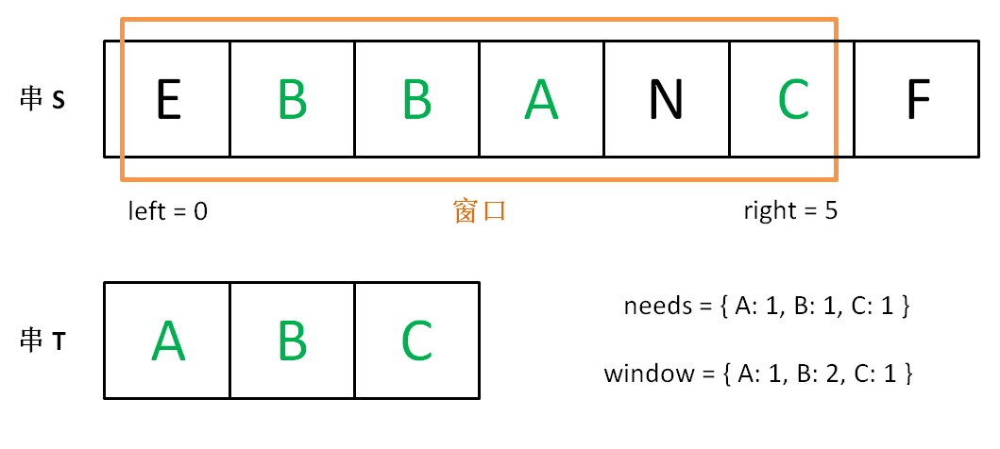

## 198. 打家劫舍（简单）

你是一个专业的小偷，计划偷窃沿街的房屋。每间房内都藏有一定的现金，影响你偷窃的唯一制约因素就是相邻的房屋装有相互连通的防盗系统，如果两间相邻的房屋在同一晚上被小偷闯入，系统会自动报警。

给定一个代表每个房屋存放金额的非负整数数组，计算你在不触动警报装置的情况下，能够偷窃到的最高金额。

示例 1:

    输入: [1,2,3,1]
    输出: 4
    解释: 偷窃 1 号房屋 (金额 = 1) ，然后偷窃 3 号房屋 (金额 = 3)。
         偷窃到的最高金额 = 1 + 3 = 4 。
示例 2:

    输入: [2,7,9,3,1]
    输出: 12
    解释: 偷窃 1 号房屋 (金额 = 2), 偷窃 3 号房屋 (金额 = 9)，接着偷窃 5 号房屋 (金额 = 1)。
         偷窃到的最高金额 = 2 + 9 + 1 = 12 。


```python
class Solution(object):
    def rob(self, nums):
        """
        :type nums: List[int]
        :rtype: int
        """
        if not nums:
            return 0
        # dp[i] 表示只偷窃前i个房屋的最高金额
        dp = [0] * len(nums)

        # dp[i+1] = max(dp[i], dp[i-1] + nums[i+1])
        dp[0] = nums[0]

        for i in range(len(nums)-1):
            dp[i+1] = max(dp[i], dp[i-1] + nums[i+1])

        return dp[-1]
```

## 169. 求众数（简单）哈希表

给定一个大小为 n 的数组，找到其中的众数。众数是指在数组中出现次数大于 ⌊ n/2 ⌋ 的元素。

你可以假设数组是非空的，并且给定的数组总是存在众数。

示例 1:

    输入: [3,2,3]
    输出: 3
示例 2:

    输入: [2,2,1,1,1,2,2]
    输出: 2


```python
class Solution(object):
    def majorityElement(self, nums):
        """
        :type nums: List[int]
        :rtype: int
        """
        dic = {}

        for num in nums:
            if num in dic:
                dic[num] += 1
            else:
                dic[num] = 1
        
        for key, value in dic.items():
            if value > len(nums) // 2:
                return key
```

## 240. 搜索二维矩阵 II（中等）从左下角开始查找

编写一个高效的算法来搜索 m x n 矩阵 matrix 中的一个目标值 target。该矩阵具有以下特性：

每行的元素从左到右升序排列。
每列的元素从上到下升序排列。
示例:

现有矩阵 matrix 如下：

    [
      [1,   4,  7, 11, 15],
      [2,   5,  8, 12, 19],
      [3,   6,  9, 16, 22],
      [10, 13, 14, 17, 24],
      [18, 21, 23, 26, 30]
    ]
给定 target = 5，返回 true。

给定 target = 20，返回 false。

从最右上角的元素开始找，如果这个元素比target大，则说明找更小的，往左走；如果这个元素比target小，则说明应该找更大的，往下走。

画个图看代码就很容易理解，总之就是从右上角开始找，如果矩阵的元素小了就往下走，如果矩阵元素大了就往左走。如果某个时刻相等了，就说明找到了，如果一直走出矩阵边界了还没找到，则说明不存在。


```python
class Solution(object):
    def searchMatrix(self, matrix, target):
        """
        :type matrix: List[List[int]]
        :type target: int
        :rtype: bool
        """
        if not matrix:
            return False
        
        # 从左下角的元素开始搜索
        row = len(matrix) - 1
        col = 0

        while row >= 0 and col <= len(matrix[0]) - 1:
            if matrix[row][col] > target:
                row -= 1
            elif matrix[row][col] < target:
                col += 1
            else:
                return True
        
        return False
```

## 279. 完全平方数（中等）动态规划

给定正整数 n，找到若干个完全平方数（比如 1, 4, 9, 16, ...）使得它们的和等于 n。你需要让组成和的完全平方数的个数最少。

示例 1:

    输入: n = 12
    输出: 3 
    解释: 12 = 4 + 4 + 4.
示例 2:

    输入: n = 13
    输出: 2
    解释: 13 = 4 + 9.


```python
import math

class Solution(object):
    def numSquares(self, n):
        """
        :type n: int
        :rtype: int
        """
        dp = [0] * (n+1)

        # 初始化为1的和，个数即为i
        
        for i in range(n+1):
            dp[i] = i
        
        for i in range(1, n+1):
            for j in range(1, int(math.sqrt(i))+1):
                dp[i] = min(dp[i], dp[i-j*j]+1)

        return dp[-1]
```

## 96. 不同的二叉搜索树（中等）树型动态规划

给定一个整数 n，求以 1 ... n 为节点组成的二叉搜索树有多少种？

示例:

    输入: 3
    输出: 5
    解释:
    给定 n = 3, 一共有 5 种不同结构的二叉搜索树:

       1         3     3      2      1
        \       /     /      / \      \
         3     2     1      1   3      2
        /     /       \                 \
       2     1         2                 3
       
思路

- 标签：动态规划
- 假设n个节点存在二叉排序树的个数是G(n)，令f(i)为以i为根的二叉搜索树的个数，则

- G(n)=f(1)+f(2)+f(3)+f(4)+...+f(n)

- 当i为根节点时，其左子树节点个数为i-1个，右子树节点为n-i，则f(i)=G(i−1)∗G(n−i)

- 综合两个公式可以得到 卡特兰数 公式G(n)=G(0)∗G(n−1)+G(1)∗(n−2)+...+G(n−1)∗G(0)


```python
class Solution(object):
    def numTrees(self, n):
        """
        :type n: int
        :rtype: int
        """
        # G(n)表示以 1 ... n 为节点组成的二叉搜索树个数
        # G(n) = f(1) + ... + f(n)
        # f(i)表示以i为根节点的n个节点二叉搜索树个数
        # f(i) = G(i-1) * G(n-i)
        # G(n) = G(0) * G(n-1) + G(1) * G(n-2) + ... + G(n-1) * G(0)

        dp = [0] * (n+1)
        dp[0] = 1

        for i in range(1, n+1):
            for j in range(i):
                dp[i] += dp[j] * dp[i-j-1]

        return dp[-1]
```

## 70. 爬楼梯（简单）动态规划

假设你正在爬楼梯。需要 n 阶你才能到达楼顶。

每次你可以爬 1 或 2 个台阶。你有多少种不同的方法可以爬到楼顶呢？

注意：给定 n 是一个正整数。

示例 1：

    输入： 2
    输出： 2
    解释： 有两种方法可以爬到楼顶。
    1.  1 阶 + 1 阶
    2.  2 阶
示例 2：

    输入： 3
    输出： 3
    解释： 有三种方法可以爬到楼顶。
    1.  1 阶 + 1 阶 + 1 阶
    2.  1 阶 + 2 阶
    3.  2 阶 + 1 阶


```python
class Solution(object):
    def climbStairs(self, n):
        """
        :type n: int
        :rtype: int
        """
        if n < 3:
            return n

        dp = [0] * (n+1)
        dp[1] = 1
        dp[2] = 2

        for i in range(3, n+1):
            dp[i] = dp[i-2] + dp[i-1]

        return dp[-1]
```

## 64. 最小路径和（中等）动态规划

给定一个包含非负整数的 m x n 网格，请找出一条从左上角到右下角的路径，使得路径上的数字总和为最小。

说明：每次只能向下或者向右移动一步。

示例:

    输入:
    [
      [1,3,1],
      [1,5,1],
      [4,2,1]
    ]
    输出: 7
    解释: 因为路径 1→3→1→1→1 的总和最小。


```python
class Solution(object):
    def minPathSum(self, grid):
        """
        :type grid: List[List[int]]
        :rtype: int
        """
        m = len(grid)
        n = len(grid[0])

        dp = [[0 for _ in range(n)] for _ in range(m)]
        dp[0][0] = grid[0][0]
        for j in range(1, n):
            dp[0][j] = dp[0][j-1] + grid[0][j]
        for i in range(1, m):
            dp[i][0] = dp[i-1][0] + grid[i][0]

        for i in range(1, m):
            for j in range(1, n):
                dp[i][j] = min(dp[i-1][j], dp[i][j-1]) + grid[i][j]
        
        return dp[-1][-1]
```

## 53. 最大子序和（简单）动态规划

给定一个整数数组 nums ，找到一个具有最大和的连续子数组（子数组最少包含一个元素），返回其最大和。

示例:

    输入: [-2,1,-3,4,-1,2,1,-5,4],
    输出: 6
    解释: 连续子数组 [4,-1,2,1] 的和最大，为 6。
进阶:

如果你已经实现复杂度为 O(n) 的解法，尝试使用更为精妙的分治法求解。


```python
class Solution(object):
    def maxSubArray(self, nums):
        """
        :type nums: List[int]
        :rtype: int
        """
        result = nums[0]

        dp = [0] * len(nums)

        dp[0] = nums[0]

        for i in range(1, len(nums)):
            dp[i] = max(dp[i-1] + nums[i], nums[i])
            if dp[i] > result:
                result = dp[i]

        return result
```

## 32. 最长有效括号（困难）动态规划 栈

给定一个只包含 '(' 和 ')' 的字符串，找出最长的包含有效括号的子串的长度。

示例 1:

    输入: "(()"
    输出: 2
    解释: 最长有效括号子串为 "()"
示例 2:

    输入: ")()())"
    输出: 4
    解释: 最长有效括号子串为 "()()"
    
### 动态规划

我们用 dp[i] 表示以 i 结尾的最长有效括号；


当s[i] 为(,dp[i] 必然等于0,因为不可能组成有效的括号;

那么s[i] 为 )

2.1 当 s[i-1] 为 (，那么 dp[i] = dp[i-2] + 2；

2.2 当 s[i-1] 为 ) 并且 s[i-dp[i-1] - 1] 为 (，那么 dp[i] = dp[i-1] + 2 + dp[i-dp[i-1]-2]；

时间复杂度：
O(n)


```python
class Solution(object):
    def longestValidParentheses(self, s):
        """
        :type s: str
        :rtype: int
        """
        if len(s) < 2:
            return 0

        result = 0
        # dp[i]表示以i为结尾的字符串的最长有效括号长度
        dp = [0] * len(s)

        if s[0] == '(' and s[1] == ')':
            dp[1] = 2
            result = 2
        debug = []
        for i in range(2, len(s)):
            if s[i] == ')':
                if s[i-1] == '(':
                    dp[i] = dp[i-2] + 2
                if s[i-1] == ')':
                    if s[i-1-dp[i-1]] == '(' and i-1-dp[i-1] >=0:
                        debug.append(i-1-dp[i-1])
                        dp[i] = dp[i-1] + 2 + dp[i-2-dp[i-1]]
                if dp[i] > result:
                    result = dp[i]

        return result
```

### 栈

对于这种括号匹配问题，一般都是使用栈

我们先找到所有可以匹配的索引号，然后找出最长连续数列！

例如：s = )(()())，我们用栈可以找到，

位置 2 和位置 3 匹配，

位置 4 和位置 5 匹配，

位置 1 和位置 6 匹配，

这个数组为：2,3,4,5,1,6 这是通过栈找到的,我们按递增排序！1,2,3,4,5,6

找出该数组的最长连续数列的长度就是最长有效括号长度！

所以时间复杂度来自排序：O(nlogn)

接下来我们思考，是否可以省略排序的过程,在弹栈时候进行操作呢?

直接看代码理解!所以时间复杂度为：O(n)

## 226. 翻转二叉树（简单）dfs

翻转一棵二叉树。

示例：

输入：

         4
       /   \
      2     7
     / \   / \
    1   3 6   9
输出：

         4
       /   \
      7     2
     / \   / \
    9   6 3   1


```python
# Definition for a binary tree node.
# class TreeNode(object):
#     def __init__(self, x):
#         self.val = x
#         self.left = None
#         self.right = None

class Solution(object):
    def invertTree(self, root):
        """
        :type root: TreeNode
        :rtype: TreeNode
        """
        if root:
            root.left = self.invertTree(root.left)
            root.right = self.invertTree(root.right)
            root.left, root.right = root.right, root.left
        
        return root
```

## 142. 环形链表 II（中等）

给定一个链表，返回链表开始入环的第一个节点。 如果链表无环，则返回 null。

为了表示给定链表中的环，我们使用整数 pos 来表示链表尾连接到链表中的位置（索引从 0 开始）。 如果 pos 是 -1，则在该链表中没有环。

说明：不允许修改给定的链表。

 

示例 1：

    输入：head = [3,2,0,-4], pos = 1
    输出：tail connects to node index 1
    解释：链表中有一个环，其尾部连接到第二个节点。

示例 2：

    输入：head = [1,2], pos = 0
    输出：tail connects to node index 0
    解释：链表中有一个环，其尾部连接到第一个节点。

示例 3：

    输入：head = [1], pos = -1
    输出：no cycle
    解释：链表中没有环。

## 437. 路径总和 III（简单）两次dfs

给定一个二叉树，它的每个结点都存放着一个整数值。

找出路径和等于给定数值的路径总数。

路径不需要从根节点开始，也不需要在叶子节点结束，但是路径方向必须是向下的（只能从父节点到子节点）。

二叉树不超过1000个节点，且节点数值范围是 [-1000000,1000000] 的整数。

示例：

    root = [10,5,-3,3,2,null,11,3,-2,null,1], sum = 8

          10
         /  \
        5   -3
       / \    \
      3   2   11
     / \   \
    3  -2   1

    返回 3。和等于 8 的路径有:

    1.  5 -> 3
    2.  5 -> 2 -> 1
    3.  -3 -> 11
    
    

分析：用到了两个递归  
第一个递归：用于遍历每个结点  
第二个递归：从该节点开始向下找存在的路径个数


```python
# Definition for a binary tree node.
# class TreeNode(object):
#     def __init__(self, x):
#         self.val = x
#         self.left = None
#         self.right = None

class Solution(object):

    def pathSum(self, root, sum):
        """
        :type root: TreeNode
        :type sum: int
        :rtype: int
        """
        if not root:
            return 0

        def dfs(root, sum):
            count = 0
            if not root:
                return 0
            if root.val == sum:
                count += 1
            count += dfs(root.left, sum-root.val)
            count += dfs(root.right, sum-root.val)

            return count
        
        return dfs(root, sum) + self.pathSum(root.left, sum) + self.pathSum(root.right, sum)
```

## 283. 移动零（简单）
给定一个数组 nums，编写一个函数将所有 0 移动到数组的末尾，同时保持非零元素的相对顺序。

示例:

    输入: [0,1,0,3,12]
    输出: [1,3,12,0,0]
说明:

必须在原数组上操作，不能拷贝额外的数组。  
尽量减少操作次数。

思路：可以先把所有非0的元素移到前面，然后将后面的位置补0。  
使用指针i，指向需要插入的下标，使用指针j指向遍历的下标。遍历一遍，如果j指向的位置为0，则i不变，j++后移；如果j指向的位置不为0，则将j位置的元素值赋值到i位置，然后i++。


```python
class Solution(object):
    def moveZeroes(self, nums):
        """
        :type nums: List[int]
        :rtype: None Do not return anything, modify nums in-place instead.
        """
        i = 0
        for j in range(len(nums)):
            if nums[j] != 0:
                nums[i] = nums[j]
                i += 1
        
        for k in range(i, len(nums)):
            nums[k] = 0

        return nums
```

## 287. 寻找重复数（中等）快慢指针

给定一个包含 n + 1 个整数的数组 nums，其数字都在 1 到 n 之间（包括 1 和 n），可知至少存在一个重复的整数。假设只有一个重复的整数，找出这个重复的数。

示例 1:

    输入: [1,3,4,2,2]
    输出: 2
示例 2:

    输入: [3,1,3,4,2]
    输出: 3
说明：

不能更改原数组（假设数组是只读的）。  
只能使用额外的 O(1) 的空间。  
时间复杂度小于 O(n2) 。  
数组中只有一个重复的数字，但它可能不止重复出现一次。


排序，哈希的方法时间、空间复杂度过高

### 数组形式的链表

题目设定的问题是N+1个元素都在[1,n]这个范围内。这样我们可以用那个类似于 ‘缺失的第一个正数’ 这种解法来做，但是题意限制了我们不能修改原数组，我们只能另寻他法。也就是本编题解讲的方法，将这个题目给的特殊的数组当作一个链表来看，数组的下标就是指向元素的指针，把数组的元素也看作指针。如0是指针，指向nums[0]，而nums[0]也是指针，指向nums[nums[0]].

假设有这样一个样例：[1,2,3,4,5,6,7,8,9,5]。如果我们按照上面的循环下去就会得到这样一个路径: 1 2 3 4 5 [6 7 8 9] [6 7 8 9] [6 7 8 9] . . .这样就有了一个环，也就是6 7 8 9。point会一直在环中循环的前进。
这时我们设置两个一快(fast)一慢(slow)两个指针，一个每次走两步，一个每次走一步，这样让他们一直走下去，直到他们在重复的序列中相遇

slow和fast会在环中相遇，先假设一些量：起点到环的入口长度为m，环的周长为c，在fast和slow相遇时slow走了n步。则fast走了2n步，fast比slow多走了n步，而这n步全用在了在环里循环（n%c==0）。
当fast和last相遇之后，我们设置第三个指针finder，它从起点开始和slow(在fast和slow相遇处)同步前进，当finder和slow相遇时，就是在环的入口处相遇，也就是重复的那个数字相遇

### 为什么finder和slow相遇在入口
fast和slow相遇时，slow在环中行进的距离是n-m，其中n%c==0。这时我们再让slow前进m步——也就是在环中走了n步了。而n%c==0即slow在环里面走的距离是环的周长的整数倍，就回到了环的入口了，而入口就是重复的数字。
我们不知道起点到入口的长度m，所以弄个finder和slow一起走，他们必定会在入口处相遇。


```python
class Solution(object):
    def findDuplicate(self, nums):
        """
        :type nums: List[int]
        :rtype: int
        """
        fast = 0
        slow = 0
        while True:
            fast = nums[nums[fast]]
            slow = nums[slow]
            if fast == slow:
                break

        finder = 0
        while True:
            finder = nums[finder]
            slow = nums[slow]
            if slow == finder:
                break
        
        return slow
```

## 滑动窗口通用思想解决子串问题

本文详解「滑动窗口」这种高级双指针技巧的算法框架，带你秒杀几道难度较大的子字符串匹配问题：

    76. 最小覆盖子串

    438. 找到字符串中所有字母异位词

    3. 无重复字符的最长子串

## 76. 最小覆盖子串（困难）

给你一个字符串 S、一个字符串 T，请在字符串 S 里面找出：包含 T 所有字母的最小子串。

示例：

    输入: S = "ADOBECODEBANC", T = "ABC"
    输出: "BANC"
说明：

如果 S 中不存这样的子串，则返回空字符串 ""。
如果 S 中存在这样的子串，我们保证它是唯一的答案。

滑动窗口算法的思路是这样：

1、我们在字符串 S 中使用双指针中的左右指针技巧，初始化 left = right = 0，把索引闭区间 [left, right] 称为一个「窗口」。

2、我们先不断地增加 right 指针扩大窗口 [left, right]，直到窗口中的字符串符合要求（包含了 T 中的所有字符）。

3、此时，我们停止增加 right，转而不断增加 left 指针缩小窗口 [left, right]，直到窗口中的字符串不再符合要求（不包含 T 中的所有字符了）。同时，每次增加 left，我们都要更新一轮结果。

4、重复第 2 和第 3 步，直到 right 到达字符串 S 的尽头。

这个思路其实也不难，第 2 步相当于在寻找一个「可行解」，然后第 3 步在优化这个「可行解」，最终找到最优解。左右指针轮流前进，窗口大小增增减减，窗口不断向右滑动。

下面画图理解一下，needs 和 window 相当于计数器，分别记录 T 中字符出现次数和窗口中的相应字符的出现次数。

初始状态：


增加 right，直到窗口 [left, right] 包含了 T 中所有字符：



现在开始增加 left，缩小窗口 [left, right]。


直到窗口中的字符串不再符合要求，left 不再继续移动。


之后重复上述过程，先移动 right，再移动 left…… 直到 right 指针到达字符串 S 的末端，算法结束。

如果你能够理解上述过程，恭喜，你已经完全掌握了滑动窗口算法思想。至于如何具体到问题，如何得出此题的答案，都是编程问题，等会提供一套模板，理解一下就会了。

上述过程可以简单地写出如下伪码框架：

```cpp
string s, t;
// 在 s 中寻找 t 的「最小覆盖子串」
int left = 0, right = 0;
string res = s;

while(right < s.size()) {
    window.add(s[right]);
    right++;
    // 如果符合要求，移动 left 缩小窗口
    while (window 符合要求) {
        // 如果这个窗口的子串更短，则更新 res
        res = minLen(res, window);
        window.remove(s[left]);
        left++;
    }
}
return res;
```

如果上述代码你也能够理解，那么你离解题更近了一步。现在就剩下一个比较棘手的问题：如何判断 window 即子串 s[left...right] 是否符合要求，是否包含 t 的所有字符呢？

可以用两个哈希表当作计数器解决。用一个哈希表 needs 记录字符串 t 中包含的字符及出现次数，用另一个哈希表 window 记录当前「窗口」中包含的字符及出现的次数，如果 window 包含所有 needs 中的键，且这些键对应的值都大于等于 needs 中的值，那么就可以知道当前「窗口」符合要求了，可以开始移动 left 指针了。

现在将上面的框架继续细化：

```cpp
string s, t;
// 在 s 中寻找 t 的「最小覆盖子串」
int left = 0, right = 0;
string res = s;

// 相当于两个计数器
unordered_map<char, int> window;
unordered_map<char, int> needs;
for (char c : t) needs[c]++;

// 记录 window 中已经有多少字符符合要求了
int match = 0; 

while (right < s.size()) {
    char c1 = s[right];
    if (needs.count(c1)) {
        window[c1]++; // 加入 window
        if (window[c1] == needs[c1])
            // 字符 c1 的出现次数符合要求了
            match++;
    }
    right++;

    // window 中的字符串已符合 needs 的要求了
    while (match == needs.size()) {
        // 更新结果 res
        res = minLen(res, window);
        char c2 = s[left];
        if (needs.count(c2)) {
            window[c2]--; // 移出 window
            if (window[c2] < needs[c2])
                // 字符 c2 出现次数不再符合要求
                match--;
        }
        left++;
    }
}
return res;
```

这个算法的时间复杂度是 O(M + N)，M 和 N 分别是字符串 S 和 T 的长度。因为我们先用 for 循环遍历了字符串 T 来初始化 needs，时间 O(N)，之后的两个 while 循环最多执行 2M 次，时间 O(M)。


```python
import sys

class Solution(object):
    def minWindow(self, s, t):
        """
        :type s: str
        :type t: str
        :rtype: str
        """
        window = {}
        need = {}
        minLen = sys.maxsize

        for char in t:
            need[char] = need.get(char, 0) + 1
        
        left = 0
        right = 0

        start = 0

        # 记录 need 中有多少字符满足要求
        match = 0

        while right < len(s):
            c1 = s[right]
            if c1 in need:
                window[c1] = window.get(c1, 0) + 1

                if window[c1] == need[c1]:
                    match += 1

            right += 1

            while match == len(need):
                if right - left < minLen:
                    start = left
                    minLen = right - left
                c2 = s[left]
                if c2 in need:
                    window[c2] -= 1
                    if window[c2] < need[c2]:
                        match -= 1
                left += 1
        
        return '' if minLen == sys.maxsize else s[start:start+minLen]
```

## 438. 找到字符串中所有字母异位词（简单）

给定一个字符串 s 和一个非空字符串 p，找到 s 中所有是 p 的字母异位词的子串，返回这些子串的起始索引。

字符串只包含小写英文字母，并且字符串 s 和 p 的长度都不超过 20100。

说明：

字母异位词指字母相同，但排列不同的字符串。
不考虑答案输出的顺序。

示例 1:
    输入:
    s: "cbaebabacd" p: "abc"

    输出:
    [0, 6]

    解释:
    起始索引等于 0 的子串是 "cba", 它是 "abc" 的字母异位词。
    起始索引等于 6 的子串是 "bac", 它是 "abc" 的字母异位词。

示例2:
    输入:
    s: "abab" p: "ab"

    输出:
    [0, 1, 2]

    解释:
    起始索引等于 0 的子串是 "ab", 它是 "ab" 的字母异位词。
    起始索引等于 1 的子串是 "ba", 它是 "ab" 的字母异位词。
    起始索引等于 2 的子串是 "ab", 它是 "ab" 的字母异位词。
    
只要把上一道题的代码改中更新 res 部分的代码稍加修改就成了这道题的解

因为这道题和上一道的场景类似，也需要 window 中包含串 t 的所有字符，但上一道题要找长度最短的子串，这道题要找长度相同的子串，也就是「字母异位词」嘛。


```python
class Solution(object):
    def findAnagrams(self, s, p):
        """
        :type s: str
        :type p: str
        :rtype: List[int]
        """
        window = {}
        need = {}
        result = []

        for char in p:
            need[char] = need.get(char, 0) + 1
        
        left = 0
        right = 0

        # 记录 need 中有多少字符满足要求
        match = 0

        while right < len(s):
            c1 = s[right]
            if c1 in need:
                window[c1] = window.get(c1, 0) + 1

                if window[c1] == need[c1]:
                    match += 1

            right += 1

            while match == len(need):
                if right - left == len(p):
                    result.append(left)

                c2 = s[left]
                if c2 in need:
                    window[c2] -= 1
                    if window[c2] < need[c2]:
                        match -= 1
                left += 1
        
        return result
```

## 3. 无重复字符的最长子串（中等）
给定一个字符串，请你找出其中不含有重复字符的 最长子串 的长度。

示例 1:

    输入: "abcabcbb"
    输出: 3 
    解释: 因为无重复字符的最长子串是 "abc"，所以其长度为 3。
示例 2:

    输入: "bbbbb"
    输出: 1
    解释: 因为无重复字符的最长子串是 "b"，所以其长度为 1。
示例 3:

    输入: "pwwkew"
    输出: 3
    解释: 因为无重复字符的最长子串是 "wke"，所以其长度为 3。
         请注意，你的答案必须是 子串 的长度，"pwke" 是一个子序列，不是子串。
         
遇到子串问题，首先想到的就是滑动窗口技巧。

类似之前的思路，使用 window 作为计数器记录窗口中的字符出现次数，然后先向右移动 right，当 window 中出现重复字符时，开始移动 left 缩小窗口，如此往复：

需要注意的是，因为我们要求的是最长子串，所以需要在每次移动 right 增大窗口时更新 res，而不是像之前的题目在移动 left 缩小窗口时更新 res。


```python
class Solution(object):
    def lengthOfLongestSubstring(self, s):
        """
        :type s: str
        :rtype: int
        """
        result = 0
        window = {}
        left = 0
        right = 0

        while right < len(s):
            c1 = s[right]
            window[c1] = window.get(c1, 0) + 1
            right += 1
            while window[c1] > 1:
                c2 = s[left]
                window[c2] -= 1
                left += 1
            result = max(result, right-left)
        
        return result
```

## 234. 回文链表（简单）快慢指针+翻转

请判断一个链表是否为回文链表。

示例 1:

    输入: 1->2
    输出: false
示例 2:

    输入: 1->2->2->1
    输出: true
进阶：
你能否用 O(n) 时间复杂度和 O(1) 空间复杂度解决此题？


```python
# Definition for singly-linked list.
# class ListNode(object):
#     def __init__(self, x):
#         self.val = x
#         self.next = None

class Solution(object):
    def isPalindrome(self, head):
        """
        :type head: ListNode
        :rtype: bool
        """
        if not head:
            return True

        fast = slow = head
        while fast and fast.next:
            fast = fast.next.next
            slow = slow.next

        if not slow.next:
            return head.val == slow.val

        # 如果长度为奇数，slow位于链表中间位置
        # 如果长度为偶数，slow位于len//2（从0开始）
        head2 = slow

        
        # 翻转后半部分链表
        pre = None
        while head2:
            tmp = head2.next
            head2.next = pre
            pre = head2
            head2 = tmp
        
        result = []
        head2 = pre
        while head2:
            result.append(head2.val)
            if head2.val != head.val:
                return False
            head2 = head2.next
            head = head.next

        return True
```

## 208. 实现 Trie (前缀树)（中等）

实现一个 Trie (前缀树)，包含 insert, search, 和 startsWith 这三个操作。

示例:

    Trie trie = new Trie();

    trie.insert("apple");
    trie.search("apple");   // 返回 true
    trie.search("app");     // 返回 false
    trie.startsWith("app"); // 返回 true
    trie.insert("app");   
    trie.search("app");     // 返回 true
说明:

你可以假设所有的输入都是由小写字母 a-z 构成的。
保证所有输入均为非空字符串。

## 4. 寻找两个有序数组的中位数（困难）

给定两个大小为 m 和 n 的有序数组 nums1 和 nums2。

请你找出这两个有序数组的中位数，并且要求算法的时间复杂度为 O(log(m + n))。

你可以假设 nums1 和 nums2 不会同时为空。

示例 1:

    nums1 = [1, 3]
    nums2 = [2]

    则中位数是 2.0
示例 2:

    nums1 = [1, 2]
    nums2 = [3, 4]

    则中位数是 (2 + 3)/2 = 2.5
    
两个有序数组求中位数，问题一般化为，求两个有序数组的第k个数，当k = (m+n)/2时为原问题的解。
怎么求第k个数？分别求出第一个和第二个数组的第 k / 2个数 a 和 b，然后比较 a 和 b，当a < b ，说明第 k 个数位于 a数组的第 k / 2个数后半段，或者b数组的 第 k / 2 个数前半段，问题规模缩小了一半，然后递归处理就行。
时间复杂度是 O(log(m+n))


```python

```

## 141. 环形链表（简单）快慢指针

给定一个链表，判断链表中是否有环。

为了表示给定链表中的环，我们使用整数 pos 来表示链表尾连接到链表中的位置（索引从 0 开始）。 如果 pos 是 -1，则在该链表中没有环。

示例 1：

    输入：head = [3,2,0,-4], pos = 1
    输出：true
    解释：链表中有一个环，其尾部连接到第二个节点。


示例 2：

    输入：head = [1,2], pos = 0
    输出：true
    解释：链表中有一个环，其尾部连接到第一个节点。


示例 3：

    输入：head = [1], pos = -1
    输出：false
    解释：链表中没有环。

进阶：

    你能用 O(1)（即，常量）内存解决此问题吗？


```python
# Definition for singly-linked list.
# class ListNode(object):
#     def __init__(self, x):
#         self.val = x
#         self.next = None

class Solution(object):
    def hasCycle(self, head):
        """
        :type head: ListNode
        :rtype: bool
        """
        fast = slow = head
        while fast and fast.next:
            fast = fast.next.next
            slow = slow.next

            if not slow:
                return False
            if slow == fast:
                return True
```

## 142. 环形链表 II（中等）快慢指针

给定一个链表，返回链表开始入环的第一个节点。 如果链表无环，则返回 null。

为了表示给定链表中的环，我们使用整数 pos 来表示链表尾连接到链表中的位置（索引从 0 开始）。 如果 pos 是 -1，则在该链表中没有环。

说明：不允许修改给定的链表。

 

示例 1：

    输入：head = [3,2,0,-4], pos = 1
    输出：tail connects to node index 1
    解释：链表中有一个环，其尾部连接到第二个节点。


示例 2：

    输入：head = [1,2], pos = 0
    输出：tail connects to node index 0
    解释：链表中有一个环，其尾部连接到第一个节点。


示例 3：

    输入：head = [1], pos = -1
    输出：no cycle
    解释：链表中没有环。


进阶：
你是否可以不用额外空间解决此题？


```python
# Definition for singly-linked list.
# class ListNode(object):
#     def __init__(self, x):
#         self.val = x
#         self.next = None

class Solution(object):
    def detectCycle(self, head):
        """
        :type head: ListNode
        :rtype: ListNode
        """
        fast = slow = head
        cycle = False
        while fast and fast.next:
            fast = fast.next.next
            slow = slow.next

            if slow == fast:
                cycle = True
                break
        
        if cycle:
            fast = head
            while fast and slow:
                if fast == slow:
                    return slow
                fast = fast.next
                slow = slow.next
        return None
```


```python

```
