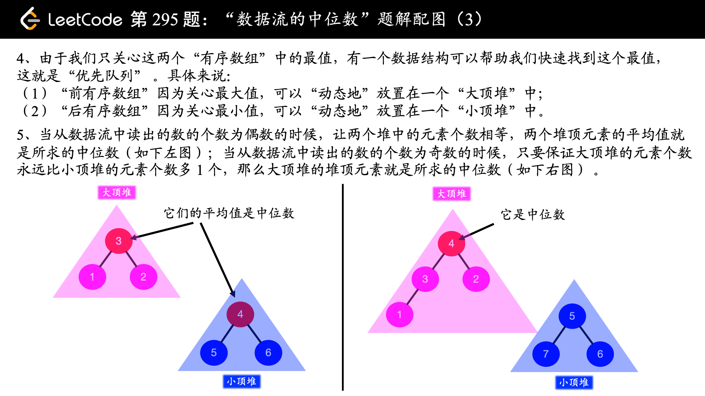

## 7. 整数反转（简单）

给出一个 32 位的有符号整数，你需要将这个整数中每位上的数字进行反转。

示例 1:

    输入: 123
    输出: 321
 示例 2:

    输入: -123
    输出: -321
示例 3:

    输入: 120
    输出: 21
注意:

假设我们的环境只能存储得下 32 位的有符号整数，则其数值范围为 [−231,  231 − 1]。请根据这个假设，如果反转后整数溢出那么就返回 0。


```python

```

## 54. 四数相加 II（中等）

给定四个包含整数的数组列表 A , B , C , D ,计算有多少个元组 (i, j, k, l) ，使得 A[i] + B[j] + C[k] + D[l] = 0。

为了使问题简单化，所有的 A, B, C, D 具有相同的长度 N，且 0 ≤ N ≤ 500 。所有整数的范围在 -228 到 228 - 1 之间，最终结果不会超过 231 - 1 。

例如:

    输入:
    A = [ 1, 2]
    B = [-2,-1]
    C = [-1, 2]
    D = [ 0, 2]

    输出:
    2

    解释:
    两个元组如下:
    1. (0, 0, 0, 1) -> A[0] + B[0] + C[0] + D[1] = 1 + (-2) + (-1) + 2 = 0
    2. (1, 1, 0, 0) -> A[1] + B[1] + C[0] + D[0] = 2 + (-1) + (-1) + 0 = 0


```python
import collections

class Solution(object):
    def fourSumCount(self, A, B, C, D):
        """
        :type A: List[int]
        :type B: List[int]
        :type C: List[int]
        :type D: List[int]
        :rtype: int
        """
        dic = collections.Counter(a + b for a in A for b in B)

        return sum(dic.get(-c-d, 0) for c in C for d in D)
```

## 412. Fizz Buzz（简单）

写一个程序，输出从 1 到 n 数字的字符串表示。

1. 如果 n 是3的倍数，输出“Fizz”；

2. 如果 n 是5的倍数，输出“Buzz”；

3.如果 n 同时是3和5的倍数，输出 “FizzBuzz”。

    示例：

    n = 15,

    返回:
    [
        "1",
        "2",
        "Fizz",
        "4",
        "Buzz",
        "Fizz",
        "7",
        "8",
        "Fizz",
        "Buzz",
        "11",
        "Fizz",
        "13",
        "14",
        "FizzBuzz"
    ]


```python
class Solution(object):
    def fizzBuzz(self, n):
        """
        :type n: int
        :rtype: List[str]
        """
        result = [''] * n

        for i in range(1, n//3+1):
            result[i*3-1] += 'Fizz'
        for i in range(1, n//5+1):
            result[i*5-1] += 'Buzz'
        
        for i in range(len(result)):
            if result[i] == '':
                result[i] = str(i+1)

        return result
```

## 395. 至少有K个重复字符的最长子串（中等）

找到给定字符串（由小写字符组成）中的最长子串 T ， 要求 T 中的每一字符出现次数都不少于 k 。输出 T 的长度。

示例 1:

    输入:
    s = "aaabb", k = 3

    输出:
    3

    最长子串为 "aaa" ，其中 'a' 重复了 3 次。
示例 2:

    输入:
    s = "ababbc", k = 2

    输出:
    5

    最长子串为 "ababb" ，其中 'a' 重复了 2 次， 'b' 重复了 3 次。
    
    
分治。

核心思想：如果某个字符 x 在整个字符串中出现的次数 <k，那么 x 不可能出现在最终要求的子串中。因此，可以将原字符串截断为：

    x 左侧字符子串 + x + x 右侧字符子串
因此，问题就被拆分为对左子串、右子串求解这两个子问题。

Python，用的是递归。

先遍历一遍统计字符串S中每个字母出现的次数,然后再遍历一遍找到出现次数小于k的一个字母对应的位置（假设S[mid]对应的字母出现次数小于k）。那么包含S[mid]的子串显然不可能符合题目要求。

所以原问题求S[start,end]字符串对应的答案就等价于求S[start,mid-1]和S[mid+1,end]对应的2个答案的最大值。也即longestSubstring(S[start,end])=max(longestSubstring(S[start,mid-1]) , longestSubstring(S[mid+1,end]))

(如果mid不存在，则说明原字符串S完全符合要求，所以答案即为S.size())


```python
class Solution(object):
    def longestSubstring(self, s, k):
        """
        :type s: str
        :type k: int
        :rtype: int
        """
        def find(s, k, left, right):
            if left > right:
                return 0

            dic = {}
            for i in range(left, right+1):
                c = s[i]
                if c not in dic:
                    dic[c] = [i]
                else:
                    dic[c] += [i]

            for key in dic:
                counter = len(dic[key])
                if counter < k:
                    pos = dic[key][0]
                    return max(find(s, k, left, pos-1), find(s, k, pos+1, right))
            
            return right-left+1
        
        return find(s, k, 0, len(s)-1)
```

## 387. 字符串中的第一个唯一字符（简单）

给定一个字符串，找到它的第一个不重复的字符，并返回它的索引。如果不存在，则返回 -1。

案例:

    s = "leetcode"
    返回 0.

    s = "loveleetcode",
    返回 2.


```python
import sys
class Solution(object):
    def firstUniqChar(self, s):
        """
        :type s: str
        :rtype: int
        """
        dic = {}
        for i in range(len(s)):
            c = s[i]
            if c in dic:
                dic[c] = -1
            else:
                dic[c] = i

        result = -1
        for key in dic:
            if result == -1:
                result = dic[key]
            else:
                if dic[key] != -1:
                    result = min(result, dic[key])
        
        return result
```

## 384. 打乱数组（中等）洗牌算法

打乱一个没有重复元素的数组。

    示例:

    // 以数字集合 1, 2 和 3 初始化数组。
    int[] nums = {1,2,3};
    Solution solution = new Solution(nums);

    // 打乱数组 [1,2,3] 并返回结果。任何 [1,2,3]的排列返回的概率应该相同。
    solution.shuffle();

    // 重设数组到它的初始状态[1,2,3]。
    solution.reset();

    // 随机返回数组[1,2,3]打乱后的结果。
    solution.shuffle();

### 一、洗牌算法

此类算法都是靠随机选取元素交换来获取随机性，直接看代码（伪码），该算法有 4 种形式，都是正确的：


```cpp
// 得到一个在闭区间 [min, max] 内的随机整数
int randInt(int min, int max);

// 第一种写法
void shuffle(int[] arr) {
    int n = arr.length();
    /******** 区别只有这两行 ********/
    for (int i = 0 ; i < n; i++) {
        // 从 i 到最后随机选一个元素
        int rand = randInt(i, n - 1);
        /*************************/
        swap(arr[i], arr[rand]);
    }
}

// 第二种写法
    for (int i = 0 ; i < n - 1; i++)
        int rand = randInt(i, n - 1);

// 第三种写法
    for (int i = n - 1 ; i >= 0; i--)
        int rand = randInt(0, i);

// 第四种写法
    for (int i = n - 1 ; i > 0; i--)
        int rand = randInt(0, i);
```

**分析洗牌算法正确性的准则：产生的结果必须有 n! 种可能，否则就是错误的。**这个很好解释，因为一个长度为 n 的数组的全排列就有 n! 种，也就是说打乱结果总共有 n! 种。算法必须能够反映这个事实，才是正确的。

我们先用这个准则分析一下第一种写法的正确性：

```cpp
// 假设传入这样一个 arr
int[] arr = {1,3,5,7,9};

void shuffle(int[] arr) {
    int n = arr.length(); // 5
    for (int i = 0 ; i < n; i++) {
        int rand = randInt(i, n - 1);
        swap(arr[i], arr[rand]);
    }
}
```

for 循环第一轮迭代时，i = 0，rand 的取值范围是 [0, 4]，有 5 个可能的取值。

for 循环第二轮迭代时，i = 1，rand 的取值范围是 [1, 4]，有 4 个可能的取值。

后面以此类推，直到最后一次迭代，i = 4，rand 的取值范围是 [4, 4]，只有 1 个可能的取值。

可以看到，整个过程产生的所有可能结果有 n! = 5! = 5*4*3*2*1 种，所以这个算法是正确的。

如果读者思考过洗牌算法，可能会想出如下的算法，但是这种写法是错误的：
```cpp
void shuffle(int[] arr) {
    int n = arr.length();
    for (int i = 0 ; i < n; i++) {
        // 每次都从闭区间 [0, n-1]
        // 中随机选取元素进行交换
        int rand = randInt(0, n - 1);
        swap(arr[i], arr[rand]);
    }
}
```

现在你应该明白这种写法为什么会错误了。因为这种写法得到的所有可能结果有 n^n 种，而不是 n! 种，而且 n^n 不可能是 n! 的整数倍。

上面我们从直觉上简单解释了洗牌算法正确的准则，没有数学证明，我想大家也懒得证明。对于概率问题我们可以使用「蒙特卡罗方法」进行简单验证。

### 二、蒙特卡罗方法验证正确性

类似的，我们可以对同一个数组进行一百万次洗牌，统计各种结果出现的次数，把频率作为概率，可以很容易看出洗牌算法是否正确。整体思想很简单，不过实现起来也有些技巧的，下面简单分析几种实现思路。

第一种思路，我们把数组 arr 的所有排列组合都列举出来，做成一个直方图（假设 arr = {1,2,3}）：

每次进行洗牌算法后，就把得到的打乱结果对应的频数加一，重复进行 100 万次，如果每种结果出现的总次数差不多，那就说明每种结果出现的概率应该是相等的。写一下这个思路的伪代码：
```cpp
void shuffle(int[] arr);

// 蒙特卡罗
int N = 1000000;
HashMap count; // 作为直方图
for (i = 0; i < N; i++) {
    int[] arr = {1,2,3};
    shuffle(arr);
    // 此时 arr 已被打乱
    count[arr] += 1；
}
for (int feq : count.values()) 
    print(feq / N + " "); // 频率
```

第二种思路，可以这样想，arr 数组中全都是 0，只有一个 1。我们对 arr 进行 100 万次打乱，记录每个索引位置出现 1 的次数，如果每个索引出现的次数差不多，也可以说明每种打乱结果的概率是相等的。

```cpp
void shuffle(int[] arr);

// 蒙特卡罗方法
int N = 1000000;    
int[] arr = {1,0,0,0,0};
int[] count = new int[arr.length];
for (int i = 0; i < N; i++) {
    shuffle(arr); // 打乱 arr
    for (int j = 0; j < arr.length; j++) 
        if (arr[j] == 1) {
            count[j]++;
            break;
        }
}
for (int feq : count) 
    print(feq / N + " "); // 频率
```


```python
import random
class Solution(object):

    def __init__(self, nums):
        """
        :type nums: List[int]
        """
        self.nums = nums
        

    def reset(self):
        """
        Resets the array to its original configuration and return it.
        :rtype: List[int]
        """
        return self.nums
        

    def shuffle(self):
        """
        Returns a random shuffling of the array.
        :rtype: List[int]
        """
        nums = self.nums[:]
        for i in range(len(nums)):
            pos = random.randint(i, len(nums)-1)
            nums[i], nums[pos] = nums[pos], nums[i]

        return nums

            
        


# Your Solution object will be instantiated and called as such:
# obj = Solution(nums)
# param_1 = obj.reset()
# param_2 = obj.shuffle()
```

## 380. 常数时间插入、删除和获取随机元素（中等）哈希 数组

设计一个支持在平均 时间复杂度 O(1) 下，执行以下操作的数据结构。

insert(val)：当元素 val 不存在时，向集合中插入该项。
remove(val)：元素 val 存在时，从集合中移除该项。
getRandom：随机返回现有集合中的一项。每个元素应该有相同的概率被返回。
示例 :

    // 初始化一个空的集合。
    RandomizedSet randomSet = new RandomizedSet();

    // 向集合中插入 1 。返回 true 表示 1 被成功地插入。
    randomSet.insert(1);

    // 返回 false ，表示集合中不存在 2 。
    randomSet.remove(2);

    // 向集合中插入 2 。返回 true 。集合现在包含 [1,2] 。
    randomSet.insert(2);

    // getRandom 应随机返回 1 或 2 。
    randomSet.getRandom();

    // 从集合中移除 1 ，返回 true 。集合现在包含 [2] 。
    randomSet.remove(1);

    // 2 已在集合中，所以返回 false 。
    randomSet.insert(2);

    // 由于 2 是集合中唯一的数字，getRandom 总是返回 2 。
    randomSet.getRandom();
    
    
    
    O(1)解法，组合使用哈希表和数组
    插入时：用哈希表来判断是否已存在O(1)，数组末尾增加一个元素O(1)，哈希表记录｛值：索引｝O(1)
    删除时：用哈希表来定位O(1)，把数组最后一个元素取下来顶替被删除元素位置O(1)，更新哈希表O(1)
    取随机数时：随机从数组里面挑一个O(1)


```python
import random
class RandomizedSet(object):

    def __init__(self):
        """
        Initialize your data structure here.
        """
        self.idx = {}
        self.nums = []
        

    def insert(self, val):
        """
        Inserts a value to the set. Returns true if the set did not already contain the specified element.
        :type val: int
        :rtype: bool
        """
        if val not in self.idx:
            self.nums.append(val)
            self.idx[val] = len(self.nums) - 1
            return True
        return False
        

    def remove(self, val):
        """
        Removes a value from the set. Returns true if the set contained the specified element.
        :type val: int
        :rtype: bool
        """
        if val in self.idx:
            idx = self.idx[val]
            
            self.nums[idx] = self.nums[-1]
            self.idx[self.nums[idx]] = idx
            self.nums.pop(-1)
            self.idx.pop(val)
            
            return True
        return False
            

        

    def getRandom(self):
        """
        Get a random element from the set.
        :rtype: int
        """
        return self.nums[random.randint(0, len(self.nums)-1)]
        


# Your RandomizedSet object will be instantiated and called as such:
# obj = RandomizedSet()
# param_1 = obj.insert(val)
# param_2 = obj.remove(val)
# param_3 = obj.getRandom()
```

## 378. 有序矩阵中第K小的元素（中等）

给定一个 n x n 矩阵，其中每行和每列元素均按升序排序，找到矩阵中第k小的元素。
请注意，它是排序后的第k小元素，而不是第k个元素。

示例:

    matrix = [
       [ 1,  5,  9],
       [10, 11, 13],
       [12, 13, 15]
    ],
    k = 8,

    返回 13。
说明: 
你可以假设 k 的值永远是有效的, 1 ≤ k ≤ n2 。


解法：二分查找法，根据题目可得左上角元素最小，右下角元素最大，计算中间值。然后计算小于等于目标值的元素个数，根据递增规则，从右上角开始查找，类似于题目“二维数组的查找”

时间复杂度：O(nlogk) ，k=最大值-最小值


最小值low在左上角，最大值high在右下角，那么要找的元素区间在[low,high]。
mid=(low+high)/2，如果小于等于mid的数量小于k，则可以pass掉小于等于mid的值，即要找的元素一定大于mid，则low=mid+1。
这样每次折半，时间复杂度是log(high-low)，由于32位的int值，其最大log为32(因为除以2相当于右移1位)
矩阵里查找小于某个值的数量，时间复杂度最小可以是O(N+N), 即O(N)
所以总体时间复杂度是log(high-low)*O(N)，32算常数，即O(N)。

其他想法：如果一个matrix是[[1,2][3,2100000000]],k是2，那么其实遍历整个矩阵也只需要4次，但是二分查找却需要32*4次。

1.找出二维矩阵中最小的数left，最大的数right，那么第k小的数必定在left~right之间
2.mid=(left+right) / 2；在二维矩阵中寻找小于等于mid的元素个数count
3.若这个count小于k，表明第k小的数在右半部分且不包含mid，即left=mid+1, right=right，又保证了第k小的数在left~right之间
4.若这个count大于k，表明第k小的数在左半部分且可能包含mid，即left=left, right=mid，又保证了第k小的数在left~right之间
5.因为每次循环中都保证了第k小的数在left~right之间，当left==right时，第k小的数即被找出，等于right

注意：这里的left mid right是数值，不是索引位置。


```python
class Solution(object):
    def findNotBiggerThanMid(self, matrix, mid):
        # 以列为单位找，找到每一列最后一个<=mid的数即知道每一列有多少个数<=mid
        n = len(matrix)
        # 从左下角开始查找
        row = n - 1
        col = 0
        count = 0

        while row >= 0 and col <= n - 1:
            if matrix[row][col] <= mid:
                # 第col列有row+1个元素<=mid
                count += row + 1
                col += 1
            else:
                # 第col列目前的数大于mid，需要继续在当前列往上找
                row -= 1

        return count


    def kthSmallest(self, matrix, k):
        """
        :type matrix: List[List[int]]
        :type k: int
        :rtype: int
        """
        left = matrix[0][0]
        right = matrix[-1][-1]
        while left < right:
            mid = (left + right) // 2
            count = self.findNotBiggerThanMid(matrix, mid)
            if count < k:
                left = mid + 1
            else:
                right = mid
        return right
```

## 371. 两整数之和（简单）

不使用运算符 + 和 - ，计算两整数 a 、b 之和。

示例 1:

    输入: a = 1, b = 2
    输出: 3
示例 2:

    输入: a = -2, b = 3
    输出: 1
    
1. a + b 的问题拆分为 (a 和 b 的无进位结果) + (a 和 b 的进位结果)
2. 无进位加法使用异或运算计算得出
3. 进位结果使用与运算和移位运算计算得出
4. 循环此过程，直到进位为 0


```python
class Solution(object):
    def getSum(self, a, b):
        """
        :type a: int
        :type b: int
        :rtype: int
        """
        # 2^32
        MASK = 0x100000000
        # 整型最大值
        MAX_INT = 0x7FFFFFFF
        MIN_INT = MAX_INT + 1
        while b != 0:
            # 计算进位
            carry = (a & b) << 1 
            # 取余范围限制在 [0, 2^32-1] 范围内
            a = (a ^ b) % MASK
            b = carry % MASK
        return a if a <= MAX_INT else ~((a % MIN_INT) ^ MAX_INT)   
```

## 350. 两个数组的交集 II（简单）

给定两个数组，编写一个函数来计算它们的交集。

示例 1:

    输入: nums1 = [1,2,2,1], nums2 = [2,2]
    输出: [2,2]
示例 2:

    输入: nums1 = [4,9,5], nums2 = [9,4,9,8,4]
    输出: [4,9]
说明：

输出结果中每个元素出现的次数，应与元素在两个数组中出现的次数一致。
我们可以不考虑输出结果的顺序。  
进阶:

    如果给定的数组已经排好序呢？你将如何优化你的算法？
    如果 nums1 的大小比 nums2 小很多，哪种方法更优？
    如果 nums2 的元素存储在磁盘上，磁盘内存是有限的，并且你不能一次加载所有的元素到内存中，你该怎么办？


```python
class Solution(object):
    def intersect(self, nums1, nums2):
        """
        :type nums1: List[int]
        :type nums2: List[int]
        :rtype: List[int]
        """
        result = []
        dic = {}
        for num in nums1:
            if num in dic:
                dic[num] += 1
            else:
                dic[num] = 1
        
        for num in nums2:
            if num in dic:
                dic[num] -= 1

                result.append(num)

                if dic[num] == 0:
                    dic.pop(num)
        
        return result
```

### 进阶 双指针


## 344. 反转字符串（简单）

编写一个函数，其作用是将输入的字符串反转过来。输入字符串以字符数组 char[] 的形式给出。

不要给另外的数组分配额外的空间，你必须原地修改输入数组、使用 O(1) 的额外空间解决这一问题。

你可以假设数组中的所有字符都是 ASCII 码表中的可打印字符。

 

示例 1：

    输入：["h","e","l","l","o"]
    输出：["o","l","l","e","h"]
示例 2：

    输入：["H","a","n","n","a","h"]
    输出：["h","a","n","n","a","H"]


```python
class Solution(object):
    def reverseString(self, s):
        """
        :type s: List[str]
        :rtype: None Do not return anything, modify s in-place instead.
        """
        length = len(s)
        mid = length // 2 - 1

        for i in range(mid+1):
            s[i], s[length-1-i] = s[length-1-i], s[i]

        return s
```

## 341. 扁平化嵌套列表迭代器（中等）

给定一个嵌套的整型列表。设计一个迭代器，使其能够遍历这个整型列表中的所有整数。

列表中的项或者为一个整数，或者是另一个列表。

示例 1:

    输入: [[1,1],2,[1,1]]
    输出: [1,1,2,1,1]
    解释: 通过重复调用 next 直到 hasNext 返回false，next 返回的元素的顺序应该是: [1,1,2,1,1]。
示例 2:

    输入: [1,[4,[6]]]
    输出: [1,4,6]
    解释: 通过重复调用 next 直到 hasNext 返回false，next 返回的元素的顺序应该是: [1,4,6]。


```python

```

## 334. 递增的三元子序列（中等）

给定一个未排序的数组，判断这个数组中是否存在长度为 3 的递增子序列。

数学表达式如下:

如果存在这样的 i, j, k,  且满足 0 ≤ i < j < k ≤ n-1，  
使得 arr[i] < arr[j] < arr[k] ，返回 true ; 否则返回 false 。  
说明: 要求算法的时间复杂度为 O(n)，空间复杂度为 O(1) 。

示例 1:

    输入: [1,2,3,4,5]
    输出: true
示例 2:

    输入: [5,4,3,2,1]
    输出: false
    
首先，如果只有一个最小值，然后找不到中间值，那么这个数组必然不包含递增的三个数（因为连递增的两个数都找不到）。

然后假设我们找到了两个递增的值，那么如果下一个值小于最小值，我们就应该将最小值的指针定位到这个值上。我们尽可能的使用最小值，防止后面出现了更小的一对递增值，而即使不出现，也不妨碍我们找到解（因为最终是看能否找到大于中间值的值）。
如果下一个值大于最小值，且小于中间值，则我们使用该值作为中间值(因为如果最小的中间值都得不到解，那么就是false，这样也保证了覆盖所有的情况)。

最后，如果找到了大于中间值的值，则为true.


```python
import sys

class Solution(object):
    def increasingTriplet(self, nums):
        """
        :type nums: List[int]
        :rtype: bool
        """
        i = 0
        small = sys.maxsize
        big = sys.maxsize
        while i < len(nums):
            if small > nums[i]:
                small = nums[i]
            elif small < nums[i] and big >= nums[i]:
                big = nums[i]
            elif nums[i] > big:
                return True
            i += 1
        return False
```

## 328. 奇偶链表（中等）

给定一个单链表，把所有的奇数节点和偶数节点分别排在一起。请注意，这里的奇数节点和偶数节点指的是节点编号的奇偶性，而不是节点的值的奇偶性。

请尝试使用原地算法完成。你的算法的空间复杂度应为 O(1)，时间复杂度应为 O(nodes)，nodes 为节点总数。

示例 1:

    输入: 1->2->3->4->5->NULL
    输出: 1->3->5->2->4->NULL
示例 2:

    输入: 2->1->3->5->6->4->7->NULL 
    输出: 2->3->6->7->1->5->4->NULL
说明:

应当保持奇数节点和偶数节点的相对顺序。

链表的第一个节点视为奇数节点，第二个节点视为偶数节点，以此类推。


```python
# Definition for singly-linked list.
# class ListNode(object):
#     def __init__(self, x):
#         self.val = x
#         self.next = None

class Solution(object):
    def oddEvenList(self, head):
        """
        :type head: ListNode
        :rtype: ListNode
        """
        if not head:
            return None
        odd = head
        even = head.next
        evenHead = even
        while even and even.next:
            odd.next = even.next
            odd = odd.next
            even.next = odd.next
            even = even.next
        odd.next = evenHead
        return head
```

## 326. 3的幂（简单）

给定一个整数，写一个函数来判断它是否是 3 的幂次方。

示例 1:

    输入: 27
    输出: true
示例 2:

    输入: 0
    输出: false
示例 3:

    输入: 9
    输出: true
示例 4:

    输入: 45
    输出: false
    
进阶：
你能不使用循环或者递归来完成本题吗？


```python
import math

class Solution(object):
    def isPowerOfThree(self, n):
        """
        :type n: int
        :rtype: bool
        """ 
        if n <= 0:
            return False
        res = math.log10(n) / math.log10(3) 

        if abs(int(round(res)) - res) < 1e-10:
            return True
        else:
            return False
```

## 324. 摆动排序 II（中等）

给定一个无序的数组 nums，将它重新排列成 nums[0] < nums[1] > nums[2] < nums[3]... 的顺序。

示例 1:

    输入: nums = [1, 5, 1, 1, 6, 4]
    输出: 一个可能的答案是 [1, 4, 1, 5, 1, 6]
示例 2:

    输入: nums = [1, 3, 2, 2, 3, 1]
    输出: 一个可能的答案是 [2, 3, 1, 3, 1, 2]
说明:
你可以假设所有输入都会得到有效的结果。

进阶:
你能用 O(n) 时间复杂度和 / 或原地 O(1) 额外空间来实现吗？


```python
class Solution(object):
    def wiggleSort(self, nums):
        """
        :type nums: List[int]
        :rtype: None Do not return anything, modify nums in-place instead.
        """
        nums.sort(reverse=True)

        nums[1::2], nums[0::2] = nums[:len(nums)//2], nums[len(nums)//2:]
```

## 315. 计算右侧小于当前元素的个数（困难）

给定一个整数数组 nums，按要求返回一个新数组 counts。数组 counts 有该性质： counts[i] 的值是  nums[i] 右侧小于 nums[i] 的元素的数量。

示例:

    输入: [5,2,6,1]
    输出: [2,1,1,0] 
    解释:
    5 的右侧有 2 个更小的元素 (2 和 1).
    2 的右侧仅有 1 个更小的元素 (1).
    6 的右侧有 1 个更小的元素 (1).
    1 的右侧有 0 个更小的元素.


```python

```

## 295. 数据流的中位数（困难）堆

中位数是有序列表中间的数。如果列表长度是偶数，中位数则是中间两个数的平均值。

例如，

[2,3,4] 的中位数是 3

[2,3] 的中位数是 (2 + 3) / 2 = 2.5

设计一个支持以下两种操作的数据结构：

    void addNum(int num) - 从数据流中添加一个整数到数据结构中。
    double findMedian() - 返回目前所有元素的中位数。
示例：

    addNum(1)
    addNum(2)
    findMedian() -> 1.5
    addNum(3) 
    findMedian() -> 2
进阶:

    如果数据流中所有整数都在 0 到 100 范围内，你将如何优化你的算法？
    如果数据流中 99% 的整数都在 0 到 100 范围内，你将如何优化你的算法？
    
一种最容易想到的思路是，数据流新进来一个数，都把它与已经读出来的数进行一次排序，这样中位数就可以很容易得到。这样做“不好”的地方是：

排序的时间复杂度为 O(NlogN)，但事实上，我对除了中位数以外的其它位置的元素并不关心。
事实上，我们只关心在中间的那两个数（或者一个数），其它数没有必要进行 “比较” 和 “交换” 的操作。

在我们学习过的数据结构里，堆就有类似的性质，每次都从堆里得到一个 “最值” 而其它元素无需排序，这样就可以以 O(logN) 的复杂度每次都从堆中取出最值。





1、数据是如何在两个堆之间流动的，脑子里要建立如下动态的过程：为了找到添加新数据以后，数据流的中位数，我们让这个新数据在大顶堆和小顶堆中都走了一遍。而为了让大顶堆的元素多 1 个，我们让从小顶堆中又拿出一个元素“送回”给大顶堆；

2、将元素放入优先队列以后，优先队列会以对数时间复杂度自行调整，把“最优值”放入堆顶，这是使用优先队列解决这个问题的原因。如果不太熟悉优先队列的朋友们，请复习一下优先队列的相关知识，包括基本操作，理解上浮和下沉。

复杂度分析：

时间复杂度：O(logN)，优先队列的出队入队操作都是对数级别的，数据在两个堆中间来回操作是常数级别的，综上时间复杂度是 O(logN) 级别的。

空间复杂度：O(N)，使用了三个辅助空间，其中两个堆的空间复杂度是 O(N/2)，一个表示数据流元素个数的计数器 count，占用空间 O(1)，综上空间复杂度为 O(N)。

1。如果数据流中所有整数都在 0 到 100 范围内，你将如何优化你的算法？

不用建堆了，用一个int[101] arr记录某个数据出现的次数。要取中位数时，第一次遍历数组累加得出总个数。然后除以2得出要找的数的位置p并知道是奇数还是偶数，然后第二次遍历数组，p-=arr[i]，当p变为1和0时分别记下i、j。奇数个数则返回j，偶数个数则返回(i+j)/2。

2。如果数据流中 99% 的整数都在 0 到 100 范围内，你将如何优化你的算法？

同样参照1的思路，用int[102] arr记录数据出现的次数，arr[101]记录大于100的数的次数。由于数据主要分布在100及以内，可知中间的2个数还是在100或以内，1的算法仍然有效。


```python
import heapq
class MedianFinder(object):

    def __init__(self):
        """
        initialize your data structure here.
        """
        self.count = 0
        self.max_heap = []
        self.min_heap = []
        

    def addNum(self, num):
        """
        :type num: int
        :rtype: None
        """
        heapq.heappush(self.max_heap, (-num, num))
        _, temp = heapq.heappop(self.max_heap)
        heapq.heappush(self.min_heap, temp)

        if self.count % 2 == 0:
            temp = heapq.heappop(self.min_heap)
            heapq.heappush(self.max_heap, (-temp, temp))
        
        self.count += 1


        

    def findMedian(self):
        """
        :rtype: float
        """
        if self.count % 2 == 0:
            return (self.max_heap[0][1] + self.min_heap[0]) / 2.0
        else:
            return self.max_heap[0][1]


# Your MedianFinder object will be instantiated and called as such:
# obj = MedianFinder()
# obj.addNum(num)
# param_2 = obj.findMedian()
```

## 289. 生命游戏（中等）

根据百度百科，生命游戏，简称为生命，是英国数学家约翰·何顿·康威在1970年发明的细胞自动机。

给定一个包含 m × n 个格子的面板，每一个格子都可以看成是一个细胞。每个细胞具有一个初始状态 live（1）即为活细胞， 或 dead（0）即为死细胞。每个细胞与其八个相邻位置（水平，垂直，对角线）的细胞都遵循以下四条生存定律：

如果活细胞周围八个位置的活细胞数少于两个，则该位置活细胞死亡；
如果活细胞周围八个位置有两个或三个活细胞，则该位置活细胞仍然存活；
如果活细胞周围八个位置有超过三个活细胞，则该位置活细胞死亡；
如果死细胞周围正好有三个活细胞，则该位置死细胞复活；
根据当前状态，写一个函数来计算面板上细胞的下一个（一次更新后的）状态。下一个状态是通过将上述规则同时应用于当前状态下的每个细胞所形成的，其中细胞的出生和死亡是同时发生的。

示例:

    输入: 
    [
      [0,1,0],
      [0,0,1],
      [1,1,1],
      [0,0,0]
    ]
    输出: 
    [
      [0,0,0],
      [1,0,1],
      [0,1,1],
      [0,1,0]
    ]
进阶:

    你可以使用原地算法解决本题吗？请注意，面板上所有格子需要同时被更新：你不能先更新某些格子，然后使用它们的更新后的值再更新其他格子。
    本题中，我们使用二维数组来表示面板。原则上，面板是无限的，但当活细胞侵占了面板边界时会造成问题。你将如何解决这些问题？


```python

```

## 268. 缺失数字（简单）

给定一个包含 0, 1, 2, ..., n 中 n 个数的序列，找出 0 .. n 中没有出现在序列中的那个数。

示例 1:

    输入: [3,0,1]
    输出: 2
示例 2:

    输入: [9,6,4,2,3,5,7,0,1]
    输出: 8
说明:
你的算法应具有线性时间复杂度。你能否仅使用额外常数空间来实现?


```python
class Solution(object):
    def missingNumber(self, nums):
        """
        :type nums: List[int]
        :rtype: int
        """
        return sum(range(len(nums)+1)) - sum(nums) 
```

## 242. 有效的字母异位词（简单）

给定两个字符串 s 和 t ，编写一个函数来判断 t 是否是 s 的字母异位词。

示例 1:

    输入: s = "anagram", t = "nagaram"
    输出: true
示例 2:

    输入: s = "rat", t = "car"
    输出: false
    说明:
    你可以假设字符串只包含小写字母。

进阶:
如果输入字符串包含 unicode 字符怎么办？你能否调整你的解法来应对这种情况？


```python
from collections import Counter

class Solution(object):
    def isAnagram(self, s, t):
        """
        :type s: str
        :type t: str
        :rtype: bool
        """
        return Counter(s) == Counter(t)
```

## 237. 删除链表中的节点（简单）

请编写一个函数，使其可以删除某个链表中给定的（非末尾）节点，你将只被给定要求被删除的节点。

现有一个链表 -- head = [4,5,1,9]，它可以表示为:

示例 1:

    输入: head = [4,5,1,9], node = 5
    输出: [4,1,9]
    解释: 给定你链表中值为 5 的第二个节点，那么在调用了你的函数之后，该链表应变为 4 -> 1 -> 9.
示例 2:

    输入: head = [4,5,1,9], node = 1
    输出: [4,5,9]
    解释: 给定你链表中值为 1 的第三个节点，那么在调用了你的函数之后，该链表应变为 4 -> 5 -> 9.
 

说明:

    链表至少包含两个节点。
    链表中所有节点的值都是唯一的。
    给定的节点为非末尾节点并且一定是链表中的一个有效节点。
    不要从你的函数中返回任何结果。


```python
# Definition for singly-linked list.
# class ListNode(object):
#     def __init__(self, x):
#         self.val = x
#         self.next = None

class Solution(object):
    def deleteNode(self, node):
        """
        :type node: ListNode
        :rtype: void Do not return anything, modify node in-place instead.
        """
        node.val = node.next.val
        node.next = node.next.next
```

## 230. 二叉搜索树中第K小的元素（中等）中序遍历

给定一个二叉搜索树，编写一个函数 kthSmallest 来查找其中第 k 个最小的元素。

说明：
你可以假设 k 总是有效的，1 ≤ k ≤ 二叉搜索树元素个数。

示例 1:

    输入: root = [3,1,4,null,2], k = 1
       3
      / \
     1   4
      \
       2
    输出: 1
示例 2:

    输入: root = [5,3,6,2,4,null,null,1], k = 3
           5
          / \
         3   6
        / \
       2   4
      /
     1
    输出: 3
进阶：
如果二叉搜索树经常被修改（插入/删除操作）并且你需要频繁地查找第 k 小的值，你将如何优化 kthSmallest 函数？


```python
# Definition for a binary tree node.
# class TreeNode(object):
#     def __init__(self, x):
#         self.val = x
#         self.left = None
#         self.right = None

class Solution(object):
    def kthSmallest(self, root, k):
        """
        :type root: TreeNode
        :type k: int
        :rtype: int
        """
        result = []
        cur = root
        stack = []
        while cur or stack:
            if cur:
                stack.append(cur)
                cur = cur.left
            else:
                cur = stack.pop()
                result.append(cur.val)
                if len(result) == k:
                    break
                cur = cur.right
        
        return result[-1]
```

## 227. 基本计算器 II（中等）

实现一个基本的计算器来计算一个简单的字符串表达式的值。

字符串表达式仅包含非负整数，+， - ，*，/ 四种运算符和空格  。 整数除法仅保留整数部分。

示例 1:

    输入: "3+2*2"
    输出: 7
示例 2:

    输入: " 3/2 "
    输出: 1
示例 3:

    输入: " 3+5 / 2 "
    输出: 5
说明：

你可以假设所给定的表达式都是有效的。
请不要使用内置的库函数 eval。


```python

```

## 217. 存在重复元素（简单）

给定一个整数数组，判断是否存在重复元素。

如果任何值在数组中出现至少两次，函数返回 true。如果数组中每个元素都不相同，则返回 false。

示例 1:

    输入: [1,2,3,1]
    输出: true
示例 2:

    输入: [1,2,3,4]
    输出: false
示例 3:

    输入: [1,1,1,3,3,4,3,2,4,2]
    输出: true


```python
class Solution(object):
    def containsDuplicate(self, nums):
        """
        :type nums: List[int]
        :rtype: bool
        """
        dic = {}
        for num in nums:
            if num not in dic:
                dic[num] = 1
            else:
                return True

        return False
```

## 204. 计数质数（简单）

统计所有小于非负整数 n 的质数的数量。

示例:

    输入: 10
    输出: 4
    解释: 小于 10 的质数一共有 4 个, 它们是 2, 3, 5, 7 。


```python

```

## 73. 矩阵置零（中等）

给定一个 m x n 的矩阵，如果一个元素为 0，则将其所在行和列的所有元素都设为 0。请使用原地算法。

示例 1:

    输入: 
    [
      [1,1,1],
      [1,0,1],
      [1,1,1]
    ]
    输出: 
    [
      [1,0,1],
      [0,0,0],
      [1,0,1]
    ]
示例 2:

    输入: 
    [
      [0,1,2,0],
      [3,4,5,2],
      [1,3,1,5]
    ]
    输出: 
    [
      [0,0,0,0],
      [0,4,5,0],
      [0,3,1,0]
    ]
进阶:

    一个直接的解决方案是使用  O(mn) 的额外空间，但这并不是一个好的解决方案。
    一个简单的改进方案是使用 O(m + n) 的额外空间，但这仍然不是最好的解决方案。
你能想出一个常数空间的解决方案吗？


```python
class Solution(object):
    def setZeroes(self, matrix):
        """
        :type matrix: List[List[int]]
        :rtype: None Do not return anything, modify matrix in-place instead.
        """
        helper = []
        m = len(matrix)
        n = len(matrix[0])
        for i in range(m):
            for j in range(n):
                if matrix[i][j] == 0:
                    helper.append([i, j])
        
        for i, j in helper:
            for col in range(n):
                matrix[i][col] = 0
            for row in range(m):
                matrix[row][j] = 0
```

## 69. x 的平方根（简单）二分法+牛顿迭代法

实现 int sqrt(int x) 函数。

计算并返回 x 的平方根，其中 x 是非负整数。

由于返回类型是整数，结果只保留整数的部分，小数部分将被舍去。

示例 1:

    输入: 4
    输出: 2
示例 2:

    输入: 8
    输出: 2
    说明: 8 的平方根是 2.82842..., 
         由于返回类型是整数，小数部分将被舍去。
         
         
二分查找法应用于搜索平方根的思想很简单，其实就是“猜”，但是是有策略的“猜”，用“排除法”在有限的区间里，一次排除一半的区间元素，最后只剩下一个数，这个数就是题目要求的向下取整的平方根整数。

牛顿法最初提出的时候，是用于求解方程的根，它的基本思想是“以直代曲”，在迭代中搜索得到方程的近似解。

方法一：二分法

思路分析：使用二分法搜索平方根的思想很简单，就类似于小时候我们看的电视节目中的“猜价格”游戏，高了就往低了猜，低了就往高了猜，范围越来越小。因此，使用二分法猜算术平方根就很自然。

一个数的平方根肯定不会超过它自己，不过直觉还告诉我们，一个数的平方根最多不会超过它的一半，如果这个数越大越是如此，因此我们要计算一下，这个边界是多少。为此，解如下不等式：

(a/2)^2 >= a

意即：如果一个数的一半的平方大于它自己，那么这个数的取值范围。解以上不等式得 a≥4 或者 a≤0。

于是边界值就是 
于是边界值就是 4，那么对 0、1、2、3 分别计算结果，很容易知道，这 4 个数的平方根依次是 0、1、1、1。

注意：这 4 个特值如果没有考虑到，有可能导致你设置的搜索边界不正确。在使用二分法寻找平方根的时候，要特别注意边界值的选择，以下给出两个参考代码。

**注意：这里一定取右中位数，如果取左中位数，代码可能会进入死循环。**


```python
class Solution(object):
    def mySqrt(self, x):
        """
        :type x: int
        :rtype: int
        """
        if x == 0:
            return 0

        left = 1
        right = x // 2
        while left < right:
            mid = (left + right + 1) // 2 
            if mid * mid > x:
                right = mid - 1
            else:
                left = mid
        
        return left
```

### 牛顿法

x = x - f(x) / f'(x)


```python
class Solution(object):
    def mySqrt(self, x):
        """
        :type x: int
        :rtype: int
        """
        if x == 0:
            return 0
        res = 1.0

        while abs(res * res - x) > 1e-6:
            res = (res + x / res) / 2
        
        return int(res)
```

## 66. 加一（简单）

给定一个由整数组成的非空数组所表示的非负整数，在该数的基础上加一。

最高位数字存放在数组的首位， 数组中每个元素只存储单个数字。

你可以假设除了整数 0 之外，这个整数不会以零开头。

示例 1:

    输入: [1,2,3]
    输出: [1,2,4]
    解释: 输入数组表示数字 123。
示例 2:

    输入: [4,3,2,1]
    输出: [4,3,2,2]
    解释: 输入数组表示数字 4321。


```python
class Solution(object):
    def plusOne(self, digits):
        """
        :type digits: List[int]
        :rtype: List[int]
        """
        carry = 1

        for i in range(len(digits)-1, -1, -1):
            digits[i] += carry
            if digits[i] == 10:
                digits[i] = 0
                carry = 1
            else:
                carry = 0
                break

        if carry:
            digits = [1, 0] + digits[1:]

        return digits
```

## 54. 螺旋矩阵（中等）

给定一个包含 m x n 个元素的矩阵（m 行, n 列），请按照顺时针螺旋顺序，返回矩阵中的所有元素。

示例 1:

    输入:
    [
     [ 1, 2, 3 ],
     [ 4, 5, 6 ],
     [ 7, 8, 9 ]
    ]
    输出: [1,2,3,6,9,8,7,4,5]
示例 2:

    输入:
    [
      [1, 2, 3, 4],
      [5, 6, 7, 8],
      [9,10,11,12]
    ]
    输出: [1,2,3,4,8,12,11,10,9,5,6,7]


```python
class Solution(object):
    def helper(self, matrix):
        if not matrix:
            return []
        m = len(matrix)
        n = len(matrix[0])

        temp = [[0 for _ in range(m)] for _ in range(n)]

        for i in range(m):
            for j in range(n):
                temp[j][i] = matrix[i][j]

        for j in range(m):
            for i in range(n//2):
                temp[i][j], temp[n-i-1][j] = temp[n-i-1][j], temp[i][j]

        return temp
        

    def spiralOrder(self, matrix):
        """
        :type matrix: List[List[int]]
        :rtype: List[int]
        """
        if not matrix:
            return []
        result = []

        while len(matrix)>2:
            # 打印第一行
            result += matrix[0]

            # 逆时针旋转90度 = 转置 + 按列逆序
            matrix = self.helper(matrix[1:])

        result += matrix[0]

        # 逆时针旋转90度 = 转置 + 按列逆序
        matrix = self.helper(matrix[1:])

        #print(matrix)
        if matrix:
            for num in matrix:
                result += num

        return result
```

## 50. Pow(x, n)（中等）

实现 pow(x, n) ，即计算 x 的 n 次幂函数。

示例 1:

    输入: 2.00000, 10
    输出: 1024.00000
示例 2:

    输入: 2.10000, 3
    输出: 9.26100
示例 3:

    输入: 2.00000, -2
    输出: 0.25000
    解释: 2^-2 = 1/2^2 = 1/4 = 0.25
说明:

-100.0 < x < 100.0
n 是 32 位有符号整数，其数值范围是 [−2^31, 2^31 − 1] 。


```python

```

## 41. 缺失的第一个正数（中等）桶排序

给定一个未排序的整数数组，找出其中没有出现的最小的正整数。

示例 1:

    输入: [1,2,0]
    输出: 3
示例 2:

    输入: [3,4,-1,1]
    输出: 2
示例 3:

    输入: [7,8,9,11,12]
    输出: 1
说明:

你的算法的时间复杂度应为O(n)，并且只能使用常数级别的空间。


```python
class Solution(object):
    def firstMissingPositive(self, nums):
        """
        :type nums: List[int]
        :rtype: int
        """
        n = len(nums)
        for i in range(n):
            while 1 <= nums[i] <= n and nums[i] != nums[nums[i]-1]:
                nums[nums[i]-1], nums[i] = nums[i], nums[nums[i]-1]

        for i in range(n):
            if nums[i] != i+1:
                return i+1
        
        return n + 1
```

## 38. 报数（简单）

报数序列是一个整数序列，按照其中的整数的顺序进行报数，得到下一个数。其前五项如下：

    1.     1
    2.     11
    3.     21
    4.     1211
    5.     111221
1 被读作  "one 1"  ("一个一") , 即 11。  
11 被读作 "two 1s" ("两个一"）, 即 21。  
21 被读作 "one 2",  "one 1" （"一个二" ,  "一个一") , 即 1211。

给定一个正整数 n（1 ≤ n ≤ 30），输出报数序列的第 n 项。

注意：整数顺序将表示为一个字符串。

 

示例 1:

    输入: 1
    输出: "1"
示例 2:

    输入: 4
    输出: "1211"


```python

```

## 36. 有效的数独（中等）

判断一个 9x9 的数独是否有效。只需要根据以下规则，验证已经填入的数字是否有效即可。

数字 1-9 在每一行只能出现一次。
数字 1-9 在每一列只能出现一次。
数字 1-9 在每一个以粗实线分隔的 3x3 宫内只能出现一次。

数独部分空格内已填入了数字，空白格用 '.' 表示。

示例 1:

    输入:
    [
      ["5","3",".",".","7",".",".",".","."],
      ["6",".",".","1","9","5",".",".","."],
      [".","9","8",".",".",".",".","6","."],
      ["8",".",".",".","6",".",".",".","3"],
      ["4",".",".","8",".","3",".",".","1"],
      ["7",".",".",".","2",".",".",".","6"],
      [".","6",".",".",".",".","2","8","."],
      [".",".",".","4","1","9",".",".","5"],
      [".",".",".",".","8",".",".","7","9"]
    ]
    输出: true
示例 2:

    输入:
    [
      ["8","3",".",".","7",".",".",".","."],
      ["6",".",".","1","9","5",".",".","."],
      [".","9","8",".",".",".",".","6","."],
      ["8",".",".",".","6",".",".",".","3"],
      ["4",".",".","8",".","3",".",".","1"],
      ["7",".",".",".","2",".",".",".","6"],
      [".","6",".",".",".",".","2","8","."],
      [".",".",".","4","1","9",".",".","5"],
      [".",".",".",".","8",".",".","7","9"]
    ]
    输出: false
    解释: 除了第一行的第一个数字从 5 改为 8 以外，空格内其他数字均与 示例1 相同。
         但由于位于左上角的 3x3 宫内有两个 8 存在, 因此这个数独是无效的。
说明:

    一个有效的数独（部分已被填充）不一定是可解的。
    只需要根据以上规则，验证已经填入的数字是否有效即可。
    给定数独序列只包含数字 1-9 和字符 '.' 。
    给定数独永远是 9x9 形式的。


```python

```

## 14. 最长公共前缀（简单）

编写一个函数来查找字符串数组中的最长公共前缀。

如果不存在公共前缀，返回空字符串 ""。

示例 1:

    输入: ["flower","flow","flight"]
    输出: "fl"
示例 2:

    输入: ["dog","racecar","car"]
    输出: ""
    解释: 输入不存在公共前缀。
说明:

所有输入只包含小写字母 a-z 。


```python
class Solution(object):
    def longestCommonPrefix(self, strs):
        """
        :type strs: List[str]
        :rtype: str
        """
        if not strs:
            return ''

        if len(strs) == 1:
            return strs[0]

        result = ''
        string = strs[0]

        for i in range(len(string)+1):

            for s in strs[1:]:
                if len(s[:i]) < len(string[:i]):
                    return result
                if string[:i] == s[:i]:
                    continue
                else:
                    return result
            
            result = string[:i]

        return result
```

## 116. 填充每个节点的下一个右侧节点指针（中等）

给定一个完美二叉树，其所有叶子节点都在同一层，每个父节点都有两个子节点。二叉树定义如下：

    struct Node {
      int val;
      Node *left;
      Node *right;
      Node *next;
    }
填充它的每个 next 指针，让这个指针指向其下一个右侧节点。如果找不到下一个右侧节点，则将 next 指针设置为 NULL。

初始状态下，所有 next 指针都被设置为 NULL。

    输入：{"$id":"1","left":{"$id":"2","left":{"$id":"3","left":null,"next":null,"right":null,"val":4},"next":null,"right":{"$id":"4","left":null,"next":null,"right":null,"val":5},"val":2},"next":null,"right":{"$id":"5","left":{"$id":"6","left":null,"next":null,"right":null,"val":6},"next":null,"right":{"$id":"7","left":null,"next":null,"right":null,"val":7},"val":3},"val":1}

    输出：{"$id":"1","left":{"$id":"2","left":{"$id":"3","left":null,"next":{"$id":"4","left":null,"next":{"$id":"5","left":null,"next":{"$id":"6","left":null,"next":null,"right":null,"val":7},"right":null,"val":6},"right":null,"val":5},"right":null,"val":4},"next":{"$id":"7","left":{"$ref":"5"},"next":null,"right":{"$ref":"6"},"val":3},"right":{"$ref":"4"},"val":2},"next":null,"right":{"$ref":"7"},"val":1}


提示：

    你只能使用常量级额外空间。
    使用递归解题也符合要求，本题中递归程序占用的栈空间不算做额外的空间复杂度。


```python

```

## 91. 解码方法（中等）

一条包含字母 A-Z 的消息通过以下方式进行了编码：

    'A' -> 1
    'B' -> 2
    ...
    'Z' -> 26
给定一个只包含数字的非空字符串，请计算解码方法的总数。

示例 1:

    输入: "12"
    输出: 2
    解释: 它可以解码为 "AB"（1 2）或者 "L"（12）。
示例 2:

    输入: "226"
    输出: 3
    解释: 它可以解码为 "BZ" (2 26), "VF" (22 6), 或者 "BBF" (2 2 6) 。


```python
class Solution(object):
    def numDecodings(self, s):
        """
        :type s: str
        :rtype: int
        """

        if s[0] == '0':
            return 0

        pre = 1
        cur = 1

        for i in range(1, len(s)):
            tmp = cur
            if s[i] == '0':
                if s[i-1] == '1' or s[i-1] == '2':
                    cur = pre
                else:
                    return 0
            elif s[i-1] == '1' or (s[i-1] == '2' and s[i] >= '1' and s[i] <= '6'):
                cur += pre
            
            pre = tmp

        return cur
```

## 134. 加油站（中等）

在一条环路上有 N 个加油站，其中第 i 个加油站有汽油 gas[i] 升。

你有一辆油箱容量无限的的汽车，从第 i 个加油站开往第 i+1 个加油站需要消耗汽油 cost[i] 升。你从其中的一个加油站出发，开始时油箱为空。

如果你可以绕环路行驶一周，则返回出发时加油站的编号，否则返回 -1。

说明: 

如果题目有解，该答案即为唯一答案。  
输入数组均为非空数组，且长度相同。  
输入数组中的元素均为非负数。
示例 1:

    输入: 
    gas  = [1,2,3,4,5]
    cost = [3,4,5,1,2]

    输出: 3

    解释:
    从 3 号加油站(索引为 3 处)出发，可获得 4 升汽油。此时油箱有 = 0 + 4 = 4 升汽油
    开往 4 号加油站，此时油箱有 4 - 1 + 5 = 8 升汽油
    开往 0 号加油站，此时油箱有 8 - 2 + 1 = 7 升汽油
    开往 1 号加油站，此时油箱有 7 - 3 + 2 = 6 升汽油
    开往 2 号加油站，此时油箱有 6 - 4 + 3 = 5 升汽油
    开往 3 号加油站，你需要消耗 5 升汽油，正好足够你返回到 3 号加油站。
    因此，3 可为起始索引。
示例 2:

    输入: 
    gas  = [2,3,4]
    cost = [3,4,3]

    输出: -1

    解释:
    你不能从 0 号或 1 号加油站出发，因为没有足够的汽油可以让你行驶到下一个加油站。
    我们从 2 号加油站出发，可以获得 4 升汽油。 此时油箱有 = 0 + 4 = 4 升汽油
    开往 0 号加油站，此时油箱有 4 - 3 + 2 = 3 升汽油
    开往 1 号加油站，此时油箱有 3 - 3 + 3 = 3 升汽油
    你无法返回 2 号加油站，因为返程需要消耗 4 升汽油，但是你的油箱只有 3 升汽油。
    因此，无论怎样，你都不可能绕环路行驶一周。


```python

```
